# History Compression & Folding — From Beginner to Advanced

> A complete, practical guide to keeping an agent's conversation from drowning in its own
> history: **compaction** (summarize the old turns and start fresh), **compression** (make
> each message cheaper without losing meaning), and **context folding** (branch a subtask
> into its own sub-context, then collapse it into a one-line outcome). What each technique
> is, when to reach for which, how to build them, and the production lessons about *what
> not to throw away*.
>
> This is the sibling of [Token Budgeting](../Token-Budgeting/introduction.md): budgeting
> decides *how much* room each thing gets; **this** doc is about what to do when history
> outgrows its budget. Read the budgeting doc first if you haven't.

---

## Table of Contents

1. [The one-sentence idea](#1-the-one-sentence-idea)
2. [Why history is the problem child](#2-why-history-is-the-problem-child)
3. [The three techniques at a glance](#3-the-three-techniques-at-a-glance)
4. [Compaction — the mental model](#4-compaction--the-mental-model)
5. [The compaction lifecycle (with diagram)](#5-the-compaction-lifecycle-with-diagram)
6. [Lightweight compression that isn't summarization](#6-lightweight-compression-that-isnt-summarization)
7. [Intermediate: what a good summary must preserve](#7-intermediate-what-a-good-summary-must-preserve)
8. [Intermediate: when to trigger compaction](#8-intermediate-when-to-trigger-compaction)
9. [Advanced: context folding — the core idea](#9-advanced-context-folding--the-core-idea)
10. [Advanced: folding vs. flat summarization](#10-advanced-folding-vs-flat-summarization)
11. [Advanced: anchored & incremental summarization](#11-advanced-anchored--incremental-summarization)
12. [Advanced: external memory as the safety net](#12-advanced-external-memory-as-the-safety-net)
13. [Advanced: production patterns & provider-native compaction](#13-advanced-production-patterns--provider-native-compaction)
14. [Metrics — how to know it's actually working](#14-metrics--how-to-know-its-actually-working)
15. [Common pitfalls checklist](#15-common-pitfalls-checklist)
16. [What to explore next](#16-what-to-explore-next)
17. [Sources](#sources)

---

## 1. The one-sentence idea

> **When a conversation gets too long to fit the context window, you don't just chop off
> the old turns — you *replace them with something shorter that preserves what matters*:
> a summary (compaction), a leaner encoding (compression), or a folded-away sub-result
> (folding).**

An agent's transcript grows every turn (see [Token Budgeting §3](../Token-Budgeting/introduction.md#3-why-the-window-fills-up-faster-than-you-think)).
Left alone, it eventually exceeds the window and the agent either crashes or silently
forgets its earliest — often most important — instructions. Compression and folding are how
you let an agent run for hundreds of steps without losing the plot.

---

## 2. Why history is the problem child

Of all the things competing for the window, conversation history is uniquely troublesome:

- **It only grows.** System prompts and tool defs are roughly fixed; history is monotonically
  increasing. It is always the first category to blow its budget.
- **Its value is uneven.** The user's original goal (turn 1) may matter enormously; a tool
  result from turn 6 that already got used may matter not at all.
- **Naive fixes lose critical information.** "Just keep the last 10 messages" is a sliding
  window that will happily discard the task definition while keeping small talk.

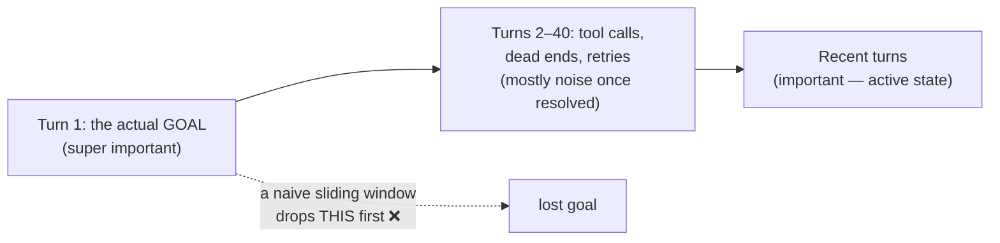

> **The core tension:** you must shrink history *without* dropping the few things that are
> load-bearing — the goal, key decisions, constraints, and current state. Every technique
> below is a different answer to "how do I shrink safely?"

---

## 3. The three techniques at a glance

| Technique | What it does | Loses | Best for |
|-----------|--------------|-------|----------|
| **Compaction** | Summarize the whole (or old part of) transcript into a compact brief, then continue from it | Fine-grained detail of old turns | Long chats / agents nearing the window limit |
| **Compression** | Make messages cheaper *in place* — trim/clear bulky tool results, dedupe, drop redundant scaffolding | Bulk that was already consumed | Cheap, safe, continuous housekeeping |
| **Folding** | Run a subtask in its own sub-context; collapse it to a short outcome on completion | The subtask's step-by-step trace | Long-horizon, decomposable tasks |

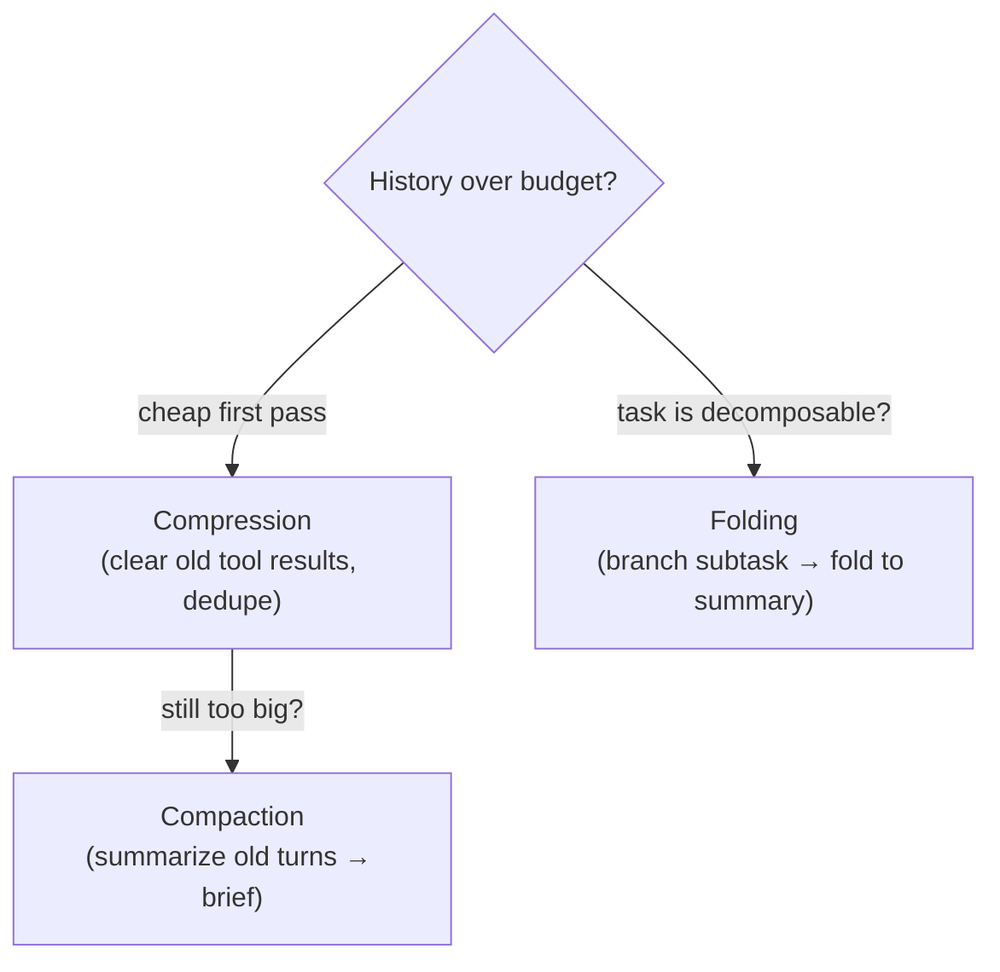

They compose: fold subtasks as you go, compress tool noise continuously, and compact the
main thread when it nears the limit.

---

## 4. Compaction — the mental model

**Compaction** = take a conversation approaching the window limit, summarize its contents,
and **re-initialize a new context window seeded with that summary**. The agent keeps going
as if it had a tidy briefing instead of a 300-message backlog.

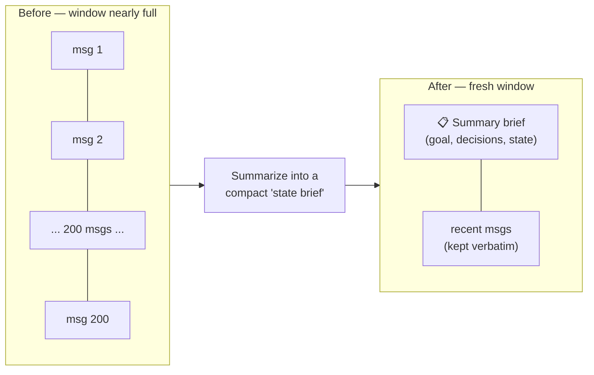

Two details separate a toy from a production compactor:

1. **Keep the tail verbatim.** Don't summarize the *most recent* few turns — the agent needs
   full-fidelity recent context to act. Summarize the old head; keep the fresh tail intact.
2. **Merge, don't regenerate.** When you compact again later, fold the new material into the
   *existing* summary rather than re-summarizing the whole thing from scratch. Factory's
   evaluation across ~36,000 real engineering-session messages found that **merging new
   summaries into a persistent state** scored higher on accuracy, completeness, and
   continuity than regenerating each time — and it's cheaper.

---

## 5. The compaction lifecycle (with diagram)

Here's exactly what happens when an agent crosses its compaction trigger. This is the
diagram to memorize.

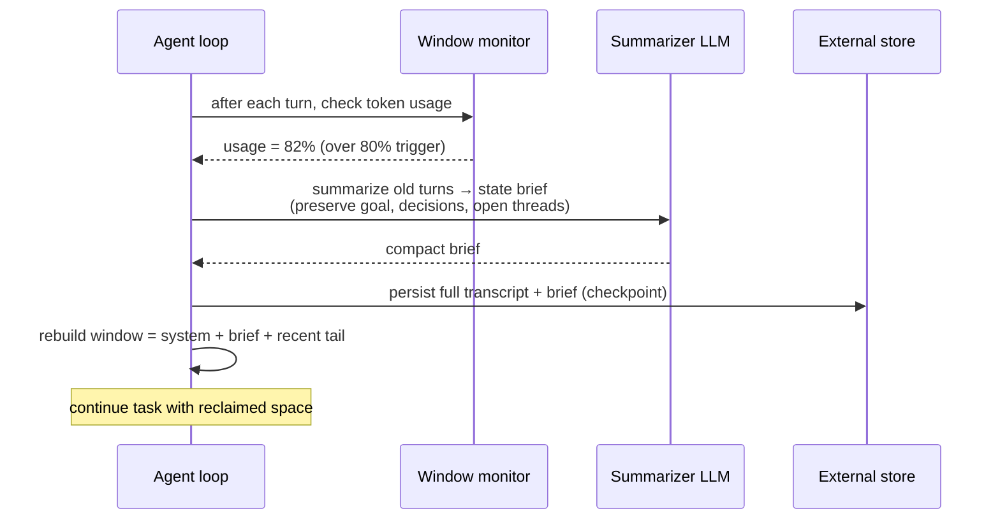

In words:
1. **Monitor** window usage after each turn.
2. When it crosses the **trigger** (commonly 70–80%), summarize the old portion.
3. **Checkpoint** the full transcript to external storage first — so nothing is truly lost
   and you can recover if the summary dropped something.
4. **Rebuild** the working window: system prompt + summary brief + the recent verbatim tail.
5. **Continue.** The agent now has room again.

> ⚠️ **Compaction is lossy and irreversible in-context.** Once you replace 200 messages with
> a summary, whatever the summary omitted is gone from the model's view. Always checkpoint
> the raw transcript externally *before* compacting, and treat "what the summary preserves"
> as a first-class design decision (§7), not an afterthought.

---

## 6. Lightweight compression that isn't summarization

Before you reach for an LLM to summarize, there's a cheaper, safer tier: **structural
compression** that removes bulk without judgment calls. No model, no risk of hallucinated
summaries.

- **Tool-result clearing.** The single safest, lightest-touch move: once a large tool
  result (a file dump, an API payload, a search page) has been *used*, replace its body
  with a short placeholder like `[tool result cleared — 4,200 tokens]`. The fact that the
  call happened stays; the bulky payload goes. This is now a first-class feature on the
  Claude Developer Platform.
- **Deduplication.** Agents re-read the same file or re-run the same query repeatedly. Keep
  the latest copy; collapse the duplicates.
- **Drop resolved scaffolding.** Verbose intermediate reasoning for a step that already
  succeeded rarely needs to persist verbatim.
- **Truncate, don't summarize, when safe.** For a giant log where only the tail matters,
  keeping the last N lines is cheaper and more faithful than an LLM summary.

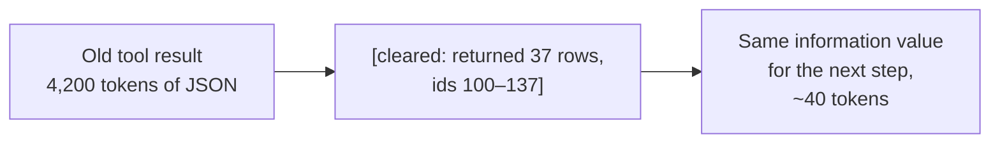

> **Rule of thumb:** compress structurally (clear/dedupe/truncate) *before* you compact
> semantically (summarize). Structural compression is nearly free and can't hallucinate;
> reserve the LLM-summarizer for when structure alone isn't enough.

---

## 7. Intermediate: what a good summary must preserve

A compaction summary is only as good as what it refuses to drop. The failure mode isn't
"the summary is too long" — it's "the summary forgot the constraint that made the whole
task make sense." A durable summary explicitly preserves:

| Must keep | Why |
|-----------|-----|
| **The original goal / task** | The agent's north star; losing it derails everything downstream |
| **Hard constraints & decisions** | "Must use Postgres", "user said no external APIs" — silently violated if dropped |
| **Current state / progress** | What's done, what's in flight, what's next |
| **Open questions / blockers** | Unresolved threads the agent still owes |
| **Key identifiers** | File paths, IDs, URLs, names the agent will need to reference |
| **What was tried and failed** | Prevents re-attempting known dead ends |

What it can safely drop: verbose tool payloads already consumed, step-by-step reasoning for
resolved steps, pleasantries, and redundant restatements.

> **Design the summary as a structured brief, not free prose.** A template with fixed
> sections (`Goal / Decisions / State / Open / Artifacts / Dead-ends`) is far more reliable
> than "summarize the conversation above" — it gives the summarizer a checklist and makes
> omissions visible. This structured, always-preserved core is the heart of **anchored**
> summarization (§11).

---

## 8. Intermediate: when to trigger compaction

Trigger too late and you overflow; too early and you needlessly discard fidelity and pay
for summaries you didn't need.

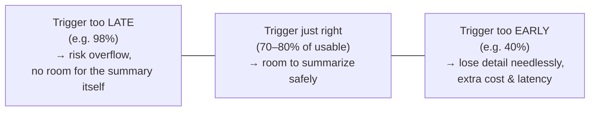

- **Threshold-based (most common):** compact when usage hits **70–80%** of the *usable*
  window. Leaves headroom for the summarization call itself, which also consumes tokens.
- **Turn-based:** every N turns. Simple, predictable, but ignores actual size.
- **Natural-boundary-based (best when possible):** compact at task/subtask boundaries — when
  a phase completes — so you never summarize across the middle of a coherent unit of work.
- **Cost-aware:** for a paid summarizer, batch the trigger so you're not summarizing on
  every single turn near the limit.

> **Rule of thumb:** default to a **70–80% usable-window threshold**, but prefer to snap the
> actual compaction to the next natural task boundary. Summarizing mid-subtask loses
> in-flight state that the tail was carrying.

---

## 9. Advanced: context folding — the core idea

**Context folding** is the most powerful technique for *long-horizon* tasks (dozens to
hundreds of steps). The insight: most long tasks are **decomposable** into subtasks whose
*internal steps* stop mattering once the subtask is done — only the **outcome** matters.

So the agent **branches** into a sub-trajectory to handle a subtask, does all its messy
work there, then **folds** it: the intermediate steps collapse away and only a concise
outcome summary rejoins the main thread.

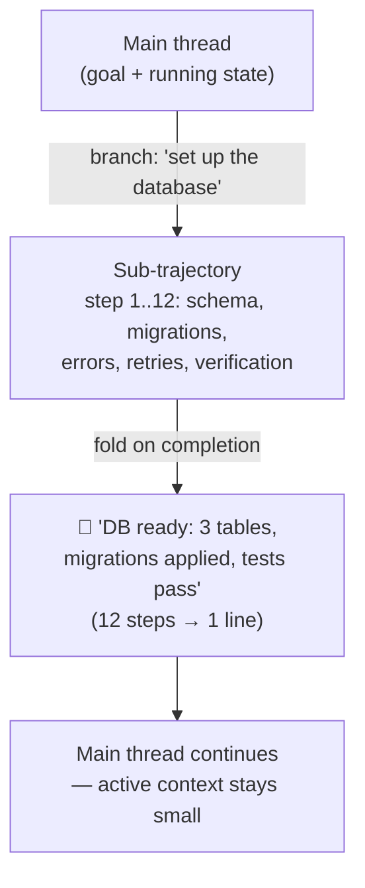

Why it's powerful: on complex long-horizon benchmarks, context folding matches the
performance of baselines while using an **active context up to ~10× smaller**, and clearly
outperforms models constrained to the same context size — and beats simple flat
summarization. The main thread never has to *hold* the 12 messy steps; it only ever sees
the one-line result.

Research has even made this a *learnable* behavior: **FoldPO** (and related frameworks like
FoldAct / AgentFold) use reinforcement learning with process rewards to teach an agent
*when* to branch and *how* to summarize on fold — so decomposition and context management
are optimized end-to-end rather than hand-coded.

---

## 10. Advanced: folding vs. flat summarization

Folding and compaction both produce summaries, but they're structurally different — and the
difference is why folding scales better.

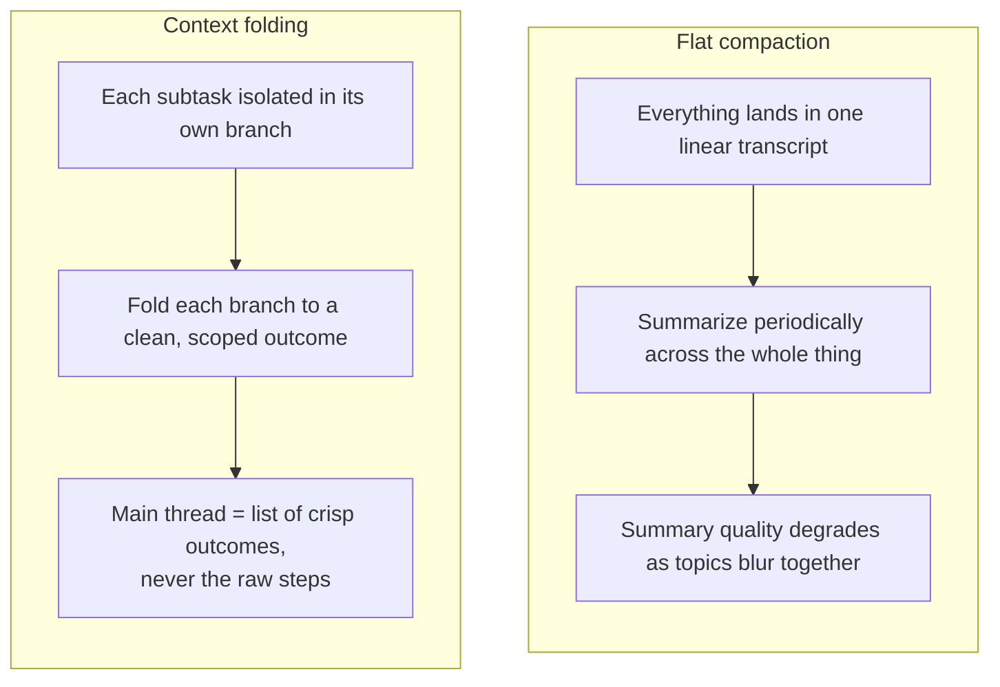

| Dimension | Flat summarization / compaction | Context folding |
|-----------|--------------------------------|-----------------|
| **Structure** | One linear transcript | Tree: main thread + foldable branches |
| **What's summarized** | A slice of mixed-topic history | One coherent subtask at a time |
| **Summary quality** | Degrades as unrelated topics blur | High — each fold is single-topic and scoped |
| **Active context size** | Grows then resets in sawtooth | Stays consistently small |
| **Best for** | General chat, single-thread tasks | Decomposable long-horizon agent work |
| **Complexity** | Low | Higher — needs subtask boundaries & branch control |

> **Rule of thumb:** if your task naturally breaks into subtasks ("first set up X, then
> build Y, then test Z"), fold. If it's one long meandering thread, compact. Real systems
> use both: fold the subtasks, compact the main thread when even the outcomes pile up.

---

## 11. Advanced: anchored & incremental summarization

Two techniques make repeated summarization stable over a long run — without them, summaries
drift and degrade each cycle.

**Anchored summarization.** Keep a fixed, always-preserved **anchor** — the immutable core
(original goal, hard constraints, key identifiers from §7) — that is *never* re-summarized.
Only the mutable working state around it gets recompressed. The anchor prevents the slow
"telephone game" drift where each summary-of-a-summary loses a little more of the goal until
the agent forgets what it was doing.

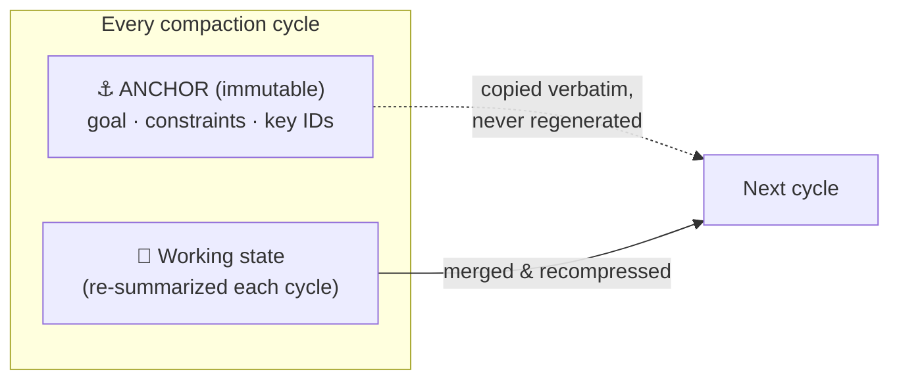

**Incremental / merge-based summarization.** Instead of re-summarizing the entire history
each time (expensive, and each pass risks dropping something), **merge** new events into the
*existing* summary. This is the Factory finding from §4: merging into a persistent state
beats regenerating from scratch on accuracy, completeness, and continuity — and costs less
because you only process the *new* material.

> **Failure-driven refinement (ACON-style):** advanced systems go further — when a compacted
> agent later makes a mistake traceable to *lost* context, that failure is used to refine the
> summarization guideline so the next summary keeps that kind of information. The compactor
> learns from its own omissions.

---

## 12. Advanced: external memory as the safety net

Compression is lossy by definition. **External memory** is what makes lossy compression
*safe*: the compact in-context summary is the agent's working memory; the full detail lives
in durable storage it can query on demand.

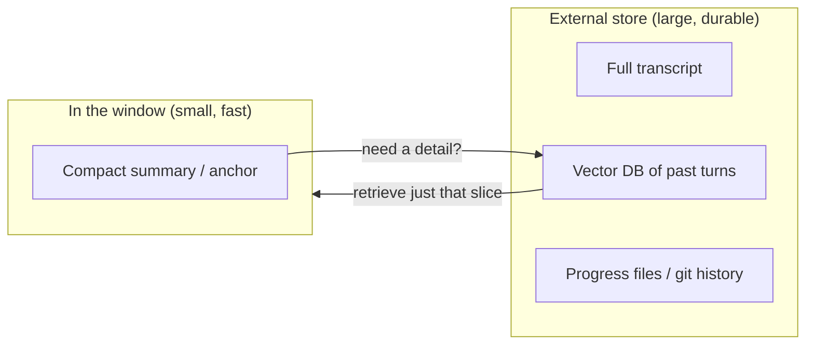

Concrete patterns, from lightest to heaviest:

- **Progress files.** The agent writes a running summary to a file and re-reads it after
  compaction. Simple, transparent, and human-auditable.
- **Git as checkpoints.** For coding agents, commit progress with descriptive messages;
  after compaction the agent reconstructs state from `git log` / `git diff`. Anthropic
  specifically recommends pairing compaction with commits + progress files.
- **Vector-store recall.** Embed and store every turn; when the agent needs a detail the
  summary dropped, retrieve just that slice back into context on demand. This turns
  "forgotten forever" into "paged out, retrievable."

> **Rule of thumb:** never compact without a durable checkpoint of the raw material first.
> The summary is a *cache* of the conversation, not the source of truth. If the summary is
> wrong, you want a way back.

---

## 13. Advanced: production patterns & provider-native compaction

You increasingly don't have to build all of this by hand.

- **Provider-native compaction.** Anthropic ships an automatic compaction capability (the
  `compact-2026-01-12` capability / API) that summarizes a conversation nearing the limit
  and continues from the summary — available across the Claude API, AWS Bedrock, Google
  Vertex AI, and Microsoft Foundry, with Zero-Data-Retention support. The **Claude Agent
  SDK** can automatically compress history when token usage crosses a configurable
  threshold, letting a task run well beyond the base window.
- **Tool-result clearing** (from §6) is offered as a managed feature — the safest first
  line of defense, no summarizer required.
- **Framework support.** Agent frameworks (LangChain/LangGraph, LlamaIndex, and others)
  provide summary-memory / trimming primitives so you configure a policy rather than
  hand-roll the loop.

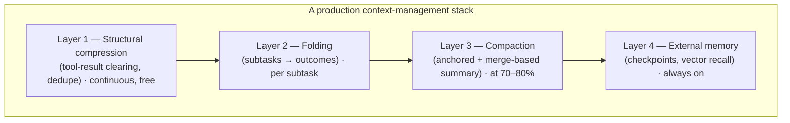

> **Build vs. buy:** start with the provider-native compaction + tool-result clearing —
> they cover most cases with the least risk. Reach for custom folding and anchored/merge
> summarization when you're running genuinely long-horizon agents where the native
> defaults leave quality or cost on the table.

---

## 14. Metrics — how to know it's actually working

| Metric | What it tells you | Watch for |
|--------|-------------------|-----------|
| **Compression ratio** | tokens after ÷ before | Too aggressive = lost info; too mild = little benefit |
| **Task-continuity / success rate** | Does the agent finish correctly *post*-compaction? | A drop = your summary is losing load-bearing info |
| **Post-compaction error rate** | Mistakes traceable to forgotten context | Non-zero = tighten what the summary preserves (§7) |
| **Compaction frequency** | How often you hit the trigger | Very high = window too small or history bloated |
| **Active-context size (folding)** | Tokens in the working window over time | Should stay flat, not grow, on long tasks |
| **Summarization cost/latency** | $ and ms spent compacting | Rising = summarize less often, or use merge-based |
| **Recovery rate** | How often external recall saves a dropped detail | High = your summary is too lossy; adjust the template |

> **The metric that matters most is task-continuity after compaction.** A summary that
> halves the tokens but makes the agent forget its goal is a net loss. Measure whether the
> agent still *succeeds*, not just whether the transcript got shorter.

---

## 15. Common pitfalls checklist

- [ ] **Summarizing without a durable checkpoint** → lost detail is gone for good.
- [ ] **Naive sliding window (last N msgs)** → silently drops the original goal.
- [ ] **No anchor** → summary-of-summary drift; the agent forgets what it's doing.
- [ ] **Regenerating the summary from scratch each time** → costlier and less accurate than merging.
- [ ] **Free-prose "summarize the above"** → omits constraints; use a structured template.
- [ ] **Summarizing the recent tail** → drops the in-flight state the agent needs *now*.
- [ ] **Triggering too late (>90%)** → no room for the summary call itself; overflow.
- [ ] **Compacting mid-subtask** → loses coherent in-flight work; snap to boundaries.
- [ ] **Folding a task that isn't decomposable** → complexity with no benefit; just compact.
- [ ] **LLM-summarizing bulk that could be structurally cleared** → paying (and risking
      hallucination) for what tool-result clearing does for free.
- [ ] **Measuring only compression ratio** → optimizing shortness over task success.
- [ ] **No external recall path** → "forgotten" is permanent instead of "paged out".

---

## 16. What to explore next

- Read the sibling [Token Budgeting](../Token-Budgeting/introduction.md) doc — budgeting is
  what tells you *when* these techniques must fire.
- Try the **provider-native path first**: enable automatic compaction / tool-result clearing
  in the Claude Agent SDK and observe the compaction trigger firing on a long task.
- Build a **minimal anchored compactor**: a structured `Goal / Decisions / State / Open /
  Artifacts / Dead-ends` template, a 75%-usable-window trigger, and a raw-transcript
  checkpoint to disk before each compaction.
- Prototype **folding** on a naturally decomposable task (e.g. "scaffold, implement, test")
  and compare active-context size against flat compaction on the same task.
- Study the **Context-Folding paper** (arXiv 2510.11967) and the FoldAct / AgentFold
  follow-ups for how folding is made a *learned* behavior.

---

## Sources

- [Anthropic — Effective context engineering for AI agents](https://www.anthropic.com/engineering/effective-context-engineering-for-ai-agents)
- [Claude Cookbook — Automatic context compaction](https://platform.claude.com/cookbook/tool-use-automatic-context-compaction)
- [Factory.ai — Evaluating Context Compression for AI Agents](https://factory.ai/news/evaluating-compression)
- [Zylos Research — AI Agent Context Compression: Strategies for Long-Running Sessions](https://zylos.ai/research/2026-02-28-ai-agent-context-compression-strategies/)
- [mem0 — How Hermes and Claude Handle Context Compression in Production Agents](https://mem0.ai/blog/how-hermes-and-claude-handle-context-compression-in-real-production-agents-(and-what-you-should-extract))
- [Morph — Context Engineering: Why More Tokens Makes Agents Worse](https://www.morphllm.com/context-engineering)
- [Victor Dibia — Context Engineering 101: How Agents (Claude Code) manage context](https://newsletter.victordibia.com/p/context-engineering-101-how-agents)
- [arXiv — Scaling Long-Horizon LLM Agent via Context-Folding (2510.11967)](https://huggingface.co/papers/2510.11967)
- [Context-Folding — project page](https://context-folding.github.io/)
- [arXiv — FoldAct: Efficient and Stable Context Folding for Long-Horizon Search Agents](https://arxiv.org/html/2512.22733v1)
- [arXiv — AgentFold: Long-Horizon Web Agents with Proactive Context Management](https://arxiv.org/pdf/2510.24699)
- [MarkTechPost — Building a Context-Folding LLM Agent for Long-Horizon Reasoning](https://www.marktechpost.com/2025/10/15/building-a-context-folding-llm-agent-for-long-horizon-reasoning-with-memory-compression-and-tool-use/)
- [EmergentMind — Context Folding Methods: Techniques & Applications](https://www.emergentmind.com/topics/context-folding-methods)
- [Anthropic — Claude Agent SDK docs](https://docs.claude.com/en/api/agent-sdk/overview)
