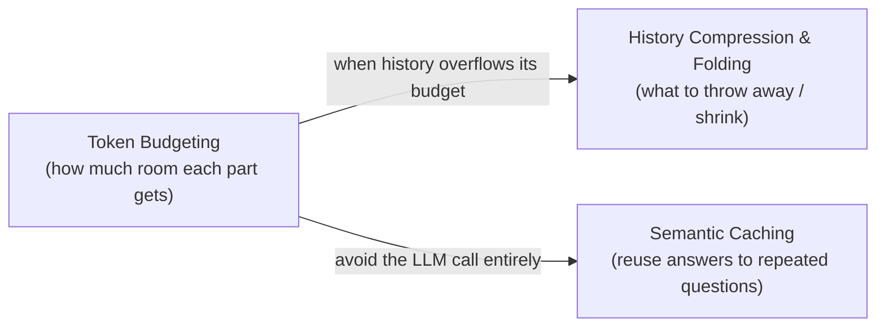

# Context Engineering

> **Context engineering** is the discipline of deciding *what goes into an LLM's context
> window, and what stays out* — so the model gets exactly the information it needs to do the
> task well, and nothing that wastes space, money, or attention. It's the successor to
> "prompt engineering": once you're building agents, the prompt is the *least* of what fills
> the window.

Each folder below is a self-contained, beginner→advanced guide with an `introduction.md`
in the house style (diagrams, trade-off tables, runnable snippets, real sources).

## Topics

| Folder | What it covers |
|--------|----------------|
| [Token-Budgeting](./Token-Budgeting/introduction.md) | Treating the context window as a scarce, shared resource: how a token works, why the window fills up, how to divide it across system/tools/memory/retrieval/history/output, measuring & enforcing a budget, effective-vs-advertised windows, the tool-metadata tax, prompt caching, and multi-agent budgeting. |
| [History-Compression-and-Folding](./History-Compression-and-Folding/introduction.md) | What to do when history outgrows its budget: **compaction** (summarize old turns), **compression** (clear/dedupe bulky messages), and **context folding** (branch a subtask, fold it into a one-line outcome). Anchored & merge-based summarization, external memory, and provider-native compaction. |
| [Semantic-Caching](./Semantic-Caching/introduction.md) | Returning a stored answer when a new question *means the same thing* as an old one — cutting LLM cost and latency. Embeddings, similarity thresholds, false positives, TTL/eviction, and production architecture. |

## How they fit together

**Start with [Token Budgeting](./Token-Budgeting/introduction.md)** — it sets up the
mental model (the window is a zero-sum resource) that the other topics build on.
