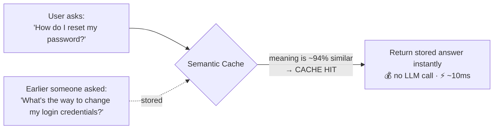
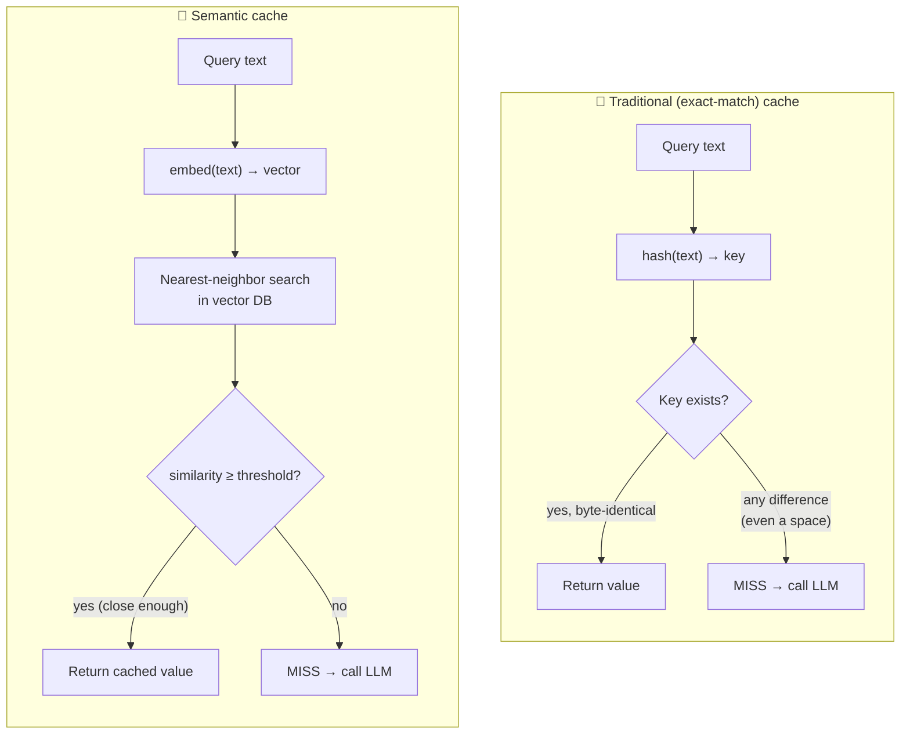
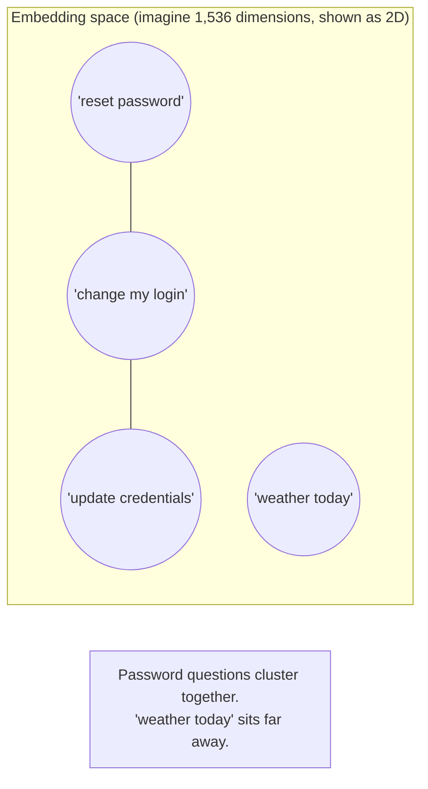
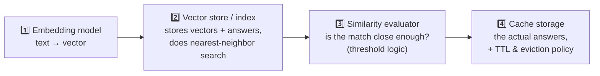
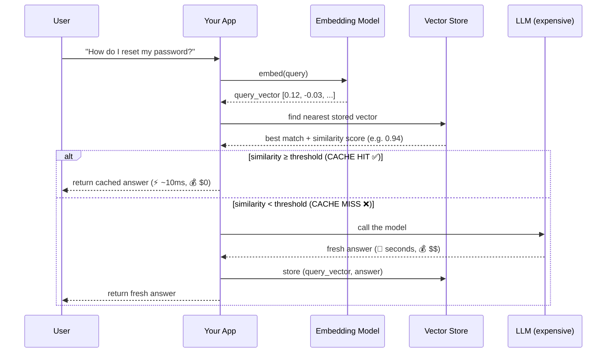
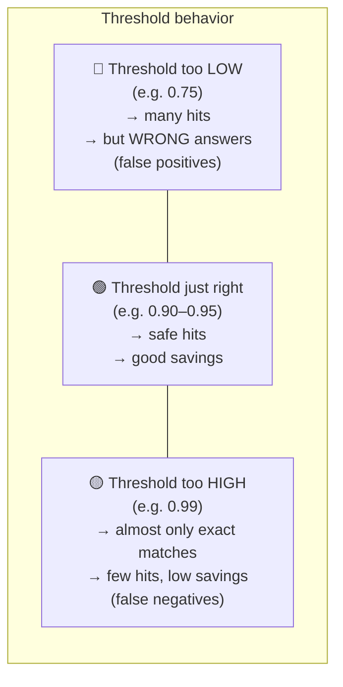
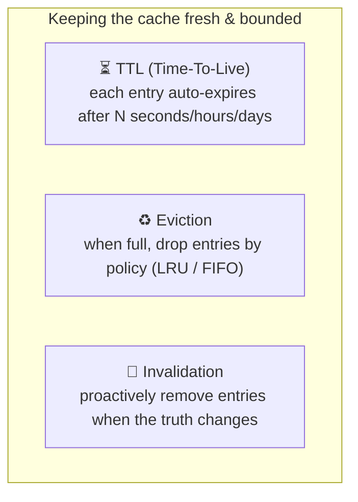
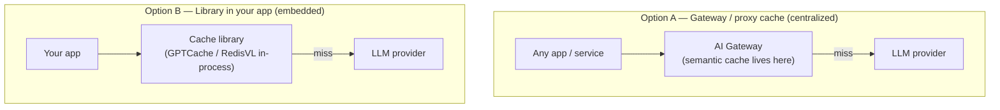

# Semantic Caching — From Beginner to Advanced

> A complete, practical guide to semantic caching for LLM applications: what it is,
> why it matters, how it works under the hood, how to build one from scratch, how to
> run production-grade caches (Redis / GPTCache), and the hard lessons about
> thresholds, false positives, and cache invalidation.
>
> Runnable code lives in [`./resources`](./resources). API keys are read from
> environment variables — just `export` them in your terminal (see the resources README).

---

## Table of Contents

1. [The one-sentence idea](#1-the-one-sentence-idea)
2. [Why do we even cache? (the motivation)](#2-why-do-we-even-cache-the-motivation)
3. [Traditional cache vs. semantic cache](#3-traditional-cache-vs-semantic-cache)
4. [How semantic caching works (the mental model)](#4-how-semantic-caching-works-the-mental-model)
5. [The building blocks](#5-the-building-blocks)
6. [The full request lifecycle (with diagram)](#6-the-full-request-lifecycle-with-diagram)
7. [Use cases — where it shines and where it hurts](#7-use-cases--where-it-shines-and-where-it-hurts)
8. [Intermediate: the similarity threshold — the single most important knob](#8-intermediate-the-similarity-threshold--the-single-most-important-knob)
9. [Intermediate: embeddings, distance metrics, and dimensions](#9-intermediate-embeddings-distance-metrics-and-dimensions)
10. [Advanced: eviction, TTL, and cache invalidation](#10-advanced-eviction-ttl-and-cache-invalidation)
11. [Advanced: false positives, safety, and per-category thresholds](#11-advanced-false-positives-safety-and-per-category-thresholds)
12. [Advanced: production architecture and where the cache lives](#12-advanced-production-architecture-and-where-the-cache-lives)
13. [Metrics — how to know it's actually working](#13-metrics--how-to-know-its-actually-working)
14. [Tooling landscape (2026)](#14-tooling-landscape-2026)
15. [Common pitfalls checklist](#15-common-pitfalls-checklist)
16. [What to run next](#16-what-to-run-next)
17. [Sources](#sources)

---

## 1. The one-sentence idea

> **Semantic caching returns a stored answer when a *new* question *means the same thing*
> as an old one — even if it's worded completely differently.**

A normal cache asks *"have I seen this exact string before?"*. A semantic cache asks
*"have I seen something that **means** this before?"*. That shift — from **exact match**
to **meaning match** — is the entire concept.

An **exact-match** cache would treat those two questions as completely different strings
and call the LLM twice. A **semantic** cache recognizes they're the same intent and answers
the second one for free.

---

## 2. Why do we even cache? (the motivation)

Every call to a large language model has three costs:

| Cost | Typical scale | Who feels it |
|------|---------------|--------------|
| 💰 **Money** | ~$0.001–$0.05+ per call depending on model & tokens | Your finance team |
| ⏱️ **Latency** | 300ms – several seconds per call | Your users |
| 🔋 **Compute / energy** | GPU inference is expensive and power-hungry | Infra + sustainability |

Now here's the key observation about real traffic:

> **Users ask the same things over and over, phrased slightly differently.**

"How do I return an item?", "What's your return policy?", "Can I send this back?" — three
strings, one intent. In production, a large slice of traffic is *near-duplicate*. If you
can detect that a question is essentially a repeat, you can **skip the LLM entirely** and
serve a stored answer in milliseconds for free.

Reported production impact: semantic caches commonly cut LLM cost **40–80%** on
repetitive workloads, with one VentureBeat-cited deployment reducing spend **~73%**. Cache
*hits* return in ~tens of milliseconds instead of seconds.

⚠️ **Reality check:** vendors love to quote 95% hit rates. Real production semantic caches
typically intercept **20–45%** of traffic. That's still huge — but calibrate expectations.

---

## 3. Traditional cache vs. semantic cache

This comparison is the heart of understanding the topic.

| Dimension | Traditional cache | Semantic cache |
|-----------|------------------|----------------|
| **Match on** | Exact bytes of the key | *Meaning* of the query |
| **Key** | `hash(string)` | High-dimensional embedding vector |
| **Lookup** | O(1) hash map | Approximate nearest-neighbor (ANN) vector search |
| **"How do I reset my password?" vs "How can I change my password?"** | ❌ two misses | ✅ one hit |
| **Extra dependency** | None | Embedding model + vector store |
| **Failure mode** | Misses (safe, just slower) | *False positives* — wrong answer for a similar-looking question |
| **Cost per lookup** | ~free | 1 embedding call + a vector search |

> **Key trade-off:** a traditional cache can only ever be *unhelpful* (a miss). A semantic
> cache can be *wrong* (a false positive) — it can hand back an answer to a question that
> only *looked* similar. Managing that risk is what most of the "advanced" section is about.

---

## 4. How semantic caching works (the mental model)

The whole trick rests on one idea from machine learning: **embeddings**.

An **embedding** is a way of turning a piece of text into a list of numbers (a *vector*,
e.g. 768 or 1,536 numbers) such that **texts with similar meaning end up close together in
that number-space**, and unrelated texts end up far apart.

So "measuring meaning similarity" becomes "**measuring distance between two vectors**" —
a plain geometry problem a computer does instantly. The most common measure is **cosine
similarity**: the cosine of the angle between two vectors.

- `cosine = 1.0` → identical direction → identical meaning
- `cosine ≈ 0.9` → very close meaning
- `cosine ≈ 0.0` → unrelated

A semantic cache simply says: *if the closest stored question is within my similarity
threshold, reuse its answer.*

---

## 5. The building blocks

Every semantic cache — homemade or enterprise — is made of the same four parts:

| # | Component | Job | Example choices |
|---|-----------|-----|-----------------|
| 1 | **Embedding model** | Turn text into a vector | OpenAI `text-embedding-3-small`, `sentence-transformers` (local, free), Cohere, Voyage |
| 2 | **Vector store / index** | Store vectors & find nearest neighbors fast | Redis, FAISS, Milvus, Qdrant, pgvector, Chroma |
| 3 | **Similarity evaluator** | Decide hit vs. miss using a threshold | Cosine similarity ≥ 0.9 (tunable) |
| 4 | **Cache storage + policy** | Hold answers; expire/evict them | TTL, LRU/FIFO eviction |

Good libraries (GPTCache, RedisVL) make each of these **swappable** — you can start with a
free local embedding model and FAISS, then graduate to a hosted model + Redis without
rewriting your logic.

---

## 6. The full request lifecycle (with diagram)

Here is exactly what happens on every incoming query. This diagram is the one to memorize.

**In words:**
1. Embed the incoming query into a vector.
2. Search the vector store for the most similar stored query.
3. If similarity ≥ your threshold → **HIT**: return the stored answer. Done. No LLM.
4. If not → **MISS**: call the LLM, return its answer, **and store** the new
   `(vector, answer)` pair so the *next* similar question becomes a hit.

That "store on miss" step is what makes the cache learn your traffic over time.

---

## 7. Use cases — where it shines and where it hurts

### ✅ Great fits

- **Customer support / FAQ bots** — huge overlap in how people ask the same 50 questions.
- **RAG systems** — cache answers to repeated knowledge-base questions; also cache the
  *retrieval* step.
- **Documentation & internal help assistants** — bounded topic, repetitive queries.
- **High-traffic public chatbots** — the long tail is unique, but the head is very repetitive.
- **Agent tool-call results** — cache expensive, deterministic sub-steps.
- **Autocomplete / suggestion endpoints** — many near-identical prefixes.

### ⚠️ Dangerous / poor fits (be careful)

- **Personalized responses** — "What are *my* recommendations?" from two different users
  embeds almost identically but must **not** share an answer. (Classic false-positive trap
  — you'd leak user A's data to user B.) → *Scope the cache per-user, or don't cache these.*
- **Time-sensitive answers** — "What's today's stock price / weather / news?" A cached
  answer goes stale fast. → *Short TTLs, or bypass the cache.*
- **Creative / diverse generation** — "Write me a unique poem." Users *want* variety;
  returning a cached poem defeats the purpose.
- **Math/precision where small wording changes flip the answer** — "profit in 2023" vs
  "profit in 2024" are ~identical embeddings but require different answers.

> **Rule of thumb:** the more *deterministic, repetitive, and non-personalized* your
> queries are, the better semantic caching works.

---

## 8. Intermediate: the similarity threshold — the single most important knob

The threshold is the number that decides HIT vs MISS. It is where most of the engineering
effort actually goes, and it's rarely covered in intro tutorials.

- **Note on terminology:** some libraries use a **similarity** threshold (higher = stricter,
  e.g. "≥ 0.92") and others use a **distance** threshold (lower = stricter, e.g. "≤ 0.15").
  They're two sides of the same coin: `distance ≈ 1 − similarity` for cosine. Always check
  which one your tool uses — getting it backwards silently breaks the cache.

- **Typical starting range:** cosine similarity **0.85–0.95** (many teams start at **0.90**).

- **Precision vs. hit-rate is a dial**, not a fixed setting:
  - Lower the threshold → *more* cache hits, *more* false positives.
  - Raise it → *fewer* false positives, *fewer* hits (you save less money).

- **False positives usually cost more than false negatives.** A miss just means you paid for
  an LLM call you maybe didn't need. A false positive means you gave the user a *wrong
  answer* — which erodes trust and can be dangerous (finance, medical, legal). So when in
  doubt, **bias toward a higher/stricter threshold.**

- **Best practice: tune per category, not globally.** A FAQ query can tolerate 0.88.
  A query that mentions a specific number, date, or account might need 0.97 or no cache at
  all. Route different query types to different thresholds.

- **Aim for 95%+ precision *before* you ship**, then monitor and adjust weekly for the
  first month. A fixed 0.90 is a *starting point, not a destination.*

---

## 9. Intermediate: embeddings, distance metrics, and dimensions

The quality of your cache is capped by the quality of your embeddings.

- **Dimensions:** embeddings are typically **768** or **1,536** numbers long. More
  dimensions ≈ more expressive but more storage and slower search. This is a trade-off you
  tune, not a "bigger is better."

- **Distance metrics:**
  - **Cosine similarity** — by far the most common for text; measures *direction* (meaning),
    ignores magnitude. Default choice.
  - **Dot product** — fast; equivalent to cosine when vectors are normalized.
  - **Euclidean (L2)** — measures straight-line distance; less common for text semantics.

- **Model choice matters more than people expect.** A domain-specific or fine-tuned
  embedding model (e.g. trained on your support tickets) can dramatically cut false
  positives compared to a generic model, because it learns which distinctions matter *in
  your domain*. Recent research shows domain-specific embeddings + synthetic training data
  meaningfully improve semantic-cache accuracy.

- **Local vs. hosted:**
  - Local (`sentence-transformers`, ONNX) → free, private, no network hop, but you host it.
  - Hosted (OpenAI/Cohere/Voyage) → best quality with zero infra, but costs a small amount
    per embedding and adds a network round-trip. (Note: you're now paying for an embedding
    on *every* query, including hits — factor that into ROI. Local models remove that cost.)

---

## 10. Advanced: eviction, TTL, and cache invalidation

A cache that only grows will eventually run out of memory and fill with stale junk. Three
mechanisms keep it healthy:

- **TTL (Time-To-Live):** every entry gets an expiry. Use **short TTLs for time-sensitive
  data** (prices, news) and **long TTLs for stable data** (product policies, definitions).
  Set it per content type, not one global value.

- **Eviction (size limits):** when the cache hits its memory/entry cap, it removes entries
  by a policy:
  - **LRU (Least Recently Used)** — drop what hasn't been touched in a while (good default).
  - **FIFO (First In, First Out)** — drop the oldest inserts.
  - ⚠️ Some tools (e.g. GPTCache) evict purely by *entry count*, which can misjudge real
    memory and cause out-of-memory (OOM) errors on large entries. Watch memory directly.

- **Invalidation (correctness):** the hardest problem in caching. When the underlying truth
  changes (you update your return policy, a price changes, you swap embedding models), old
  cached answers become *wrong*, not just stale. Strategies, best combined:
  1. **TTL-based** — let entries expire naturally (cheap, but wrong answers persist until expiry).
  2. **Event-based** — when a source document changes, purge related cache entries.
  3. **Staleness detection** — periodically re-validate hot entries against fresh LLM output.
  4. **Versioned embeddings** — if you change the embedding model, old vectors are
     incomparable to new ones. Tag entries with an embedding-model version and expire old
     versions, so you never compare across models (a subtle, nasty bug called *embedding drift*).

---

## 11. Advanced: false positives, safety, and per-category thresholds

This is the failure mode unique to semantic caching, so it deserves its own treatment.

A **false positive** = the cache says "close enough!" and returns an answer for a query that
*looked* similar but actually needed a different answer.

**Classic real-world traps:**
- *Numbers/dates:* "revenue in **2023**" vs "revenue in **2024**" → nearly identical
  embeddings, opposite correct answers.
- *Negation:* "How do I **enable** 2FA?" vs "How do I **disable** 2FA?" → embeddings are
  very close, answers are opposite.
- *Personalization:* two users asking "show me *my* orders" → same embedding, must never
  share a result.

**Defenses (layer them):**
1. **Raise the threshold** for risky categories (or disable caching there entirely).
2. **Per-category thresholds** — classify the query first, apply a tailored cutoff.
3. **Scope the cache key** — include `user_id`, `tenant_id`, `language`, or `date` in the
   namespace so different scopes can't collide even at high similarity.
4. **Confidence bands** — only serve a cache hit above a *high* confidence; in the
   *ambiguous* middle band, fall through to the LLM to be safe.
5. **Secondary check** — for high-stakes flows, verify a candidate hit with a cheap
   re-ranker or a lightweight LLM "does this cached answer actually match?" gate.

> A documented production deployment reached a **0.8% false-positive rate**, concentrated
> right at the threshold boundary. The takeaway: measure it, and treat the boundary as the
> danger zone.

---

## 12. Advanced: production architecture and where the cache lives

Two common placements:

- **Option A — Gateway/proxy** (e.g. an AI gateway sitting in front of all LLM calls):
  one cache serves *every* app and team, centralized metrics, no code changes in each app.
  Best for organizations with many services. Cache hits never leave the gateway.

- **Option B — In-app library** (GPTCache, RedisVL, LangChain cache): simplest to start,
  full control, lives inside one service. Best for a single app or getting started.

Either way the **vector store is usually shared and networked** (Redis, Milvus, Qdrant) so
the cache survives restarts and is shared across replicas — not a per-process in-memory dict.

---

## 13. Metrics — how to know it's actually working

You cannot manage what you don't measure. Track these:

| Metric | What it tells you | Watch for |
|--------|-------------------|-----------|
| **Cache hit rate** | % of queries served from cache | A sudden *drop* = traffic shifted or TTL evicting too aggressively |
| **False-positive rate** | % of hits that were actually wrong | The number that protects user trust — keep it tiny |
| **False-negative rate** | % of true repeats you *missed* | High = threshold too strict, leaving savings on the table |
| **Latency (p50/p95)** | Speed of hits vs. misses | Hits should be ~10–50ms |
| **Cost saved** | $ avoided by not calling the LLM | The headline ROI number |
| **TTL expiry rate** | How many entries expire before being reused | High = you're caching cold entries, wasting storage |

> **First-month playbook:** ship with a conservative (high) threshold, log both false
> positives and false negatives, and **review weekly**. Tune per-category thresholds from
> real data. Only *then* loosen thresholds to chase a higher hit rate.

---

## 14. Tooling landscape (2026)

| Tool | What it is | Good for |
|------|-----------|----------|
| **GPTCache** (Zilliz, open source) | Purpose-built semantic cache lib; pluggable embeddings + vector backends (Milvus/FAISS/Redis/Qdrant); LangChain & LlamaIndex integrations | The canonical "just add a semantic cache" library |
| **Redis + RedisVL / `RedisSemanticCache`** | Redis with vector search (RediSearch) + LangChain integration | Production, already-using-Redis shops, low-latency |
| **FAISS** (Meta, open source) | In-memory vector similarity search library | Fast local prototyping, no server |
| **Milvus / Qdrant / Weaviate** | Dedicated vector databases | Large-scale, persistent, distributed vector search |
| **pgvector** | Vector search inside PostgreSQL | Teams who want one database for everything |
| **AI Gateways** (various) | Semantic caching as a managed proxy feature | Centralized, multi-app, no per-app code |
| **LangChain `.cache`** | `RedisSemanticCache`, `GPTCache` adapters | Drop-in caching for LangChain apps |

The [`./resources`](./resources) folder contains runnable examples for the first three tiers:
a from-scratch cache, a local-embeddings cache, and a Redis-backed cache.

---

## 15. Common pitfalls checklist

- [ ] **Using one global threshold** for everything → tune per category.
- [ ] **Threshold set by vibes** → measure precision/recall on real queries first.
- [ ] **Confusing similarity vs. distance thresholds** → check which your tool uses.
- [ ] **Caching personalized queries without scoping by user** → data leak.
- [ ] **Caching time-sensitive answers with a long TTL** → stale/wrong answers.
- [ ] **Ignoring negation & numbers** → "enable" vs "disable", "2023" vs "2024".
- [ ] **Changing embedding models without versioning** → embedding drift, silent mismatches.
- [ ] **Evicting by entry count only** → OOM on large entries; watch real memory.
- [ ] **No monitoring of false positives** → you won't notice you're serving wrong answers.
- [ ] **Expecting 95% hit rates** → plan for a realistic 20–45% and be happy.
- [ ] **Forgetting embeddings cost money too** (if hosted) → factor into ROI, or go local.

---

## 16. What to run next

Head to [`./resources`](./resources) and follow its `README.md`. In order of difficulty:

1. **`01_from_scratch_cache.py`** — a ~100-line semantic cache using only `numpy` + an
   embedding call, so you can *see* every moving part (embed → cosine → threshold → store).
2. **`02_local_embeddings_cache.py`** — the same idea but with a **free local** embedding
   model (`sentence-transformers`) and FAISS — no API key needed at all.
3. **`03_redis_semantic_cache.py`** — a production-style cache backed by **Redis + RedisVL**.
4. **`04_gptcache_openai.py`** — wrap the OpenAI client so caching is fully automatic.

Every script reads keys from environment variables (e.g. `OPENAI_API_KEY`) — just `export`
them in your shell. No `.env` files are created for you; see the resources README.

---

## Sources

- [Redis — What is semantic caching? Guide to faster, smarter LLM apps](https://redis.io/blog/what-is-semantic-caching/)
- [Redis — Semantic cache docs](https://redis.io/docs/latest/develop/use-cases/semantic-cache/)
- [Redis — What's the best embedding model for semantic caching?](https://redis.io/blog/whats-the-best-embedding-model-for-semantic-caching/)
- [GigaSpaces — What is Semantic Caching For LLMs?](https://www.gigaspaces.com/data-terms/semanticaching-for-llms)
- [Gravitee — Semantic Caching for LLMs: Reduce AI Costs and Latency at the Gateway](https://www.gravitee.io/blog/semantic-caching-for-llms-how-to-reduce-ai-costs-and-latency-at-the-gateway)
- [TrueFoundry — Semantic Caching: Boost LLM Speed & Reduce Costs](https://www.truefoundry.com/blog/semantic-caching)
- [WSO2 — What is Semantic Caching?](https://wso2.com/library/blogs/what-is-semantic-caching/)
- [PyImageSearch — Semantic Caching for LLMs: FastAPI, Redis, and Embeddings](https://pyimagesearch.com/2026/04/27/semantic-caching-for-llms-fastapi-redis-and-embeddings/)
- [PyImageSearch — Semantic Caching for LLMs: TTLs, Confidence, and Cache Safety](https://pyimagesearch.com/2026/05/04/semantic-caching-for-llms-ttls-confidence-and-cache-safety/)
- [GPTCache (GitHub, Zilliz)](https://github.com/zilliztech/GPTCache)
- [GPTCache docs](https://gptcache.readthedocs.io/en/latest/)
- [DataCamp — GPTCache Tutorial](https://www.datacamp.com/tutorial/gptcache-tutorial-enhancing-efficiency-in-llm-applications)
- [LangChain — RedisSemanticCache reference](https://reference.langchain.com/python/langchain-redis/cache/RedisSemanticCache)
- [Amazon ElastiCache — Overview of semantic caching](https://docs.aws.amazon.com/AmazonElastiCache/latest/dg/semantic-caching-overview.html)
- [VentureBeat — Why your LLM bill is exploding — and how semantic caching can cut it 73%](https://venturebeat.com/orchestration/why-your-llm-bill-is-exploding-and-how-semantic-caching-can-cut-it-by-73)
- [InfoQ — Reducing False Positives in RAG Semantic Caching: a Banking Case Study](https://www.infoq.com/articles/reducing-false-positives-retrieval-augmented-generation/)
- [buildmvpfast — Semantic Caching for AI Agents: Cut LLM Costs 40-80%](https://www.buildmvpfast.com/blog/semantic-caching-ai-agents-cost-optimization)
- [arXiv — Advancing Semantic Caching for LLMs with Domain-Specific Embeddings and Synthetic Data](https://arxiv.org/html/2504.02268v1)
- [arXiv — GPT Semantic Cache: Reducing LLM Costs and Latency via Semantic Embedding Caching](https://arxiv.org/html/2411.05276v1)
- [TianPan.co — Semantic Caching for LLM Applications: What the Benchmarks Don't Tell You](https://tianpan.co/blog/2026-04-09-semantic-caching-llm-production)
