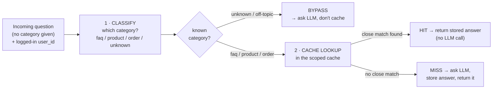
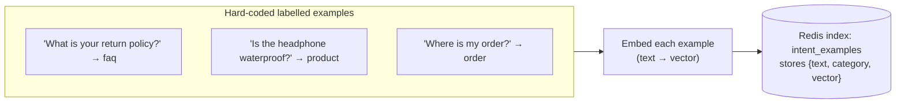
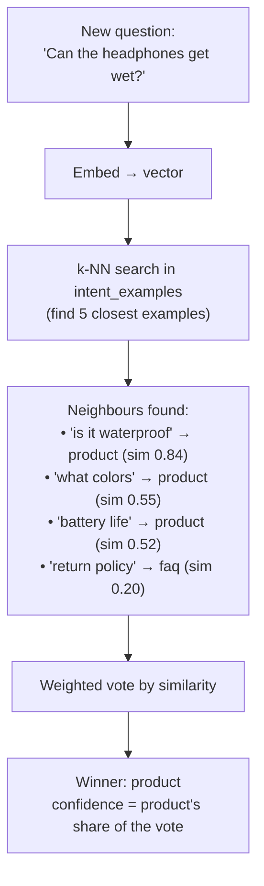
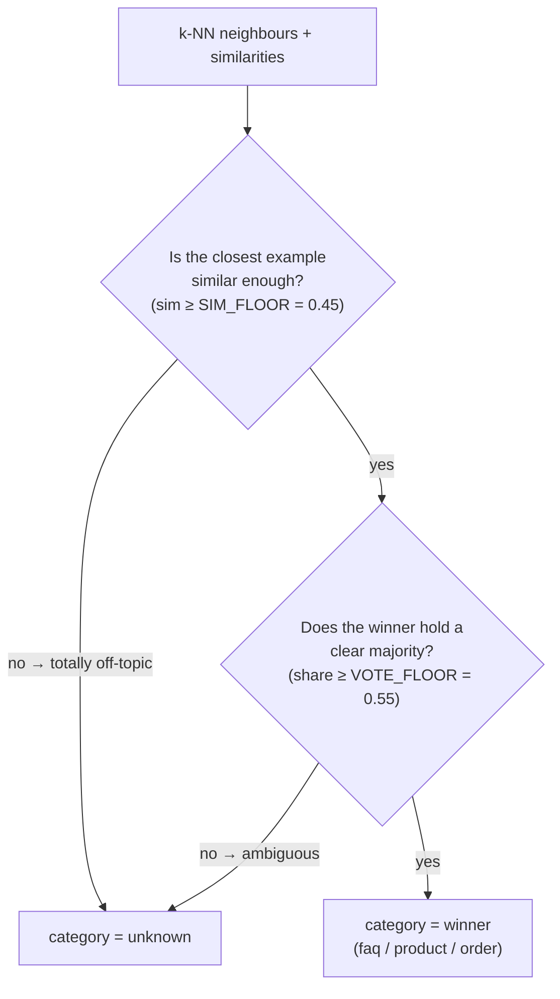
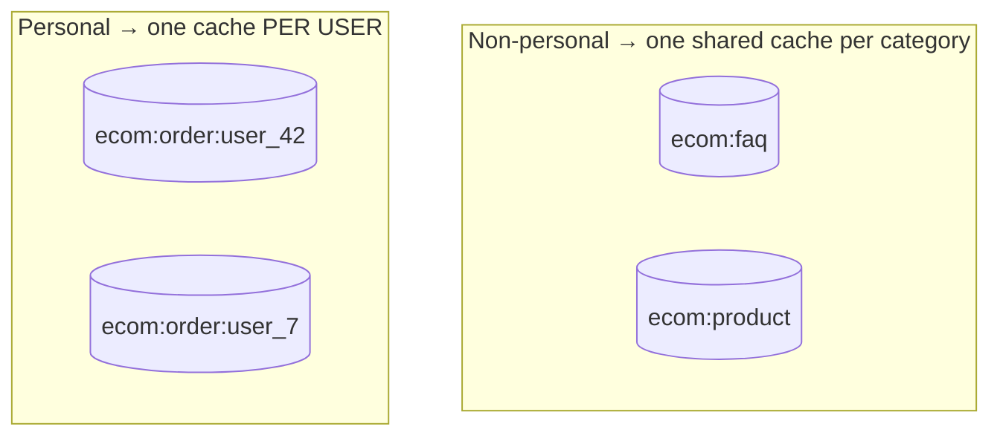
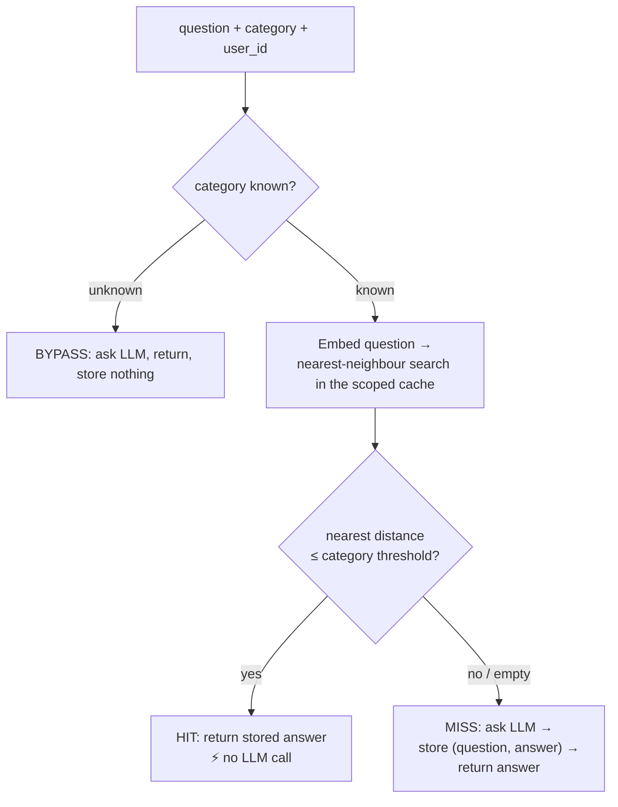
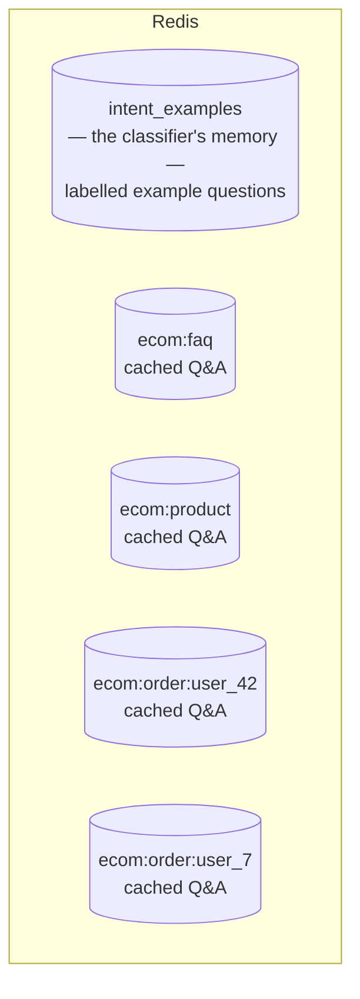
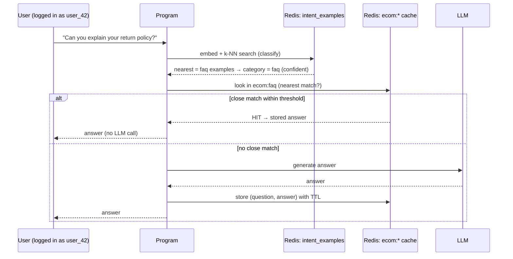

# How `redis_semantic_cache.py` Works — Architecture Guide

This document explains the **architecture** of the program: what it is made of, how a
question flows through it, how categories are decided automatically, and what lives inside
Redis. It focuses on *how things work*, not on the code line-by-line. Pair it with
[`../introduction.md`](../introduction.md) for the underlying concepts.

---

## 1. The big picture

The program is an e-commerce assistant with **two subsystems** working back-to-back:

1. **The Classifier** — decides *which category* a question belongs to
   (`faq`, `product`, or `order`). The incoming questions carry **no category label**;
   the program figures it out.
2. **The Semantic Cache** — tries to answer from a stored response; only calls the LLM when
   there is no good cached match. It is **scoped** per category (and per user for personal
   questions).

Every incoming question travels through the same pipeline:



> **Key architectural point:** the *category* is **detected** by the Classifier, while the
> *user_id* comes from the login/session (it is never read from the question text). These
> are two separate inputs to the cache stage.

---

## 2. Subsystem 1 — the Classifier (how categories are formed)

### 2.1 The idea in one line

> **To label a new question, find the most similar questions you have already labelled, and
> take a vote.**

This is called **k-Nearest-Neighbours (k-NN)**: look at the *k* closest known examples
(here *k*=5) and let them vote on the category.

### 2.2 Step A — teach the classifier (build the intent index)

The program holds a small, hard-coded list of **labelled example questions**
(`TRAINING_EXAMPLES`) — a handful per category. At startup each example is turned into a
vector (an embedding) and stored in a dedicated Redis vector index called
`intent_examples`. This is a **one-time setup** that "teaches" the classifier what each
category looks like.



Adding intelligence is as simple as adding more example lines — no other code changes.

### 2.3 Step B — classify a new question (k-NN vote)

When a real question arrives, the program embeds it, searches `intent_examples` for the
**5 nearest** labelled examples, and each neighbour votes for its own category. Votes are
**weighted by similarity** (closer neighbours count more). The category with the most vote
weight wins.



### 2.4 The two safety guards → `unknown`

The classifier refuses to guess when it isn't sure. Two checks can send a question to the
`unknown` bucket:



- **Guard 1 (off-topic):** if even the nearest known example is unlike the question
  (e.g. *"What time is the football match?"*), it's off-topic → `unknown`.
- **Guard 2 (ambiguous):** if no single category clearly wins the vote, don't force it →
  `unknown`.

An `unknown` question **bypasses the cache** and goes straight to the LLM. This is the safe
choice: guessing a wrong category could search the wrong cache and return a wrong answer.

---

## 3. Subsystem 2 — the Semantic Cache

Once the category is known, the question goes to that category's cache. Each category has
**its own cache with its own rules**, and personal questions are further split per user.

### 3.1 Scoping — one cache namespace per (category [+ user])



`order` questions are personal, so their cache name includes the `user_id`. This is a
**safety mechanism**: user_42 and user_7 can both ask the identical sentence *"Where is my
order?"*, but each is stored in a separate namespace, so user_7 can never receive user_42's
answer. FAQs and product questions are the same for everyone, so they share one cache.

### 3.2 Per-category thresholds and TTLs

| Category | Match strictness (distance) | Time-To-Live | Why |
|----------|-----------------------------|--------------|-----|
| `faq` | loose — `≤ 0.20` | 1 day | asked many ways, same answer; rarely changes |
| `product` | medium — `≤ 0.15` | 1 hour | fairly stable facts |
| `order` | strict — `≤ 0.10` | 5 minutes | personal + changes constantly |

- **Threshold** decides how similar a question must be to count as a match
  (lower distance = must be more similar). Strict where mistakes are costly.
- **TTL** decides how long an answer stays valid. Short where the truth changes fast.

### 3.3 The cache lifecycle: HIT / MISS / BYPASS



Every MISS **teaches** the cache: the new question+answer is stored, so the next similar
question becomes a HIT.

---

## 4. What is stored in Redis

The program creates **two kinds** of Redis vector indexes:



- **`intent_examples`** — the classifier's training memory. Each entry is
  `{ text, category, vector }`. This is *read* during classification and rebuilt at startup.
- **`ecom:*`** — the answer caches, one index per scope. Each entry is a record holding the
  original `prompt`, the cached `response`, the prompt's `vector`, timestamps, and a **TTL**
  on the record so it auto-expires.

In both cases the vector field is configured the same way: **1536 dimensions, FLOAT32,
cosine distance** — so "finding the nearest" always means "closest in meaning".

---

## 5. One request, end to end



---

## 6. Running it and reading the output

```bash
# from the repo root (applied-ai-resources/)
source .venv/bin/activate
python context-engineering/Semantic-Caching/resources/redis_semantic_cache.py
```

Each processed question prints a block like:

```
[06] ✅ HIT    | category=product (conf 100%) user=user_99
     Q: Can the Aura wireless headphones get wet?
     classified via nearest example: "Is the Aura wireless headphone waterproof?" [product] sim=0.84
     cache: scope='ecom:product'  dist=0.0871 ≤ 0.15  → matched "Is the Aura wireless headphone waterproof?"
     time=..ms   A: ...
```

How to read it:
- **category=… (conf …)** — what the Classifier decided, and how sure it was.
- **classified via nearest example** — the closest labelled example that drove the decision.
- **HIT / MISS / BYPASS** — whether the cache answered, called the LLM, or skipped the cache.
- **scope** — which cache namespace handled it (note the per-user `order` scopes).
- **dist … ≤ threshold** — the match distance vs. the category's strictness.

### Inspect Redis directly

```bash
redis-cli FT._LIST                 # all indexes: intent_examples + ecom:*
redis-cli FT.INFO intent_examples  # the classifier index schema
redis-cli KEYS 'ecom:*'            # cached answers
redis-cli TTL <a-cache-key>        # seconds until that answer expires
```

---

## 7. How to extend or experiment

- **Make the classifier smarter** — add more lines to `TRAINING_EXAMPLES`. More/varied
  examples per category = better classification. No other change needed.
- **Add a new category** — add its examples to `TRAINING_EXAMPLES` and one entry to
  `CATEGORIES` (its threshold, TTL, and whether it's personal). Done.
- **Change the questions being tested** — edit `DEMO_QUERIES` (they carry only text + the
  logged-in user; category is always detected).
- **Tune classification** — raise `SIM_FLOOR`/`VOTE_FLOOR` to send more borderline questions
  to `unknown` (safer), or lower them to classify more aggressively.
- **Tune caching** — adjust each category's `distance_threshold` (precision vs. hit rate)
  and `ttl_seconds` (freshness vs. reuse).
- **See scoping protect users** — temporarily make `order` non-personal (`user_scoped=False`)
  and watch a different user wrongly HIT another user's cached answer.

---

## 8. Design choices (the "why")

- **Two separate subsystems.** Classification and caching are independent concerns, wired in
  sequence. Each can be tuned or replaced without touching the other.
- **k-NN classifier over embeddings.** It reuses the embedding model the cache already needs,
  costs almost nothing per query, needs no training, and improves just by adding examples.
- **Confidence guards + bypass.** The classifier can say "I don't know"; the pipeline then
  refuses to cache. A wrong category is worse than no cache at all.
- **Scoping = safety, not just performance.** Personal data is namespaced by user so a cache
  match can never leak across users.
- **Per-category thresholds/TTLs.** One global setting can't serve stable FAQs and volatile,
  personal order questions well; each category gets rules that fit its risk and freshness.
