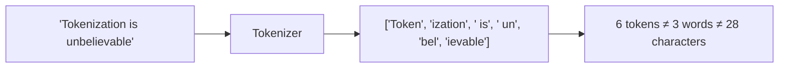
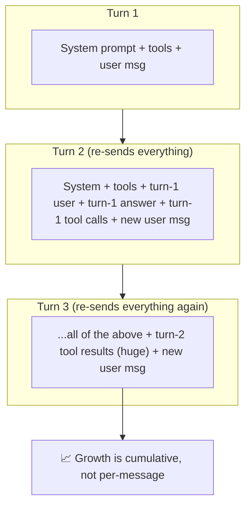
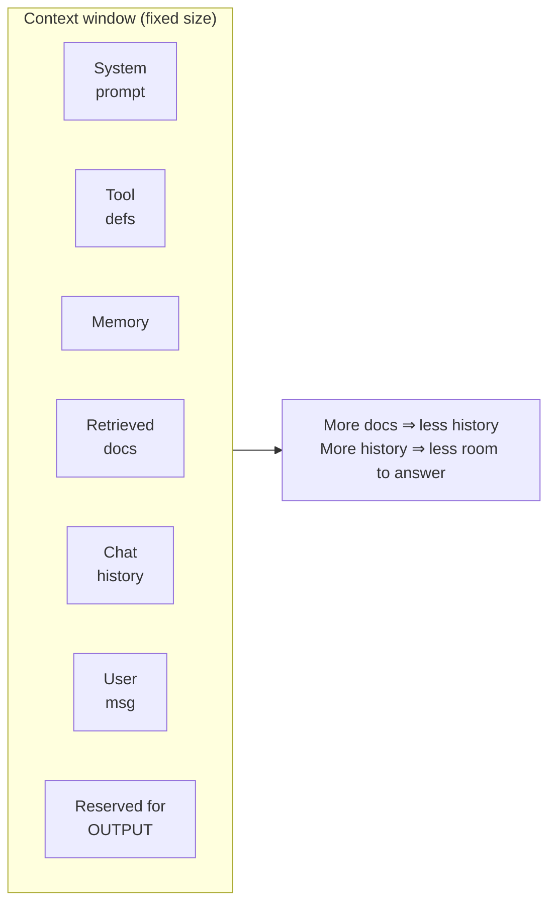
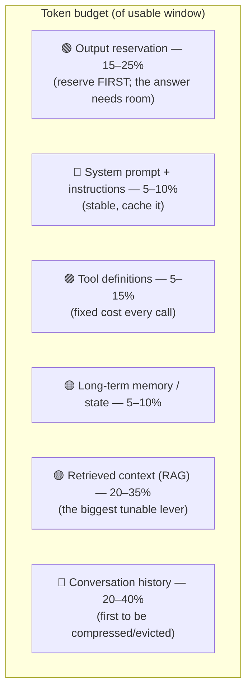
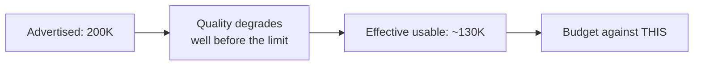
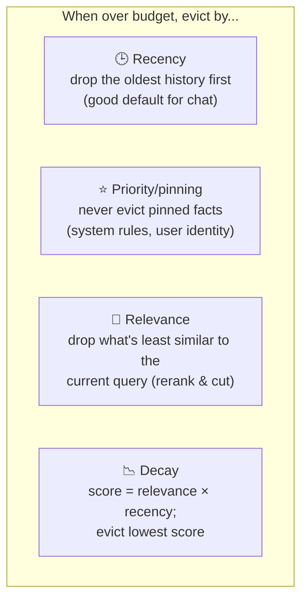
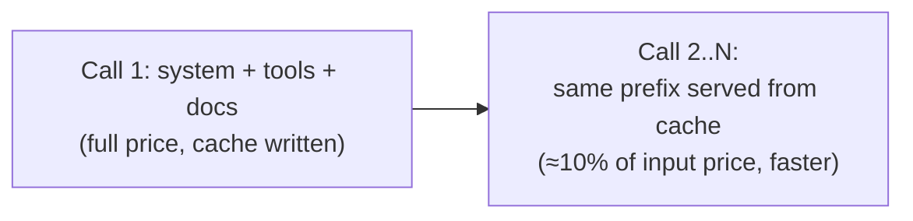
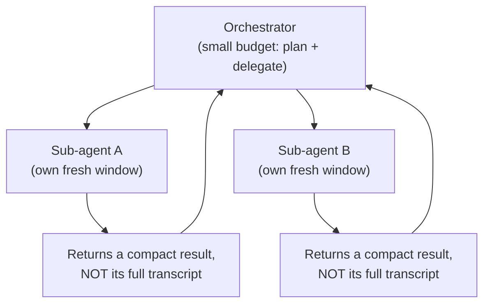

# Token Budgeting — From Beginner to Advanced

> A practical guide to **token budgeting**: treating the context window as a scarce,
> shared resource and deciding — deliberately, not accidentally — how many tokens each
> part of your prompt is allowed to spend. What a token is, why the window fills up so
> fast, how to divide it between system prompt, tools, memory, retrieval, history and the
> model's own output, how to measure and enforce a budget in code, and the hard lessons
> about the gap between the *advertised* window and the *usable* one.
>
> This is the sibling of [History Compression & Folding](../History-Compression-and-Folding/introduction.md):
> budgeting decides *how much* room each thing gets; compression decides *what to throw
> away* when you run out. Read this one first.

---

## Table of Contents

1. [The one-sentence idea](#1-the-one-sentence-idea)
2. [What is a token, really?](#2-what-is-a-token-really)
3. [Why the window fills up faster than you think](#3-why-the-window-fills-up-faster-than-you-think)
4. [The context window is a zero-sum game](#4-the-context-window-is-a-zero-sum-game)
5. [Anatomy of a token budget](#5-anatomy-of-a-token-budget)
6. [A worked example budget](#6-a-worked-example-budget)
7. [Intermediate: measuring tokens before you spend them](#7-intermediate-measuring-tokens-before-you-spend-them)
8. [Intermediate: the effective vs. advertised window](#8-intermediate-the-effective-vs-advertised-window)
9. [Intermediate: enforcing a budget in code](#9-intermediate-enforcing-a-budget-in-code)
10. [Advanced: allocation policies & priority-based eviction](#10-advanced-allocation-policies--priority-based-eviction)
11. [Advanced: the tool-metadata tax](#11-advanced-the-tool-metadata-tax)
12. [Advanced: prompt caching changes the economics](#12-advanced-prompt-caching-changes-the-economics)
13. [Advanced: budgeting for multi-agent & long-horizon systems](#13-advanced-budgeting-for-multi-agent--long-horizon-systems)
14. [Metrics — how to know your budget is working](#14-metrics--how-to-know-your-budget-is-working)
15. [Common pitfalls checklist](#15-common-pitfalls-checklist)
16. [Sources](#sources)

---

## 1. The one-sentence idea

> **Token budgeting is deciding, on purpose, how the finite context window is divided —
> so that the tokens that matter most are guaranteed a seat, and the tokens that matter
> least get evicted first.**

Every LLM has a hard ceiling on how many tokens it can "see" at once — the **context
window**. That window holds *everything*: your system prompt, tool definitions, retrieved
documents, conversation history, the user's latest message, **and** the space the model
needs to write its answer. When the total exceeds the window, something has to give —
either the request errors out, or the framework silently drops content and the model
starts forgetting things.

Token budgeting is the discipline of managing that space *before* it becomes a crisis. It
is to a context window what a monthly household budget is to a bank account: you decide in
advance what each category gets, instead of discovering at the end of the month that you
overspent.

---

## 2. What is a token, really?

A **token** is the unit an LLM actually reads and writes. It is *not* a word and *not* a
character — it's a chunk produced by the model's tokenizer, usually a common word-piece.



Useful rules of thumb for English text:

| Approximation | Value |
|---------------|-------|
| 1 token | ≈ 4 characters |
| 1 token | ≈ 0.75 words |
| 100 tokens | ≈ 75 words |
| 1,000 words | ≈ 1,300–1,500 tokens |

> ⚠️ These are **English-prose** ratios. Code, JSON, non-Latin scripts, and long numbers
> tokenize *much* worse — often 1.5–3× more tokens for the same visible length. A page of
> minified JSON or a stack trace can cost far more tokens than a page of prose. Never
> estimate a budget for structured data using prose ratios.

Both **input** (what you send) and **output** (what the model generates) are counted in
tokens, and on most providers they share the same window and are **billed separately**
(output tokens usually cost more).

---

## 3. Why the window fills up faster than you think

Beginners assume "200K tokens is enormous, I'll never hit it." In an agent, you hit it
constantly, because the window doesn't hold *one* message — it holds the **entire growing
transcript** plus a lot of invisible overhead.



The specific culprits that inflate the count:

- **Conversation history is cumulative.** Every turn re-sends the *whole* prior transcript.
  A 20-turn chat sends turn 1 twenty times.
- **Tool results are enormous.** A single API response, file read, or search result can be
  thousands of tokens. Agents accumulate dozens of these.
- **Tool *definitions* are always present.** Every tool's name, description, and JSON schema
  sits in the window on *every* call, whether used or not (see §11).
- **Reasoning traces.** Models that "think" emit large intermediate reasoning that also
  occupies the window.
- **Retrieved context (RAG).** Stuffing 10 documents "just in case" can dwarf everything else.

> **Rule of thumb:** in a real agent, the user's actual question is often **< 1%** of the
> tokens in the window. The other 99% is scaffolding, history, and tool noise — which is
> exactly why budgeting matters.

---

## 4. The context window is a zero-sum game

This is the single most important mental model. The window is a fixed-size box. **Every
token you spend on one thing is a token unavailable to everything else.**



Concretely, the trade-offs you are constantly making:

- Retrieve **more documents** → **less** room for conversation history.
- Keep **more history** → **less** room for the model to actually write a long answer.
- Add **more tools** → the fixed tool-definition overhead eats the window on *every* call.
- Forget to **reserve output space** → the model runs out of room mid-answer, or errors.

> **The output reservation is the mistake beginners make most.** If the window is 200K and
> you fill 199K with input, the model has 1K tokens to answer in — or the call fails
> outright. Always carve out the output budget *first*, then divide what remains.

---

## 5. Anatomy of a token budget

A token budget assigns each **category** of content a share of the window. A sensible
default split for an agent (percentages of the *usable* window — see §8):



| Category | Typical share | Character | Budgeting strategy |
|----------|--------------:|-----------|--------------------|
| **Output reservation** | 15–25% | Non-negotiable | Reserve *before* anything else |
| **System prompt** | 5–10% | Stable, every call | Keep tight; cache it |
| **Tool definitions** | 5–15% | Fixed per call | Prune unused tools; load on demand (§11) |
| **Long-term memory** | 5–10% | Slow-changing | Store externally, inject only what's relevant |
| **Retrieved docs (RAG)** | 20–35% | Highly tunable | Cap `top_k`; rerank; the main lever you control |
| **Conversation history** | 20–40% | Grows unboundedly | Compress/fold/evict oldest (see sibling doc) |

These are *starting points*, not laws — a research agent leans toward retrieval, a chatbot
toward history. The point is to **have** numbers, then tune them from telemetry.

---

## 6. A worked example budget

Say you're on a model with a **200,000-token** advertised window, but you treat the
**usable** window as **~130,000** (see §8 for why). Here is a concrete allocation:

| Category | Budget (tokens) | Notes |
|----------|----------------:|-------|
| Output reservation | 30,000 | Reserved first; hard floor |
| System prompt | 4,000 | Cached |
| Tool definitions | 12,000 | 8 tools, pruned from 25 |
| Long-term memory | 8,000 | User profile + key facts |
| Retrieved documents | 40,000 | `top_k=8`, reranked, ~5K each |
| Conversation history | 36,000 | Compressed beyond this |
| **Total input** | **100,000** | Leaves margin below 130K |

The logic:

1. **Reserve output first** (30K). Whatever happens, the model can write a full answer.
2. **Fixed costs next** (system + tools + memory = 24K). These are non-negotiable per call.
3. **Split the remainder** between retrieval and history — the two big tunable levers.
4. **Leave a margin** (100K used of 130K usable). Never budget to 100%; leave headroom for
   an unusually long tool result or a burst of reasoning.

> **Rule of thumb:** budget to **~75–80%** of your *usable* window, not 100%. The last 20%
> is your shock absorber for the one turn that returns a giant tool result.

---

## 7. Intermediate: measuring tokens before you spend them

You cannot budget what you don't measure. Count tokens with the **same tokenizer the model
uses** — a `len(text.split())` word count is not good enough and will be wrong by 30%+.

- **OpenAI models** → [`tiktoken`](https://github.com/openai/tiktoken) (`cl100k_base` /
  `o200k_base`).
- **Anthropic / Claude** → the [token counting endpoint](https://docs.claude.com/en/docs/build-with-claude/token-counting)
  (`client.messages.count_tokens(...)`) gives an exact server-side count including tools.
- **Open models (Llama, Mistral, etc.)** → the model's own HuggingFace tokenizer.

```python
import os
import tiktoken

# API keys always come from the environment, never hard-coded.
# export OPENAI_API_KEY=... in your shell.

enc = tiktoken.get_encoding("o200k_base")

def count_tokens(text: str) -> int:
    """Exact token count for OpenAI o200k models."""
    return len(enc.encode(text))

def fits_budget(text: str, budget: int) -> bool:
    n = count_tokens(text)
    if n > budget:
        print(f"⚠️ {n} tokens exceeds budget of {budget} (over by {n - budget})")
    return n <= budget

system_prompt = "You are a helpful assistant that ..."
print(count_tokens(system_prompt))  # know the cost of every fixed piece
```

> ⚠️ **Tool schemas and message wrappers cost tokens too**, and the exact overhead is
> provider-specific (role markers, JSON structure, tool-use envelopes). For a precise
> number, use the provider's own counting endpoint against the *full* request payload —
> not just the visible text. Estimate locally during development; verify with the provider
> before you trust a tight budget in production.

---

## 8. Intermediate: the effective vs. advertised window

The number on the box is a marketing number. The number you should budget against is
smaller — sometimes much smaller.



Two independent effects shrink your real budget:

1. **"Lost in the middle" / context rot.** As the window fills, models attend less reliably
   to information buried in the middle of a long prompt. Recall and reasoning quality
   measurably degrade *well before* the hard token limit — many teams observe noticeable
   degradation around **60–70% of the advertised window**. A model advertising 200K may
   behave meaningfully worse past ~130K.

2. **The hard limit includes output.** The advertised number is input **+** output combined
   on most providers. You never actually get 200K of input.

> **Rule of thumb:** treat the *usable* window as roughly **60–70% of advertised**, and
> reserve output on top of that. "Treating the advertised number as your operating budget
> is how production systems quietly degrade." More tokens is not more quality — past a
> point, more tokens is *worse* quality, slower responses, and higher cost.

This is why "just use the 1M-token model and stop worrying" is a trap: the failure mode
shifts from a loud error (request rejected) to a silent one (the model ignores things in
the middle and you can't tell why).

---

## 9. Intermediate: enforcing a budget in code

A budget is only real if something enforces it. The pattern: define per-category caps, fill
categories in priority order, and truncate/compress the low-priority ones when the total
would overflow.

```python
from dataclasses import dataclass

@dataclass
class Section:
    name: str
    text: str
    priority: int      # lower = more important, evicted last
    max_tokens: int    # this section's cap

def assemble_prompt(sections: list[Section], usable_window: int,
                    output_reserve: int, count) -> list[Section]:
    """Fill the window by priority; drop/trim low-priority sections that don't fit."""
    input_budget = usable_window - output_reserve
    spent, kept = 0, []
    for s in sorted(sections, key=lambda x: x.priority):
        n = min(count(s.text), s.max_tokens)
        if spent + n <= input_budget:
            kept.append(s)
            spent += n
        else:
            # Not enough room: trim to whatever fits, or skip entirely.
            remaining = input_budget - spent
            if remaining > 200:                 # worth keeping a trimmed slice
                s.text = trim_to_tokens(s.text, remaining, count)
                kept.append(s)
                spent = input_budget
            # else: this section is evicted — it lost the budget competition
            break
    print(f"Assembled {spent}/{input_budget} input tokens across {len(kept)} sections")
    return kept
```

The key ideas embodied here:

- **Priority ordering** — the system prompt and user message win; old history loses.
- **Per-section caps** — no single retrieved doc can blow the whole budget.
- **Explicit output reservation** — subtracted up front.
- **Graceful degradation** — trim-then-drop instead of a hard crash.

---

## 10. Advanced: allocation policies & priority-based eviction

When the budget is tight, *which* tokens do you drop? This is an eviction-policy problem,
and different strategies suit different content.



| Policy | Evicts | Best for | Risk |
|--------|--------|----------|------|
| **Recency (FIFO)** | Oldest turns | General chat | Drops still-relevant early context |
| **Priority / pinning** | Anything unpinned | Rules & identity that must persist | Manual; you must mark pins |
| **Relevance** | Least query-similar chunks | RAG, big document sets | Needs an embedding/rerank step |
| **Decay (relevance × recency)** | Lowest combined score | Long-running agents | More complex to tune |

Production systems usually **layer** these: pin the non-negotiables (system prompt, user
identity, task goal), keep the last *N* turns by recency, and fill the remaining retrieval
budget by relevance. A common trigger: when usage hits **70–80% of capacity**, kick off
summarization of the oldest history to reclaim space (this is where the
[compression/folding](../History-Compression-and-Folding/introduction.md) machinery takes
over).

> **Rule of thumb:** *pin what must never be lost, evict by recency by default, and rank by
> relevance when you have more candidates than budget.* Never rely on the framework's
> silent auto-truncation — you won't know what it dropped.

---

## 11. Advanced: the tool-metadata tax

An underappreciated line item: **tool definitions are in the window on every single call**,
used or not. Each tool contributes its name, description, and full JSON-schema parameters.

- A rich MCP (Model Context Protocol) server can register **dozens** of tools. Reported
  figures put tool/MCP metadata at **40–50% of the context window** in tool-heavy setups —
  before the user has said anything.
- This cost is paid on *every* request, and it competes directly with retrieval and history.

Mitigations, roughly in order of impact:

1. **Prune to the tools this agent actually needs.** 8 well-chosen tools beat 30 generic
   ones — both for the budget and for the model's accuracy.
2. **Tighten schemas and descriptions.** Verbose parameter docs are pure token cost;
   compress them without losing meaning.
3. **Load tools on demand / staged loading.** Expose a small core set; reveal specialized
   tools only when the task pattern matches, instead of front-loading everything.
4. **Prefer CLI- or Skills-based approaches** where the model invokes capability without a
   large always-present schema, so "tool discovery" isn't a runtime token cost.

> ⚠️ Adding a tool is never free. Every tool you register is a standing tax on **every**
> turn for the life of the session. Audit your tool list the way you'd audit a subscription
> bill.

---

## 12. Advanced: prompt caching changes the economics

Token *budgeting* (space) and token *cost* (money) are related but distinct. **Prompt
caching** attacks the cost side without changing the space side.

Providers let you mark a stable prefix of the prompt (system prompt, tool definitions,
long static documents) as **cacheable**. On subsequent calls, that prefix is billed at a
large discount and processed faster, because the provider reuses its internal state.



Budgeting implications:

- **Order your prompt stable-first.** Put the unchanging content (system, tools, pinned
  docs) at the *front* so the cacheable prefix is as long as possible; put volatile content
  (latest user message, fresh retrieval) at the end.
- **Caching does not shrink the window.** Those tokens still occupy space — caching only
  makes them *cheaper and faster*, not *smaller*. You still budget for them.
- **Cache invalidation is prefix-based.** Change one token early in the prompt and the whole
  downstream cache misses. Keep the stable prefix genuinely stable.

> **Rule of thumb:** budget the *window* for space and design the *prompt order* for cache
> hits. They're two separate optimizations that stack.

---

## 13. Advanced: budgeting for multi-agent & long-horizon systems

Single-agent budgeting is the easy case. Two harder regimes:

**Long-horizon agents** (tasks spanning hundreds of steps) *will* exceed any window,
period. Budgeting alone can't save you — you pair it with compaction and folding:

- Budget a working window; when it approaches the trigger (~70–80%), **compact** older
  steps into a summary and continue.
- **Context folding**: spin a subtask into its own sub-context, then "fold" it back as a
  short outcome summary — keeping the main thread's active budget small even as total work
  grows. Research shows folding can keep the active context up to ~10× smaller than naive
  accumulation. (Full treatment in the
  [sibling doc](../History-Compression-and-Folding/introduction.md).)

**Multi-agent systems** distribute the budget across agents:



- Each sub-agent gets its **own** context window — parallelism multiplies your total
  effective budget.
- The contract that makes this work: a sub-agent returns a **compact summary**, never its
  raw transcript. If sub-agents dump full histories back to the orchestrator, you've just
  moved the overflow, not solved it.
- The orchestrator's budget stays small: high-level plan, task assignments, and the compact
  results — never the sub-agents' step-by-step work.

---

## 14. Metrics — how to know your budget is working

| Metric | What it tells you | Watch for |
|--------|-------------------|-----------|
| **Window utilization (%)** | How full the window is per call | Consistently >85% = no shock absorber; frequent overflow risk |
| **Tokens per category** | Where the budget actually goes | Tool defs or history quietly dominating |
| **Truncation / eviction rate** | How often you drop content | High = budget too tight or history growing unbounded |
| **Output-length clipping** | Answers cut off at max_tokens | You under-reserved output |
| **Cost per request** | $ per call | Rising = cache misses or bloated input |
| **Cache hit rate** | % of input served from cache | Low = volatile prefix; reorder the prompt |
| **Quality vs. utilization** | Accuracy as the window fills | Drop past ~60–70% = context rot; compress sooner |

> **First-week playbook:** log tokens-per-category on every request, find the biggest line
> item (usually tool defs or history), and attack that first. You cannot budget what you
> haven't measured.

---

## 15. Common pitfalls checklist

- [ ] **Not reserving output space** → answers get clipped or the call errors out.
- [ ] **Budgeting against the advertised window** → context rot; budget the *usable* ~60–70%.
- [ ] **Counting tokens with a word-splitter** → use the model's real tokenizer.
- [ ] **Estimating structured data (code/JSON) with prose ratios** → 2–3× undercount.
- [ ] **Registering every tool "just in case"** → the tool-metadata tax on every turn.
- [ ] **Stuffing `top_k=20` documents** → history and output starved; cap and rerank.
- [ ] **Letting history grow unbounded** → the window silently overflows; compress at 70–80%.
- [ ] **Budgeting to 100% of the window** → no shock absorber for a giant tool result.
- [ ] **Volatile content early in the prompt** → kills prompt-cache hits.
- [ ] **Trusting the framework's silent truncation** → you won't know what it dropped.
- [ ] **Sub-agents returning full transcripts** → overflow moved, not solved.
- [ ] **"Bigger window = better"** → often slower, costlier, and *less* accurate.

---

## Sources

- [Anthropic — Effective context engineering for AI agents](https://www.anthropic.com/engineering/effective-context-engineering-for-ai-agents)
- [Morph — Context Engineering: Why More Tokens Makes Agents Worse](https://www.morphllm.com/context-engineering)
- [Morph — LLM Context Window Comparison (2026)](https://www.morphllm.com/llm-context-window-comparison)
- [Redis — Context Window Overflow in 2026: Fix LLM Errors Fast](https://redis.io/blog/context-window-overflow/)
- [DEV — LLM Context Window Token Budget: Why Your Window Fills Up Fast](https://dev.to/swapnanilsaha/llm-context-window-token-budget-why-your-window-fills-up-fast-4c05)
- [Machine Learning Plus — LLM Context Windows Explained: Token Budget Guide](https://machinelearningplus.com/gen-ai/context-windows-token-budget/)
- [Fast.io — AI Agent Token Cost Optimization: Complete Guide for 2026](https://fast.io/resources/ai-agent-token-cost-optimization/)
- [Iternal — Tokenization in NLP: Tokens, Usage & Cost Guide (2026)](https://iternal.ai/token-usage-guide)
- [arXiv — ContextBudget: Budget-Aware Context Management for Long-Horizon Search Agents](https://arxiv.org/pdf/2604.01664)
- [arXiv — Externalization in LLM Agents: Memory, Skills, Protocols and Harness Engineering](https://arxiv.org/pdf/2604.08224)
- [OpenAI — tiktoken (tokenizer library)](https://github.com/openai/tiktoken)
- [Anthropic — Token counting docs](https://docs.claude.com/en/docs/build-with-claude/token-counting)
- [Anthropic — Prompt caching docs](https://docs.claude.com/en/docs/build-with-claude/prompt-caching)
