# Advanced RAG Patterns — Beyond the Naive Pipeline (Beginner → Advanced)

> The [naive RAG pipeline](../overview.md) is a **straight line**: chunk → embed → store →
> retrieve → stuff into prompt → generate. It works, but it's brittle — it retrieves once, never
> checks if the context was any good, and never adapts to the question. **Advanced RAG patterns**
> are the named architectures that fix this by adding *control flow*: loops, branches,
> self-checks, routing, and autonomous agents.
>
> This document explains the paradigm shift and then walks through every major pattern —
> **RAPTOR, Self-RAG, Corrective RAG (CRAG), Adaptive RAG, Agentic RAG, Modular RAG, and
> Multimodal RAG** — from first principles, each with a diagram, the problem it solves, how it
> works step by step, and when to use it. No code; concepts only, from beginner to advanced.

---

## Table of Contents

1. [The big picture: Naive → Advanced → Modular](#1-the-big-picture-naive--advanced--modular)
2. [The mental shift: from a pipeline to a control flow](#2-the-mental-shift-from-a-pipeline-to-a-control-flow)
3. [A quick recap: pre-retrieval and post-retrieval optimizations](#3-a-quick-recap-pre-retrieval-and-post-retrieval-optimizations)
4. [Pattern 1 — RAPTOR (hierarchical tree retrieval)](#4-pattern-1--raptor-hierarchical-tree-retrieval)
5. [Pattern 2 — Self-RAG (retrieve on demand + self-critique)](#5-pattern-2--self-rag-retrieve-on-demand--self-critique)
6. [Pattern 3 — Corrective RAG / CRAG (grade, then correct)](#6-pattern-3--corrective-rag--crag-grade-then-correct)
7. [Pattern 4 — Adaptive RAG (route by query complexity)](#7-pattern-4--adaptive-rag-route-by-query-complexity)
8. [Pattern 5 — Agentic RAG (the autonomous loop)](#8-pattern-5--agentic-rag-the-autonomous-loop)
9. [Pattern 6 — Modular RAG (RAG as swappable Lego)](#9-pattern-6--modular-rag-rag-as-swappable-lego)
10. [Pattern 7 — Multimodal RAG (beyond text)](#10-pattern-7--multimodal-rag-beyond-text)
11. [All patterns side by side](#11-all-patterns-side-by-side)
12. [How to choose & apply to an existing pipeline](#12-how-to-choose--apply-to-an-existing-pipeline)
13. [Pitfalls & trade-offs](#13-pitfalls--trade-offs)
14. [Mastery checklist](#14-mastery-checklist)
15. [Sources](#sources)

---

## 1. The big picture: Naive → Advanced → Modular

RAG evolved through **three paradigms**. Understanding this progression is the frame for
everything below — each pattern is a point on this evolution.

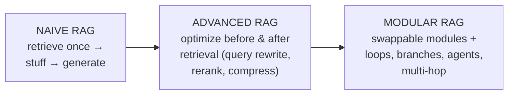

- **Naive RAG** — the straight line. One retrieval, no quality control. Problem: retrieves
  irrelevant or incomplete chunks and has no way to notice.
- **Advanced RAG** — adds **pre-retrieval** optimizations (query rewriting/expansion) and
  **post-retrieval** optimizations (reranking, context compression). Still basically linear, but
  smarter at each end.
- **Modular RAG** — the current paradigm. RAG becomes a **set of reconfigurable modules** you can
  rewire, plus the ability to **call the retriever and LLM multiple times** in loops and
  branches. Every pattern in this doc (Self-RAG, CRAG, Adaptive, Agentic) is a *modular RAG*
  arrangement.

> **Key insight:** "advanced patterns" aren't random tricks — they're all answers to the same
> question: *"How do we stop trusting a single, blind retrieval and instead check, adapt, and
> iterate?"*

---

## 2. The mental shift: from a pipeline to a control flow

Naive RAG is a **pipeline** — data flows one way, once. Advanced RAG is a **control flow** —
there are decisions, loops, and fallbacks, like a real program.

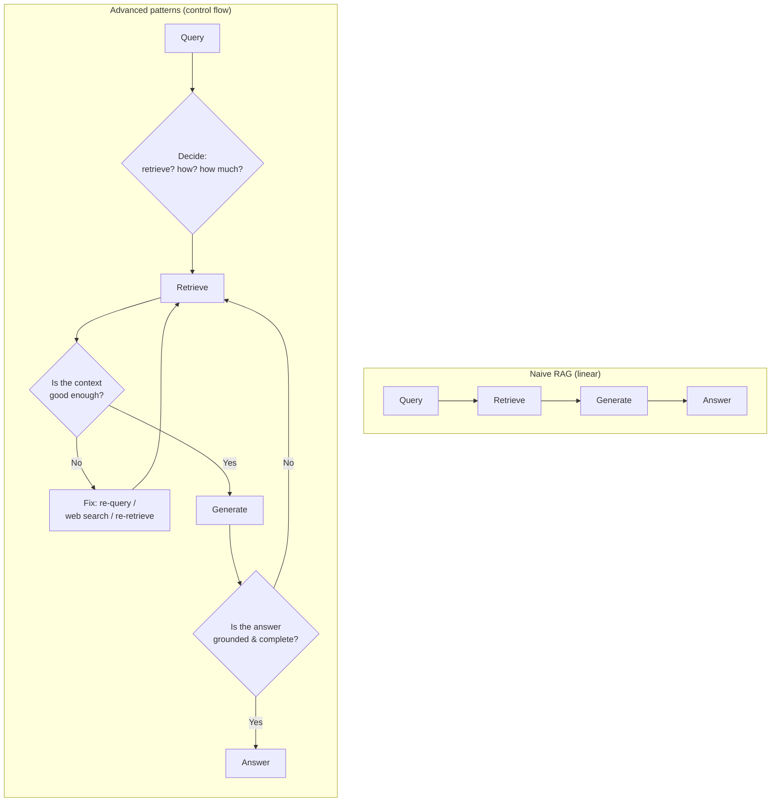

The three new powers that define advanced RAG:
1. **Decide** — should we even retrieve? How deep? (→ Adaptive RAG, Self-RAG)
2. **Check** — is the retrieved context / generated answer good enough? (→ CRAG, Self-RAG)
3. **Loop** — if not, fix it and try again. (→ Agentic RAG)

Every pattern below is a specific way of wiring these three powers.

---

## 3. A quick recap: pre-retrieval and post-retrieval optimizations

Before the named patterns, "Advanced RAG" (the paradigm) is mostly about optimizing the two ends
of retrieval. You've met these in earlier tiers; they're the *foundation* the patterns build on:

- **Pre-retrieval (fix the query):** query rewriting, expansion, HyDE, sub-question decomposition
  (Tier 4 — Query Transformation).
- **Retrieval (fix the search):** hybrid search (BM25 + vectors), metadata filtering (Tier 3).
- **Post-retrieval (fix the results):** **reranking** with a cross-encoder, **context compression**
  (trim chunks before the LLM) (Tier 3).

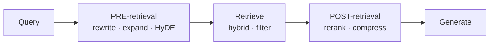

The named patterns below add **feedback and control** *on top of* these optimizations.

---

## 4. Pattern 1 — RAPTOR (hierarchical tree retrieval)

**Recursive Abstractive Processing for Tree-Organized Retrieval.** This is an **indexing-side**
pattern — it changes *what you store*, not the query loop.

**Problem it solves:** naive RAG retrieves flat chunks. A chunk holds *local* detail but no
*big-picture* context. Questions like *"What are the overall themes of this report?"* can't be
answered from any single 200-token chunk — the answer is spread across the whole document.

**How it works — build a knowledge pyramid:**

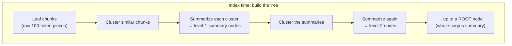

1. **Chunk** the corpus into small leaf nodes (~100 tokens).
2. **Cluster** semantically similar chunks together.
3. **Summarize** each cluster with an LLM → these summaries become new, higher-level nodes.
4. **Recurse** — cluster and summarize the summaries, again and again, until you reach a single
   root that summarizes everything.
5. **Embed and store *every* node** — leaves *and* all summary levels — in one vector index.

**At query time:** you search across the *entire tree*, so a query can match a **fine-grained leaf**
(for detail questions) *or* a **high-level summary node** (for thematic questions). Same retrieval
mechanism, but now multiple abstraction levels are available.

**When to use it:** long documents, multi-hop questions, and "summarize/what are the themes"
queries where flat chunks lose the forest for the trees. **Cost:** extra LLM calls and storage at
index time to build the summaries.

---

## 5. Pattern 2 — Self-RAG (retrieve on demand + self-critique)

**Self-Reflective RAG.** The model learns to **decide when to retrieve** and to **grade its own
output** using special "reflection" tokens.

**Problem it solves:** naive RAG *always* retrieves, even for questions the model already knows
(wasteful, and irrelevant context can hurt). And it never checks whether its answer is actually
supported by the context.

**How it works:**

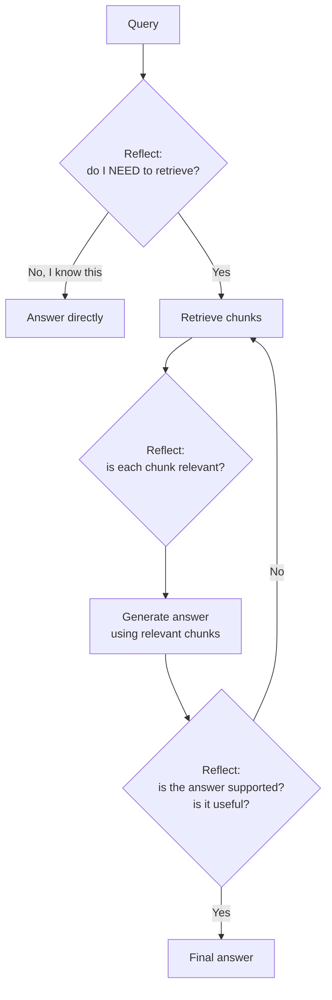

The model emits **reflection tokens** at three decision points:
1. **Retrieve or not?** — skip retrieval for parametric-knowledge questions.
2. **Is the retrieved passage relevant?** — grade each chunk.
3. **Is my generated answer grounded and useful?** — critique the output; if it's unsupported,
   retrieve again and regenerate.

**When to use it:** systems that mix "the model already knows this" questions with "must look it
up" questions, and where you want built-in hallucination self-checking. **Cost:** typically needs
a model trained/fine-tuned to emit reflection tokens (or careful prompting to emulate them).

---

## 6. Pattern 3 — Corrective RAG / CRAG (grade, then correct)

**Corrective RAG** adds a **relevance grader** on the retrieved documents *before* generation,
and a **fallback** when retrieval is poor.

**Problem it solves:** the retriever sometimes returns weak or off-topic documents. Naive RAG
feeds them to the LLM anyway → garbage in, garbage out. CRAG catches bad retrieval and *does
something about it*.

**How it works:**

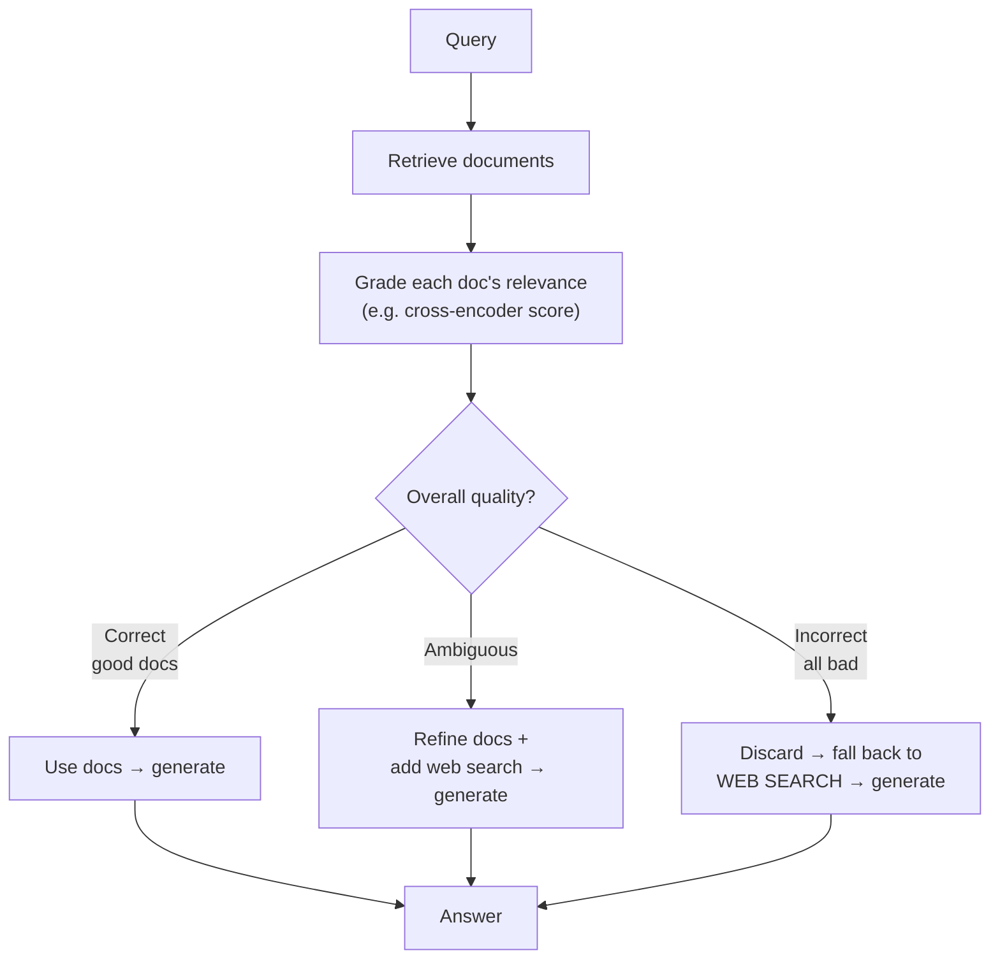

1. Retrieve as usual.
2. **Grade** each retrieved doc for relevance (a scoring model / cross-encoder), producing a
   confidence label: **Correct**, **Incorrect**, or **Ambiguous**.
3. **Act on the grade:**
   - *Correct* → use the docs, optionally after a "knowledge refinement" step that strips
     irrelevant sentences.
   - *Incorrect* → the internal corpus failed; **fall back to web search** for fresh sources.
   - *Ambiguous* → combine refined internal docs **and** web results.
4. Generate from whatever survived.

**When to use it:** open-domain Q&A where your corpus may not cover everything, and you can afford
a web-search fallback. It's the go-to pattern for **"validate retrieval before trusting it."**

> **CRAG vs. Self-RAG:** Self-RAG critiques *the answer* (generation side); CRAG grades *the
> documents* (retrieval side) and adds an external fallback. They're complementary and often
> combined.

---

## 7. Pattern 4 — Adaptive RAG (route by query complexity)

**Adaptive RAG** puts a **classifier at the front** that reads the query and picks a retrieval
strategy proportional to how hard the question is. Don't spend a multi-hop reasoning budget on
"what's your return window?"

**Problem it solves:** all queries are *not* equal. A single fixed strategy either over-serves
simple queries (slow, expensive) or under-serves complex ones (incomplete answers).

**How it works:**

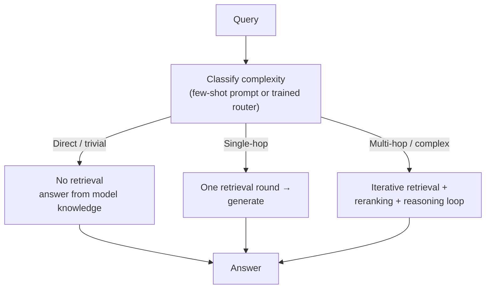

1. A **router/classifier** labels the query: *direct* (no retrieval needed), *single-hop* (one
   retrieval), or *multi-hop/complex* (iterative retrieval + reasoning).
2. The system **dynamically adjusts** retrieval depth, number of documents, and reasoning effort
   to match.

**When to use it:** production systems with a wide mix of query difficulty, where latency and cost
matter. The router can be as simple as a few-shot-prompted classifier or a fine-tuned model.
Adaptive RAG is essentially the "dispatcher" that decides *which* other pattern to run.

---

## 8. Pattern 5 — Agentic RAG (the autonomous loop)

The biggest 2025–26 direction. **Agentic RAG** replaces the fixed pipeline with one or more
**autonomous agents** that *plan*, *use tools* (retrievers, web search, calculators, APIs),
*reflect* on results, and *iterate* until the task is done.

**Problem it solves:** complex, multi-step questions ("compare our Q3 refund rate to the industry
and explain the gap") need *several* retrievals, across *several* sources, with *reasoning* in
between. A linear pipeline can't plan or adapt mid-task. An agent can.

### The four agentic design patterns

Agentic RAG is built from four reusable behaviours:

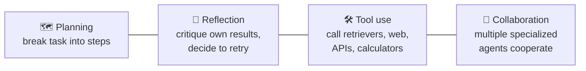

### Architecture types (start simple!)

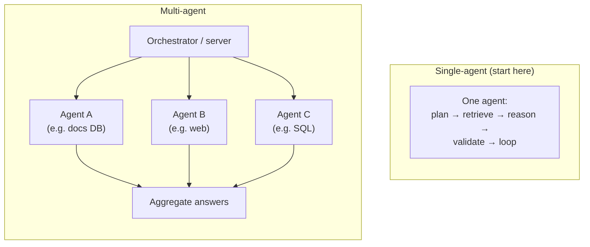

- **Single-agent** — one agent does everything in a loop: plan, retrieve, evaluate whether the
  context is sufficient, re-retrieve if not, then answer. **This is where you should start.**
- **Multi-agent** — an **orchestrator** routes the query to specialized agents (one per source /
  skill), collects their answers, and aggregates. Use only when a single agent genuinely can't
  cope — the coordination overhead (shared state, routing, communication) only pays off when the
  task needs **specialization or parallelism**.
- **Hierarchical** — layered agents (a top planner delegating to sub-teams) for very complex
  workflows.

### The query-routing classifier (inside an agent)

A recurring agentic building block classifies each query:
- **Direct** — the LLM answers from its own knowledge; no retrieval.
- **Single-hop** — one retrieval round against one source.
- **Multi-hop** — synthesize across multiple sources / iterative retrieval.

**When to use it:** genuinely complex, open-ended, or multi-source tasks. **The warning:** agents
add latency, cost, and unpredictability. Don't reach for multi-agent unless single-agent can't do
the job — most problems don't need it.

> **Relationship to the others:** Agentic RAG is the *superset*. An agent can *use* Self-RAG's
> self-critique, CRAG's document grading, Adaptive RAG's routing, and RAPTOR's index as tools and
> sub-behaviours. Think of the earlier patterns as *behaviours* an agent orchestrates.

---

## 9. Pattern 6 — Modular RAG (RAG as swappable Lego)

**Modular RAG** is less a single algorithm and more the **architectural philosophy** behind all
the above: decompose RAG into interchangeable **modules** (indexing, pre-retrieval, retrieval,
post-retrieval, generation, orchestration) that you can **add, remove, swap, and loop**.

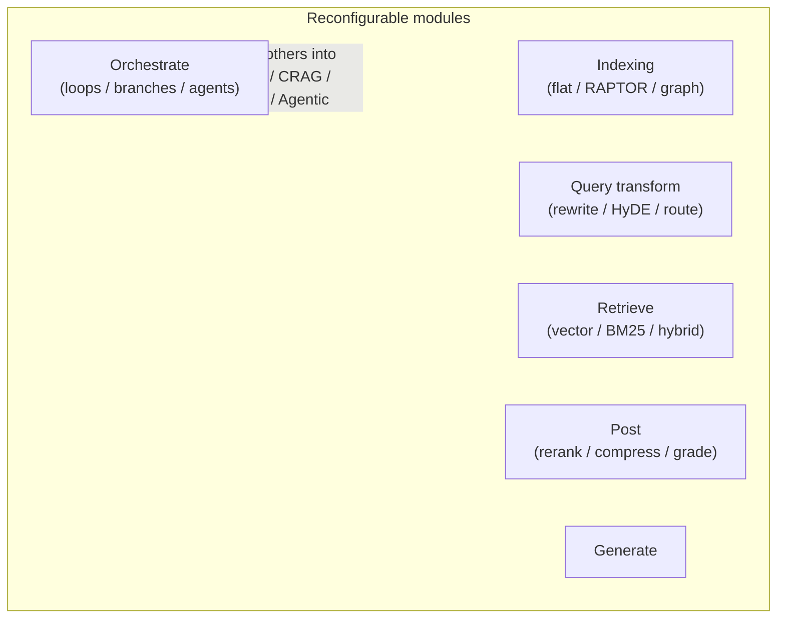

**Why it matters:** once you see RAG as modules, the "patterns" stop being magic names — Self-RAG
is *just* "retrieval module + a reflection module in a loop"; CRAG is "retrieval + a grading
module + a web-search fallback module." You **compose** patterns instead of memorizing them.

**When to use it:** it's the mindset for any serious production system — build your RAG so each
piece is swappable and measurable (tie back to the evaluation tier: measure, swap one module,
re-measure).

---

## 10. Pattern 7 — Multimodal RAG (beyond text)

**Multimodal RAG** extends retrieval and generation to **non-text data** — images, tables,
charts, audio, video — not just paragraphs of text.

**Problem it solves:** real corpora aren't pure text. Product catalogs have images, financial
reports have tables and charts, manuals have diagrams. Text-only RAG is blind to all of it.

**How it works (two common approaches):**

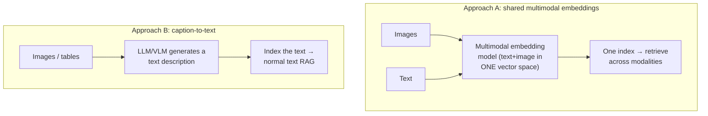

- **Approach A** — use a **multimodal embedding model** that maps images and text into the *same*
  vector space, so a text query can retrieve a relevant image directly.
- **Approach B** — **convert everything to text** first (caption images, describe tables with a
  vision-language model), then do ordinary text RAG over the descriptions.

**When to use it:** any domain where the answer lives in non-text assets (e-commerce, medical
imaging, financial tables, technical diagrams). **Cost:** multimodal models and extra
preprocessing.

---

## 11. All patterns side by side

| Pattern | Where it acts | Core idea | Best for |
|---|---|---|---|
| **RAPTOR** | Indexing | Recursive summary tree → retrieve at multiple abstraction levels | Long docs; thematic + detail questions |
| **Self-RAG** | Decide + Generate | Model decides when to retrieve; self-critiques its answer | Mixed known/unknown queries; self-checking |
| **CRAG** | Post-retrieval | Grade retrieved docs; fall back to web if weak | Open-domain; corpus may be incomplete |
| **Adaptive RAG** | Front router | Classify query complexity → match strategy | Wide query-difficulty mix; latency/cost control |
| **Agentic RAG** | Whole loop | Autonomous plan → tool-use → reflect → iterate | Complex, multi-step, multi-source tasks |
| **Modular RAG** | Architecture | RAG as swappable, re-wireable modules | The philosophy behind all serious systems |
| **Multimodal RAG** | Index + retrieve + generate | Retrieve over images/tables/audio, not just text | Non-text corpora |

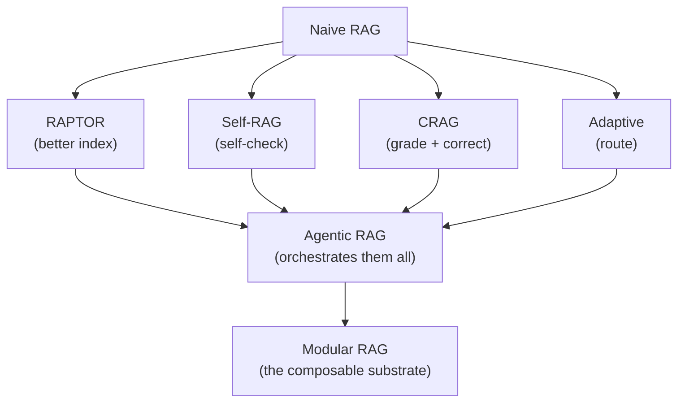

---

## 12. How to choose & apply to an existing pipeline

You already have a basic RAG pipeline (like the `evaluation/rag-triad` demo: CSV → pgvector →
retrieve → generate). Add patterns **incrementally**, and let your **evaluation metrics** decide
whether each one helped.

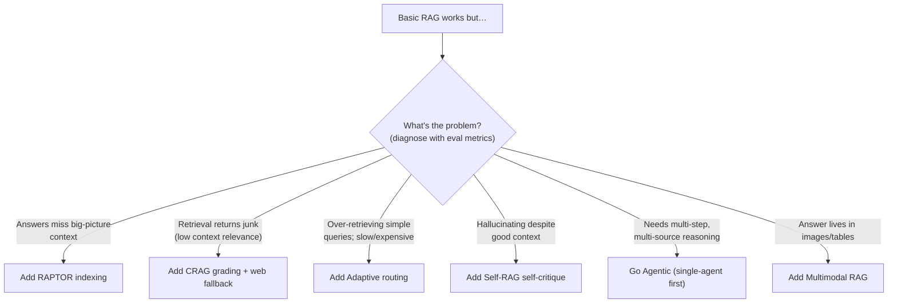

**The disciplined loop (ties to the Evaluation tier):**
1. Measure your current pipeline (RAG Triad + retrieval metrics).
2. Read *which* leg is weak → that tells you *which pattern* to try (see diagram).
3. Add **one** pattern.
4. Re-measure on the same test set. Keep it only if the metric moved up.
5. Repeat. Reach for Agentic/multi-agent **last** — it's the most powerful and the most expensive.

**Golden rule:** *start simple, add complexity only when a metric demands it.* Every pattern buys
quality with latency, cost, and complexity — pay only when the return is real.

---

## 13. Pitfalls & trade-offs

- **Complexity for its own sake.** Each pattern adds latency, cost, and failure modes. A tuned
  naive pipeline often beats a badly-built agentic one. Justify every addition with a metric.
- **Multi-agent overkill.** Coordination overhead (shared state, routing, communication) rarely
  pays off. Exhaust single-agent first.
- **Loops that don't terminate.** Self-RAG / Agentic / CRAG can loop; always cap iterations and
  set stop conditions, or you'll get runaway cost and latency.
- **Web-search fallback isn't free or safe.** CRAG's fallback introduces external, unvetted
  content — mind freshness, cost, and trust.
- **RAPTOR/graph indexing costs at build time.** Recursive summarization means many LLM calls up
  front and more storage. Worth it only for corpora where big-picture questions matter.
- **Patterns compose — don't treat them as rivals.** Real systems combine them (Adaptive router →
  Agentic loop that *uses* CRAG grading over a RAPTOR index). Learn them as building blocks.
- **Evaluate every change.** Without the metrics from the Evaluation tier, you're adding
  complexity blind.

---

## 14. Mastery checklist

You've mastered advanced RAG patterns when you can, from memory:

- [ ] Explain the Naive → Advanced → Modular paradigm evolution.
- [ ] Describe the shift from a linear pipeline to a control flow (decide · check · loop).
- [ ] Explain **RAPTOR**'s build process (cluster → summarize → recurse) and why it helps thematic questions.
- [ ] Explain **Self-RAG**'s three reflection decisions (retrieve? relevant? supported?).
- [ ] Explain **CRAG**'s grade → {Correct / Incorrect / Ambiguous} → web-search fallback.
- [ ] Explain **Adaptive RAG**'s query-complexity routing (direct / single-hop / multi-hop).
- [ ] Explain **Agentic RAG**'s four design patterns (planning, reflection, tool use, collaboration) and single vs. multi vs. hierarchical.
- [ ] Explain why **Modular RAG** lets you *compose* patterns instead of memorizing them.
- [ ] Describe the two approaches to **Multimodal RAG** (shared embeddings vs. caption-to-text).
- [ ] Given a weak eval result, pick the right pattern to try next.
- [ ] Articulate why "start simple, add complexity only when a metric demands it" is the golden rule.

If you can do all of these, you can design a RAG architecture fit for the problem instead of
cargo-culting the fanciest one. **Next stop:** Tier 6 — Graph RAG & Knowledge Graphs, a genuinely
different retrieval paradigm.

---

## Sources

- [Retrieval-Augmented Generation for LLMs: A Survey (the Naive/Advanced/Modular framing) — arXiv](https://arxiv.org/pdf/2312.10997)
- [Naive RAG vs. Advanced RAG vs. Modular RAG — Zilliz](https://zilliz.com/blog/advancing-llms-native-advanced-modular-rag-approaches)
- [8 RAG Architectures You Should Know — Humanloop](https://humanloop.com/blog/rag-architectures)
- [RAPTOR: Recursive Abstractive Processing for Tree-Organized Retrieval — arXiv](https://arxiv.org/html/2401.18059v1)
- [RAPTOR RAG Explained — Machine Learning Plus](https://machinelearningplus.com/gen-ai/raptor-rag-explained-building-hierarchical-retrieval-for-smarter-ai-answers/)
- [Self-Correcting and Self-Improving RAG Systems — ApXML](https://apxml.com/courses/large-scale-distributed-rag/chapter-6-advanced-rag-architectures-techniques/self-correcting-improving-rag)
- [Agentic Retrieval-Augmented Generation: A Survey — arXiv](https://arxiv.org/html/2501.09136v1)
- [Agentic RAG in 2026: Architecture Patterns, Frameworks & When to Use It — JobsByCulture](https://jobsbyculture.com/blog/agentic-rag-guide-2026)
- [RAG Techniques — IBM](https://www.ibm.com/think/topics/rag-techniques)
