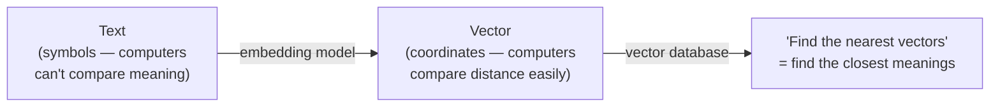
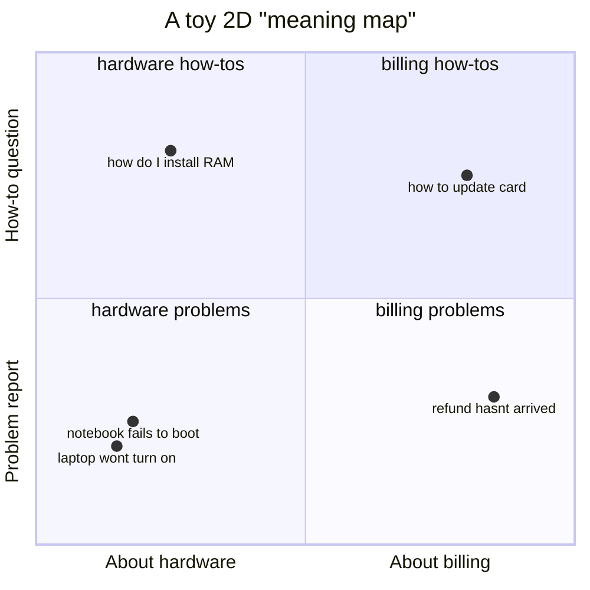
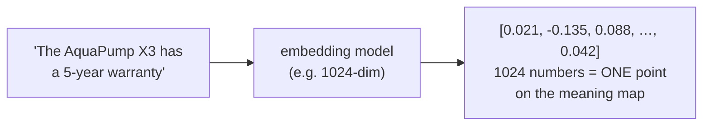
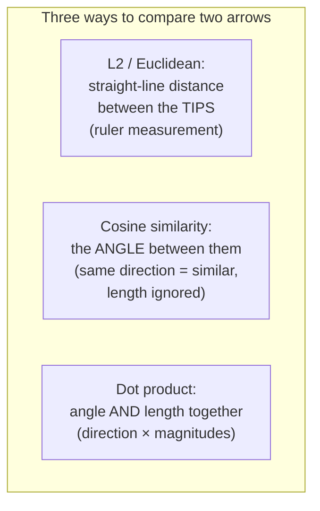
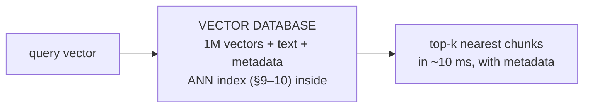
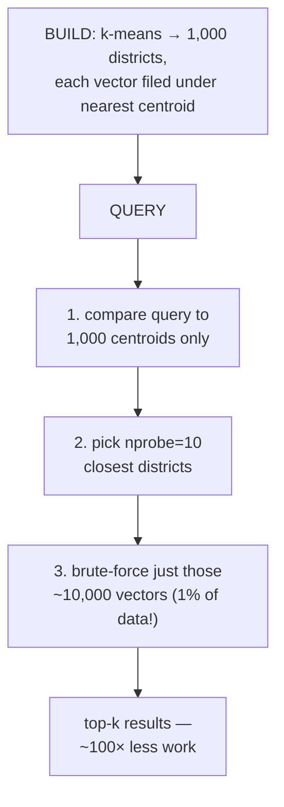
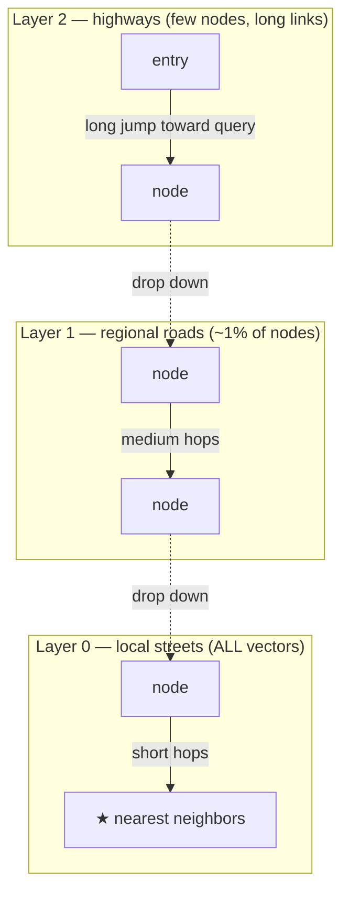
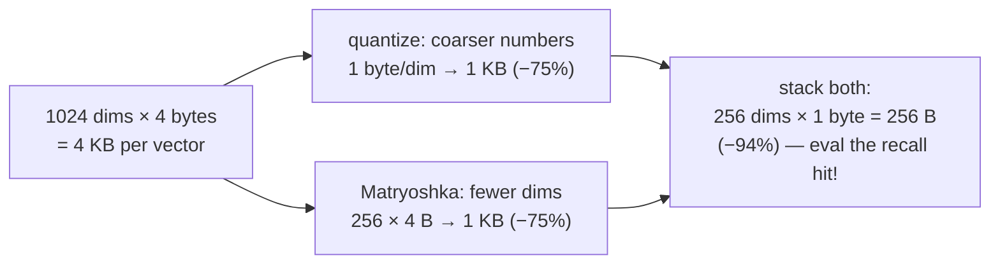

# Embeddings & Vector Stores — How Meaning Becomes Searchable (Beginner → Advanced)

> This is **Tier 2** of the [RAG curriculum](../overview.md) — stages 3–4 of the pipeline
> (**Embed** and **Store**), the retrieval substrate. Tier 1 gave you clean chunks; this
> tier turns them into something a machine can *search by meaning*: vectors in a vector
> database. Tier 3's retrieval strategies all stand on what you build here.
>
> This document explains, from zero: what an embedding actually is (with a 2D example you
> can picture), how "similar meaning = nearby points" works, the three distance metrics
> (cosine, dot product, L2), how to choose an embedding model (dimensions, MTEB,
> multilingual, Matryoshka), what vector databases do, and — the advanced heart of the tier
> — how **ANN indexes (HNSW and IVF)** find the nearest vector among millions in
> milliseconds. Examples and diagrams throughout. No code; concepts only.

---

## Table of Contents

1. [The problem this tier solves](#1-the-problem-this-tier-solves)
2. [What an embedding actually is (start in 2D)](#2-what-an-embedding-actually-is-start-in-2d)
3. [From 2 dimensions to 1,000: what the axes mean](#3-from-2-dimensions-to-1000-what-the-axes-mean)
4. [The terminology, properly defined](#4-the-terminology-properly-defined)
5. [Measuring "nearby": the three distance metrics](#5-measuring-nearby-the-three-distance-metrics)
6. [Choosing an embedding model](#6-choosing-an-embedding-model)
7. [Vector databases: what they are and the landscape](#7-vector-databases-what-they-are-and-the-landscape)
8. [The scaling problem: why exact search dies at a million vectors](#8-the-scaling-problem-why-exact-search-dies-at-a-million-vectors)
9. [ANN index 1 — IVF (search only the right neighborhoods)](#9-ann-index-1--ivf-search-only-the-right-neighborhoods)
10. [ANN index 2 — HNSW (the highway network)](#10-ann-index-2--hnsw-the-highway-network)
11. [Shrinking the bill: quantization & Matryoshka](#11-shrinking-the-bill-quantization--matryoshka)
12. [Pitfalls & trade-offs](#12-pitfalls--trade-offs)
13. [Mastery checklist](#13-mastery-checklist)
14. [Sources](#sources)

---

## 1. The problem this tier solves

Computers compare *symbols*, not *meanings*. To a naive string comparison:

- `"laptop won't turn on"` vs. `"notebook fails to boot"` → **0% similar** (no shared words)
- `"laptop won't turn on"` vs. `"laptop turns on instantly"` → **~80% similar** (almost all words shared — opposite meaning!)

Everything in semantic search depends on fixing this: we need a representation where
**similarity of representation = similarity of meaning**. That representation is the
embedding, and the machinery for searching millions of them fast is the vector database.

---

## 2. What an embedding actually is (start in 2D)

**An embedding is a point on a map of meaning.**

Forget high dimensions for a moment. Imagine plotting texts on a simple 2D map where the
x-axis happens to capture "about hardware ↔ about billing" and the y-axis "problem report ↔
how-to question." Every text lands somewhere:

Look at the two dots in the bottom-left: *"laptop won't turn on"* and *"notebook fails to
boot"* share **zero words**, but they landed almost on top of each other — because they
*mean* nearly the same thing, and this map is organized by meaning. Meanwhile *"refund
hasn't arrived"* is far away on the right.

That's the entire trick:

> **Embedding model = a function that reads text and outputs coordinates on a meaning map,
> trained so that texts humans consider similar land close together.**
> **Semantic search = "find the nearest dots to my query's dot."**

Where does such a function come from? Training on enormous numbers of *text pairs* known to
be related (question ↔ its answer, sentence ↔ its paraphrase, title ↔ its article). The
model is rewarded for placing related pairs close and unrelated pairs far. After billions
of examples, the map's geometry *is* semantics.

---

## 3. From 2 dimensions to 1,000: what the axes mean

A real embedding isn't 2 numbers — it's typically **384, 768, 1024, or 1536 numbers** (the
model's **dimensionality**). Two honest clarifications, because this is where beginners
either over-mystify or over-trust:

1. **Why so many dimensions?** Two axes can encode two aspects of meaning. Real meaning has
   *thousands* of aspects — topic, tone, tense, specificity, domain, sentiment, language,
   formality… A 1024-dimensional map has room to separate texts along ~a thousand
   independent directions at once. Things impossible to separate in 2D become separable.
2. **Can I read the axes?** Mostly no. Unlike our toy map, real dimensions aren't labeled
   ("dimension 407 = animal-ness"); meaning is smeared *across combinations* of dimensions.
   The vector is meaningful as a whole position, not digit by digit. You never interpret
   embeddings — you only ever *compare* them.

One more property that matters daily: **the vector is always the same size, no matter the
input length.** A 3-word query and a 500-word chunk both become 1024 numbers. That's what
makes query-vs-chunk comparison possible — and it's also why over-long chunks *dilute*
(Tier 1 §3): more text squeezed into the same fixed budget of numbers.

---

## 4. The terminology, properly defined

| Term | Definition |
|---|---|
| **Embedding / vector** | The list of numbers (one point on the meaning map) an embedding model outputs for a text. |
| **Dimensionality (d)** | How many numbers in the vector (384 / 768 / 1024 / 1536…). More dims = more expressive, bigger, slower, costlier. |
| **Embedding model** | The trained network that maps text → vector. Distinct from the LLM! Usually far smaller and cheaper. |
| **Dense vector** | Every dimension holds a value; meaning is distributed. What this tier is about. (Contrast: **sparse** vectors, Tier 3 §3 — one slot per vocabulary word, almost all zeros.) |
| **Vector space** | The "map" — the d-dimensional space all these points live in. Only points from the *same model* share a map. |
| **Similarity / distance** | A number scoring how close two vectors are (§5). High similarity = close = similar meaning. |
| **Nearest-neighbor search (kNN)** | "Given a query vector, find the k closest stored vectors." Retrieval's core operation. |
| **ANN (Approximate Nearest Neighbor)** | Same, but *approximately* — trading a sliver of accuracy for enormous speed (§8–10). |
| **Recall (of an index)** | What fraction of the true nearest neighbors the ANN index actually finds. The accuracy knob you trade for speed. |
| **Normalization** | Rescaling a vector to length 1 (a "unit vector"). Makes cosine and dot product equivalent (§5). |
| **MTEB** | Massive Text Embedding Benchmark — the standard public leaderboard for comparing embedding models. |
| **Matryoshka (MRL)** | Training trick letting one model's vectors be *truncated* to fewer dims with little quality loss (§11). |

---

## 5. Measuring "nearby": the three distance metrics

Two dots on the map — how do we score their closeness? Three standard answers. Picture each
vector as **an arrow from the map's origin to the point**:

- **L2 (Euclidean) distance** — the ruler: straight-line distance between the two points.
  Smaller = closer. Intuitive, but sensitive to vector *length*, which for text embeddings
  usually isn't meaningful.
- **Cosine similarity** — the compass: measures only the **angle** between the arrows.
  Two arrows pointing the same direction score 1.0 even if one is longer; opposite
  directions score −1. Length is ignored — which is *why it's the default for text*:
  direction encodes the meaning; length is mostly an artifact (e.g. of text length).
- **Dot product** — angle *and* length combined. Cheapest to compute, and used by systems
  that deliberately encode importance/popularity in vector length (some recommendation
  models).

**The fact that dissolves most confusion:** *normalize* all vectors to length 1, and the
three metrics **agree on every ranking** — cosine and dot product become literally the same
number, and L2 becomes a monotonic transform of it. Most modern embedding models already
output normalized vectors. So in practice:

> **The real rule: use the metric the embedding model was trained for** (its model card
> says — cosine, overwhelmingly). Mismatching model and metric silently degrades rankings.
> With normalized vectors, pick dot product in the database for speed; it *is* cosine.

**Tiny worked example** (2D, normalized): query **q** = (0.9, 0.44). Chunk A = (0.87, 0.49),
chunk B = (0.1, 0.99). Cosine(q, A) = 0.9·0.87 + 0.44·0.49 ≈ **0.999** — nearly identical
direction. Cosine(q, B) = 0.9·0.1 + 0.44·0.99 ≈ **0.53** — different direction, different
meaning. A wins, by arithmetic anyone can check.

---

## 6. Choosing an embedding model

The map is only as good as the cartographer. Choosing the model is choosing your retrieval
quality ceiling. The decision, as five questions:

**Q1 — Hosted API or self-hosted?** APIs (OpenAI `text-embedding-3`, Cohere, Voyage): zero
ops, per-token cost, data leaves your infra. Self-hosted open-source (BGE family, E5, GTE,
Qwen3-Embedding, all-MiniLM): free at scale, private, your GPU problem. Regulated data
usually decides this question for you.

**Q2 — How good, per MTEB?** [MTEB](https://huggingface.co/spaces/mteb/leaderboard) is the
standard leaderboard across retrieval/clustering/classification tasks. Use it to build a
**shortlist of 2–3**, not to crown a winner — leaderboard rank is measured on *public
benchmarks*, and the deltas between top models are often smaller than the delta between
any of them *on your corpus*. The only choice that counts is a bake-off on **your** data
with Tier 7's retrieval metrics (recall@k, NDCG).

**Q3 — Which dimensionality?** The precision-vs-cost dial. Every dimension is paid for in
storage, RAM, and search time, *multiplied by every chunk you'll ever index*:

| dims | Character | Typical use |
|---|---|---|
| 384 | small, fast, cheap | huge corpora on a budget; latency-critical |
| **768–1024** | **the sweet spot** | **most RAG systems** |
| 1536–4096 | max nuance, max cost | when eval proves the gain is real |

**Q4 — Multilingual?** If queries and documents span languages, you need a model that maps
*all* its languages onto **one shared meaning map** — so a German query lands near the
English chunk that answers it. BGE-M3 (100+ languages, MIT license) and the larger
Qwen3-Embedding models are the current open-source workhorses; don't use an English-only
model and hope.

**Q5 — Any special requirements?** Long inputs (8k-token chunks need a long-context
embedding model), code search (code-trained models), domain jargon (medical/legal — check
domain benchmarks or fine-tune), hybrid-in-one-model (BGE-M3 emits dense + sparse + 
multi-vector outputs simultaneously — one model powering a whole Tier 3 hybrid stack).

> **The iron rule of this tier:** **index and query with the SAME model, forever.** Vectors
> from different models are points on *different maps* — comparing them is meaningless
> (coordinates in Tokyo vs. coordinates in Paris). Upgrading the model = re-embedding the
> entire corpus. Budget for that day; version your index with the model name that built it.

---

## 7. Vector databases: what they are and the landscape

You now have a million chunk vectors. A **vector database** is a database whose specialty
is one query shape: *"here's a vector — return the k nearest stored vectors, fast."* Beyond
that specialty it still does database things: store the chunk text + metadata alongside
each vector, filter (Tier 3 §8's metadata pre-filtering!), replicate, scale, back up.

The landscape in one honest table:

| Option | What it is | Reach for it when |
|---|---|---|
| **FAISS** | a *library*, not a server (Meta) — raw index algorithms in-process | research, benchmarks, embedded use; you build the server parts yourself |
| **Chroma** | lightweight, developer-friendly | prototypes, small projects, tutorials |
| **pgvector** | extension making **Postgres** a vector store | you already run Postgres; vectors next to relational data; the pragmatic enterprise default |
| **Qdrant** | dedicated vector DB (Rust) — strong filtering, quantization | production loads with heavy metadata filtering |
| **Weaviate** | dedicated vector DB — built-in hybrid (BM25+vector) search | you want hybrid search out of the box |
| **Milvus** | dedicated, built for horizontal scale | billion-vector, multi-tenant scale |
| **Pinecone** | fully managed SaaS | no-ops preference, elastic scale, cloud budget |
| **Elasticsearch / OpenSearch** | classic search engine + vector support | you already run it for BM25; one system for both hybrid legs |

Boring-but-true guidance: **the database choice matters far less than the model choice and
the chunking.** Start with whatever fits your stack (already on Postgres → pgvector;
greenfield prototype → Chroma/Qdrant). The one feature to verify *before* committing:
**efficient metadata pre-filtering** — Tier 3 depends on it.

---

## 8. The scaling problem: why exact search dies at a million vectors

The naive way to find the nearest neighbor is **brute force**: compare the query against
*every* stored vector, keep the best k. It's *exact* — and it's a dead end:

> 1,000,000 vectors × 1024 dimensions = a million similarity computations, each touching
> 1024 numbers, **per query**. Tens to hundreds of milliseconds of pure arithmetic — for
> *one* user. At 100 queries/second, the math alone melts your CPU budget. At 100M vectors,
> forget it.

The fix is the defining trade of this tier: **give up exactness.**

> **ANN — Approximate Nearest Neighbor — search: return *almost certainly* the nearest
> vectors, *almost always*, 100× faster.** Missing the true #1 neighbor occasionally and
> returning #2 in its place is invisible in a RAG system that retrieves top-20 and reranks
> anyway (Tier 3 §7) — but the speedup is the difference between viable and not.

Every serious vector DB is built around an ANN index. The knob every ANN index shares:
**recall vs. speed** — how often it finds the *true* nearest neighbors vs. how fast it
answers. You tune it like a dial (95%? 99%?), and Tier 7's metrics tell you what your
application actually needs. The two dominant index families follow — both are *"organize
the data cleverly so most of it never needs to be looked at."*

---

## 9. ANN index 1 — IVF (search only the right neighborhoods)

**IVF = Inverted File index. The idea: give the map postal districts.**

A city courier doesn't check every address in town — they read the postal code, drive to
that district, and search only its streets. IVF does this to the vector space:

**Build time:**
1. Run k-means clustering over all vectors → e.g. 1,000 clusters ("districts"), each with
   a **centroid** (the district's center point).
2. Assign every vector to its nearest centroid → 1,000 buckets of ~1,000 vectors each.

**Query time:**
1. Compare the query to the 1,000 **centroids** only (cheap — 1,000 ≪ 1,000,000).
2. Pick the closest few districts (the `nprobe` parameter, e.g. 10).
3. Brute-force search **only inside those** ~10,000 vectors.

**Where it's approximate:** a true neighbor can sit *just across a district border* in a
district you didn't probe — that's the recall loss. **The dial:** `nprobe`. Probe 1 district
= fastest, most misses; probe 50 = slower, near-exact. **Character:** memory-light, simple,
needs a representative training pass (and periodic re-clustering if data drifts). The
classic choice for very large, memory-constrained indexes (often combined with compression,
§11).

---

## 10. ANN index 2 — HNSW (the highway network)

**HNSW = Hierarchical Navigable Small World. The idea: navigate like you plan a road trip —
highways first, local streets last.** HNSW is today's default index in most vector DBs
(pgvector, Qdrant, Weaviate, Milvus all lead with it).

**The structure:** every vector becomes a node in a graph, connected to a handful of its
near neighbors ("local streets"). Then — the *hierarchical* part — HNSW builds sparser and
sparser layers above: a mid layer with ~1% of nodes and longer-range links ("regional
roads"), a top layer with a handful of nodes and very long links ("highways").

**Query time — one greedy descent:**
1. Start at the top layer's entry node. Greedily hop to whichever neighbor is closest to
   the query — long highway jumps across the space.
2. Can't get closer on this layer? Drop one layer down and continue with shorter hops.
3. On the bottom layer (all vectors, short links), the final local walk lands on the
   nearest neighbors.

Each hop halves-ish the remaining distance, so the whole search touches a few hundred nodes
out of a million — **logarithmic-ish** work instead of linear. That's the 100× (often
1000×) win.

**The dials:** `M` (links per node — bigger = better recall, more memory),
`ef_construction` (build thoroughness), `ef_search` (how wide the query walk looks —
**the** runtime recall-vs-latency knob; raising it is the standard fix for "my retrieval
misses things"). **Character:** superb speed/recall, incremental inserts (no retraining,
unlike IVF), but the whole graph lives in RAM — the memory-hungry option.

**IVF vs. HNSW in one line each:** *IVF: cluster the map, search the right districts —
light on memory, needs training.* *HNSW: layered navigation graph — fastest and default,
pay in RAM.*

---

## 11. Shrinking the bill: quantization & Matryoshka

At scale, the index's size *is* the bill (RAM for HNSW, storage everywhere). Two standard
compressions:

- **Quantization — store coarser numbers.** Full precision = 4 bytes per dimension.
  Scalar quantization stores 1 byte (−75%, near-zero quality loss); binary quantization
  stores 1 *bit* (−97%, real but often acceptable loss); product quantization (PQ)
  compresses sub-vectors via codebooks (the classic FAISS `IVF+PQ` combo for
  billion-vector indexes). Common production pattern: search coarsely on compressed
  vectors, then **re-score the top candidates with full-precision vectors** — most of the
  savings, almost none of the loss.
- **Matryoshka (MRL) — store fewer dimensions.** Models trained with Matryoshka
  Representation Learning (named for the nesting dolls) pack the most important information
  into the *first* dimensions, so you can simply **truncate** — keep the first 256 of 1024
  dims and lose only ~2–3% quality while cutting storage 4×. Modern API models (e.g.
  OpenAI's `text-embedding-3`) expose this as a `dimensions` parameter.

---

## 12. Pitfalls & trade-offs

- **Comparing vectors from different models** (or model versions!). Different maps —
  garbage similarities, often silently. One model per index, its name stamped on the index.
- **Forgetting that upgrades mean re-embedding.** New model = rebuild everything. Teams
  that never budgeted for this run years-old embedding models in production.
- **Mismatching the distance metric.** Use what the model card trained for; normalized +
  dot product = cosine, fast.
- **Choosing the DB before the model.** The model sets your quality ceiling; the DB mostly
  sets ops ergonomics. Decide in that order.
- **Leaderboard worship.** MTEB rank ≠ your-corpus rank. Shortlist by MTEB, decide by a
  bake-off on your own eval set (Tier 7).
- **Ignoring index recall.** ANN misses are invisible — no error, just an occasionally
  absent chunk. If retrieval "randomly" misses documents you *know* are indexed, check
  `ef_search`/`nprobe` before blaming the embedding model.
- **Embedding queries and documents naively when the model wants prefixes.** Many models
  (E5 family, BGE) were trained with `"query: …"` / `"passage: …"` prefixes. Skipping them
  quietly costs accuracy. Read the model card.
- **Vector DB as the only source of truth.** Keep original documents elsewhere; the index
  is a *derived* artifact you should be able to rebuild (new chunking! new model!) at will.
- **Premature compression.** Quantize when scale demands it, and always eval before/after —
  binary quantization on a 384-dim model can hurt in ways binary on 1024 dims doesn't.

---

## 13. Mastery checklist

You've mastered the substrate when you can, from memory:

- [ ] Explain why string comparison fails at meaning, with the laptop/notebook example.
- [ ] Define an embedding as coordinates on a meaning map, and explain how training on pairs shapes the map.
- [ ] Explain what dimensionality buys, why individual dimensions aren't interpretable, and why fixed size enables query↔chunk comparison (and causes dilution).
- [ ] Draw the three metrics (ruler / angle / both) and state when they all agree — and the "use the model's training metric" rule.
- [ ] Walk the five model-choice questions and the iron rule (one model per index; upgrades = re-embed).
- [ ] Say what a vector DB adds beyond an index, and name where in the landscape you'd start for: existing Postgres shop, prototype, billion-scale, hybrid out of the box.
- [ ] Explain why brute-force search dies, and define ANN and index recall.
- [ ] Explain IVF via postal districts: k-means, centroids, `nprobe`, the border-miss failure.
- [ ] Explain HNSW via highways: layered graph, greedy descent, `ef_search` as the recall dial, RAM cost.
- [ ] Explain quantization vs. Matryoshka — coarser numbers vs. fewer dimensions — and the re-score-with-full-precision pattern.

Next: **Tier 3 — [Retrieval Strategies](../retrieval-strategies/Introduction.md)** — with
vectors stored and searchable, the real craft begins: BM25, hybrid search, RRF, reranking,
filtering, and compression.

---

## Sources

- [The Best Open-Source Embedding Models in 2026 — BentoML](https://www.bentoml.com/blog/a-guide-to-open-source-embedding-models)
- [Best Embedding Models in 2026: Tested & Ranked — Mixpeek](https://mixpeek.com/curated-lists/best-embedding-models)
- [8 Embedding Models Compared for Production RAG (2026 benchmark) — Tensoria](https://tensoria.fr/en/blog/embedding-models-2026-guide)
- [MTEB: Massive Text Embedding Benchmark — Hugging Face leaderboard](https://huggingface.co/spaces/mteb/leaderboard)
- [Matryoshka Representation Learning — arXiv](https://arxiv.org/abs/2205.13147)
- [Similarity Metrics for Vector Search — Zilliz](https://zilliz.com/blog/similarity-metrics-for-vector-search)
- [Embedding Dimensions and Distance Metrics: Cosine, Euclidean, Dot Product — Callsphere](https://callsphere.ai/blog/embedding-dimensions-distance-metrics-cosine-euclidean-dot-product)
- [Understanding vector search and HNSW index with pgvector — Neon](https://neon.com/blog/understanding-vector-search-and-hnsw-index-with-pgvector)
- [Optimize generative AI applications with pgvector indexing: IVFFlat and HNSW — AWS Database Blog](https://aws.amazon.com/blogs/database/optimize-generative-ai-applications-with-pgvector-indexing-a-deep-dive-into-ivfflat-and-hnsw-techniques/)
- [Vector Search with FAISS: ANN Explained — PyImageSearch](https://pyimagesearch.com/2026/02/16/vector-search-with-faiss-approximate-nearest-neighbor-ann-explained/)
- [Vector databases: Not all indexes are created equal — The Data Quarry](https://thedataquarry.com/blog/vector-db-3/)
- [Efficient and robust approximate nearest neighbor search using HNSW graphs (the HNSW paper) — arXiv](https://arxiv.org/abs/1603.09320)
