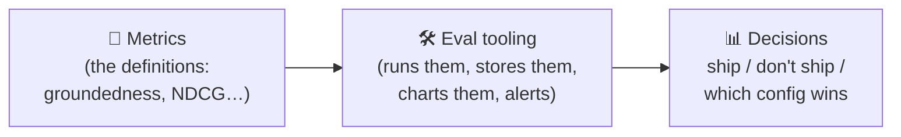
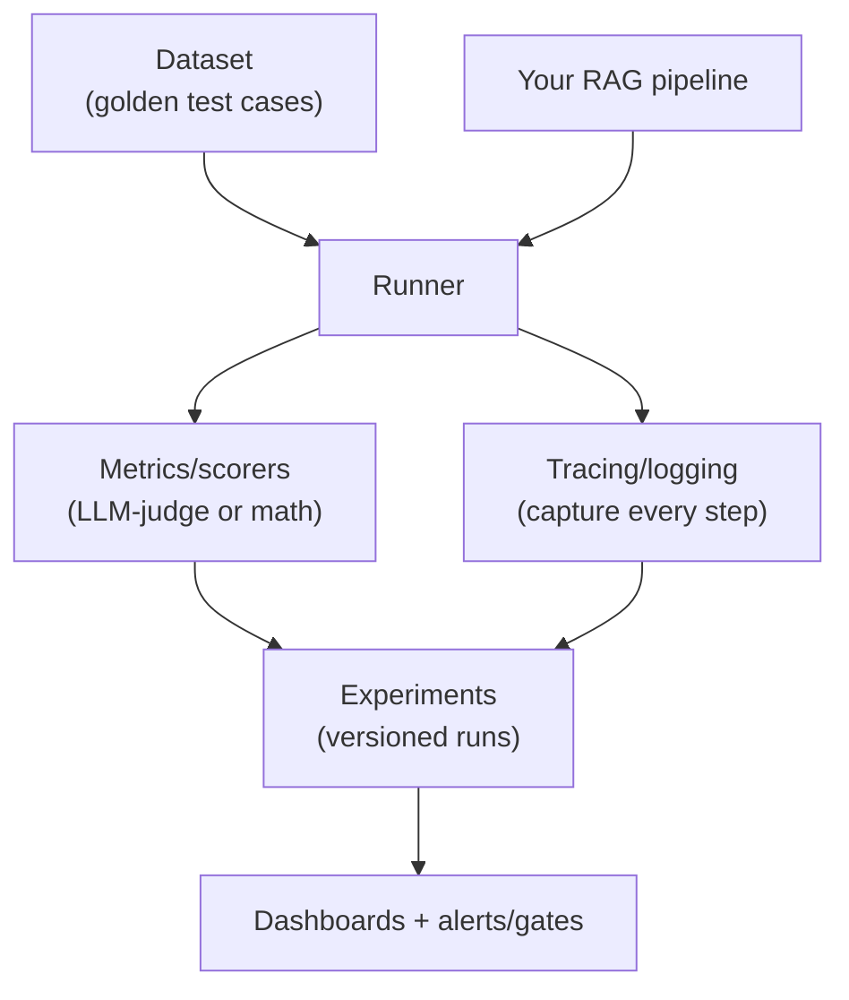
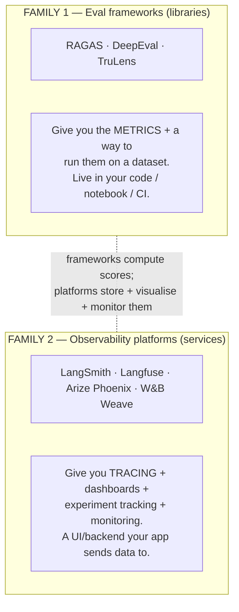
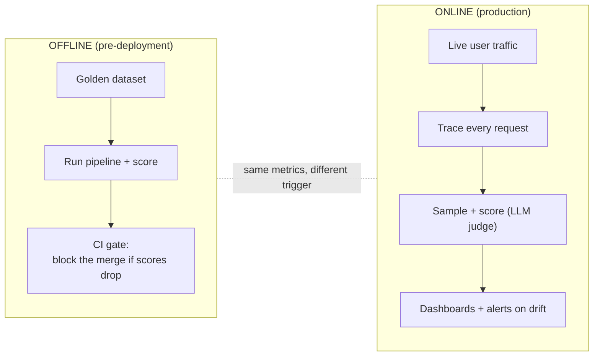
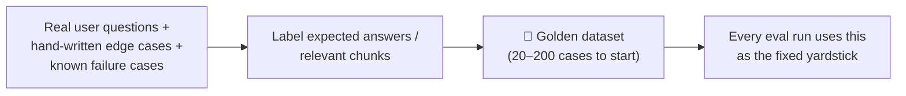
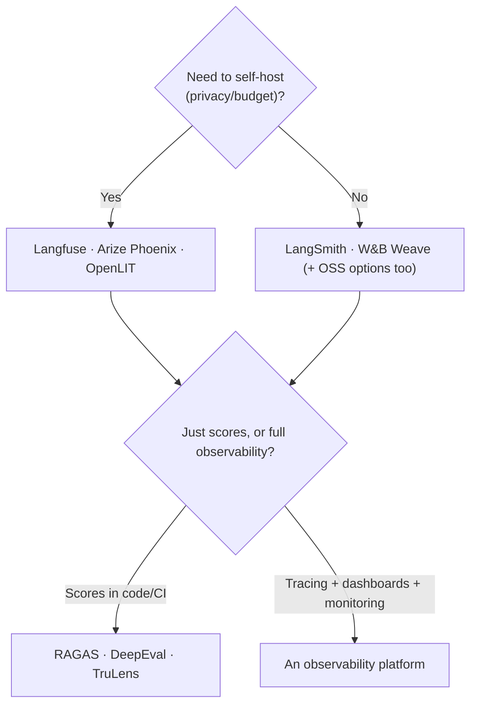
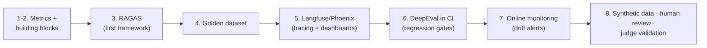

# Evaluation Tooling — The Tools That Run Your RAG Evals (Beginner → Advanced)

> The previous two topics taught you the **metrics**: the [RAG Triad](../rag-triad/Introduction.md)
> (context relevance, groundedness, answer relevance) and the
> [retrieval metrics](../retrieval-metrics/Introduction.md) (precision, recall, MRR, MAP, NDCG).
> Knowing the *math* is one thing — **running it repeatedly, at scale, on every code change and
> on live traffic** is another. That's what **evaluation tooling** is for.
>
> This document is an **overview map**, not a how-to. No code, no installs. By the end you'll
> know: what "eval tooling" actually means, the two families of tools (eval frameworks vs.
> observability platforms) and how they differ, an introduction to the specific tools you'll
> hear about (RAGAS, TruLens, DeepEval, LangSmith, Langfuse, Arize Phoenix, and friends), and a
> clear picture of *what you should learn, in what order*, to go from beginner to advanced.

---

## Table of Contents

1. [What "evaluation tooling" actually means](#1-what-evaluation-tooling-actually-means)
2. [Why you can't just eyeball it (the problem tooling solves)](#2-why-you-cant-just-eyeball-it-the-problem-tooling-solves)
3. [The building blocks every eval tool gives you](#3-the-building-blocks-every-eval-tool-gives-you)
4. [The two families: eval frameworks vs. observability platforms](#4-the-two-families-eval-frameworks-vs-observability-platforms)
5. [Family 1 — Eval frameworks (RAGAS · DeepEval · TruLens)](#5-family-1--eval-frameworks-ragas--deepeval--trulens)
6. [Family 2 — Observability platforms (LangSmith · Langfuse · Arize Phoenix · W&B Weave)](#6-family-2--observability-platforms-langsmith--langfuse--arize-phoenix--wb-weave)
7. [Offline vs. online evaluation (where each tool fits)](#7-offline-vs-online-evaluation-where-each-tool-fits)
8. [The golden dataset — the thing that matters more than any tool](#8-the-golden-dataset--the-thing-that-matters-more-than-any-tool)
9. [How to choose (the decision axes)](#9-how-to-choose-the-decision-axes)
10. [A sensible learning path (what to learn, in order)](#10-a-sensible-learning-path-what-to-learn-in-order)
11. [Pitfalls & things people get wrong](#11-pitfalls--things-people-get-wrong)
12. [Mastery checklist](#12-mastery-checklist)
13. [Sources](#sources)

---

## 1. What "evaluation tooling" actually means

**Evaluation tooling = the software that automates measuring your RAG/LLM system's quality.**

A metric like "groundedness" is just a definition. A *tool* is what actually:
- takes your queries, contexts, and answers,
- computes the metric scores (usually by orchestrating **LLM-as-a-Judge** calls or exact math),
- stores the results,
- shows you dashboards / test reports, and
- lets you **compare versions** and **catch regressions** automatically.

Think of it as the difference between *knowing* what a unit test is versus *having pytest + CI*
that runs your tests on every commit. Eval tooling is "pytest + CI + dashboards", but for the
fuzzy, non-deterministic outputs of an LLM.

---

## 2. Why you can't just eyeball it (the problem tooling solves)

Early on, everyone evaluates RAG by hand: run a few questions, read the answers, "looks good."
This breaks down fast. Tooling exists because manual checking cannot:

- **Scale.** You can't hand-read 500 answers after every prompt tweak.
- **Stay consistent.** Your judgment drifts; a tool applies the same rubric every time.
- **Catch regressions.** Change a prompt to fix bug A and silently break answers B–Z. Only a
  repeatable eval suite catches that.
- **Compare fairly.** "Is embedding model X better than Y?" needs the *same* questions scored the
  *same* way — a controlled experiment, not vibes.
- **Watch production.** Real user traffic drifts over time (new topics, stale data). You need
  continuous monitoring, not a one-time check.

> The mantra: **"You can't improve what you can't measure — and you can't measure at scale
> without tooling."**

---

## 3. The building blocks every eval tool gives you

Whatever tool you pick, it's assembled from the same conceptual parts. Learn these *concepts*
once and every tool looks familiar:

| Building block | What it does |
|---|---|
| **Metrics / scorers** | The actual quality functions (faithfulness, answer relevancy, context precision, NDCG…). Most are **LLM-as-a-Judge**; some are exact math. |
| **Dataset** | Your set of test cases — queries, and (optionally) reference answers / relevant chunks. The "golden dataset." |
| **Runner / harness** | Executes your pipeline over the dataset and applies the scorers. |
| **Tracing / logging** | Records every step of a run — the query, retrieved chunks, prompt, model call, tokens, latency, cost. |
| **Experiments / versioning** | Saves each run so you can diff "config A vs. config B" over time. |
| **Dashboards / reports** | Visualise scores, trends, and the worst-performing cases. |
| **Alerts / gates** | Fail a CI build, or fire an alert in production, when a score drops below a threshold. |

---

## 4. The two families: eval frameworks vs. observability platforms

This is the single most useful distinction to hold in your head. The tools split into two
overlapping families, and you often use **one from each**.

- **Eval frameworks** are Python libraries focused on *"what are the scores?"* — the metric
  definitions and a runner. Lightweight, code-first, great in notebooks and CI.
- **Observability platforms** are services focused on *"what happened, over time, across all
  runs and all production traffic?"* — tracing, dashboards, experiment history, monitoring,
  human-review queues.

They're complementary: a common real-world setup is **DeepEval or RAGAS for the metrics** +
**Langfuse or Phoenix for tracing and dashboards.** Many platforms also embed the frameworks'
metrics natively (e.g. Phoenix ships RAGAS-style scorers).

---

## 5. Family 1 — Eval frameworks (RAGAS · DeepEval · TruLens)

These are the three you'll meet first. All three use **LLM-as-a-Judge** under the hood.

### RAGAS
- **What it is:** the most popular **RAG-specific** metrics library. Purpose-built for the exact
  metrics you've already learned: **faithfulness, answer relevancy, context precision, context
  recall.** Several work **without ground-truth labels**.
- **Strength:** fast to adopt, lightweight, laser-focused on RAG quality. Best for *metric
  exploration* — "how good is my RAG pipeline right now?"
- **Limitation:** it's *just metrics* — no built-in tracing, dashboards, or production
  monitoring. Teams pair it with an observability platform.

### DeepEval
- **What it is:** an eval framework that brings **test-driven development (TDD)** to LLMs. It's
  **pytest-compatible** — you write eval "unit tests" for your RAG outputs the same way you'd
  write code tests.
- **Strength:** the **broadest metric library** (50+ metrics across RAG, agents, multi-turn,
  safety, etc.) and a natural fit for **CI/CD gates** — fail the build if quality regresses.
- **Use it when:** you want evaluation wired into your engineering test pipeline.

### TruLens
- **What it is:** the framework that popularised the **RAG Triad** vocabulary. Built around
  **"feedback functions"** (its name for scorers) plus **tracing** (OpenTelemetry-based).
- **Strength:** couples **evaluation with tracing inline** — every retrieval and LLM call is
  traced *and* scored together. Good for experiment dashboards.
- **Use it when:** you want scoring and step-by-step traces bundled from the start.

> **The clean mental model (from the sources):** *use **RAGAS** for metric exploration,
> **DeepEval** for CI/CD gates, and **TruLens** for experiment dashboards.* They overlap, but
> that's each one's sweet spot.

---

## 6. Family 2 — Observability platforms (LangSmith · Langfuse · Arize Phoenix · W&B Weave)

When you move toward production, you need to *see* what your system is doing across thousands of
requests — not just a score, but the full trace, over time. That's **observability**.

### LangSmith
- Commercial platform built by **LangChain**. Richest **tracing** and agent-graph visualisation
  for apps built on **LangChain / LangGraph**; includes evaluation + human-annotation queues.
- Best if you're already in the LangChain ecosystem (less polished for other frameworks).

### Langfuse
- The **open-source leader**. **Self-hostable** (Postgres + ClickHouse), **framework-agnostic**
  via **OpenTelemetry**, works with any LLM SDK. Tracing + prompt management + evals + dashboards.
- Best if you need **data residency / privacy / self-hosting** or vendor-neutrality.

### Arize Phoenix
- **Open-source** observability from Arize (a classical-ML-monitoring company). Ships **50+
  research-backed metrics** (faithfulness, relevance, safety, hallucination), **drift detection**,
  trace clustering, and **retrieval-relevancy visualisation** for RAG. Notebook-first, great for
  experimentation; has native RAGAS support.

### W&B Weave
- LLM/agent tracing + evaluation from **Weights & Biases** — strong if your team already uses W&B
  for ML experiment tracking.

> Others you'll see: **Promptfoo** (config-driven eval + red-teaming, popular in CI),
> **MLflow** (now has LLM tracing/eval), **OpenLIT** (open-source, OpenTelemetry). You don't need
> all of them — recognise the category.

---

## 7. Offline vs. online evaluation (where each tool fits)

Eval tooling runs in **two moments**, and it's crucial to know which is which:

- **Offline** = a fixed **golden dataset**, run before you ship. Catches regressions from prompt
  or model changes. This is where **eval frameworks + CI** shine.
- **Online** = real production traffic, evaluated continuously (usually a **sample**, since every
  score costs an LLM call). Catches **drift** — new topics, stale data, silent quality decay.
  This is where **observability platforms** shine.
- **Note the tie-in to prior topics:** reference-*based* retrieval metrics mostly live offline
  (they need labels); the reference-*free* RAG Triad can run in **both** places — which is
  exactly why it's so valuable for online monitoring.

---

## 8. The golden dataset — the thing that matters more than any tool

The uncomfortable truth: **your evaluation is only as good as your test dataset**, and no tool
creates that for you. This is the highest-leverage thing to learn in this whole topic.

A **golden dataset** is a curated set of representative test cases:
- the **query**,
- (for reference-based metrics) the **expected answer** and/or the **relevant chunk IDs**,
- ideally covering your real distribution: common questions, edge cases, and known hard cases.

Rules of thumb:
- Start small (**20–100 cases**) — a small, honest set beats a huge, sloppy one.
- Grow it by **adding every production failure** you find back into the set (regression tests).
- Keep it representative; if it doesn't look like real traffic, your scores lie.

Tools can *help* generate synthetic datasets (RAGAS and DeepEval both do), but you must review
them — synthetic data is a starting point, not ground truth.

---

## 9. How to choose (the decision axes)

Don't memorise tools — reason along these axes:

| Axis | Question to ask |
|---|---|
| **Open-source vs. SaaS** | Do you need to **self-host** for privacy/data-residency/budget? → Langfuse, Phoenix, OpenLIT. |
| **Frameworks vs. platform** | Do you just need **scores** (framework) or **tracing + dashboards + monitoring** (platform)? Usually you want both. |
| **Depth / breadth of metrics** | RAG-only (RAGAS) vs. broad suite incl. agents/safety (DeepEval, Phoenix)? |
| **Ecosystem fit** | On LangChain? → LangSmith is smoothest. On W&B already? → Weave. Framework-agnostic? → Langfuse/Phoenix (OpenTelemetry). |
| **Offline vs. online** | CI gates (DeepEval/Promptfoo) vs. production monitoring (Langfuse/Phoenix/LangSmith)? |
| **Cost attribution** | How precisely must you track token spend per request/feature? |

---

## 10. A sensible learning path (what to learn, in order)

You don't need every tool. Learn the **concepts** first, then one tool per family.

1. **Solidify the metrics** (you've done this): RAG Triad + retrieval metrics. Tools are just
   runners for these.
2. **Learn the building blocks** (Section 3) — dataset, scorer, runner, tracing, experiment,
   dashboard, gate. These transfer across every tool.
3. **Get hands-on with ONE eval framework** — **RAGAS** is the best first pick (RAG-focused,
   lightweight, the metrics match what you already know).
4. **Learn to build a golden dataset** (Section 8). This is the real skill; the tool is secondary.
5. **Add ONE observability platform** — **Langfuse** (open-source, self-hostable, framework-
   agnostic) or **Arize Phoenix** (notebook-first, RAG-focused). Learn **tracing** and reading a
   trace.
6. **Wire evals into CI** — use **DeepEval** (pytest-style) to fail builds on regressions. Now
   quality is a gate, not an afterthought.
7. **Turn on online monitoring** — sample production traffic, score with the reference-free RAG
   Triad, alert on drift.
8. **Advanced:** synthetic dataset generation, human-in-the-loop annotation queues, and
   **validating your LLM judge against human labels** (don't trust a judge you haven't checked).

---

## 11. Pitfalls & things people get wrong

- **Buying tools before defining metrics.** The tool doesn't tell you *what* good means — you do.
  Metrics and a dataset come first; tooling second.
- **No golden dataset.** A shiny dashboard over a bad/absent test set is theatre. The dataset is
  the foundation.
- **Trusting the LLM judge blindly.** LLM-as-a-Judge has biases (length, position, self-preference).
  Validate it against a sample of human labels before you rely on its scores.
- **Only offline, or only online.** You need *both* — CI gates catch regressions before ship;
  monitoring catches drift after.
- **Scoring 100% of production traffic.** Every eval is an extra LLM call → cost + latency.
  **Sample** in production.
- **Chasing the average.** A good mean hides a cluster of terrible cases. Always inspect the
  worst performers, not just the headline number.
- **Tool sprawl.** You don't need five platforms. One framework + one observability tool covers
  almost everyone.

---

## 12. Mastery checklist

You've mastered the eval-tooling landscape when you can, from memory:

- [ ] Explain what "eval tooling" is and why manual checking doesn't scale.
- [ ] List the building blocks (dataset, scorer, runner, tracing, experiments, dashboards, gates).
- [ ] Explain the two families — **eval frameworks** vs. **observability platforms** — and why you use one of each.
- [ ] Give the one-line sweet spot for RAGAS, DeepEval, and TruLens.
- [ ] Name two open-source observability platforms and when you'd choose them (self-hosting).
- [ ] Explain offline vs. online evaluation and which tools serve each.
- [ ] Explain why the **golden dataset** matters more than the tool, and how to grow it.
- [ ] Reason about tool choice along the axes (OSS/SaaS, framework/platform, ecosystem, cost).
- [ ] Describe a sensible learning order (metrics → RAGAS → dataset → Langfuse → CI → monitoring).
- [ ] Name three ways an LLM judge can mislead and why you validate it against humans.

If you can do all of these, you can walk into any team's RAG stack, recognise the tools in play,
and know exactly where each one fits. **This closes the Evaluation tier** — next in the overall
roadmap is the *production & optimization* tier (latency, cost, caching, monitoring at scale).

---

## Sources

- [RAGAS, TruLens, DeepEval: LLM Evaluation Frameworks Compared — Atlan](https://atlan.com/know/llm-evaluation-frameworks-compared/)
- [RAG Evaluation Frameworks 2026: RAGAS, TruLens, and DeepEval — CallSphere](https://callsphere.ai/blog/rag-evaluation-frameworks-2026-ragas-trulens-deepeval)
- [DeepEval vs Ragas — DeepEval](https://deepeval.com/blog/deepeval-vs-ragas)
- [The 5 Best RAG Evaluation Tools You Should Know in 2026 — Maxim AI](https://www.getmaxim.ai/articles/the-5-best-rag-evaluation-tools-you-should-know-in-2026/)
- [Top 5 LLM and Agent Observability Tools — MLflow](https://mlflow.org/top-5-agent-observability-tools/)
- [LLMOps Observability: LangSmith vs Arize vs Langfuse vs W&B — Kanerika (Medium)](https://medium.com/@kanerika/llmops-observability-langsmith-vs-arize-vs-langfuse-vs-w-b-f1baeabd1bbf)
- [Best Phoenix / Arize Alternatives (Langfuse comparison) — Langfuse](https://langfuse.com/faq/all/best-phoenix-arize-alternatives)
- [Top 7 LLM Observability Tools in 2026 — Confident AI](https://www.confident-ai.com/knowledge-base/compare/top-7-llm-observability-tools)
