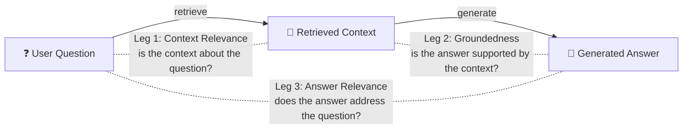
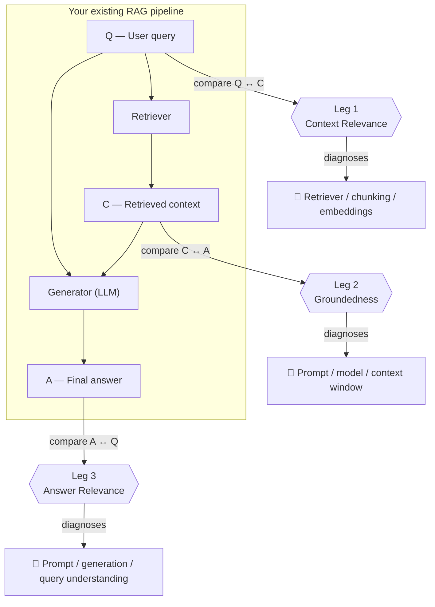
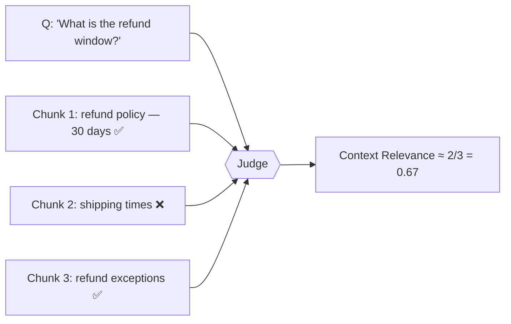
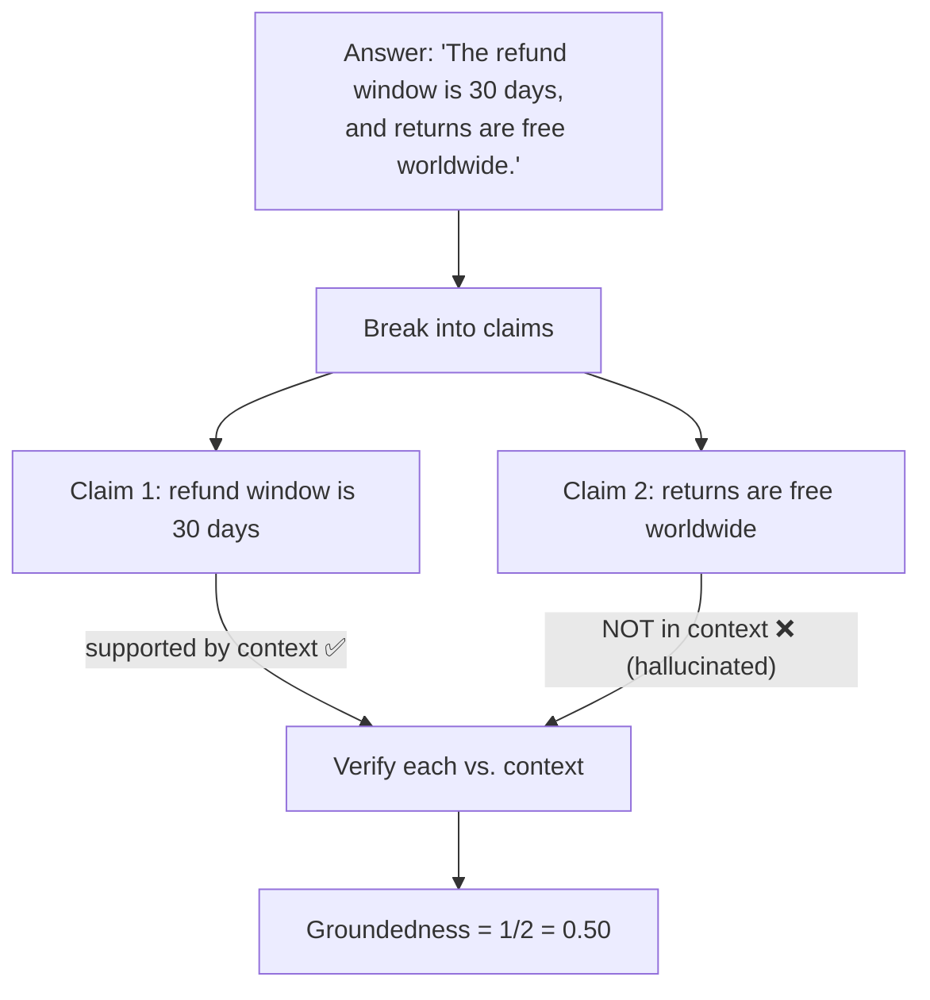
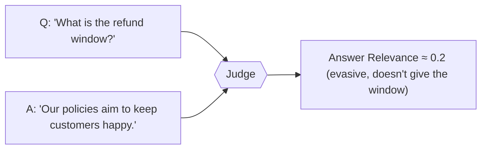
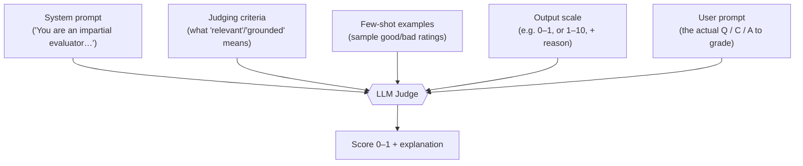
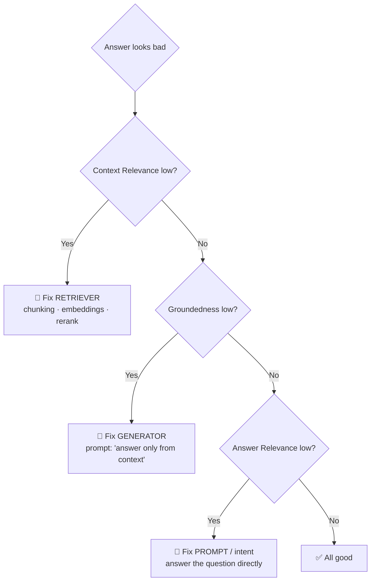
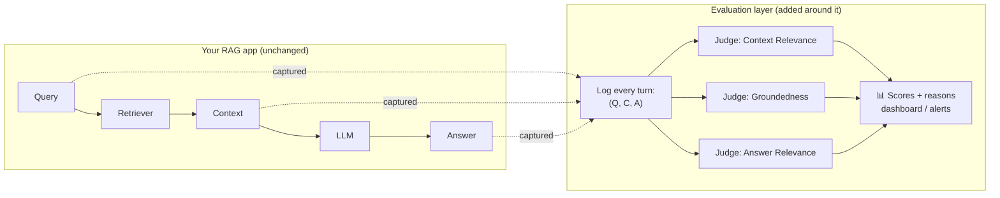
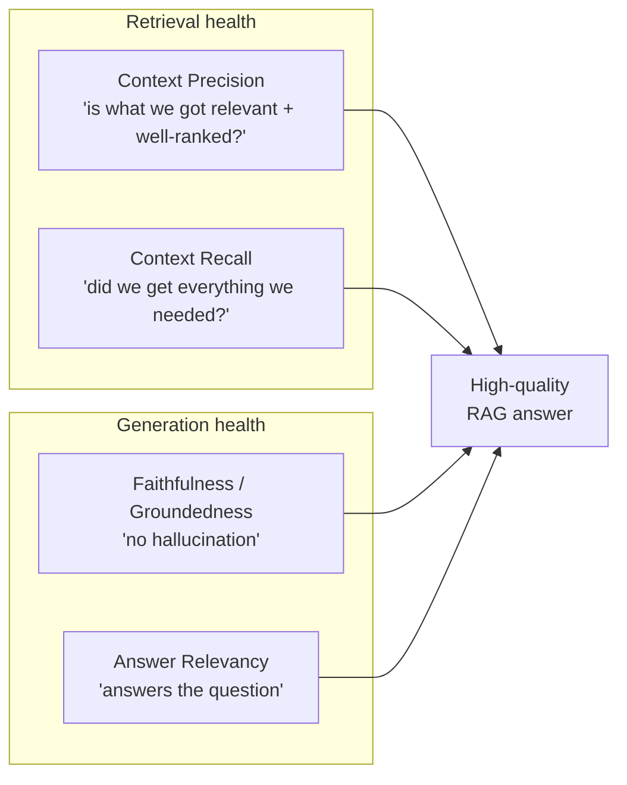
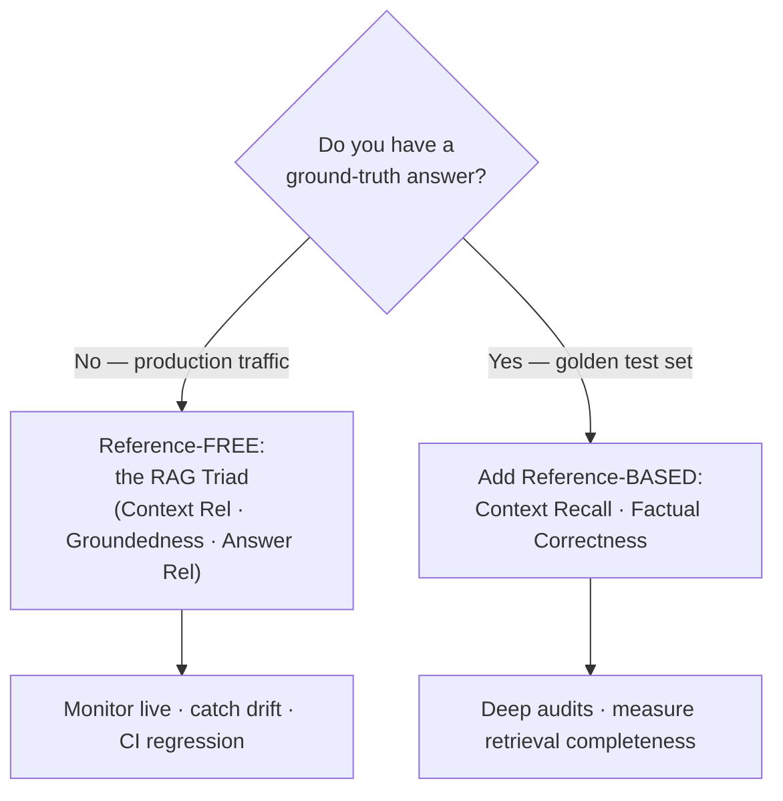

# The RAG Triad — Evaluating RAG Without Ground Truth (Beginner → Advanced)

> The **RAG Triad** is the single most important mental model for evaluating a RAG system.
> It says: a trustworthy answer must pass **three** independent checks —
> **Context Relevance**, **Groundedness (Faithfulness)**, and **Answer Relevance**.
> If all three pass, you have strong evidence the answer is correct *and* honest. If one
> fails, the *failing leg tells you exactly which part of your pipeline to fix.*
>
> The magic property: the triad needs **no human-written "correct answer"** to run. That means
> you can evaluate real production traffic, at scale, automatically. This document explains
> what each leg means, how it is measured, how to apply it to a RAG pipeline you already have,
> and how it relates to the RAGAS metrics (Context Precision / Recall) you'll see everywhere.

---

## Table of Contents

1. [The core intuition](#1-the-core-intuition)
2. [Why we even need the triad (the failure it prevents)](#2-why-we-even-need-the-triad-the-failure-it-prevents)
3. [The three legs mapped onto the pipeline](#3-the-three-legs-mapped-onto-the-pipeline)
4. [Leg 1 — Context Relevance](#4-leg-1--context-relevance)
5. [Leg 2 — Groundedness / Faithfulness](#5-leg-2--groundedness--faithfulness)
6. [Leg 3 — Answer Relevance](#6-leg-3--answer-relevance)
7. [How measurement actually works: LLM-as-a-Judge](#7-how-measurement-actually-works-llm-as-a-judge)
8. [Reading the triad like a doctor: diagnosis table](#8-reading-the-triad-like-a-doctor-diagnosis-table)
9. [Applying it to a RAG pipeline you already have](#9-applying-it-to-a-rag-pipeline-you-already-have)
10. [The triad vs. RAGAS metrics (Context Precision & Recall)](#10-the-triad-vs-ragas-metrics-context-precision--recall)
11. [Reference-free vs. reference-based evaluation](#11-reference-free-vs-reference-based-evaluation)
12. [Advanced: trusting the judge, thresholds, and pitfalls](#12-advanced-trusting-the-judge-thresholds-and-pitfalls)
13. [Mastery checklist](#13-mastery-checklist)
14. [Sources](#sources)

---

## 1. The core intuition

A RAG answer is only trustworthy if **three things** are all true:

1. **We looked in the right place.** The chunks we retrieved are actually about the question.
2. **We didn't make things up.** Every claim in the answer is backed by those chunks.
3. **We actually answered the question.** The final response addresses what the user asked.

That's the whole triad in one breath:

> **Right context → Honest use of context → Useful answer.**

Notice the triad forms a **triangle** between the three things every RAG turn produces: the
**question**, the **context**, and the **answer**. Each leg checks one *edge* of that triangle.

---

## 2. Why we even need the triad (the failure it prevents)

RAG has one nightmare failure: **a confident, fluent, completely wrong answer.** A single
overall "is this good?" score can't tell you *why* it went wrong. The triad decomposes the
problem so the failure becomes *addressable*.

Consider what can silently break:

- Retrieval pulls the wrong documents → the LLM never had a chance. *(Context Relevance catches this.)*
- Retrieval was fine, but the LLM ignored it and hallucinated. *(Groundedness catches this.)*
- The answer is factually grounded but dodges the actual question. *(Answer Relevance catches this.)*

Without the triad you see "the answer is bad." With the triad you see "**the retriever is
the problem**" or "**the generator is the problem**" — and you fix the right thing.

---

## 3. The three legs mapped onto the pipeline

Every RAG turn has exactly three artifacts: **Question (Q)**, **Context (C)**, **Answer (A)**.
Each leg compares two of them.

| Leg | Compares | Stage it grades | If it's low, fix… |
|-----|----------|-----------------|-------------------|
| **Context Relevance** | Question ↔ Context | Retrieval | chunking, embeddings, top-k, hybrid search, reranking |
| **Groundedness** | Context ↔ Answer | Generation | prompt instructions, model choice, context stuffing |
| **Answer Relevance** | Answer ↔ Question | Generation / output | prompt, query rewriting, instructions to "answer directly" |

---

## 4. Leg 1 — Context Relevance

**Question it answers:** *Did the retriever fetch chunks that are actually about the query?*

This is the **first** thing to check, because retrieval is upstream of everything. If the
context is junk, the LLM is doomed no matter how good it is — irrelevant context is the
seed of downstream hallucination.

**How it's scored:** the judge looks at each retrieved chunk and asks *"is this piece relevant
to the question?"* Then it aggregates — e.g. what fraction of retrieved chunks were relevant,
or an average relevance score across chunks. Score is normalized to **0 → 1** (higher = better).

**Low Context Relevance means:** your retrieval layer is the problem. Look at chunk size,
embedding model, `top_k`, missing hybrid/keyword search, or a missing reranker.

---

## 5. Leg 2 — Groundedness / Faithfulness

**Question it answers:** *Is every claim in the answer actually supported by the retrieved context?*

"Groundedness" (TruLens's name) and "Faithfulness" (RAGAS's name) are **the same idea**: the
answer must not invent, exaggerate, or "expand to a correct-sounding" statement that the
context doesn't back up. This is the **direct hallucination detector.**

**How it's scored (the clever part):** the answer is broken into **individual claims**, and
each claim is checked *independently* against the context for supporting evidence.

> **Groundedness = (number of claims supported by the context) ÷ (total claims in the answer)**

**Low Groundedness means:** the generator is the problem. The retriever *may* have found good
context, but the LLM strayed from it. Fixes: strengthen the prompt ("answer only from the
context, say 'I don't know' otherwise"), use a stronger model, ensure the context actually
fits in the window, reduce temperature.

> **Key insight:** Groundedness ≠ correctness. An answer can be perfectly grounded in the
> context *and still be wrong* if the context itself is wrong. Groundedness only certifies
> *"the model didn't make this up"* — that's why you also need Context Relevance upstream.

---

## 6. Leg 3 — Answer Relevance

**Question it answers:** *Does the final answer actually address what the user asked?*

An answer can be grounded and factual yet **useless** — too vague, off-topic, evasive, or
answering a slightly different question. This leg guards the *usefulness* of the output.

**How it's scored:** the judge compares the final answer directly against the original
question and rates how well it addresses it (0 → 1). Some frameworks do this by generating
"what question would this answer be answering?" and checking how close that is to the real
question.

**Low Answer Relevance means:** generation/prompting problem — the model is rambling, hedging,
or misreading intent. Fixes: sharpen the prompt, add query rewriting/understanding, instruct
the model to answer the question directly and concisely.

---

## 7. How measurement actually works: LLM-as-a-Judge

The triad is scored by an **LLM-as-a-Judge**: a second, carefully-prompted LLM reads the Q, C,
and A and returns scores. This is why it needs no human labels.

A judge prompt is built from a few standard parts:

Two things make this trustworthy in practice:
- **Ask for a reason, not just a number.** A judge that must justify its score (chain-of-thought)
  is far more reliable, and the explanation is gold when debugging.
- **Claim-decomposition** (used in groundedness) turns a fuzzy judgment into many tiny,
  verifiable yes/no checks — much more reliable than one holistic "is this grounded?" call.

Because it's just an LLM call over `(Q, C, A)`, you can run the triad **offline in CI** (on a
fixed test set, to catch regressions) *and* **online in production** (sampling live traffic).

---

## 8. Reading the triad like a doctor: diagnosis table

The whole point is *localizing the fault*. Read the three scores together:

| Context Rel. | Groundedness | Answer Rel. | Diagnosis | Where to look |
|:---:|:---:|:---:|---|---|
| ✅ | ✅ | ✅ | Healthy | Ship it |
| ❌ | – | – | **Retriever failed** — bad context in | chunking, embeddings, top-k, hybrid search, reranker |
| ✅ | ❌ | ✅/❌ | **LLM hallucinated** — ignored good context | prompt ("use only context"), stronger model, temperature |
| ✅ | ✅ | ❌ | **Off-target** — grounded but doesn't answer | prompt clarity, query rewriting, answer directness |
| ❌ | ✅ | ✅ | Suspicious: grounded in *irrelevant* context | verify — may be luck or leakage; fix retrieval anyway |

This decision tree is the practical payoff of the whole concept — **memorize it.**

---

## 9. Applying it to a RAG pipeline you already have

Say you already have a working RAG pipeline (retriever + LLM). Here's how the triad drops in
**without changing the pipeline itself** — it's a wrapper that observes each turn.

The practical steps (conceptually — no code needed to understand them):

1. **Instrument the pipeline** so that for every request you capture the three artifacts:
   the **query**, the exact **retrieved context** passed to the LLM, and the final **answer**.
2. **Build a small golden test set** — 20–100 representative questions. Run them through the
   pipeline, then run the triad. This is your offline baseline in CI.
3. **Score the triad** with an LLM judge on those three artifacts. Store score + reason.
4. **Read the diagnosis** (Section 8) and change *one* thing (e.g. add a reranker).
5. **Re-run the same test set.** Did the targeted leg's score go up without hurting the others?
   That's a real improvement — proven by a number, not a vibe.
6. **Turn it on in production**, sampling live traffic, with alerts when any leg drops below a
   threshold. Now you catch regressions from data drift, model updates, or prompt changes.

> This is the core loop of RAG engineering: **measure the triad → read which leg is low →
> fix that stage → re-measure.** Every advanced technique (hybrid search, reranking, HyDE,
> agentic RAG) should be justified by a triad leg moving up.

---

## 10. The triad vs. RAGAS metrics (Context Precision & Recall)

You'll constantly see **RAGAS** metrics alongside the triad. They overlap and complement it.
The naming can confuse — here's the clean mapping:

| Concept | TruLens (triad) name | RAGAS name | Needs a reference answer? |
|---|---|---|---|
| Is the answer supported by context? | **Groundedness** | **Faithfulness** | No |
| Does the answer address the question? | **Answer Relevance** | **Answer Relevancy** | No |
| Is the retrieved context on-topic? | **Context Relevance** | (closest: **Context Precision**) | Precision: needs reference |
| Did we retrieve *all* needed info? | *(not in the triad)* | **Context Recall** | Yes |

Two RAGAS additions worth knowing:

- **Context Precision** — of the retrieved chunks, what fraction is relevant, **and are the
  relevant ones ranked near the top?** It's rank-aware (rewards putting good chunks first).
  Formula intuition: average of `Precision@k` at each position where a relevant chunk appears.
- **Context Recall** — of all the information *needed* to answer (from a reference answer),
  how much did retrieval actually bring back? This is the one leg the triad **cannot** measure,
  because "what was needed" requires a ground-truth reference.

**Rule of thumb:** the **triad** is your always-on, no-labels monitor. **Context Recall** is the
extra metric you add when you *do* have a labeled test set and want to know if retrieval is
missing information (recall problems are invisible to the triad alone).

---

## 11. Reference-free vs. reference-based evaluation

This distinction unlocks *when* you can use each metric.

- **Reference-free** (Context Relevance, Groundedness, Answer Relevance, Context Precision*):
  computed from only `(Q, C, A)`. No human-written "gold answer" needed → usable on
  **live production traffic**.
- **Reference-based** (Context Recall, factual correctness, exact-match): need a curated
  ground-truth answer/context → usable only on a **labeled test set**.

*\(Context Precision can be run in a reference-free "LLM decides relevance" mode or a
reference-based mode.\)*

The triad's superpower is being **reference-free** — that's why it scales to real usage where
you'll never have gold answers for every query.

---

## 12. Advanced: trusting the judge, thresholds, and pitfalls

Once you're comfortable, these are the things that separate a naive setup from a robust one:

- **Validate the judge against humans first.** Before trusting judge scores, hand-label a small
  sample and check the judge agrees with you. A judge you haven't validated is just another
  unverified LLM.
- **Set per-leg thresholds, not one global number.** e.g. Groundedness must be ≥ 0.9 (hallucination
  is unacceptable), Answer Relevance ≥ 0.7. Different legs have different tolerances.
- **Always keep the reason string.** The score tells you *that* something's wrong; the
  explanation tells you *what*. This is your fastest debugging tool.
- **Watch for judge bias**: LLM judges can favor longer answers, their own model family's style,
  or position order in a list. Use few-shot calibration and, for high stakes, a stronger judge
  model than the one being judged.
- **Groundedness ≠ correctness (again).** If your knowledge base is wrong, a grounded answer is
  a confidently-wrong answer. Garbage in the source data → garbage out, and the triad won't
  save you. Keep the source corpus clean.
- **Cost and latency.** Every leg is an extra LLM call. In production you usually **sample**
  (e.g. score 5–10% of traffic) rather than evaluate every single request.
- **Aggregate over a set, not one example.** A single low score is noise. Track the *average*
  of each leg across your test set / traffic window, and alert on **trends**.

---

## 13. Mastery checklist

You've mastered the RAG Triad when you can, from memory:

- [ ] State the three legs and which two artifacts (Q/C/A) each one compares.
- [ ] Explain why **Context Relevance → Groundedness → Answer Relevance** is the natural order.
- [ ] Explain groundedness via **claim decomposition** and why it beats a holistic judgment.
- [ ] Read a `(Context Rel, Groundedness, Answer Rel)` triple and name the broken pipeline stage.
- [ ] Explain why the triad is **reference-free** and what that enables (production monitoring).
- [ ] Map triad names to RAGAS names (Groundedness = Faithfulness, etc.).
- [ ] Explain the one thing the triad *can't* see (**Context Recall**) and why it needs a reference.
- [ ] Describe the improvement loop: measure → diagnose the low leg → fix that stage → re-measure.
- [ ] Name three ways an LLM judge can be biased and how to guard against it.

If you can do all of these, you understand RAG evaluation better than most people shipping
RAG today. **Next stop:** the retrieval metrics folder (MRR, MAP, NDCG) — those quantify the
*ranking quality* behind Context Relevance and Context Precision.

---

## Sources

- [The RAG Triad — TruLens (official docs)](https://www.trulens.org/getting_started/core_concepts/rag_triad/)
- [TruLens RAG Triad: Groundedness, Context Relevance, Answer Relevance — QASkills](https://qaskills.sh/blog/trulens-rag-triad-groundedness-context-relevance-2026)
- [Benchmarking LLM-as-a-Judge for the RAG Triad Metrics — Snowflake Engineering](https://www.snowflake.com/en/blog/engineering/benchmarking-LLM-as-a-judge-RAG-triad-metrics/)
- [Eval-Guided Optimization of LLM Judges for the RAG Triad — Snowflake](https://www.snowflake.com/en/engineering-blog/eval-guided-optimization-llm-judges-rag-triad/)
- [Ragas Metrics (Faithfulness, Answer Relevancy, Context Precision/Recall) — official docs](https://docs.ragas.io/en/v0.1.21/concepts/metrics/)
- [Ragas Metrics Explained: What They Actually Compute — Saulius blog](https://saulius.io/blog/ragas-rag-evaluation-metrics-llm-judge)
- [RAG Evaluation Metrics: Answer Relevancy, Faithfulness, and More — Confident AI](https://www.confident-ai.com/blog/rag-evaluation-metrics-answer-relevancy-faithfulness-and-more)
- [Result Evaluation for RAG: Metrics & Best Practices — IBM](https://www.ibm.com/think/architectures/rag-cookbook/result-evaluation)
