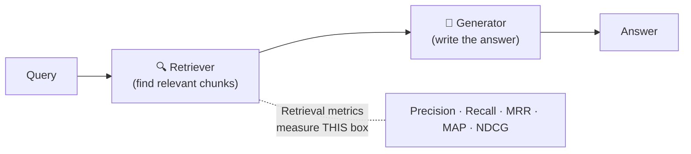
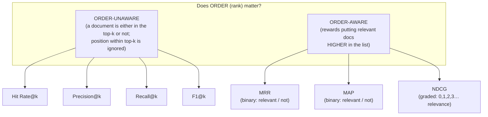
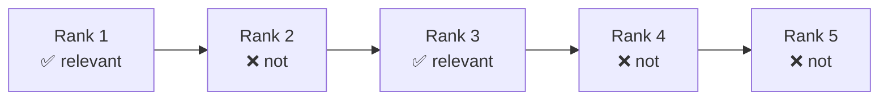
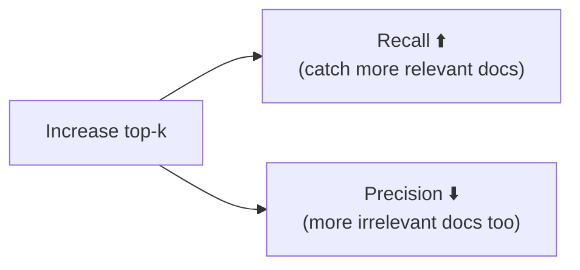
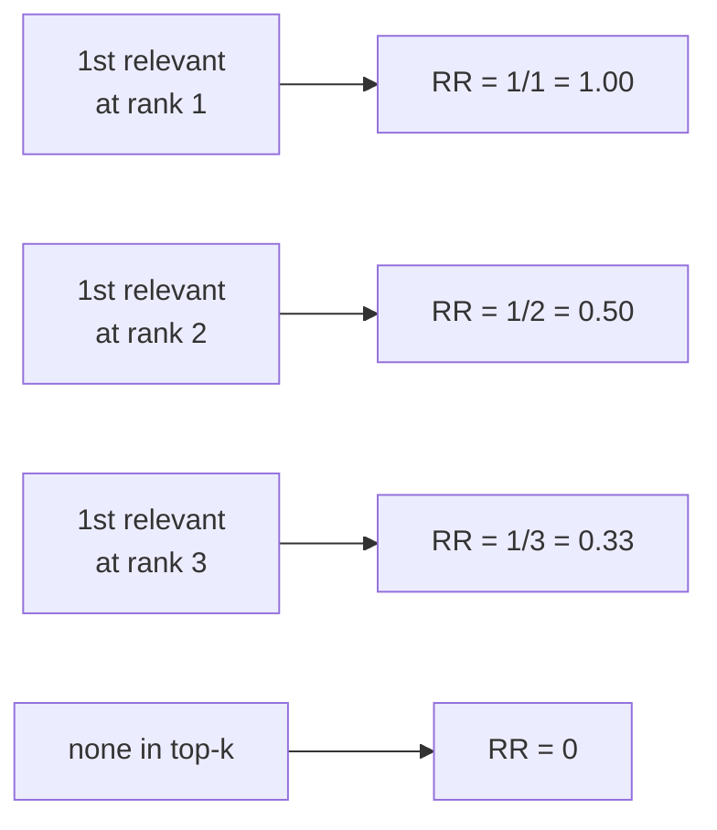
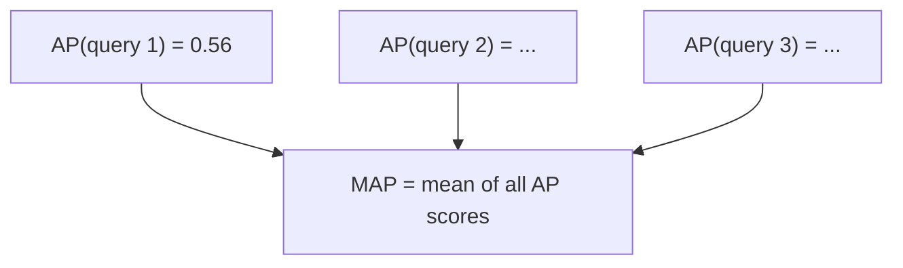
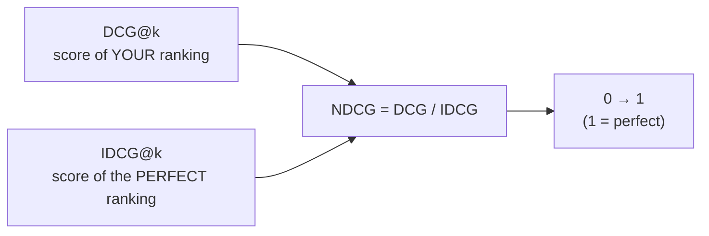
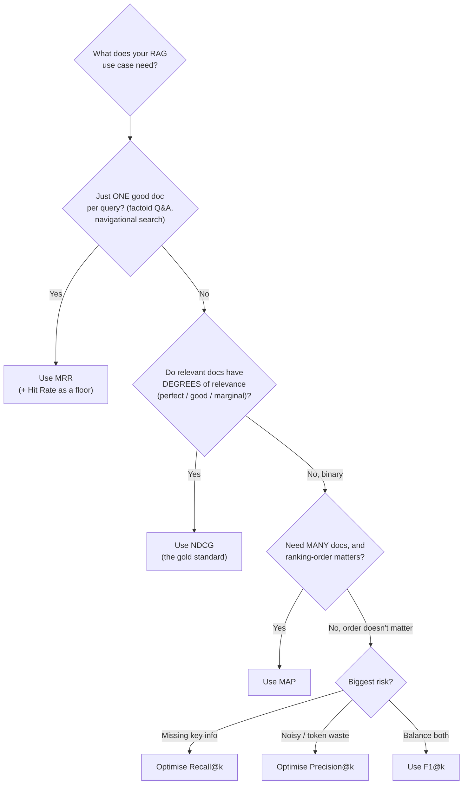
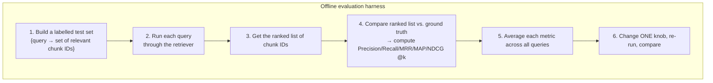
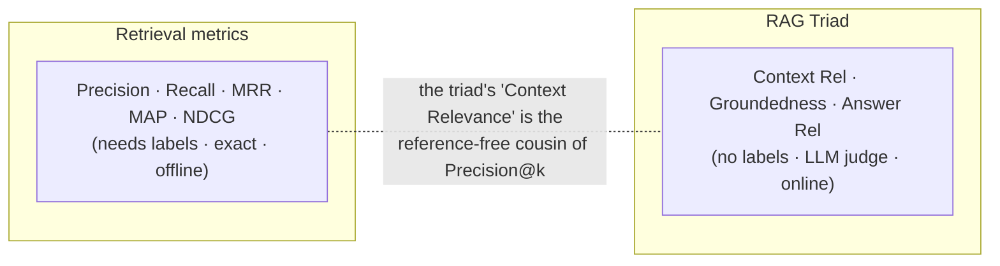

# Retrieval Metrics — Measuring the Retriever (Beginner → Advanced)

> Before an LLM can answer well, your **retriever** has to hand it the right documents.
> **Retrieval metrics** are the numbers that tell you *how good the retriever is* — did it
> find the relevant chunks, and did it rank the good ones near the top? This is pure
> **Information Retrieval (IR)** — the same math that powers search engines — applied to the
> retrieval stage of RAG.
>
> Unlike the [RAG Triad](../rag-triad/Introduction.md) (which is reference-free and judged by
> an LLM), retrieval metrics are **reference-based**: they need a labelled test set where you
> already know which documents are "relevant" for each query. In exchange, they give you exact,
> cheap, deterministic numbers you can compute thousands of times to tune `top_k`, chunk size,
> embeddings, hybrid search, and rerankers.
>
> This document explains every important retrieval metric from scratch — Hit Rate, Precision@k,
> Recall@k, F1@k, MRR, MAP, and NDCG — each with a formula, a worked example on **one shared
> scenario**, a diagram, and clear guidance on *when to use it*.

---

## Table of Contents

1. [The core intuition: why we need retrieval metrics](#1-the-core-intuition-why-we-need-retrieval-metrics)
2. [The setup: query, ranked list, ground truth, and "@k"](#2-the-setup-query-ranked-list-ground-truth-and-k)
3. [The two big questions → a metric taxonomy](#3-the-two-big-questions--a-metric-taxonomy)
4. [Our running example (used by every metric below)](#4-our-running-example-used-by-every-metric-below)
5. [Hit Rate@k — "did we get at least one?"](#5-hit-ratek--did-we-get-at-least-one)
6. [Precision@k — "how much of what we got is useful?"](#6-precisionk--how-much-of-what-we-got-is-useful)
7. [Recall@k — "how much of what we needed did we get?"](#7-recallk--how-much-of-what-we-needed-did-we-get)
8. [F1@k — "the balance of precision and recall"](#8-f1k--the-balance-of-precision-and-recall)
9. [MRR — "how high is the FIRST correct hit?"](#9-mrr--how-high-is-the-first-correct-hit)
10. [MAP — "how well are ALL correct hits ranked?"](#10-map--how-well-are-all-correct-hits-ranked)
11. [NDCG — "the ultimate rank + graded-relevance metric"](#11-ndcg--the-ultimate-rank--graded-relevance-metric)
12. [All metrics side by side (on the same example)](#12-all-metrics-side-by-side-on-the-same-example)
13. [Which metric should I use? (decision guide)](#13-which-metric-should-i-use-decision-guide)
14. [Applying retrieval metrics to your RAG pipeline](#14-applying-retrieval-metrics-to-your-rag-pipeline)
15. [How this connects to the RAG Triad](#15-how-this-connects-to-the-rag-triad)
16. [Advanced notes & pitfalls](#16-advanced-notes--pitfalls)
17. [Mastery checklist](#17-mastery-checklist)
18. [Sources](#sources)

---

## 1. The core intuition: why we need retrieval metrics

RAG has two stages, and each can fail independently:



If retrieval hands the generator garbage, no LLM on earth can save the answer — **"garbage in,
garbage out."** So before you tune prompts or swap models, you measure the retriever in
isolation. Retrieval metrics answer one focused question:

> **Given a query, did the retriever return the relevant documents — and did it rank the good
> ones near the top?**

Everything else in this doc is just different ways of turning that question into a number.

---

## 2. The setup: query, ranked list, ground truth, and "@k"

Every retrieval metric needs four ingredients:

| Ingredient | What it is |
|---|---|
| **Query (q)** | The user's question. |
| **Ranked list** | The ordered chunks the retriever returned: rank 1, rank 2, rank 3, … |
| **Ground truth** | The set of chunks a human (or dataset) labelled **relevant** for that query. |
| **k** | The cutoff — we only look at the **top-k** results (e.g. `@5` = top 5). |

Why **@k**? Because in RAG you only pass the top few chunks to the LLM (your context window is
finite). A relevant document sitting at rank 900 is useless — it never reaches the model. So
almost every metric is reported "at k": **Precision@5**, **Recall@10**, **NDCG@5**, etc.

> **Key distinction from the RAG Triad:** these metrics need a **labelled ground-truth set**
> ("which chunks are relevant for this query"). That's why they run on a curated *test set*,
> not on arbitrary live traffic. Building that labelled set is the price of admission.

---

## 3. The two big questions → a metric taxonomy

Every retrieval metric is really asking one of two questions, using one of two kinds of
relevance labels. That gives a clean 2×2 mental map:



Two axes to keep in your head:

1. **Order-unaware vs. order-aware** — does the *position* of a relevant doc within the top-k
   change the score? Precision@k doesn't care if the relevant doc is at rank 1 or rank 5.
   MRR/MAP/NDCG do.
2. **Binary vs. graded relevance** — is a document just "relevant / not relevant" (binary), or
   does it have *degrees* of relevance (0 = useless, 1 = somewhat, 2 = good, 3 = perfect)?
   Only **NDCG** naturally uses graded relevance.

---

## 4. Our running example (used by every metric below)

To make the metrics concrete, we'll use **one scenario for all of them.**

**Query:** *"What is your return policy?"*

Suppose the corpus contains **3 truly relevant chunks** for this query (the ground truth).
The retriever returns its **top 5**, which we label ✅ (relevant) or ❌ (not relevant):



So:
- **Ranked results (top-5):** `[✅, ❌, ✅, ❌, ❌]`
- **Relevant docs retrieved:** 2 (at ranks 1 and 3)
- **Total relevant docs in the corpus:** 3 (so **one relevant doc was missed entirely** — it's not in the top-5)
- We'll compute every metric at **k = 5**.

Keep this picture in mind — each section below plugs it into a different formula.

---

## 5. Hit Rate@k — "did we get at least one?"

**Question:** *Did at least one relevant chunk appear in the top-k?* (Yes = 1, No = 0.)

This is the simplest possible metric. Averaged over many queries, **Hit Rate@k** = the fraction
of queries for which the retriever surfaced *any* relevant chunk in the top-k.

```
HitRate@k (per query) = 1 if (relevant docs in top-k ≥ 1) else 0
```

**On our example:** there's a ✅ in the top-5, so **Hit Rate@5 = 1**.

**When to use it:** a quick sanity floor. If Hit Rate is low, retrieval is fundamentally broken
and no fancier metric matters yet. It's coarse, though — it can't tell a great ranking from a
barely-passing one.

---

## 6. Precision@k — "how much of what we got is useful?"

**Question:** *Of the top-k results, what fraction are actually relevant?*

```
Precision@k = (relevant docs in top-k) / k
```

**On our example:** 2 relevant out of 5 retrieved → **Precision@5 = 2/5 = 0.40**.

**Why it matters in RAG:** every irrelevant chunk you stuff into the prompt burns tokens and
**invites hallucination** — the LLM may latch onto the junk. High precision keeps the context
clean. Precision is the metric to watch when *context-window budget* and *noise* are your concern.

> **Order-unaware:** Precision@5 would be 0.40 whether the two ✅ sat at ranks 1–2 or ranks 4–5.
> Position doesn't affect it.

---

## 7. Recall@k — "how much of what we needed did we get?"

**Question:** *Of all the relevant docs that exist, what fraction did we retrieve in the top-k?*

```
Recall@k = (relevant docs in top-k) / (total relevant docs in the corpus)
```

**On our example:** we retrieved 2 of the 3 relevant docs → **Recall@5 = 2/3 ≈ 0.67**.

**Why it matters in RAG:** Recall is often **the single most important retrieval metric for RAG.**
If the answer-bearing chunk never gets retrieved, the LLM *cannot* answer correctly — full stop.
For high-stakes domains (medical, legal, finance) where a missed document means an incomplete or
dangerous answer, you optimise recall hard.

**The precision/recall tension:** raise `k` (retrieve more) and Recall goes up but Precision
usually goes down (more junk). This trade-off is the central knob of retrieval tuning.



---

## 8. F1@k — "the balance of precision and recall"

**Question:** *What's the single number that balances Precision and Recall?*

F1 is their **harmonic mean** — it's high only when *both* are high, and it punishes a big gap
between them.

```
F1@k = 2 × (Precision@k × Recall@k) / (Precision@k + Recall@k)
```

**On our example:** P = 0.40, R = 0.67 →
F1@5 = 2 × (0.40 × 0.67) / (0.40 + 0.67) = 0.536 / 1.067 ≈ **0.50**.

**When to use it:** when you want *one* order-unaware number that neither floods the prompt
(low precision) nor misses key docs (low recall). Good for comparing two retrieval configs at a
glance — but because it's order-unaware, it still ignores *where* the good docs landed.

---

## 9. MRR — "how high is the FIRST correct hit?"

**Mean Reciprocal Rank.** This is the first **order-aware** metric: position now matters.

**Question (per query):** *At what rank did the FIRST relevant document appear?* The score is
the **reciprocal** of that rank.

```
ReciprocalRank = 1 / (rank of the first relevant document)
   → rank 1 → 1.00     rank 2 → 0.50     rank 3 → 0.33     rank 4 → 0.25 ...
   → 0 if no relevant document is retrieved at all

MRR = mean of ReciprocalRank across all queries
```

**On our example:** the first ✅ is at **rank 1** → ReciprocalRank = 1/1 = **1.00**. (If it had
been at rank 3, this query would score 0.33.)



**When to use it:** when the user needs **one good answer, fast** — factoid Q&A, "find *the*
doc" navigational search, single-answer chatbots. MRR captures "did we put a correct result at
or near the top?" **Its blind spot:** it *completely ignores* every relevant doc after the
first. For multi-document RAG, that's a serious limitation → use MAP or NDCG.

---

## 10. MAP — "how well are ALL correct hits ranked?"

**Mean Average Precision.** Where MRR looks only at the first hit, **MAP looks at every relevant
hit** and rewards ranking *all* of them early. Build it in two steps.

**Step 1 — Average Precision (AP) for one query.** Walk down the ranked list; every time you hit
a relevant doc, compute Precision@(that rank). Average those precisions, dividing by the total
number of relevant docs.

```
AP = ( Σ  Precision@(rank of each relevant doc retrieved) ) / (total relevant docs)
```

**On our example** (`[✅, ❌, ✅, ❌, ❌]`, 3 relevant total):

| Relevant doc | Found at rank | Precision at that rank |
|---|---|---|
| 1st ✅ | rank 1 | 1 relevant / 1 seen = **1.00** |
| 2nd ✅ | rank 3 | 2 relevant / 3 seen = **0.67** |
| 3rd (missed) | — | contributes **0** |

```
AP = (1.00 + 0.67 + 0) / 3  =  1.667 / 3  ≈  0.56
```

**Step 2 — MAP** = the mean of AP across all queries in your test set.



**When to use it:** when the answer needs **multiple supporting documents** and you care that
*all* of them rank early (multi-hop reasoning, research assistants, "gather all the evidence"
queries). MAP is stricter and more informative than MRR, but it assumes **binary** relevance
(a doc is relevant or not — no degrees). For graded relevance, you want NDCG.

---

## 11. NDCG — "the ultimate rank + graded-relevance metric"

**Normalized Discounted Cumulative Gain.** The most powerful and most-used ranking metric. It's
the only one here that handles **graded relevance** — where a doc can be *perfect (3)*,
*good (2)*, *marginal (1)*, or *useless (0)* rather than just yes/no. Build it in three layers.

**Layer 1 — DCG (Discounted Cumulative Gain).** Sum the relevance of each result, but
**discount** it by how far down the list it sits (a log penalty). Great docs near the top count
more; the same doc lower down counts less.

```
DCG@k = Σ (from i=1 to k)   relevanceᵢ / log₂(i + 1)
```

The `log₂(i+1)` denominator is the "discount": rank 1 → ÷1, rank 2 → ÷1.585, rank 3 → ÷2, …
The lower the rank, the harder the relevance gets divided down.

**Layer 2 — IDCG (Ideal DCG).** Compute DCG for the *perfect* ordering — the same relevance
scores sorted from highest to lowest. This is the best score physically achievable.

**Layer 3 — NDCG = DCG / IDCG.** Dividing by the ideal **normalises** the score to **0 → 1**,
so it's comparable across queries with different numbers of relevant docs.

```
NDCG@k = DCG@k / IDCG@k     (1.0 = perfect ranking)
```

### Worked example (graded relevance)

Say the top-5 results have graded relevance scores `[3, 2, 3, 0, 1]`:

```
DCG = 3/log₂2 + 2/log₂3 + 3/log₂4 + 0/log₂5 + 1/log₂6
    = 3/1 + 2/1.585 + 3/2 + 0 + 1/2.585
    = 3 + 1.262 + 1.5 + 0 + 0.387  =  6.15
```

Ideal ordering (sort the scores descending → `[3, 3, 2, 1, 0]`):

```
IDCG = 3/log₂2 + 3/log₂3 + 2/log₂4 + 1/log₂5 + 0/log₂6
     = 3 + 1.893 + 1 + 0.431 + 0  =  6.32
```

```
NDCG@5 = 6.15 / 6.32  ≈  0.97   → this ranking is very close to ideal
```



> **Binary NDCG on our running example** (`[✅,❌,✅,❌,❌]` = relevance `[1,0,1,0,0]`, 3 relevant total):
> DCG = 1/log₂2 + 1/log₂4 = 1 + 0.5 = **1.5**.
> IDCG (ideal `[1,1,1,0,0]`) = 1 + 1/log₂3 + 1/log₂4 = 1 + 0.631 + 0.5 = **2.13**.
> **NDCG@5 = 1.5 / 2.13 ≈ 0.70.**

**When to use it:** whenever relevance has **degrees**, or you simply want the best all-round
ranking metric. It's the industry default for search and recommendation quality. **Trade-off:**
it needs graded relevance labels (more expensive to produce) and is less intuitive to explain
than Precision/Recall.

> **Note on formula variants:** some define the numerator as `(2^relevanceᵢ − 1)/log₂(i+1)`,
> which weights highly-relevant docs even more aggressively. Both are common — pick one and be
> consistent across all your evaluations.

---

## 12. All metrics side by side (on the same example)

Our scenario: `[✅, ❌, ✅, ❌, ❌]`, 3 relevant docs total, k = 5.

| Metric | Value | What it told us |
|---|---|---|
| **Hit Rate@5** | 1.00 | At least one relevant doc showed up. |
| **Precision@5** | 0.40 | Only 40% of what we retrieved was useful (noisy). |
| **Recall@5** | 0.67 | We found 2 of the 3 relevant docs (missed one). |
| **F1@5** | 0.50 | Balanced precision/recall score. |
| **MRR** | 1.00 | The *first* relevant doc was at the very top — great. |
| **MAP (AP)** | 0.56 | Considering *all* relevant docs, ranking is only okay. |
| **NDCG@5** (binary) | 0.70 | Rank-aware, normalised: decent but not ideal. |

Notice how the **same retrieval** looks "perfect" through MRR (1.00) but only "okay" through MAP
(0.56) — because MRR stops at the first hit while MAP notices the missed and lower-ranked docs.
**This is exactly why you report several metrics, not one.**

---

## 13. Which metric should I use? (decision guide)



Quick rules of thumb:

- **Start with Recall@k** — for most RAG, "did the answer-bearing chunk get retrieved at all?" is
  the make-or-break question.
- **Add Precision@k** to catch prompt-flooding noise once recall is healthy.
- **Use MRR** for single-answer / factoid systems.
- **Use MAP** for multi-document / research-style systems with binary labels.
- **Use NDCG** when you have graded relevance or want the single best rank-quality number.

---

## 14. Applying retrieval metrics to your RAG pipeline

Imagine you already have the RAG pipeline from the `rag-triad` demo (CSV → pgvector → retrieve →
generate). Here's how retrieval metrics drop in — **they only touch the retrieval step.**



**The step-by-step loop:**

1. **Build a labelled test set.** For 30–100 representative questions, record which chunk IDs are
   *truly relevant* (the ground truth). This is the hard, human part — but you only do it once and
   it pays off forever. (For graded NDCG, label each as 0/1/2/3 instead of just yes/no.)
2. **Run retrieval only** for each query → get the ranked list of chunk IDs (no LLM generation
   needed; these metrics don't call the generator).
3. **Compare** the ranked list against the ground truth and compute the metrics **@k** (match your
   real production `top_k`).
4. **Average** each metric over all queries → your baseline scorecard
   (e.g. Recall@5 = 0.71, MRR = 0.68, NDCG@5 = 0.74).
5. **Change one knob** — chunk size, embedding model, `top_k`, add **hybrid search (BM25 + vector)**,
   add a **reranker** — then re-run the exact same harness.
6. **Keep the change only if the metric moved up.** This turns "I think hybrid search helped" into
   "Recall@5 went 0.71 → 0.83, NDCG@5 went 0.74 → 0.86." Proof, not vibes.

> **Practical tip — where a reranker shows up:** a reranker rarely changes *Recall@k* (the same
> docs are present) but sharply improves the **order-aware** metrics (MRR, MAP, NDCG), because its
> whole job is pushing the best docs to the top. Watching order-aware vs. order-unaware metrics
> separately tells you *whether your problem is "can't find it" (recall) or "found it but ranked it
> low" (ordering).*

---

## 15. How this connects to the RAG Triad

Retrieval metrics and the [RAG Triad](../rag-triad/Introduction.md) are **complementary halves**
of RAG evaluation. Don't confuse them:

| | Retrieval metrics (this doc) | RAG Triad |
|---|---|---|
| **Measures** | The retriever's ranking quality | Retriever + generator, end to end |
| **Needs ground truth?** | **Yes** — labelled relevant chunks | **No** — reference-free (LLM judge) |
| **How computed** | Exact math (deterministic, cheap) | LLM-as-a-Judge (approximate, costs a call) |
| **Runs on** | A curated offline test set | Offline *and* live production traffic |
| **Best for** | Tuning chunking / embeddings / top-k / rerankers | Monitoring answer quality & catching hallucination |



The bridge: the Triad's **Context Relevance** leg is essentially a *reference-free* version of
**Precision@k** — it asks "is the retrieved context on-topic?" but has an LLM judge it instead of
a labelled ground-truth set. Use **retrieval metrics offline** to *tune* the retriever precisely,
and the **Triad online** to *monitor* the whole system where you have no labels.

---

## 16. Advanced notes & pitfalls

- **@k must match production.** If you feed the LLM 5 chunks, report `@5`. Measuring Recall@100
  while shipping top-3 flatters you with numbers you never actually use.
- **Recall vs. Precision is a dial, not a bug.** Bigger `k` → higher recall, lower precision. Pick
  the `k` where recall is "good enough" before precision (and token cost) collapses.
- **Ground-truth quality caps everything.** Mislabelled or incomplete relevance judgments make
  every metric lie. Sparse labels especially *understate* precision (a retrieved doc that's
  actually relevant but never labelled looks like a false positive).
- **Averaging hides tails.** A great mean Recall can still hide a cluster of queries scoring 0.
  Inspect the **distribution and the worst performers**, not just the average.
- **Binary vs. graded is a real choice.** Binary labels are cheap but throw away the difference
  between a perfect and a barely-relevant doc — exactly what NDCG exists to capture.
- **These metrics never touch the generator.** A perfect Recall@5 with a hallucinating LLM still
  produces a wrong answer — that failure is invisible here and shows up only in the Triad's
  Groundedness leg. Always evaluate *both* stages.
- **LLMs are starting to grade relevance.** A 2025+ trend is using an LLM to *produce* the graded
  relevance labels that feed NDCG, blending the reference-based and reference-free worlds — handy
  when hand-labelling doesn't scale, but validate the LLM labels against humans first.

---

## 17. Mastery checklist

You've mastered retrieval metrics when you can, from memory:

- [ ] State the four ingredients every retrieval metric needs (query, ranked list, ground truth, k).
- [ ] Explain why almost every metric is reported **"@k"**.
- [ ] Place each metric on the 2×2 map: **order-aware?** and **binary vs. graded?**
- [ ] Compute **Precision@k, Recall@k, F1@k** from a `[✅,❌,✅,…]` list in your head.
- [ ] Explain the **precision ↔ recall trade-off** as `k` grows.
- [ ] Compute **MRR** and say why it ignores everything after the first hit.
- [ ] Compute an **Average Precision** by hand and explain how MAP builds on it.
- [ ] Explain **DCG → IDCG → NDCG** and why the log discount and normalisation exist.
- [ ] Pick the right metric for a factoid bot vs. a multi-doc research assistant.
- [ ] Describe the offline tuning loop: label → retrieve → score → change one knob → re-score.
- [ ] Explain how retrieval metrics differ from (and complement) the **RAG Triad**.

If you can do all of these, you can diagnose *and prove* whether your retriever is the bottleneck
in any RAG system. **Next stop:** apply this to the retrieval-strategies tier (BM25, hybrid
search, reranking) — those are the knobs these metrics measure.

---

## Sources

- [Metrics for Evaluation of Retrieval in RAG Systems — Deconvolute Labs](https://deconvoluteai.com/blog/rag/metrics-retrieval)
- [Evaluation Metrics for Search and Recommendation Systems — Weaviate](https://weaviate.io/blog/retrieval-evaluation-metrics)
- [MRR vs MAP vs NDCG: Retrieval Ranking Metrics — Future AGI](https://futureagi.com/blog/what-is-mrr-map-ndcg-2026/)
- [How to Evaluate Retrieval Quality in RAG Pipelines: Precision@k, Recall@k, F1@k — Towards Data Science](https://towardsdatascience.com/how-to-evaluate-retrieval-quality-in-rag-pipelines-precisionk-recallk-and-f1k/)
- [How to Evaluate Retrieval Quality in RAG Pipelines: DCG@k and NDCG@k — Towards Data Science](https://towardsdatascience.com/how-to-evaluate-retrieval-quality-in-rag-pipelines-part-3-dcgk-and-ndcgk/)
- [Normalized Discounted Cumulative Gain (NDCG) — The Ultimate Ranking Metric — Towards Data Science](https://towardsdatascience.com/normalized-discounted-cumulative-gain-ndcg-the-ultimate-ranking-metric-437b03529f75/)
- [How is nDCG calculated? — Milvus](https://milvus.io/ai-quick-reference/how-is-normalized-discounted-cumulative-gain-ndcg-calculated)
- [What Is Mean Average Precision (MAP) — Galileo](https://galileo.ai/blog/mean-average-precision-metric)
- [Evaluate Retrieval Quality: MRR and Average Precision — Nikhil Dharmaram (Medium)](https://medium.com/@nikhil.dharmaram/evaluate-retrieval-quality-in-rag-pipelines-mean-reciprocal-rank-mrr-and-average-precision-ap-5385486a3629)
- [RAG Evaluation: Metrics for Retrieval and Generation Quality — Michael Brenndoerfer](https://mbrenndoerfer.com/writing/rag-evaluation-metrics-retrieval-generation)
