# Graph RAG & Knowledge Graphs — Retrieval That Understands Relationships (Beginner → Advanced)

> Vector RAG (everything up to now) retrieves by **similarity**: "find chunks that *mean* something
> like the query." That's powerful, but it has a blind spot — it doesn't understand how facts
> *connect*. Ask *"Which of our suppliers are also customers of our biggest competitor?"* and
> similarity search flounders: the answer isn't in any one chunk, it's in the **relationships
> between** many chunks.
>
> **Graph RAG** fixes this by first turning your documents into a **knowledge graph** — a network
> of entities (nodes) linked by relationships (edges) — and then retrieving by *traversing those
> connections*. This unlocks **multi-hop reasoning** ("connect the dots across many facts") and
> **global/thematic questions** ("what are the overall themes?") that vector RAG cannot answer.
>
> This document builds the whole topic from scratch: what a knowledge graph is, how to build one
> from text with LLMs, why graphs beat vectors for certain questions, a deep dive into
> **Microsoft GraphRAG**, the other major frameworks (**LightRAG, HippoRAG, Neo4j/Graphiti**),
> and the hybrid graph+vector approach that wins in production. No code; concepts only.

---

## Table of Contents

1. [The core intuition: similarity vs. relationships](#1-the-core-intuition-similarity-vs-relationships)
2. [Knowledge graph fundamentals: entities, relations, triples](#2-knowledge-graph-fundamentals-entities-relations-triples)
3. [Building a knowledge graph from text (with LLMs)](#3-building-a-knowledge-graph-from-text-with-llms)
4. [Why vector RAG struggles: multi-hop & global questions](#4-why-vector-rag-struggles-multi-hop--global-questions)
5. [Graph RAG vs. Vector RAG (head to head)](#5-graph-rag-vs-vector-rag-head-to-head)
6. [Deep dive: Microsoft GraphRAG](#6-deep-dive-microsoft-graphrag)
7. [The other frameworks: LightRAG, HippoRAG, Neo4j/Graphiti](#7-the-other-frameworks-lightrag-hipporag-neo4jgraphiti)
8. [Hybrid RAG: graph + vector (the production sweet spot)](#8-hybrid-rag-graph--vector-the-production-sweet-spot)
9. [When to choose Graph RAG (and when not to)](#9-when-to-choose-graph-rag-and-when-not-to)
10. [Applying it: from documents to a graph-powered answer](#10-applying-it-from-documents-to-a-graph-powered-answer)
11. [Pitfalls, costs & trade-offs](#11-pitfalls-costs--trade-offs)
12. [Mastery checklist](#12-mastery-checklist)
13. [Sources](#sources)

---

## 1. The core intuition: similarity vs. relationships

Two ways to organize knowledge, two very different superpowers:

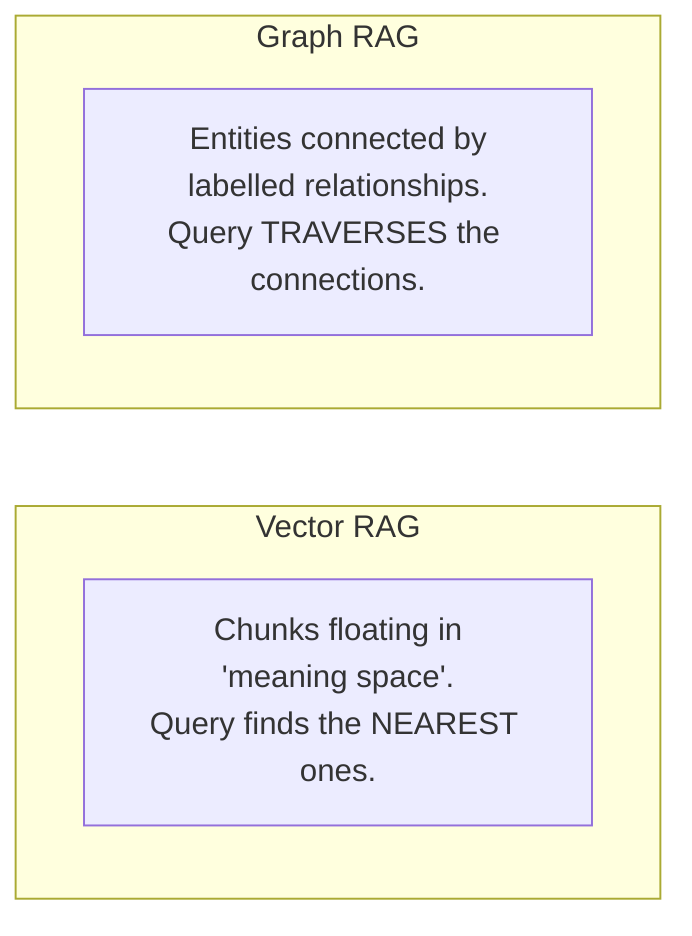

- **Vector RAG** answers *"what text is most similar to my query?"* — great for "find the passage
  about X."
- **Graph RAG** answers *"how are these things connected?"* — great for "trace the chain from A
  through B to C" and "summarize how everything relates."

> **One-line mental model:** *Vectors know what things **mean**. Graphs know how things
> **relate**.* Graph RAG is what you reach for when the answer lives in the **connections**, not
> in any single chunk.

---

## 2. Knowledge graph fundamentals: entities, relations, triples

A **knowledge graph (KG)** represents facts as a network. Three terms are everything:

- **Entity** — a "thing": a person, company, product, concept. Becomes a **node**.
- **Relation** — how two entities are connected: *works_at*, *founded*, *located_in*. Becomes a
  labelled **edge**.
- **Triple** — one atomic fact: **(head entity, relation, tail entity)**, written `(h, r, t)`.
  This is the unit a KG is built from.

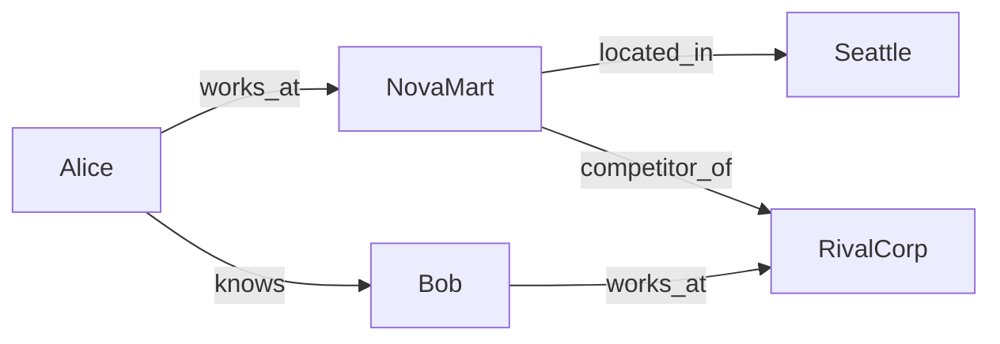

Every arrow above is a **triple**:
- `(Alice, works_at, NovaMart)`
- `(NovaMart, competitor_of, RivalCorp)`
- `(Alice, knows, Bob)` … etc.

Now the magic: to answer *"Does anyone at NovaMart know someone at a competitor?"* you just
**walk the edges**: `Alice → works_at → NovaMart`, `Alice → knows → Bob`, `Bob → works_at →
RivalCorp`, `NovaMart → competitor_of → RivalCorp`. That chained walk is **multi-hop reasoning** —
and it's trivial on a graph but nearly impossible for pure similarity search.

Entities usually also carry **types**, **descriptions**, and **provenance** (which document the
fact came from), which is what makes graph answers **auditable**.

---

## 3. Building a knowledge graph from text (with LLMs)

The historical blocker for KGs was construction — it needed hand-crafted rules or specially
trained NER/RE models. **LLMs changed everything**: they can extract entities and relations
**zero-shot** from raw text. The modern pipeline:

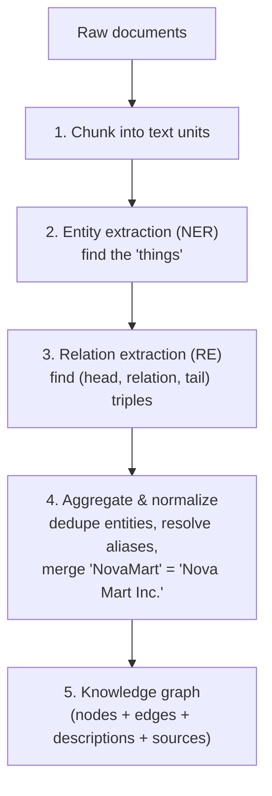

1. **Chunk** the documents into manageable text units.
2. **Entity extraction (NER):** prompt an LLM to list the entities in each chunk (with type +
   description).
3. **Relation extraction (RE):** prompt the LLM to output the **triples** `(subject, relation,
   object)` — usually as JSON. (Steps 2–3 can be one joint "end-to-end" call or two pipelined
   calls.)
4. **Aggregate & normalize (the crucial, underrated step):** the LLM will extract the same entity
   with different surface forms ("NovaMart", "Nova Mart Inc.", "the company"). You must
   **de-duplicate and resolve** these to a single canonical node — otherwise your graph
   fragments. This includes lowercasing, coreference/pronoun resolution, and merging duplicates.
5. **Assemble** entities → nodes, relations → edges, and attach descriptions and source
   references. Store in a graph database (or a graph library).

> **Key takeaway:** building the KG is an **offline, LLM-heavy, one-time cost.** It's where most
> of Graph RAG's expense lives — many LLM calls up front — but it pays off at query time.

---

## 4. Why vector RAG struggles: multi-hop & global questions

Two specific question types expose vector RAG's limits — and are exactly where Graph RAG shines.

### Problem A — Multi-hop reasoning (the "lost context" problem)

A multi-hop question needs facts chained across *several* documents. Vector RAG retrieves the
top-k *most similar* chunks independently — it has no notion of "follow this fact to the next."

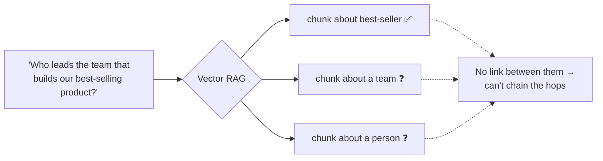

Traditional RAG tends to **lose the thread after 3–4 hops**. A graph just walks the edges:
`product → built_by → team → led_by → person`. On enterprise multi-hop benchmarks this gap is
dramatic — reported figures like **GraphRAG ~86% vs. vector RAG ~32%** accuracy.

### Problem B — Global / thematic questions

Ask *"What are the main themes across all 500 support tickets?"* Vector RAG retrieves a handful
of similar chunks — but the answer requires **summarizing the entire corpus**, which no top-k
retrieval can do. Graph RAG solves this with **community summaries** (Section 6).

---

## 5. Graph RAG vs. Vector RAG (head to head)

| Dimension | Vector RAG | Graph RAG |
|---|---|---|
| **Retrieves by** | Semantic similarity | Relationship traversal |
| **Best at** | "Find the passage about X" | "Connect the dots" + "summarize the whole" |
| **Multi-hop reasoning** | Weak (loses the thread) | Strong (walk the edges) |
| **Global/thematic questions** | Weak | Strong (community summaries) |
| **Explainability** | Low (opaque similarity scores) | High (auditable reasoning path) |
| **Indexing cost** | Low (embed + store) | High (LLM entity/relation extraction) |
| **Query latency** | Low | Higher (graph traversal) |
| **Setup complexity** | Simple | Complex (graph construction) |

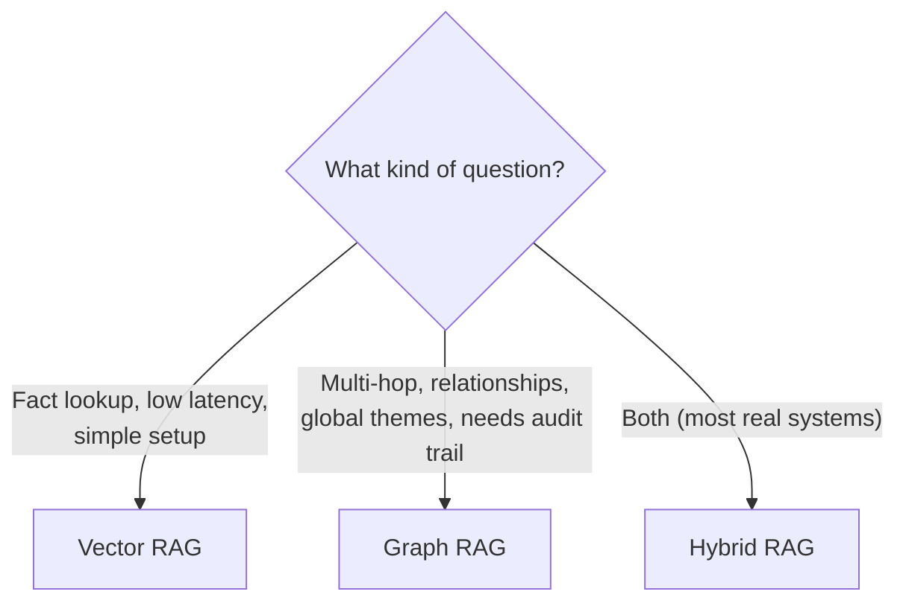

**The honest summary:** Graph RAG is **more accurate on complex/connected questions** but
**slower, costlier, and harder to build**. It is not a replacement for vector RAG — it's a
different tool, and the best systems combine both (Section 8).

---

## 6. Deep dive: Microsoft GraphRAG

Microsoft Research's **GraphRAG** (April 2024) is the reference implementation and the one you
must understand. It has two phases: an **indexing** phase (build the graph + summaries) and a
**query** phase (local vs. global search).

### Phase 1 — Indexing (build the knowledge structure)

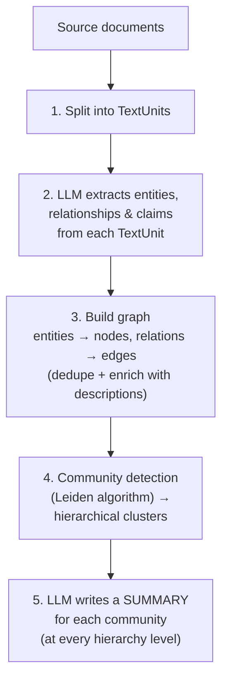

1. **TextUnits:** break documents into chunks.
2. **Extraction:** an LLM identifies **entities, relationships, and key claims** in each TextUnit.
3. **Graph construction:** entities become nodes, relationships become edges; duplicate entities
   are resolved and nodes are enriched with descriptions and source references.
4. **Community detection with the Leiden algorithm:** the graph is partitioned into
   **communities** — clusters of densely-connected entities. Leiden is **hierarchical**, so you
   get communities at multiple levels: **level 0** = a few big, generic clusters (whole topics);
   deeper levels (1, 2, 3…) = smaller, more specific sub-clusters.
5. **Community summaries:** an LLM writes a natural-language **summary for each community** at
   every level. These summaries are the secret to answering global questions.

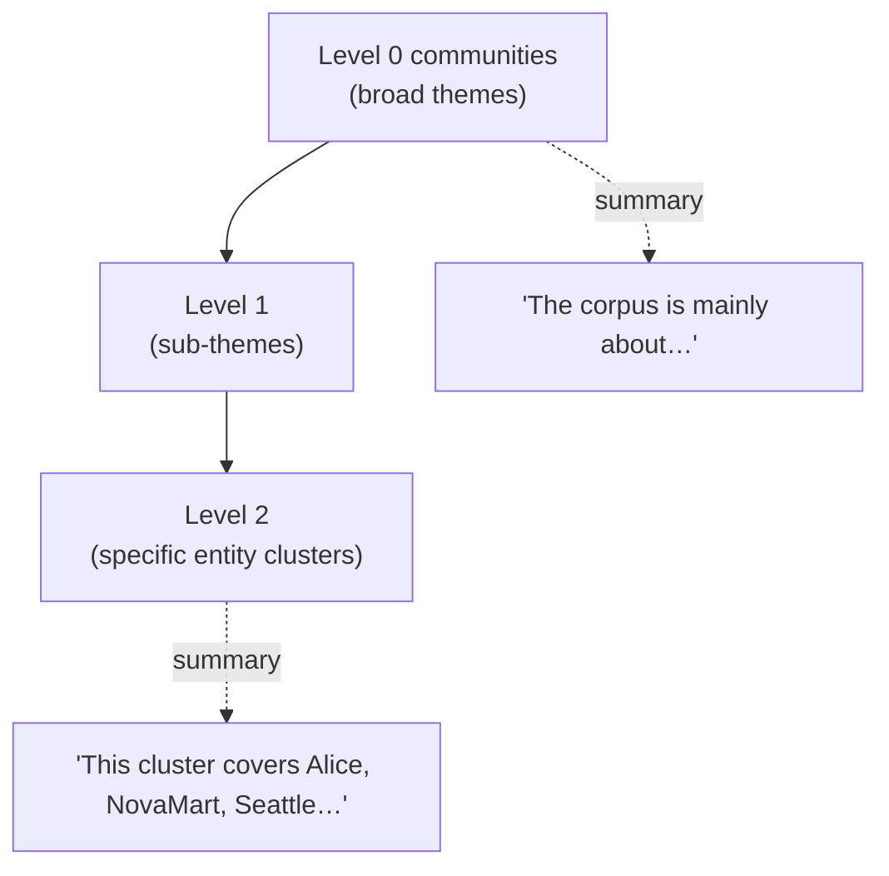

### Phase 2 — Querying: Local vs. Global search

GraphRAG's dual strategy matches the two hard question types from Section 4:

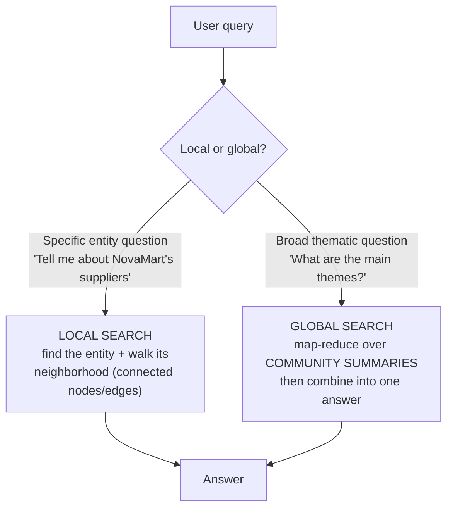

- **Local search** — for questions about a *specific entity*. Find that entity in the graph, then
  gather its **neighborhood** (its connected entities, relationships, and the source text) as
  context. This is the multi-hop workhorse.
- **Global search** — for *whole-corpus* questions. Don't search chunks at all; instead run
  **map-reduce over the community summaries**: each relevant community summary produces a partial
  answer, then those are combined into a final response. This is how GraphRAG answers "what are
  the overall themes?" — impossible for vector top-k.

> Microsoft's open-source release earned 20,000+ GitHub stars within months — it turned Graph RAG
> from a research idea into a mainstream paradigm.

---

## 7. The other frameworks: LightRAG, HippoRAG, Neo4j/Graphiti

Microsoft GraphRAG is powerful but **expensive to index**. Alternatives trade some capability for
speed, cost, or ecosystem fit.

### LightRAG — cheaper, faster, dual-level
- **Idea:** combine a (flatter) graph with vector representations and a **dual-level retrieval**:
  **low-level** (specific entities and their neighbors) + **high-level** (broader concepts/themes).
  Offers local, global, and hybrid retrieval modes.
- **Why people pick it:** delivers roughly **70–90% of GraphRAG's quality at ~1/100th the indexing
  cost** — it skips the heavy community-detection + hierarchical-summarization step. Best for
  **domain-specific Q&A where cost matters.**

### HippoRAG — brain-inspired, multi-hop via PageRank
- **Idea:** inspired by the human hippocampus / long-term memory. Build a KG offline, then at
  query time use **Personalized PageRank** — seed the graph with query-related concepts and let
  the ranking "spread" through connections to surface the relevant subgraph.
- **Why people pick it:** **training-free**, strong at **associative, multi-hop QA**. HippoRAG 2
  improves graph construction and retrieval further.

### Neo4j / Graphiti — the graph-database route
- **Idea:** use a real **graph database (Neo4j)** as the store. LLM- or rules-based NER/RE writes
  triples into Neo4j; you query with the graph query language and can bolt on a vector index for
  semantic search. **Graphiti** (Neo4j's framework) natively supports **hybrid graph+vector**
  retrieval and dynamic/temporal graphs.
- **Why people pick it:** production-grade storage, mature tooling, and native hybrid retrieval.

| Framework | Superpower | Trade-off |
|---|---|---|
| **Microsoft GraphRAG** | Best global/thematic answers; hierarchical summaries | Highest indexing cost |
| **LightRAG** | ~1/100th cost, fast, dual-level | Slightly lower quality; flatter graph |
| **HippoRAG** | Training-free multi-hop via PageRank | Less focused on global summarization |
| **Neo4j / Graphiti** | Real graph DB, native hybrid, temporal | You manage a database |

---

## 8. Hybrid RAG: graph + vector (the production sweet spot)

You rarely have to choose. **Hybrid RAG** runs **both**: vector search for fast semantic recall,
then graph traversal to expand with connected facts and reasoning.

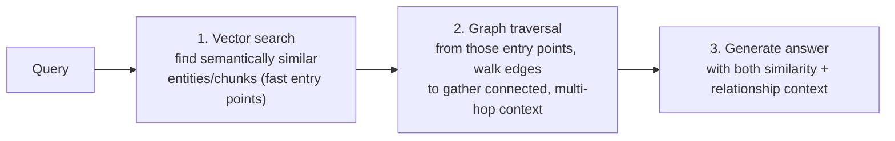

The pattern: **vectors find the *starting points* fast; the graph *expands* them into connected,
multi-hop context.** You get similarity recall *and* relationship reasoning *and* an auditable
path. This is why frameworks increasingly ship hybrid retrieval by default (LightRAG's hybrid
mode, Neo4j Graphiti, "HybridRAG").

---

## 9. When to choose Graph RAG (and when not to)

**Reach for Graph RAG / Hybrid when:**
- Questions require **multi-hop reasoning** (chaining facts across documents).
- You need **global/thematic** answers ("summarize everything about…", "what are the themes?").
- **Explainability / auditability** matters (finance, legal, medical) — you must show the
  reasoning path.
- The domain is **relationship-rich** (org charts, supply chains, citations, fraud/AML networks,
  medical ontologies).

**Stick with plain Vector RAG when:**
- Questions are mostly **single-fact lookups** ("what's the return window?").
- **Low latency and simple setup** are priorities.
- The corpus is small or the relationships between facts don't matter for your questions.
- You can't afford the graph-construction cost.

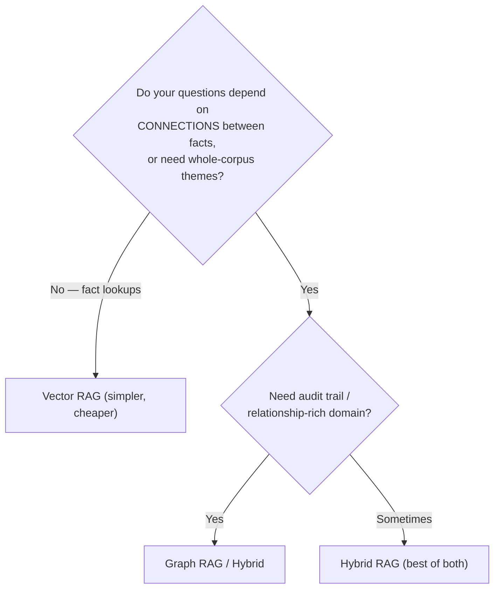

---

## 10. Applying it: from documents to a graph-powered answer

End to end, here's how Graph RAG slots in — note it's a **different indexing path** bolted onto
the same query→generate spirit you already know.

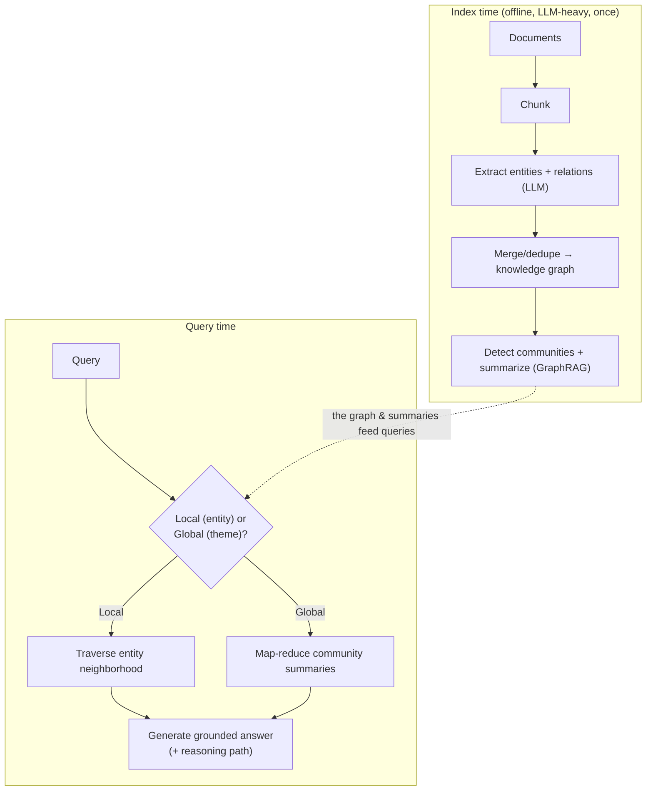

**Step by step:**
1. **Index (once):** chunk → LLM extracts triples → merge/dedupe into a graph → (optionally)
   detect communities and summarize them.
2. **Query:** decide if it's a **local** (specific entity) or **global** (thematic) question.
3. **Retrieve:** local → walk the entity's neighborhood; global → aggregate community summaries.
4. **Generate:** feed the graph-derived context to the LLM, ideally emitting the **reasoning path**
   for auditability.
5. **Evaluate** (tie to the Evaluation tier): multi-hop accuracy, plus the RAG Triad — graph
   context should *raise* groundedness and context relevance on connected questions.

> **Practical tip:** you don't have to hand-build any of this. Microsoft GraphRAG, LightRAG, and
> Neo4j/Graphiti provide the indexing + querying machinery; your job is choosing the framework,
> preparing the corpus, and tuning extraction prompts and the local/global routing.

---

## 11. Pitfalls, costs & trade-offs

- **Indexing is expensive.** LLM entity/relation extraction over a big corpus = many calls + time
  + money. This is Graph RAG's biggest cost — budget for it (LightRAG exists precisely to cut it).
- **Entity resolution is make-or-break.** If "NovaMart" and "Nova Mart Inc." aren't merged, your
  graph fragments and traversal breaks. Invest in the normalization/dedup step.
- **Extraction quality caps everything.** A wrong or missing triple is a wrong or missing fact.
  Garbage extraction → garbage graph. Prompt design and (optionally) an ontology to guide
  extraction matter a lot.
- **Higher query latency.** Graph traversal (and global map-reduce) is slower than a single vector
  lookup. Mind it for latency-sensitive apps.
- **Complexity.** More moving parts = more to build, monitor, and debug than vector RAG. Don't
  adopt it unless the question types justify it.
- **Staleness.** Graphs must be updated as documents change; temporal/dynamic graph frameworks
  (e.g. Graphiti) address this, but it's extra work.
- **It's not a silver bullet.** For simple fact lookups, Graph RAG is *slower and pricier* with no
  accuracy gain. Match the tool to the question.

---

## 12. Mastery checklist

You've mastered Graph RAG & knowledge graphs when you can, from memory:

- [ ] Explain the one-line difference: vectors know *meaning*, graphs know *relationships*.
- [ ] Define **entity, relation, triple `(h, r, t)`**, node, and edge — and draw a small KG.
- [ ] Describe the LLM pipeline to build a KG from text (chunk → NER → RE → **aggregate/dedupe** → graph).
- [ ] Explain why **entity resolution/normalization** is the crucial step.
- [ ] Explain the two question types vector RAG fails at: **multi-hop** and **global/thematic**.
- [ ] Walk a multi-hop question across a graph's edges by hand.
- [ ] Compare Graph RAG vs. Vector RAG on accuracy, cost, latency, explainability.
- [ ] Explain **Microsoft GraphRAG** indexing: TextUnits → extraction → graph → **Leiden communities** → community summaries.
- [ ] Explain **local search** (entity neighborhood) vs. **global search** (map-reduce over community summaries).
- [ ] Summarize **LightRAG** (cheap, dual-level), **HippoRAG** (Personalized PageRank, memory-inspired), and **Neo4j/Graphiti** (graph DB, hybrid).
- [ ] Explain **Hybrid RAG**: vectors find entry points, the graph expands them.
- [ ] Decide, for a given use case, whether to use Vector, Graph, or Hybrid RAG.

If you can do all of these, you understand the retrieval paradigm most teams adopt too late — and
you can tell when the extra cost of a graph actually buys you accuracy. **This completes Tier 6.**

---

## Sources

- [Project GraphRAG — Microsoft Research](https://www.microsoft.com/en-us/research/project/graphrag/)
- [How Microsoft GraphRAG Works Step-By-Step — Bertelsmann Tech](https://tech.bertelsmann.com/en/blog/articles/how-microsoft-graphrag-works-step-by-step-part-12)
- [GraphRAG: Microsoft's Global-Local Dual Search Strategy — SOTAAZ](https://blog.sotaaz.com/post/graphrag-microsoft-en)
- [What is GraphRAG? — IBM](https://www.ibm.com/think/topics/graphrag)
- [GraphRAG vs. Vector RAG: Side-by-side comparison — Meilisearch](https://www.meilisearch.com/blog/graph-rag-vs-vector-rag)
- [How GraphRAG Improves Multi-Hop Reasoning — SingleStore](https://www.singlestore.com/blog/rethinking-rag-how-graphrag-improves-multi-hop-reasoning-/)
- [Building Knowledge Graphs from Text: A Complete Guide with LLMs — Medium](https://ssahuupgrad-93226.medium.com/building-knowledge-graphs-from-text-a-complete-guide-with-llms-02be1b0bce64)
- [LightRAG: Simple and Fast Alternative to GraphRAG — LearnOpenCV](https://learnopencv.com/lightrag/)
- [Graph RAG in 2026: What Works in Production (GraphRAG vs LightRAG vs Neo4j Graphiti) — Paperclipped](https://www.paperclipped.de/en/blog/graph-rag-production/)
- [Why HybridRAG: Combining Vector Embeddings with Knowledge Graphs — Memgraph](https://memgraph.com/blog/why-hybridrag)
- [GraphRAG field guide: Navigating advanced RAG patterns — Neo4j](https://neo4j.com/blog/developer/graphrag-field-guide-rag-patterns/)
