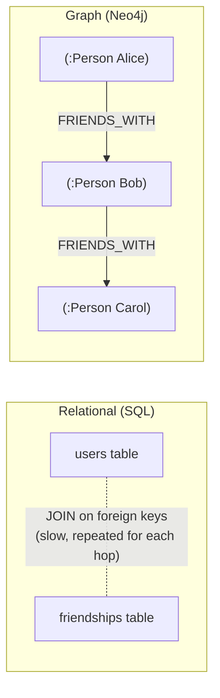
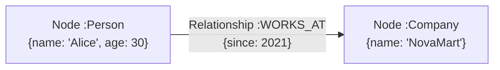
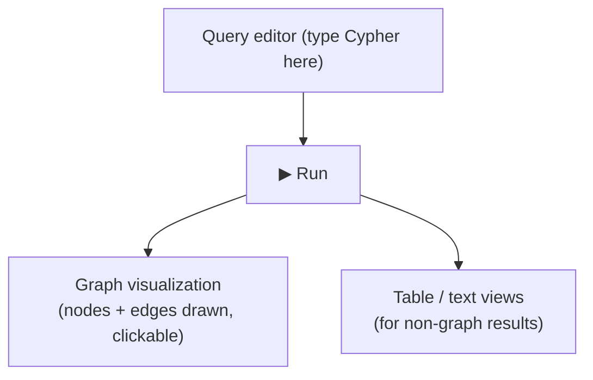
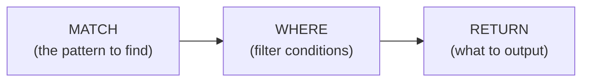
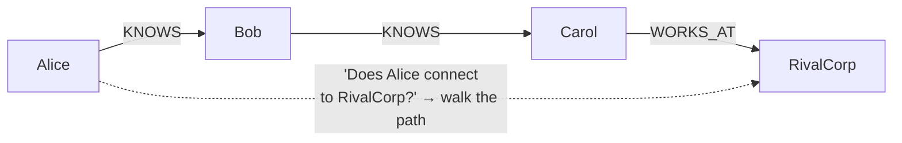
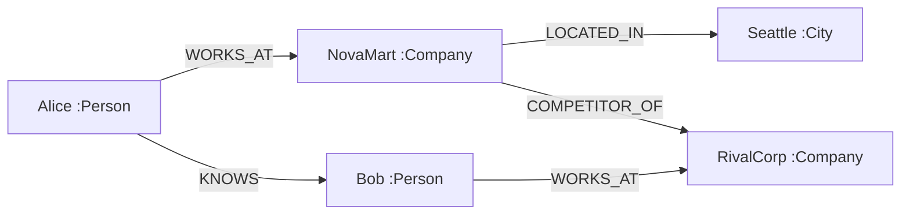
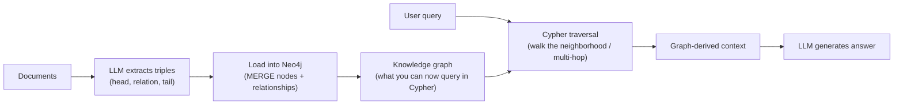

# Neo4j — The Graph Database, From Zero to Graph RAG (Beginner → Advanced)

> To *explore* knowledge graphs and Graph RAG hands-on, you first need a place to **store and
> query a graph** — and to *see* it. That's **Neo4j**: the most popular graph database, with a
> free open-source **Community Edition** and a visual browser where your nodes and edges light up
> as you query them.
>
> This is a **learning + reference document** (no code to run here, no installs performed). It
> explains what Neo4j is, how it works, how to get it running, and its query language **Cypher**
> from the first `CREATE` to the multi-hop traversals that power Graph RAG. Work top to bottom the
> first time; use the cheat sheet (§10) as a reference afterwards.
>
> **Why learn this before diving into Microsoft GraphRAG:** GraphRAG assumes you already
> understand nodes, edges, and traversal. Neo4j makes those *tangible* — you write a query and
> literally watch the graph. Learn the substrate first; the fancy pipeline makes sense afterward.
> (See the sibling [`../Introduction.md`](../Introduction.md) for the Graph RAG theory.)

---

## Table of Contents

1. [What Neo4j is (and why a graph database)](#1-what-neo4j-is-and-why-a-graph-database)
2. [The data model: nodes, relationships, properties, labels](#2-the-data-model-nodes-relationships-properties-labels)
3. [Community Edition vs. the paid editions (what's free)](#3-community-edition-vs-the-paid-editions-whats-free)
4. [How to get Neo4j running (your options)](#4-how-to-get-neo4j-running-your-options)
5. [Neo4j Browser — your visual playground](#5-neo4j-browser--your-visual-playground)
6. [Cypher basics: CREATE, MATCH, RETURN](#6-cypher-basics-create-match-return)
7. [Relationships & pattern matching (the ASCII-art idea)](#7-relationships--pattern-matching-the-ascii-art-idea)
8. [MERGE, UPDATE, DELETE — changing the graph safely](#8-merge-update-delete--changing-the-graph-safely)
9. [Multi-hop traversal — the reason graphs exist](#9-multi-hop-traversal--the-reason-graphs-exist)
10. [Cypher cheat sheet (quick reference)](#10-cypher-cheat-sheet-quick-reference)
11. [A complete worked example: the NovaMart mini-graph](#11-a-complete-worked-example-the-novamart-mini-graph)
12. [Loading data at scale: LOAD CSV & indexes](#12-loading-data-at-scale-load-csv--indexes)
13. [Advanced: indexes, constraints, and performance](#13-advanced-indexes-constraints-and-performance)
14. [From Neo4j to Graph RAG (tying it together)](#14-from-neo4j-to-graph-rag-tying-it-together)
15. [Mastery checklist](#15-mastery-checklist)
16. [Sources](#sources)

---

## 1. What Neo4j is (and why a graph database)

**Neo4j is a database that stores data as a *graph*** — nodes (things) connected by relationships
(how they relate) — instead of tables with rows and columns.

In a **relational database (SQL)**, to answer *"friends of my friends"* you write painful,
repeated **JOINs** across a table — and it gets exponentially slower with each hop. In a **graph
database**, relationships are **first-class citizens stored directly** on disk, so "follow the
edge" is a cheap pointer hop. This is called **index-free adjacency**, and it's why graph
databases stay fast on deeply connected, multi-hop queries.



> **One-line idea:** *SQL stores rows and computes relationships at query time; Neo4j stores the
> relationships themselves, so traversing them is native and fast.*

---

## 2. The data model: nodes, relationships, properties, labels

Four concepts are the entire model. Learn these and Cypher becomes obvious.

| Concept | What it is | Example |
|---|---|---|
| **Node** | An entity/thing | a Person, a Company |
| **Label** | A "type" tag on a node (starts with `:`) | `:Person`, `:Company` |
| **Relationship** | A **directed, typed** edge between two nodes | `[:WORKS_AT]`, `[:KNOWS]` |
| **Property** | A key–value attribute on a node *or* a relationship | `name: "Alice"`, `since: 2021` |



Notes that trip up beginners:
- A node can have **multiple labels** (e.g. `:Person:Employee`).
- Relationships are **always directed** when created (they have a start and end), but you can
  *query* them ignoring direction.
- **Both** nodes and relationships can carry properties. (`WORKS_AT {since: 2021}` — the "since"
  lives on the edge, not the node.)

---

## 3. Community Edition vs. the paid editions (what's free)

Yes — Neo4j has a **free, open-source Community Edition (CE)**, which is all you need for learning
and small projects.

| | **Community Edition (free, open source)** | **Enterprise Edition (paid)** |
|---|---|---|
| Cost | Free (GPLv3) | Commercial license |
| Full graph + Cypher | ✅ | ✅ |
| Neo4j Browser + visualization | ✅ | ✅ |
| Databases per instance | **One** user database | Many |
| Clustering / high availability | ❌ | ✅ |
| Advanced security (RBAC, fine-grained) | ❌ | ✅ |
| Hot backups, advanced monitoring | ❌ | ✅ |

Other free ways to use Neo4j:
- **Neo4j Desktop** — a free local app that bundles the database + Browser + tooling (great for
  beginners on Windows/Mac).
- **Neo4j AuraDB Free** — a free hosted cloud instance (no install at all).
- **Neo4j Sandbox** — free, temporary, browser-only instances pre-loaded with example datasets —
  the fastest way to *try* Cypher with zero setup.

> **For learning, start with a Sandbox or AuraDB Free (nothing to install), or Docker CE if you
> want it local.** You do **not** need Enterprise for anything in this document.

---

## 4. How to get Neo4j running (your options)

You don't have to run anything now — this is reference. When you're ready, easiest → most control:

**Option A — Neo4j Sandbox (zero install):** go to the Neo4j Sandbox site, pick a blank or example
project, and you get a browser with a live database. Best for a first hour.

**Option B — Neo4j Desktop (local app):** download and install; it manages the database and opens
Browser for you. Good for ongoing local learning.

**Option C — Docker (Community Edition, local, reproducible):** the standard way developers run CE
locally. The official image on Docker Hub ships CE (tags with no suffix, e.g. `neo4j:2026.05.0`):

```bash
# Illustrative only — do not run unless you have Docker and want a local instance.
docker run \
  --publish=7474:7474 --publish=7687:7687 \
  --env NEO4J_AUTH=neo4j/your_password \
  neo4j:2026.05.0
```

- Port **7474** = the **Neo4j Browser** (the web UI) → open `http://localhost:7474`.
- Port **7687** = the **Bolt** protocol (how apps/drivers like Python connect).
- `NEO4J_AUTH=neo4j/your_password` sets the initial login (default username is always `neo4j`).

> **Two ports, two purposes:** humans use **7474** (Browser); programs use **7687** (Bolt driver).
> Remember this — it's the #1 source of "why can't I connect?" confusion.

---

## 5. Neo4j Browser — your visual playground

The **Neo4j Browser** (at `http://localhost:7474`) is where learning happens. You type a Cypher
query in the top bar, hit run, and it **draws the resulting nodes and edges** as an interactive
graph you can drag around and click.



Useful browser commands (typed in the same bar, they start with `:`):
- `:play start` — an interactive getting-started guide.
- `:help` — help topics.
- `:schema` — see your labels, relationship types, indexes, and constraints.
- `:clear` — clear the result stream.

This visual feedback loop — *write a query → see the graph* — is exactly the intuition that makes
Graph RAG click later.

---

## 6. Cypher basics: CREATE, MATCH, RETURN

**Cypher** is Neo4j's query language. Its big idea: you **draw the pattern you want using
ASCII-art**, and Cypher finds or creates it. Nodes are in `()`, relationships in `[]`, direction
with `-->`.

### CREATE — make nodes

```cypher
// Create a single node with a label and properties
CREATE (a:Person {name: 'Alice', age: 30})

// Create several at once
CREATE (b:Person {name: 'Bob'}), (n:Company {name: 'NovaMart'})
```

### MATCH … RETURN — find and show

`MATCH` describes a pattern to find; `RETURN` says what to give back. (Think SQL's `SELECT … FROM
… WHERE`, but visual.)

```cypher
// Find all Person nodes, return them
MATCH (p:Person)
RETURN p

// Find one person by property
MATCH (p:Person {name: 'Alice'})
RETURN p.name, p.age
```

### WHERE — filter

```cypher
MATCH (p:Person)
WHERE p.age > 25
RETURN p.name
```

### Anatomy of a query



Other clauses you'll use constantly: `ORDER BY`, `LIMIT`, `SKIP`, `WITH` (to chain query parts),
`COUNT()`/`COLLECT()` (aggregation).

---

## 7. Relationships & pattern matching (the ASCII-art idea)

The whole point of a graph is the **relationships**. In Cypher a relationship is `-[:TYPE]->`.

### Create a relationship between existing nodes

```cypher
// Find Alice and NovaMart, then connect them
MATCH (a:Person {name: 'Alice'}), (n:Company {name: 'NovaMart'})
CREATE (a)-[:WORKS_AT {since: 2021}]->(n)
```

### Match across a relationship

```cypher
// Who works at NovaMart?
MATCH (p:Person)-[:WORKS_AT]->(c:Company {name: 'NovaMart'})
RETURN p.name
```

Read the pattern like a sentence: *"a Person, who WORKS_AT, a Company named NovaMart."* That's the
"ASCII-art" philosophy — the query **looks like the graph**.

### Direction matters (but you can ignore it when querying)

```cypher
(a)-[:KNOWS]->(b)   // directed: a knows b
(a)-[:KNOWS]-(b)    // undirected match: either direction
(a)-[:KNOWS]->()    // b is anonymous — we don't care who, just that a knows someone
```

---

## 8. MERGE, UPDATE, DELETE — changing the graph safely

### MERGE — "get or create" (avoid duplicates)

`CREATE` **always** makes a new node — run it twice and you get two Alices. `MERGE` **finds the
pattern if it exists, or creates it if it doesn't** — your safeguard against duplicate entities
(exactly the entity-resolution problem from the Graph RAG doc).

```cypher
// Won't create a second Alice if one already exists
MERGE (a:Person {name: 'Alice'})

// Common pattern: match/merge nodes first, then merge the relationship
MERGE (a:Person {name: 'Alice'})
MERGE (n:Company {name: 'NovaMart'})
MERGE (a)-[:WORKS_AT]->(n)
```

> **Use MERGE deliberately.** It's powerful but more expensive than CREATE, and it matches on
> *all* the properties you specify — `MERGE (a:Person {name:'Alice', age:30})` is a different
> match than `MERGE (a:Person {name:'Alice'})`. For safe upserts, merge on a **unique key** only,
> then set other properties with `SET`.

### SET — update properties

```cypher
MATCH (p:Person {name: 'Alice'})
SET p.age = 31, p.city = 'Seattle'
RETURN p
```

### DELETE / DETACH DELETE — remove

```cypher
// Delete a node — FAILS if it still has relationships
MATCH (p:Person {name: 'Bob'})
DELETE p

// DETACH DELETE removes the node AND its relationships (the safe way)
MATCH (p:Person {name: 'Bob'})
DETACH DELETE p

// Wipe the whole graph (careful!)
MATCH (n) DETACH DELETE n
```

---

## 9. Multi-hop traversal — the reason graphs exist

This is the payoff — the queries that are trivial in Neo4j and painful in SQL, and *exactly* what
Graph RAG relies on.

### Two hops

```cypher
// Friends of Alice's friends
MATCH (a:Person {name: 'Alice'})-[:KNOWS]->(friend)-[:KNOWS]->(fof)
RETURN DISTINCT fof.name
```

### Variable-length paths (1 to N hops)

The `*` lets you traverse an unknown number of hops — the graph's superpower:

```cypher
// Anyone Alice can reach through 1 to 3 KNOWS hops
MATCH (a:Person {name: 'Alice'})-[:KNOWS*1..3]->(reachable)
RETURN DISTINCT reachable.name
```

### Shortest path

```cypher
MATCH p = shortestPath(
  (a:Person {name: 'Alice'})-[:KNOWS*]-(z:Person {name: 'Zoe'})
)
RETURN p
```



A question like *"Is Alice connected to anyone at RivalCorp, and how?"* is **one Cypher pattern**.
In SQL it's a nightmare of recursive JOINs. This is the entire reason Graph RAG can do multi-hop
reasoning that vector RAG can't.

---

## 10. Cypher cheat sheet (quick reference)

| Task | Cypher |
|---|---|
| Create node | `CREATE (a:Person {name:'Alice'})` |
| Find all of a label | `MATCH (p:Person) RETURN p` |
| Find by property | `MATCH (p:Person {name:'Alice'}) RETURN p` |
| Filter | `MATCH (p:Person) WHERE p.age > 25 RETURN p` |
| Create relationship | `MATCH (a),(b) ... CREATE (a)-[:KNOWS]->(b)` |
| Match across relationship | `MATCH (a)-[:WORKS_AT]->(c) RETURN a,c` |
| Get-or-create (no dupes) | `MERGE (a:Person {name:'Alice'})` |
| Update properties | `SET p.age = 31` |
| Delete node + edges | `DETACH DELETE p` |
| Count | `MATCH (p:Person) RETURN count(p)` |
| Aggregate into a list | `... RETURN collect(p.name)` |
| Limit / sort | `... RETURN p ORDER BY p.age DESC LIMIT 10` |
| Chain query parts | `MATCH ... WITH ... MATCH ...` |
| Multi-hop | `MATCH (a)-[:KNOWS*1..3]->(b)` |
| Shortest path | `shortestPath((a)-[:KNOWS*]-(b))` |
| Show schema | `:schema` (browser) or `SHOW INDEXES` |
| Load CSV | `LOAD CSV WITH HEADERS FROM 'file:///x.csv' AS row` |

---

## 11. A complete worked example: the NovaMart mini-graph

Here's an end-to-end script you can paste into the Neo4j Browser to build and query a tiny graph —
the same NovaMart world from your RAG examples.

```cypher
// 1) Build the graph (MERGE = safe to re-run without duplicates)
MERGE (alice:Person {name: 'Alice'})
MERGE (bob:Person   {name: 'Bob'})
MERGE (nova:Company  {name: 'NovaMart'})
MERGE (rival:Company {name: 'RivalCorp'})
MERGE (seattle:City  {name: 'Seattle'})

MERGE (alice)-[:WORKS_AT {since: 2021}]->(nova)
MERGE (bob)-[:WORKS_AT   {since: 2019}]->(rival)
MERGE (alice)-[:KNOWS]->(bob)
MERGE (nova)-[:LOCATED_IN]->(seattle)
MERGE (nova)-[:COMPETITOR_OF]->(rival);

// 2) Simple lookup: who works at NovaMart?
MATCH (p:Person)-[:WORKS_AT]->(:Company {name: 'NovaMart'})
RETURN p.name;

// 3) The multi-hop question vector RAG can't do:
//    "Does anyone at NovaMart know someone at a competitor?"
MATCH (p1:Person)-[:WORKS_AT]->(c1:Company {name: 'NovaMart'})
MATCH (c1)-[:COMPETITOR_OF]->(c2:Company)
MATCH (p1)-[:KNOWS]->(p2:Person)-[:WORKS_AT]->(c2)
RETURN p1.name AS insider, p2.name AS contact, c2.name AS competitor;
```

Query 3 returns `Alice → Bob → RivalCorp` — the graph walked four relationships to connect the
dots. **That traversal is the essence of Graph RAG.**



---

## 12. Loading data at scale: LOAD CSV & indexes

For more than a handful of nodes, don't hand-write CREATEs — bulk-load from CSV:

```cypher
// Loads rows from a CSV and MERGEs a node per row
LOAD CSV WITH HEADERS FROM 'file:///people.csv' AS row
MERGE (p:Person {name: row.name})
SET p.age = toInteger(row.age);
```

- `WITH HEADERS` treats the first line as column names (`row.name`, `row.age`).
- CSV values are strings — cast with `toInteger()`, `toFloat()`, `date()`, etc.
- For big files, wrap in `CALL { ... } IN TRANSACTIONS` (batches) so you don't blow memory.
- This is exactly how you'd load LLM-extracted triples (`head, relation, tail`) into a graph for
  Graph RAG.

---

## 13. Advanced: indexes, constraints, and performance

As graphs grow, two things keep queries fast and data clean:

**Indexes** — speed up finding nodes by a property (like SQL indexes):

```cypher
CREATE INDEX person_name IF NOT EXISTS FOR (p:Person) ON (p.name);
```

**Uniqueness constraints** — enforce that a property is unique (and auto-create an index). This is
your database-level guard against duplicate entities:

```cypher
CREATE CONSTRAINT unique_person IF NOT EXISTS
FOR (p:Person) REQUIRE p.name IS UNIQUE;
```

Performance tips:
- **Always index the properties you `MATCH`/`MERGE` on** — without an index, `MERGE` scans every
  node of that label (slow, and gets slower as data grows).
- Use `PROFILE <query>` or `EXPLAIN <query>` in the Browser to see the execution plan and spot
  full scans.
- `MERGE` on a **unique key only**, then `SET` other properties — merging on many properties can
  accidentally create duplicates.
- Prefer `DETACH DELETE` over `DELETE` when a node may still have relationships.

---

## 14. From Neo4j to Graph RAG (tying it together)

Everything above is the substrate. Here's the bridge to the Graph RAG theory in
[`../Introduction.md`](../Introduction.md):



- The **triples** an LLM extracts (Introduction §3) become `MERGE (h)-[:REL]->(t)` statements.
- **Entity resolution** (the crucial dedup step) is enforced with `MERGE` + a **uniqueness
  constraint**.
- **Local search** (an entity's neighborhood) is a Cypher `MATCH (e)-[*1..2]-(neighbor)`.
- **Multi-hop reasoning** is a variable-length path query (§9).
- Official tooling — the **`neo4j-graphrag` Python package** and **LangChain + Neo4j** — wraps all
  this so you can build Graph RAG on Neo4j without writing every Cypher query by hand. But now you
  *understand* what those tools do under the hood.

> **Suggested next hands-on step:** extract triples from your NovaMart CSV with your OpenAI key,
> `MERGE` them into a local Neo4j (Docker CE or a free Sandbox), and re-ask the multi-hop question
> from §11. That single exercise turns all this theory into intuition.

---

## 15. Mastery checklist

You can *explore* Neo4j confidently when you can, from memory:

- [ ] Explain why a graph DB beats SQL for multi-hop queries (index-free adjacency).
- [ ] Define node, label, relationship, property — and know both nodes *and* edges hold properties.
- [ ] Say what Community Edition gives you for free (and its one-database limit).
- [ ] Name three ways to run Neo4j (Sandbox, Desktop, Docker CE) and what ports 7474 vs. 7687 are for.
- [ ] Write `CREATE`, `MATCH … WHERE … RETURN` from memory.
- [ ] Create and match a relationship using the `-[:TYPE]->` ASCII-art syntax.
- [ ] Explain `MERGE` vs. `CREATE` and why MERGE prevents duplicate entities.
- [ ] Update with `SET`, remove with `DETACH DELETE`.
- [ ] Write a two-hop and a variable-length (`*1..3`) traversal.
- [ ] Bulk-load with `LOAD CSV` and add an index + uniqueness constraint.
- [ ] Explain how LLM-extracted triples + `MERGE` build a knowledge graph for Graph RAG.

If you can do these, you can build, query, and *see* a knowledge graph — the foundation for
everything in the Graph RAG tier, and the right thing to learn *before* Microsoft GraphRAG.

---

## Sources

- [Neo4j Docker — Operations Manual (official)](https://neo4j.com/docs/operations-manual/current/docker/introduction/)
- [Getting Started with Neo4j: Installation and Setup — KDnuggets](https://www.kdnuggets.com/getting-started-with-neo4j-installation-and-setup-guide)
- [Cypher: The Neo4j Query Language Decoded for Beginners — Neo4j](https://neo4j.com/blog/developer/cypher-decoded-for-beginners/)
- [Basic queries — Cypher Manual (official)](https://neo4j.com/docs/cypher-manual/current/queries/basic/)
- [Cypher Cheat Sheet — Neo4j Documentation (official)](https://neo4j.com/docs/cypher-cheat-sheet/current/)
- [Neo4j Cheat Sheet & Quick Reference — QuickRef](https://quickref.me/neo4j.html)
- [How to Run Neo4j in Docker for Graph Databases — OneUptime](https://oneuptime.com/blog/post/2026-02-08-how-to-run-neo4j-in-docker-for-graph-databases/view)
