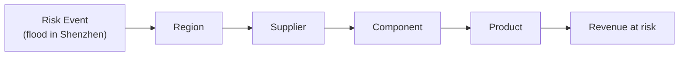
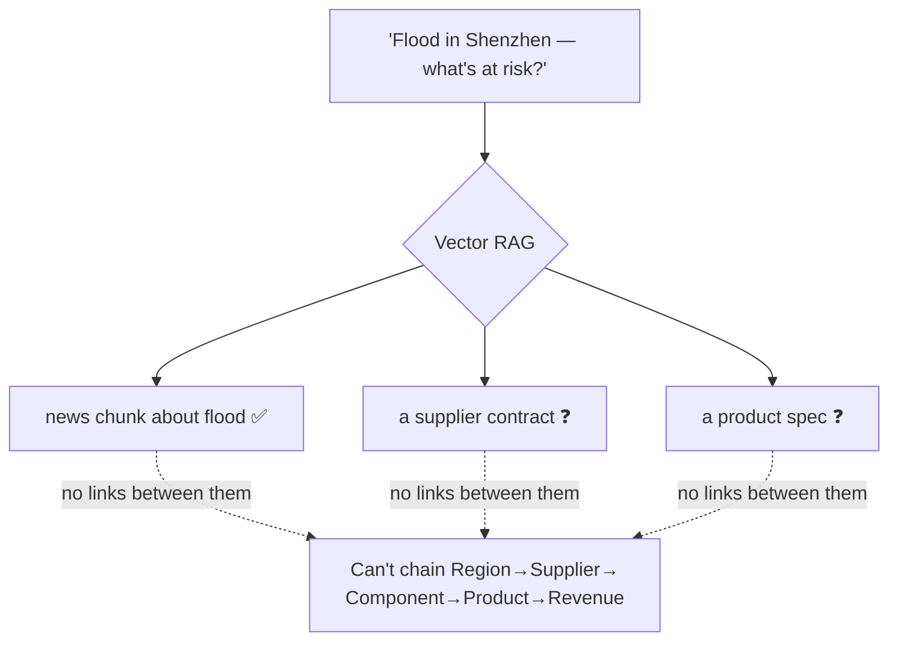
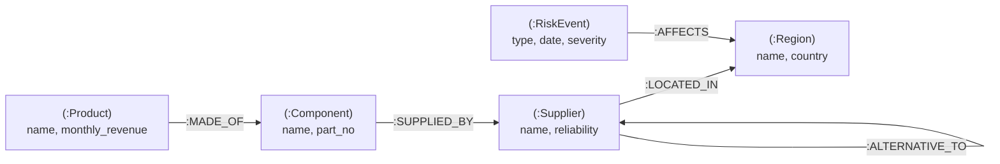
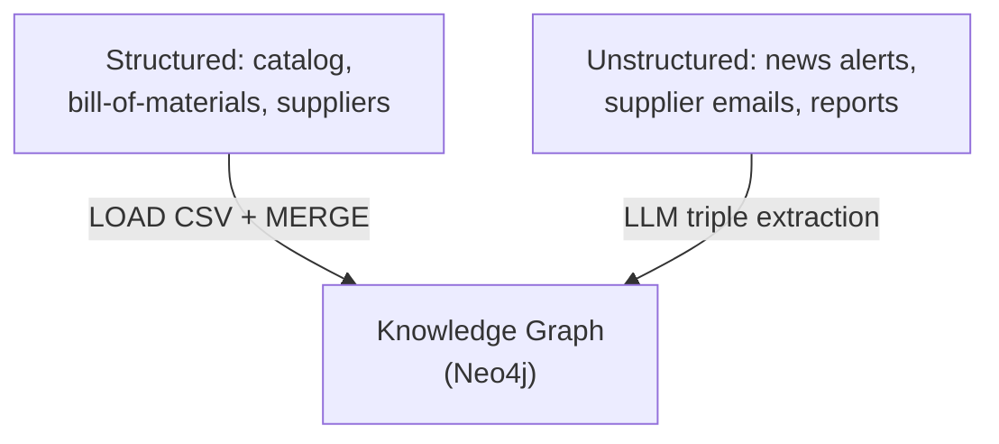
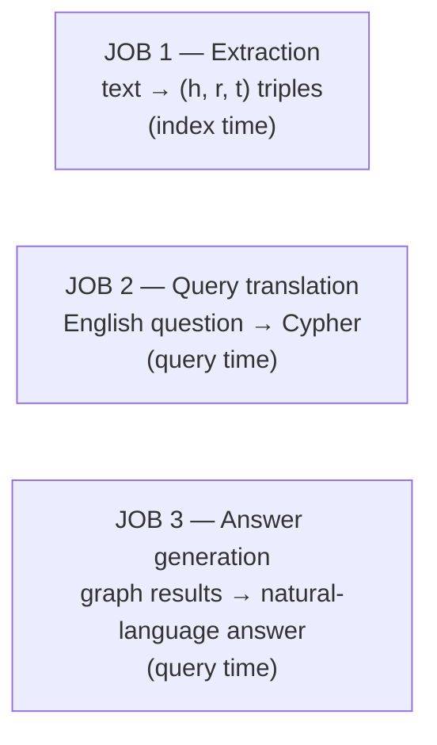
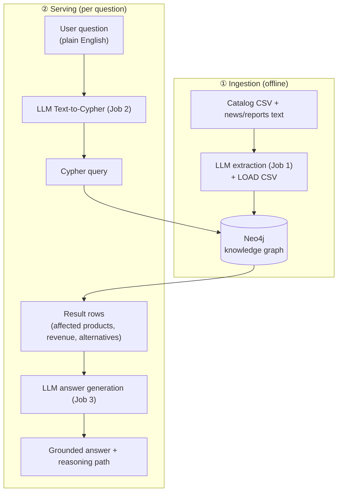
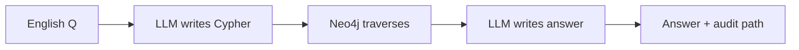
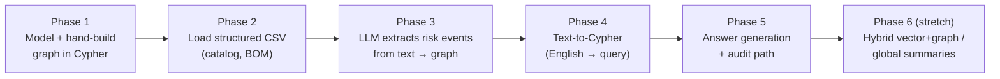

# Sample Project — "NovaMart Supply-Chain Risk Intelligence" (Graph RAG Architecture)

> This is a **blueprint**, not code. It describes one realistic business scenario where Graph RAG
> genuinely beats vector RAG, and lays out the *architecture* so you can read it, understand every
> moving piece, and then start building it hands-on.
>
> We deliberately pick a problem that is **impossible for vector RAG** — one where the answer lives
> in the *connections between* many facts, not in any single document. That's the whole point of
> using a graph. Everything ties back to the concepts in
> [`../Introduction.md`](../Introduction.md) (Graph RAG theory) and
> [`./neo4j.md`](./neo4j.md) (Neo4j + Cypher).

---

## Table of Contents

1. [The scenario (the business problem)](#1-the-scenario-the-business-problem)
2. [Why vector RAG fails here](#2-why-vector-rag-fails-here)
3. [The graph model (schema)](#3-the-graph-model-schema)
4. [Where the data comes from](#4-where-the-data-comes-from)
5. [Where the LLM is used (three distinct jobs)](#5-where-the-llm-is-used-three-distinct-jobs)
6. [End-to-end architecture](#6-end-to-end-architecture)
7. [The query lifecycle (step by step)](#7-the-query-lifecycle-step-by-step)
8. [Example questions & how the graph solves them](#8-example-questions--how-the-graph-solves-them)
9. [Tech stack](#9-tech-stack)
10. [Build roadmap (phases you can actually do)](#10-build-roadmap-phases-you-can-actually-do)
11. [How we'll know it works (evaluation)](#11-how-well-know-it-works-evaluation)
12. [Stretch goals](#12-stretch-goals)

---

## 1. The scenario (the business problem)

**NovaMart** is our online store. It sells **products**, each assembled from **components**, each
sourced from **suppliers**, who operate in **regions**. Regions occasionally suffer **risk events**
(floods, port strikes, factory fires, geopolitical bans).

The operations team keeps asking questions that **span all of these layers at once**:

> *"A flood just hit the Shenzhen region. Which of our products are at risk, which suppliers are
> involved, how much monthly revenue is exposed, and do we have an alternative supplier for those
> components?"*

That single question hops across **five entity types** (Region → Supplier → Component → Product →
Revenue) and needs the *relationships* between them. No single document contains the answer — it
has to be **assembled by traversing connections**. That's a textbook Graph RAG problem.



---

## 2. Why vector RAG fails here

Put every supplier contract, product spec, and news alert into a vector store and ask the flood
question. Vector RAG will:

- retrieve the **few chunks most textually similar** to "flood Shenzhen" — probably the news alert
  and maybe one supplier doc,
- have **no way to follow** "this supplier → makes which components → used in which products →
  worth how much revenue,"
- and **lose the thread after 1–2 hops**, returning a vague summary instead of the exact affected
  product list + revenue number.



Graph RAG instead **walks the exact path** and returns a precise, auditable answer. This contrast
is the entire justification for the project.

---

## 3. The graph model (schema)

The heart of the project. Five node types (labels) and the relationships between them:



| Node label | Key properties | Meaning |
|---|---|---|
| `:Product` | `name`, `monthly_revenue`, `sku` | Something NovaMart sells |
| `:Component` | `name`, `part_no` | A part that goes into products |
| `:Supplier` | `name`, `reliability_score` | Who provides components |
| `:Region` | `name`, `country` | Where suppliers operate |
| `:RiskEvent` | `type`, `date`, `severity` | A disruption (flood, strike…) |

| Relationship | Reads as |
|---|---|
| `(:Product)-[:MADE_OF]->(:Component)` | a product is made of a component |
| `(:Component)-[:SUPPLIED_BY]->(:Supplier)` | a component is supplied by a supplier |
| `(:Supplier)-[:LOCATED_IN]->(:Region)` | a supplier operates in a region |
| `(:RiskEvent)-[:AFFECTS]->(:Region)` | an event affects a region |
| `(:Supplier)-[:ALTERNATIVE_TO]->(:Supplier)` | one supplier can substitute for another |

> **This schema *is* the project.** Designing it well is 80% of the work — it decides which
> questions are answerable. (In Graph RAG terms, this is your **ontology**; the teams that succeed
> spend real time here before writing retrieval code.)

---

## 4. Where the data comes from

Two ingestion paths feed the same graph:

1. **Structured data (the easy part):** product catalog, bill-of-materials, and supplier lists
   probably already exist as **CSV / database tables**. These load straight into Neo4j with
   `LOAD CSV` + `MERGE` (see [`neo4j.md` §12](./neo4j.md#12-loading-data-at-scale-load-csv--indexes)).
   No LLM needed — the relationships are already explicit.

2. **Unstructured data (where the LLM earns its keep):** news alerts, supplier emails, and risk
   reports are **free text**. Here an **LLM extracts triples** — e.g. from *"Heavy flooding shut
   ports across Shenzhen this week"* it extracts `(RiskEvent{type:flood}) -[:AFFECTS]-> (Region{name:Shenzhen})`.



---

## 5. Where the LLM is used (three distinct jobs)

A common beginner confusion is "where does the AI actually go?" In this project the LLM does
**three separate jobs** — keep them distinct:



1. **Extraction (index time):** turn unstructured text into graph triples to build/enrich the KG.
2. **Query translation / "Text-to-Cypher" (query time):** convert the user's plain-English question
   into a Cypher traversal. *(This is the clever core — the LLM writes the graph query.)*
3. **Answer generation (query time):** take the raw rows the graph returns and phrase a clear,
   grounded answer for the user.

> Jobs 2 and 3 are the retrieval-augmented loop; Job 1 is the offline graph-building loop.

---

## 6. End-to-end architecture

Putting it all together:



Optional **hybrid** upgrade (best of both worlds): add a vector index so vague/fuzzy questions
first do a **vector search to find the right starting entities**, then the **graph traversal
expands** from there. (Covered as a stretch goal in §12.)

---

## 7. The query lifecycle (step by step)

Trace the flood question through the system:

1. **User asks** (English): *"A flood hit Shenzhen — which products are at risk and how much revenue?"*
2. **LLM → Cypher (Job 2):** the LLM, given the schema, writes a traversal like:
   ```cypher
   MATCH (e:RiskEvent {type:'flood'})-[:AFFECTS]->(r:Region {name:'Shenzhen'})
   MATCH (s:Supplier)-[:LOCATED_IN]->(r)
   MATCH (c:Component)-[:SUPPLIED_BY]->(s)
   MATCH (p:Product)-[:MADE_OF]->(c)
   RETURN p.name AS product,
          sum(p.monthly_revenue) AS revenue_at_risk,
          collect(DISTINCT s.name) AS suppliers
   ORDER BY revenue_at_risk DESC;
   ```
3. **Neo4j executes** the traversal and returns exact rows (products, revenue, suppliers).
4. **LLM → answer (Job 3):** turns rows into: *"3 products are exposed (~$48k/month): AuroraBook,
   PulseBuds… supplied by ShenzhenParts Co. An alternative supplier (GuangzhouTech) exists for the
   battery component."*
5. **(Optional) return the Cypher + path** as the **audit trail** — a key Graph RAG advantage.



---

## 8. Example questions & how the graph solves them

The project is "done" when it can answer questions like these — each showcasing a different graph
strength:

| # | Question | Graph strength shown | Traversal |
|---|---|---|---|
| 1 | "What products are at risk from the Shenzhen flood?" | **Multi-hop** | Region→Supplier→Component→Product |
| 2 | "Which single supplier, if lost, hurts the most revenue?" | **Aggregation over paths** | Supplier→Component→Product, sum revenue |
| 3 | "For at-risk components, is there an alternative supplier?" | **Relationship lookup** | Component→Supplier→`:ALTERNATIVE_TO` |
| 4 | "Which products depend on a *single* supplier (no backup)?" | **Structural query** | count suppliers per component |
| 5 | "Summarize our overall supply-chain risk exposure." | **Global/thematic** | community summaries (GraphRAG-style) |

Questions 1–4 are **local/traversal** queries (Neo4j + Cypher shine). Question 5 is a **global**
query — the place you'd later layer **Microsoft GraphRAG's community summaries** on top of the same
Neo4j graph.

---

## 9. Tech stack

Deliberately close to what you already have running, so setup is minimal:

| Layer | Choice | Why |
|---|---|---|
| **Graph store** | **Neo4j Community Edition** (Docker or Sandbox) | Free, visual, teaches the fundamentals |
| **LLM** | **OpenAI** (your existing key) | Extraction, Text-to-Cypher, answer generation |
| **Language** | **Python** | Same as your `rag-triad.py` demo |
| **Driver** | `neo4j` Python driver (or `neo4j-graphrag`) | Talk to Neo4j over Bolt (port 7687) |
| **(Optional) vectors** | pgvector (you already have it) or Neo4j vector index | For the hybrid stretch goal |
| **Orchestration (optional)** | LangChain's Neo4j GraphRAG helpers | Prebuilt Text-to-Cypher chains |

> You can build the whole core with **just the `neo4j` driver + OpenAI** — no heavy framework
> required. Add `neo4j-graphrag`/LangChain later if you want their Text-to-Cypher scaffolding.

---

## 10. Build roadmap (phases you can actually do)

Build it in slices so each phase produces something you can *see*:



1. **Phase 1 — Model & seed by hand.** Write the schema (§3) and `MERGE` ~20 nodes in the Neo4j
   Browser. *See* the graph. (You already know the Cypher from `neo4j.md`.)
2. **Phase 2 — Load structured data.** `LOAD CSV` a small product/component/supplier dataset.
3. **Phase 3 — LLM extraction.** Feed a few fake news alerts to OpenAI, extract `RiskEvent→AFFECTS→Region`
   triples, `MERGE` them in.
4. **Phase 4 — Text-to-Cypher.** Give the LLM the schema + the question; have it emit Cypher; run it.
5. **Phase 5 — Answer generation.** Feed result rows back to the LLM for a natural-language answer;
   print the Cypher as the audit trail.
6. **Phase 6 — Stretch.** Add hybrid vector entry points and/or GraphRAG community summaries for
   the "overall risk" question.

Each phase is a natural stopping point — you'll have a working, demoable thing at the end of every one.

---

## 11. How we'll know it works (evaluation)

Tie back to the [Evaluation tier](../../evaluation/):

- **Correctness of traversal (retrieval):** build a tiny **golden set** — 5–10 questions with the
  known-correct product/revenue answers — and check the graph returns them. (This is the
  graph-flavored version of [retrieval metrics](../../evaluation/retrieval-metrics/Introduction.md).)
- **Text-to-Cypher validity:** does the LLM produce runnable, correct Cypher? Track the failure rate.
- **Answer quality (RAG Triad):** run the
  [RAG Triad](../../evaluation/rag-triad/Introduction.md) — is the final answer **grounded** in the
  graph rows (no invented products/numbers), and does it **address** the question?
- **The killer demo:** show the *same* flood question failing on plain vector RAG and succeeding on
  Graph RAG. That side-by-side is the proof the whole project exists for.

---

## 12. Stretch goals

- **Hybrid retrieval:** vector-search the question to find the right starting entities (handles
  fuzzy phrasing), then traverse the graph from there.
- **Global questions via GraphRAG:** run Microsoft GraphRAG's community detection + summaries over
  the same Neo4j graph to answer "summarize our overall exposure."
- **Temporal graph:** add dates to risk events and ask "what changed since last month?"
  (Neo4j Graphiti is built for this.)
- **What-if simulation:** "If we drop Supplier X, what breaks?" — delete a node in a scratch copy
  and re-run the traversals.
- **Alternative-supplier recommendation:** rank `:ALTERNATIVE_TO` suppliers by `reliability_score`.

---

**Next step:** read this, then we start at **Phase 1** — write the schema and hand-build the seed
graph in the Neo4j Browser. Once Neo4j is running (Docker CE or a free Sandbox), we can create a
runnable `resources/` script (like your `rag-triad.py`) that walks Phases 2–5 end to end.
