# Indexing & Chunking — The Data Layer (Beginner → Advanced)

> This is **Tier 1** of the [RAG curriculum](../overview.md) — the data layer, stages 1–2 of
> the pipeline (**Ingest** and **Chunk**). It is the least glamorous tier and the most
> decisive: **most RAG quality problems are born here**, long before any clever retrieval
> can happen. Garbage in = garbage out — no reranker can rescue a chunk that was mangled at
> ingestion.
>
> This document covers loading and parsing real-world documents (PDFs, HTML, tables),
> **every major chunking strategy** (fixed-size, recursive, semantic, document-structure,
> parent-document, plus the 2026-era upgrades: late chunking and contextual retrieval),
> the chunk-size/overlap trade-off, and metadata attachment. Each strategy gets a diagram
> and the *same sample document* split before your eyes, so you can compare them directly.
> No code; concepts only.

---

## Table of Contents

1. [Why the boring tier decides everything](#1-why-the-boring-tier-decides-everything)
2. [Stage 1 — Loading & parsing: the messy real world](#2-stage-1--loading--parsing-the-messy-real-world)
3. [Why chunk at all? (the three forces)](#3-why-chunk-at-all-the-three-forces)
4. [The running example](#4-the-running-example)
5. [Strategy 1 — Fixed-size chunking](#5-strategy-1--fixed-size-chunking)
6. [Strategy 2 — Recursive chunking (the production default)](#6-strategy-2--recursive-chunking-the-production-default)
7. [Strategy 3 — Document-structure chunking](#7-strategy-3--document-structure-chunking)
8. [Strategy 4 — Semantic chunking](#8-strategy-4--semantic-chunking)
9. [Strategy 5 — Parent-document / hierarchical chunking](#9-strategy-5--parent-document--hierarchical-chunking)
10. [The frontier: late chunking & contextual retrieval](#10-the-frontier-late-chunking--contextual-retrieval)
11. [Chunk size & overlap: the trade-off, with numbers](#11-chunk-size--overlap-the-trade-off-with-numbers)
12. [Metadata: attach it now, thank yourself later](#12-metadata-attach-it-now-thank-yourself-later)
13. [Choosing a strategy: the decision guide](#13-choosing-a-strategy-the-decision-guide)
14. [Pitfalls & trade-offs](#14-pitfalls--trade-offs)
15. [Mastery checklist](#15-mastery-checklist)
16. [Sources](#sources)

---

## 1. Why the boring tier decides everything

Recall the pipeline: everything downstream *consumes what this tier produces*.

Concretely, here's how an upstream mistake becomes a downstream mystery:

- A PDF table is parsed as a soup of misaligned numbers → the embedding is meaningless →
  retrieval never finds it → *"why can't the bot answer pricing questions?"*
- A chunk boundary slices a sentence in half: `"…the warranty period is"` / `"5 years for
  registered products…"` → *neither* chunk answers "what's the warranty?" → retrieval
  returns fragments → the LLM guesses.
- Chunks carry no source metadata → no citations, no filtering by date or product → and no
  way to debug which document a wrong answer came from.

The people debugging those problems usually look at the retriever or the prompt. The bug is
here, in Tier 1. **A mediocre pipeline on well-prepared data beats a fancy pipeline on
mangled data, every time.**

---

## 2. Stage 1 — Loading & parsing: the messy real world

Tutorials use clean `.txt` files. Reality is PDFs with three-column layouts, HTML full of
nav bars, scanned contracts, PowerPoints, and spreadsheets. **Parsing = turning each format
into clean text *while preserving its structure*.**

### 2.1 What can go wrong, by format

| Format | The trap | What good parsing does |
|---|---|---|
| **PDF** | It's a *visual* format — internally it's "draw these characters at these x,y coordinates," with no concept of paragraph, column, or reading order | Reconstructs reading order, detects columns, separates headers/footers from body text |
| **Tables (in PDFs)** | Naive extraction reads row-by-row across merged cells → numbers detach from their column headers → the meaning is destroyed | Extracts the table *as a table* and re-serializes it (e.g. as Markdown or JSON) so each value stays attached to its row/column labels |
| **HTML** | The answer is 5% of the page; nav menus, cookie banners, footers, and ads are the other 95% | Strips boilerplate, keeps the content block, preserves headings and lists |
| **Scanned docs / images** | There is no text at all — just pixels | OCR (optical character recognition), ideally layout-aware |
| **Word / slides** | Text boxes, speaker notes, headers in weird orders | Extracts in logical order, keeps heading levels |

### 2.2 Layout-aware parsing (the modern baseline)

The 2026 consensus: **layout-aware parsing is no longer optional for production RAG.** A
layout-aware parser doesn't just extract characters — it detects the page's *logical
elements* (title, heading, paragraph, table, list, caption, footer) and outputs structured
text that remembers what each piece *was*:

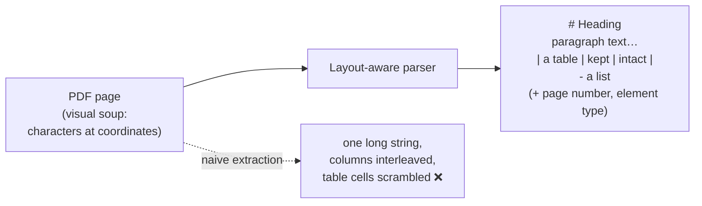

Why it matters beyond neatness: the preserved structure is exactly what the better chunking
strategies (§7) and metadata (§12) feed on. Headings become section labels; page numbers
become citations; "this is a table" becomes "don't split this in half."

**A worked disaster, so it's concrete.** A pricing PDF contains:

> | Plan | Monthly | Annual |
> |---|---|---|
> | Basic | $10 | $96 |
> | Pro | $25 | $240 |

Naive extraction can produce: `"Plan Monthly Annual Basic $10 $96 Pro $25 $240"` — and if a
chunk boundary lands mid-table, one chunk ends `"…Basic $10"` and the next starts
`"$96 Pro…"`. Now ask *"what does Pro cost annually?"* — the number $240 exists in the index
but is no longer *attached to* "Pro" or "Annual" in any chunk. Retrieval can't fix this.
The fix happened (or didn't) at parse time.

> **Rule:** treat tables, code blocks, and lists as **atomic units** — parse them
> structurally, and never let a chunk boundary cut through them.

---

## 3. Why chunk at all? (the three forces)

Beginners ask the right question: *why not just embed whole documents?* Three forces make
chunking necessary, and they push in different directions — which is why chunking is a
*trade-off*, not a solved problem.

**Force 1 — Embedding dilution (pushes chunks SMALL).** An embedding is one fixed-size
vector regardless of input length. Embed one crisp paragraph about warranties → the vector
*means* "warranty info." Embed a 40-page manual → the vector is a blurry average of
installation, safety, pricing, troubleshooting, and warranty — it means everything, so it
matches nothing precisely. Small, single-topic chunks give sharp vectors.

**Force 2 — The context budget (pushes chunks SMALL).** Retrieved chunks must fit in the
prompt alongside instructions and the question — and Tier 0's "lost in the middle" problem
means stuffing huge texts backfires even when they fit. You want to hand the LLM *just
enough*.

**Force 3 — Context completeness (pushes chunks BIG).** A chunk must contain enough
surrounding information to be *understood on its own*. Cut too small and you get fragments:
`"It lasts 5 years."` — what does? The pronoun's referent lives in the previous sentence,
now in a different chunk.

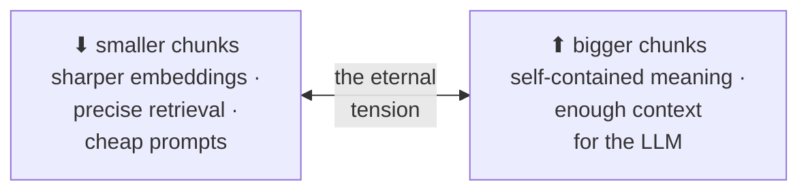

Every strategy below is a different way of balancing these three forces. (And §9's
parent-document trick is the one that *refuses to choose* — it uses small chunks for
searching and big ones for answering.)

---

## 4. The running example

To compare strategies honestly, we'll split the *same* text with each one. Our sample — a
slice of the HydroTech manual (from [Tier 0](../rag-foundations/Introduction.md)'s running
example):

> ## 4. Warranty
> The AquaPump X3 is covered by a 5-year manufacturer warranty. Registration within 90 days
> extends coverage to 7 years. The warranty excludes damage caused by unfiltered water.
>
> ## 5. Maintenance
> Clean the intake filter monthly. Replace the O-ring seal every 24 months. Only use
> HydroTech-certified parts; third-party parts void the warranty.

Small, but it has everything that matters: two topics, a heading structure, a cross-topic
dependency (that last sentence connects maintenance back to warranty!), and sentences that
lean on each other.

---

## 5. Strategy 1 — Fixed-size chunking

**The idea:** cut every N tokens/characters, optionally with overlap. A guillotine — no
reading, no understanding, blind slicing.

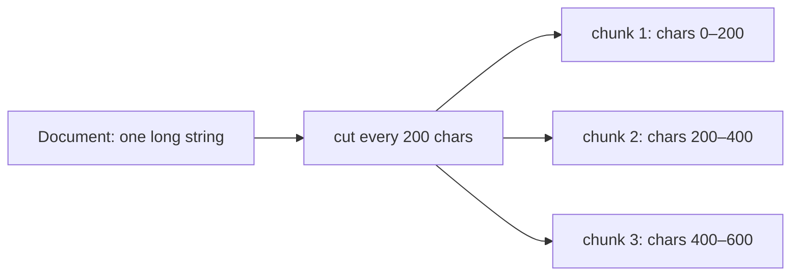

**On the running example** (cutting every ~200 characters):

> **Chunk 1:** `"## 4. Warranty | The AquaPump X3 is covered by a 5-year manufacturer warranty. Registration within 90 days extends cove"`
> **Chunk 2:** `"rage to 7 years. The warranty excludes damage caused by unfiltered wat"`
> **Chunk 3:** `"er. ## 5. Maintenance | Clean the intake filter monthly. Replace the O-ring…"`

Look at the damage: *"cove / rage"* is cut mid-word, chunk 2 is an orphan fragment that
doesn't say what product it's about, and chunk 3 glues the end of one topic to the start of
another. Ask *"how long is the extended warranty?"* — the phrase "extends coverage to 7
years" is split across two chunks; neither embeds it cleanly.

**Verdict:** ✅ trivial to implement, fast, predictable sizes (nice for capacity planning).
❌ ignores every boundary the author gave you — words, sentences, topics, tables.
**Use it for:** quick prototypes and homogeneous text without structure (transcripts, logs).
It's the baseline the other strategies are measured against, not a production choice.

---

## 6. Strategy 2 — Recursive chunking (the production default)

**The idea:** still aim for a target size, but *cut at the most natural boundary available*.
Try to split at paragraph breaks first; if a piece is still too big, split it at line
breaks; then at sentence ends; then at spaces; only in pathological cases mid-word. That
priority list is tried *recursively* — hence the name.

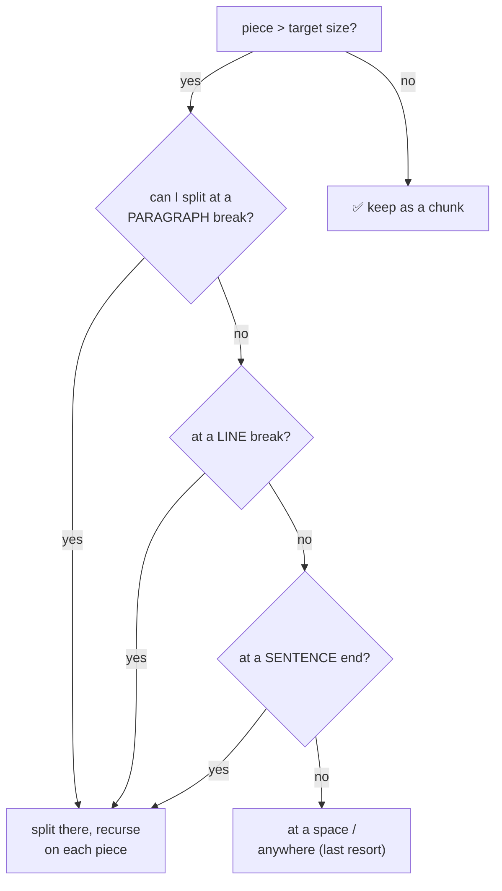

**On the running example** (target ~60 tokens): the paragraph break between the two sections
is the highest-priority separator, so:

> **Chunk 1:** `"## 4. Warranty — The AquaPump X3 is covered by a 5-year manufacturer warranty. Registration within 90 days extends coverage to 7 years. The warranty excludes damage caused by unfiltered water."`
> **Chunk 2:** `"## 5. Maintenance — Clean the intake filter monthly. Replace the O-ring seal every 24 months. Only use HydroTech-certified parts; third-party parts void the warranty."`

Night and day versus §5: whole sentences, whole topics, self-contained chunks — from a rule
that still knows nothing about *meaning*, only about separator characters.

**Verdict:** ✅ respects the document's own structure at near-zero cost; the default in most
frameworks (LangChain's `RecursiveCharacterTextSplitter`) and **the right starting point for
~80% of projects.** ❌ still size-driven at heart: a long single paragraph covering two
topics will not be split by topic.
**Use it for:** your default. Change away from it only when metrics say so.

---

## 7. Strategy 3 — Document-structure chunking

**The idea:** if the document has explicit structure — Markdown headings, HTML tags, legal
clause numbering, code functions — **let the author's own outline define the chunks**,
instead of a character count. One section (or clause, or function) = one chunk, with its
heading path attached.

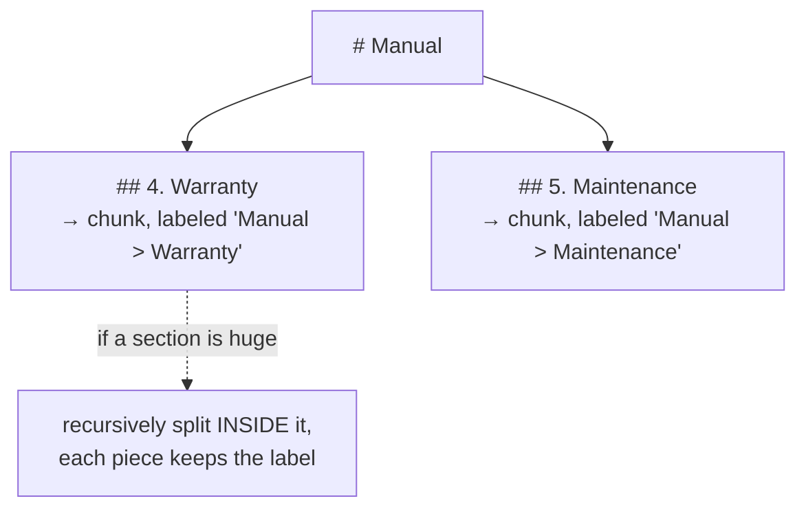

**On the running example:** the same two chunks as §6 — but now each carries its breadcrumb
(`Manual > Warranty`), which travels into metadata (§12) and can even be prepended to the
chunk text before embedding, so the vector *knows* its context: a chunk that just says
"coverage lasts 5 years" embeds very differently (better!) as "Warranty: coverage lasts 5
years."

**Verdict:** ✅ chunks match how humans organize meaning; headings power citations,
filtering, and disambiguation. ❌ only as good as the structure — useless on unstructured
prose, and dependent on the parser (§2) having preserved headings correctly.
**Use it for:** documentation, wikis, contracts, policies, codebases — anything an author
already outlined. Usually *combined* with recursive splitting for oversized sections.

---

## 8. Strategy 4 — Semantic chunking

**The idea:** stop trusting characters and structure — cut **where the *meaning* shifts**.
Embed every sentence; walk through them in order; when the similarity between consecutive
sentences *drops*, a topic just changed — cut there.

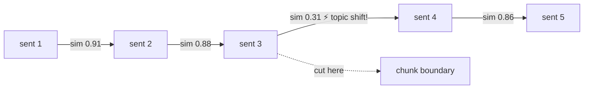

**On the running example** (pretend the headings were stripped, so structure can't help):
sentence similarities within the warranty topic run high (registration, coverage, exclusions
all "warranty-flavored"); between *"…damage caused by unfiltered water"* and *"Clean the
intake filter monthly"* the similarity plunges — semantic chunking finds the topic boundary
**without any heading telling it where to look**. That's its superpower: it recovers
structure that formatting lost.

**Verdict:** ✅ chunks are genuinely single-topic → the sharpest embeddings of any strategy;
benchmarks typically show a solid retrieval-accuracy lift over fixed-size (commonly quoted
in the 10–20% range, more on messy corpora). ❌ costs an embedding pass over every sentence
at index time; needs a tuned threshold ("how big a drop is a cut?"); chunk sizes become
unpredictable. And on *well-structured* docs, §7 gets most of the benefit for free.
**Use it for:** unstructured prose — transcripts, emails, long-form articles, OCR output —
where meaning shifts happen without formatting. Adopt only if an eval shows it beats
recursive (Tier 7 discipline).

---

## 9. Strategy 5 — Parent-document / hierarchical chunking

**The idea:** §3's small-vs-big tension, *refused*. Split twice — big **parent** sections
(great for reading) and small **child** chunks inside them (great for searching). Embed and
search ONLY the children; when a child matches, **return its parent** to the LLM.

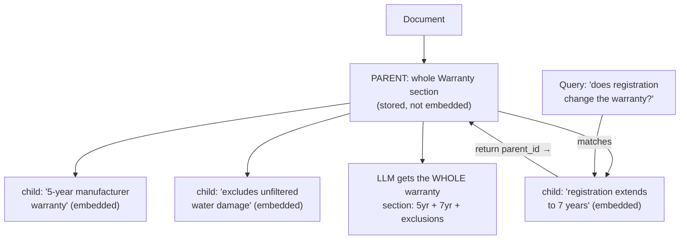

**On the running example:** the query *"does registration change the warranty?"* matches
child C2 with laser precision (it's a sentence about exactly that). But the *answer a human
would want* also mentions the base 5-year term and the exclusion — which the parent
provides, because the whole Warranty section comes back. Search hit like a scalpel, answer
context like a book page.

**Verdict:** ✅ best of both worlds; a free deduplication bonus (three child hits from one
parent → parent returned once); one of the easiest big wins in RAG. ❌ index bookkeeping
(child→parent links), and parents must themselves be sized to fit prompts.
**Use it for:** complex Q&A over structured documents. This is the indexing-side twin of
the *retrieval-side* view in [Tier 3 §10.4](../retrieval-strategies/Introduction.md) —
same idea, seen from the two ends of the pipeline. The **sentence-window** variant (embed
single sentences, return ±N neighbors) is its sliding-scale cousin.

---

## 10. The frontier: late chunking & contextual retrieval

Two 2024–26 upgrades, both attacking the same residual problem: **even a well-cut chunk
loses the context around it.** The sentence *"It voids the warranty"* is perfectly formed —
and unintelligible without knowing "it" = third-party parts and the document = AquaPump X3
manual.

**Contextual retrieval (make each chunk self-explanatory before embedding).** At index
time, an LLM reads each chunk *together with the whole document* and writes a 1–2 sentence
preamble situating it; the preamble + chunk are embedded together:

> Chunk: `"Only use HydroTech-certified parts; third-party parts void the warranty."`
> becomes: `"[From the AquaPump X3 manual, Maintenance section, on part requirements and
> their warranty impact:] Only use HydroTech-certified parts; third-party parts void the
> warranty."`

Now queries like *"AquaPump third-party parts warranty"* hit it dead-on — words the chunk
itself never contained ("AquaPump") are now part of what got embedded. Cost: one LLM call
per chunk at index time (prompt caching makes this affordable).

**Late chunking (embed first, cut later).** Standard order: cut text → embed each piece in
isolation (each piece is embedded *blind* to its neighbors). Late chunking flips it: run the
**whole document** through a long-context embedding model first — so every token's
representation is informed by the full document — *then* cut the token representations into
chunks and pool each span into its vector. Each chunk's embedding was computed **while the
model could still see everything around it**: "It voids the warranty" embeds knowing what
"it" was. Requires a long-context embedding model that exposes token-level output.

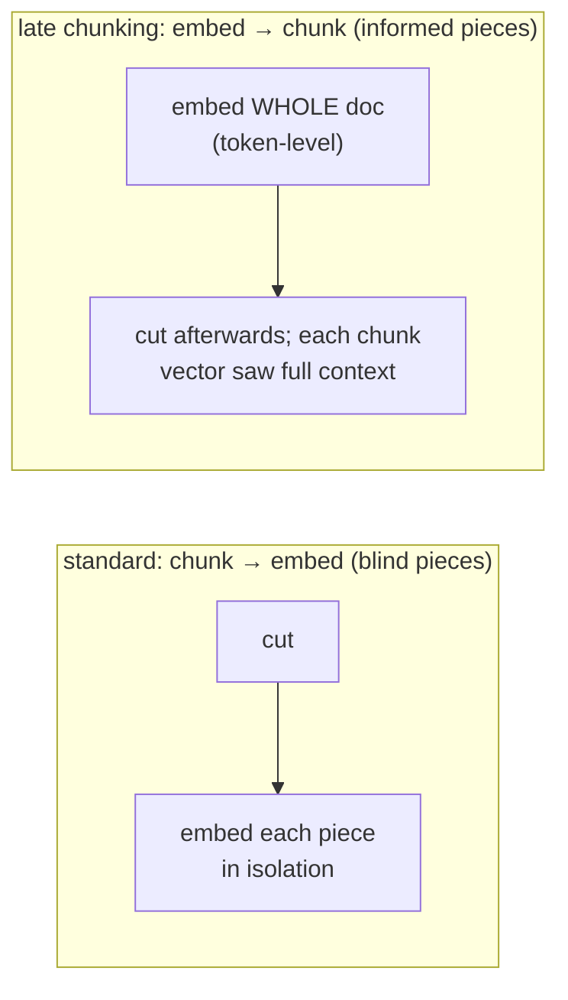

**Reach for these when:** chunks are ambiguous without their surroundings (pronouns,
implicit subjects, section-dependent meaning) and parent-document retrieval alone hasn't
closed the gap. They're refinements, not starting points.

---

## 11. Chunk size & overlap: the trade-off, with numbers

Whatever strategy you choose, two numbers still need values.

### 11.1 Chunk size

The three forces of §3, now as a dial:

| | Too small (≪100 tokens) | Sweet spot | Too large (≫2000 tokens) |
|---|---|---|---|
| Embedding | sharp but *fragmentary* — sentences lose referents | sharp AND self-contained | blurry average of topics |
| Retrieval | precise hits, incomplete answers | precise + complete | vague hits, wasted prompt space |
| Prompt cost | many chunks needed | efficient | few chunks fit; lost-in-the-middle |

**Field-tested starting defaults (2026):** **256–512 tokens** for most corpora; technical
docs with dense facts lean smaller (256–512); narrative prose leans bigger (1024–2048);
a general-purpose baseline of 512 with 10–20% overlap is hard to embarrass. These are
*starting points* for your eval to refine — never final answers.

### 11.2 Overlap

**Overlap = each chunk repeats the last ~10–20% of its predecessor**, so information
sitting *on* a boundary exists intact in at least one chunk:

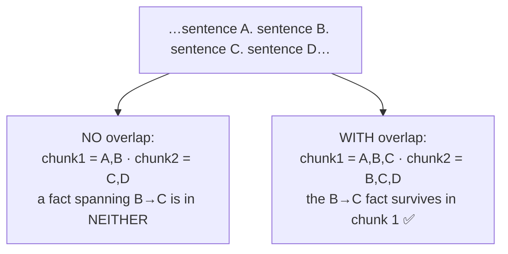

The cost is mild duplication (index size, and occasionally two near-identical hits — which
[Tier 3's MMR](../retrieval-strategies/Introduction.md) handles). **10–20% (≈50–100 tokens)
is the standard band.** Structure-based strategies (§7, §9) need less overlap, since their
boundaries already fall at natural seams.

---

## 12. Metadata: attach it now, thank yourself later

Every chunk should carry a passport — attached at indexing, because you *cannot* attach it
later without re-processing everything:

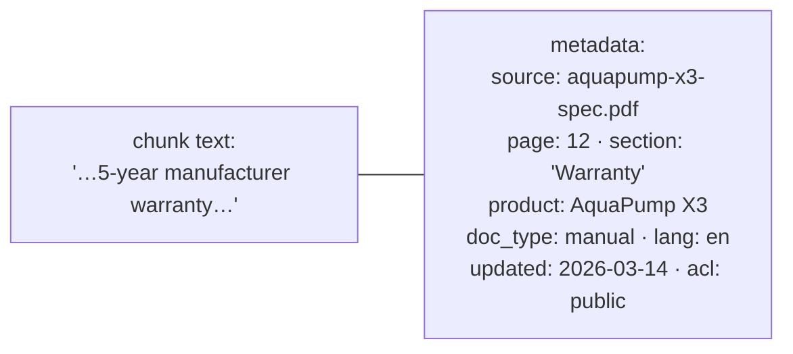

What each field buys downstream:

| Field | Downstream power |
|---|---|
| `source`, `page` | **Citations** ("per the spec, p.12") and debugging ("which doc caused this wrong answer?") |
| `section` / heading path | Disambiguation, better embeddings (§7), grouped display |
| `updated` date | **Freshness filtering** ("2026 policies only") and stale-doc audits |
| `product`, `doc_type`, `lang` | **Metadata filtering** — [Tier 3 §8](../retrieval-strategies/Introduction.md)'s hard constraints run entirely on these fields |
| `acl` / permissions | **Security**: retrieve only what this user may see. Not optional in enterprise RAG. |

> **Rule of thumb:** if you might ever want to *filter, cite, audit, or delete* by some
> property — capture it as metadata **now**. Re-indexing 50,000 documents to add a field
> you skipped is a bad week.

---

## 13. Choosing a strategy: the decision guide

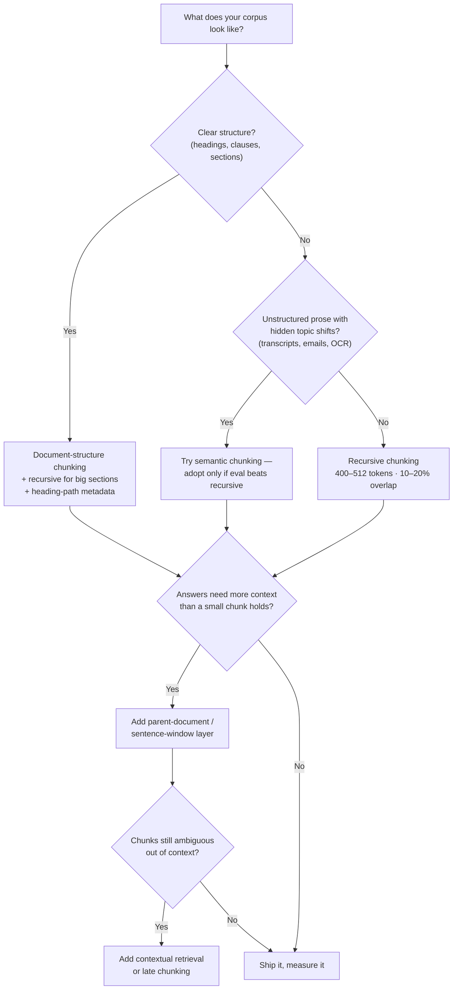

And the honest default for a first build: **recursive, 400–512 tokens, 15% overlap, rich
metadata, tables kept atomic.** Everything else is an upgrade you justify with a metric.

---

## 14. Pitfalls & trade-offs

- **Skipping parse quality.** Teams evaluate chunkers on clean text while their real PDFs
  produce scrambled tables and interleaved columns. *Look at your parsed output with your
  own eyes* before debating chunk sizes.
- **Splitting tables, lists, and code.** Half a table is worse than no table — the halves
  *look* retrievable but carry broken meaning. Atomic units, always.
- **One config for every document type.** A contract, a chat log, and an API reference in
  one corpus should not share a chunking config. Route by document type.
- **Orphan chunks.** Pronouns and implicit subjects ("It lasts 5 years") strand meaning
  across boundaries. Fixes, in escalating power: overlap → heading-prefixing (§7) →
  parent-document (§9) → contextual retrieval (§10).
- **Chunking to the embedding model's max input.** "The model accepts 8192 tokens, so chunk
  at 8192" — no: dilution (§3) ruins retrieval long before the input limit does.
- **No metadata.** The single most common regret in production post-mortems. See §12's rule
  of thumb.
- **Tuning chunk size by feel.** Chunk size interacts with your embedding model, corpus,
  and query style. Fix an eval set (Tier 7), grid a few sizes (256/512/1024), and let
  recall@k choose.
- **Forgetting re-indexing.** Chunking decisions are baked into the index. Changing
  strategy = re-processing the corpus. Version your index configs and budget for rebuilds.

---

## 15. Mastery checklist

You've mastered the data layer when you can, from memory:

- [ ] Explain why upstream parsing/chunking mistakes surface as mysterious *retrieval* failures downstream.
- [ ] Describe what layout-aware parsing preserves that naive extraction destroys — and walk the pricing-table disaster.
- [ ] Name the three forces (§3): embedding dilution, context budget, context completeness — and which direction each pushes.
- [ ] Show what fixed-size chunking does to the running example, and why it's a baseline not a choice.
- [ ] Explain recursive chunking's separator hierarchy and why it's the production default.
- [ ] Explain document-structure chunking and the value of heading-path prefixes.
- [ ] Explain how semantic chunking finds boundaries with embedding similarity, and its costs.
- [ ] Draw parent-document chunking: what's embedded, what's returned, why both.
- [ ] Distinguish contextual retrieval (prepend context, then embed) from late chunking (embed whole doc, then cut).
- [ ] Recite the default numbers: 256–512 tokens, 10–20% overlap — and what breaks at each extreme.
- [ ] List five metadata fields and the downstream capability each unlocks.
- [ ] Reproduce the decision flowchart in §13.

Next: **Tier 2 — [Embeddings & Vector Stores](../embeddings-and-vector-stores/Introduction.md)** —
what those "vectors" actually are, how to pick the model that makes them, and how a database
finds the nearest ones among millions in milliseconds.

---

## Sources

- [Document Chunking for RAG: 9 Strategies, Chunk Size & Overlap (2026) — LangCopilot](https://langcopilot.com/posts/2025-10-11-document-chunking-for-rag-practical-guide)
- [Best Chunking Strategies for RAG (and LLMs) in 2026 — Firecrawl](https://www.firecrawl.dev/blog/best-chunking-strategies-rag)
- [RAG Chunking Strategies — Semantic, Recursive & Agentic Chunking — MyEngineeringPath](https://myengineeringpath.dev/genai-engineer/rag-chunking/)
- [Chunking Strategies for RAG: Fixed, Semantic, Recursive, and Parent-Document — SurePrompts](https://sureprompts.com/blog/chunking-strategies-for-rag)
- [The Complete Guide to Document Chunking for RAG — Medium](https://kaustavmukherjee-66179.medium.com/the-complete-guide-to-document-chunking-for-rag-ac312e6d635f)
- [Document Parsing for RAG: A Complete Guide for 2026 — Omdena](https://www.omdena.com/blog/document-parsing-for-rag)
- [Best PDF Parsers for AI and RAG Workflows in 2026 — Firecrawl](https://www.firecrawl.dev/blog/best-pdf-parsers)
- [How to Implement Document Ingestion — OneUptime](https://oneuptime.com/blog/post/2026-01-30-rag-document-ingestion/view)
- [Introducing Contextual Retrieval — Anthropic](https://www.anthropic.com/news/contextual-retrieval)
- [Late Chunking: Contextual Chunk Embeddings — Jina AI (arXiv)](https://arxiv.org/abs/2409.04701)
- [Mix-of-Granularity: Optimize the Chunking Granularity for RAG — arXiv](https://arxiv.org/pdf/2406.00456)
