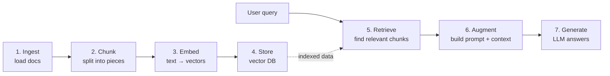
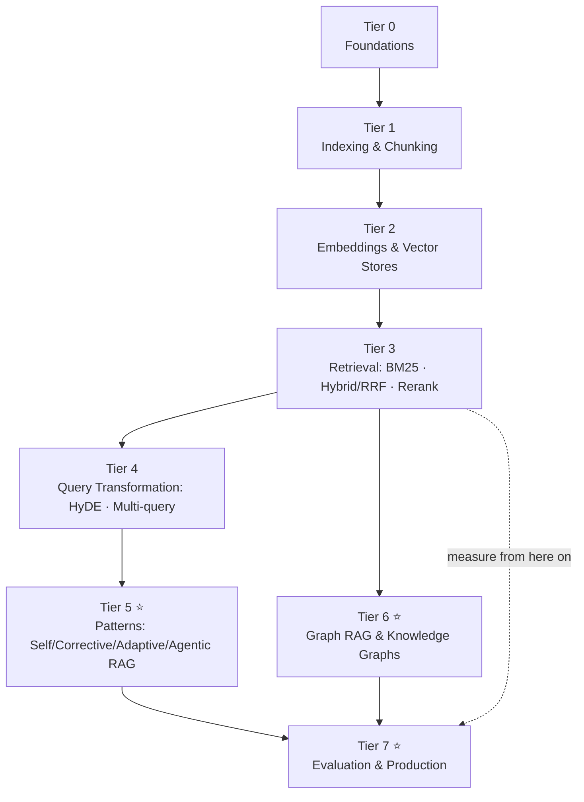

# Retrieval-Augmented Generation (RAG) — Master Curriculum Overview

> This is the **index** for the entire RAG learning track. It is a *summary-level map* only:
> every topic below gets its own dedicated deep-dive folder later. Read this document first
> to understand **what** you're learning, **why it matters**, and **the order** to learn it in —
> then pick a tier and go deep.
>
> The path runs **beginner → advanced** across 8 tiers. Each tier upgrades one stage of the
> RAG pipeline. Don't skip ahead: almost every advanced technique is meaningless until the
> fundamentals below it are solid.

---

## Table of Contents

1. [The one-sentence idea](#1-the-one-sentence-idea)
2. [The mental model: the naive RAG pipeline](#2-the-mental-model-the-naive-rag-pipeline)
3. [How to use this curriculum](#3-how-to-use-this-curriculum)
4. [Tier 0 — Foundations](#tier-0--foundations)
5. [Tier 1 — Indexing & Chunking](#tier-1--indexing--chunking)
6. [Tier 2 — Embeddings & Vector Stores](#tier-2--embeddings--vector-stores)
7. [Tier 3 — Retrieval Strategies](#tier-3--retrieval-strategies)
8. [Tier 4 — Query Transformation](#tier-4--query-transformation)
9. [Tier 5 — Advanced RAG Patterns](#tier-5--advanced-rag-patterns)
10. [Tier 6 — Graph RAG & Knowledge Graphs](#tier-6--graph-rag--knowledge-graphs)
11. [Tier 7 — Evaluation & Production](#tier-7--evaluation--production)
12. [Suggested learning order (priority)](#suggested-learning-order-priority)
13. [The full topic map at a glance](#the-full-topic-map-at-a-glance)
14. [Sources](#sources)

---

## 1. The one-sentence idea

> **RAG makes a language model answer from *your* data by retrieving relevant documents at
> query time and putting them into the prompt — instead of relying only on what the model
> memorized during training.**

This fixes the three big LLM problems in one move: **stale knowledge** (the model's training
is frozen in the past), **hallucination** (it invents facts confidently), and **no access to
private/proprietary data** (your docs were never in its training set).

---

## 2. The mental model: the naive RAG pipeline

Memorize these **7 stages**. Every single advanced topic in this curriculum is just an upgrade
to one of them.

| Stage | Upgraded by which tier |
|-------|------------------------|
| Ingest / Chunk | Tier 1 |
| Embed / Store | Tier 2 |
| Retrieve | Tier 3 (+ Tier 6 for graphs) |
| Query (before retrieve) | Tier 4 |
| Whole loop restructured | Tier 5 (agentic/self/corrective) |
| Measuring all of it | Tier 7 |

---

## 3. How to use this curriculum

- **Each tier = one folder** (e.g. [`rag-foundations/`](rag-foundations/Introduction.md)), each
  with its own `Introduction.md` deep-dive (and, where applicable, runnable `resources/`).
  Every tier section below links to its deep dive.
- **Learn evaluation early, not last.** Tier 7 is listed at the end for logical grouping, but
  you should learn the *metrics* right after Tier 3 — you can't tell if any later upgrade
  actually helped unless you can measure it.
- **The ⭐ tiers** (5, 6, 7) are where "someone who did a RAG tutorial" becomes "someone who
  can build and defend a production RAG system."

---

## Tier 0 — Foundations
*Beginner. What RAG is and when to use it.*

> 📁 **Deep dive:** [rag-foundations/Introduction.md](rag-foundations/Introduction.md)

- What RAG is and the problems it solves (stale knowledge, hallucination, private data).
- The 7-stage naive pipeline (above) — the backbone of everything.
- **RAG vs. alternatives**: fine-tuning vs. RAG vs. long-context windows vs. prompt-stuffing — and when each one wins.

---

## Tier 1 — Indexing & Chunking
*The data layer. Garbage in = garbage out — most quality problems are born here.*

> 📁 **Deep dive:** [indexing-and-chunking/Introduction.md](indexing-and-chunking/Introduction.md)

- Document loading & parsing (PDF, HTML, tables — the messy real-world part).
- **Chunking strategies**: fixed-size, recursive, sentence-window, semantic chunking, parent-document / hierarchical.
- Chunk size vs. overlap trade-offs.
- Metadata attachment (source, section, date) — powers filtering later.

---

## Tier 2 — Embeddings & Vector Stores
*The retrieval substrate. How meaning becomes searchable.*

> 📁 **Deep dive:** [embeddings-and-vector-stores/Introduction.md](embeddings-and-vector-stores/Introduction.md)

- **Embeddings**: dense vs. sparse, choosing a model, dimensionality, multilingual.
- **Vector databases**: FAISS, Chroma, Qdrant, Weaviate, pgvector, Milvus.
- **ANN indexing**: HNSW, IVF — how approximate nearest-neighbor search actually works.
- **Distance metrics**: cosine vs. dot product vs. L2.

---

## Tier 3 — Retrieval Strategies
*The core skill. This is where "good" RAG separates from "naive."*

> 📁 **Deep dive:** [retrieval-strategies/Introduction.md](retrieval-strategies/Introduction.md)

- **Sparse / keyword search**: BM25.
- **Dense / semantic search**: vector similarity.
- **Hybrid search**: BM25 + vectors fused with **RRF (Reciprocal Rank Fusion)** — usually the single highest-ROI upgrade.
- **Reranking**: retrieve a broad top-K, then re-score with a **cross-encoder reranker** — a huge quality gain.
- **Metadata filtering** and **context compression** (trim chunks before they reach the LLM).

---

## Tier 4 — Query Transformation
*Fixing the question. The user's raw query is rarely the best search query.*

> 📁 **Deep dive:** [query-transformation/Introduction.md](query-transformation/Introduction.md)

- **Query expansion / rewriting.**
- **HyDE** (Hypothetical Document Embeddings) — embed a fake ideal answer, search with that.
- **Multi-query** (several query variants) and **sub-question decomposition** (split complex questions).
- **Step-back prompting** (ask a more general question first).

---

## Tier 5 — Advanced RAG Patterns ⭐
*Named architectures. Once basics work, these are what you'll see everywhere.*

> 📁 **Deep dive:** [advanced-rag-patterns/Introduction.md](advanced-rag-patterns/Introduction.md)

- **Self-RAG** — the model decides *when* to retrieve and critiques its own output.
- **Corrective RAG (CRAG)** — grades retrieved docs; falls back to web search if they're weak.
- **Adaptive RAG** — routes easy vs. hard queries down different paths.
- **RAPTOR** — recursive summarization into a hierarchical tree for multi-level retrieval.
- **Long RAG** and **Modular RAG** (retrieval as swappable modules).
- **Agentic RAG** — an autonomous agent that plans, retrieves, evaluates, and re-retrieves in a loop, deciding whether context is sufficient. The biggest 2025–26 direction.
- **Multimodal RAG** — retrieval over images, tables, and audio, not just text.

---

## Tier 6 — Graph RAG & Knowledge Graphs ⭐
*A genuinely different paradigm from vector RAG — give it its own dedicated study block.*

> 📁 **Deep dive:** [graph-rag-knowledge-graph/Introduction.md](graph-rag-knowledge-graph/Introduction.md)

- **Why graphs**: vector-only RAG fails on **multi-hop reasoning** and global "connect-the-dots" questions; graphs encode *relationships between entities*, not just similarity.
- **Knowledge graph basics**: entities, relations, triples (subject–predicate–object); building a KG from unstructured text via LLM extraction.
- **Microsoft GraphRAG** — the reference implementation: entity extraction → relationship mapping → **community detection (Leiden algorithm)** → hierarchical community summaries → **local vs. global search**.
- **Other frameworks**: **LightRAG** (KG + vector, local + global), **HippoRAG** (hippocampus-inspired, Personalized PageRank for multi-hop), Neo4j-based GraphRAG.
- **Hybrid graph + vector retrieval** — the practical production sweet spot.

---

## Tier 7 — Evaluation & Production ⭐
*Where you become an engineer. You can't improve what you can't measure.*

> 📁 **Deep dives:** [evaluation/rag-triad/Introduction.md](evaluation/rag-triad/Introduction.md) (7a) ·
> [evaluation/retrieval-metrics/Introduction.md](evaluation/retrieval-metrics/Introduction.md) (7b) ·
> [evaluation/eval-tooling/Introduction.md](evaluation/eval-tooling/Introduction.md) (7c) ·
> 7d (production & optimization) — *not yet written*

**7a. The RAG Triad** (LLM-as-judge quality metrics):
- **Context Relevance** — did retrieval fetch docs that actually matter? *(diagnoses the retriever)*
- **Groundedness / Faithfulness** — is the answer supported by the retrieved context, or hallucinated? *(diagnoses the generator)*
- **Answer Relevance** — does the final answer address what was actually asked?
- Plus RAGAS's **Context Precision** and **Context Recall**.

**7b. Retrieval metrics** (classic information-retrieval ranking quality):
- **Precision@k / Recall@k** — how much of the top-k is relevant / how much relevant material you found.
- **MRR** (Mean Reciprocal Rank) — how high the *first* relevant result sits.
- **MAP** (Mean Average Precision) — precision averaged across all relevant results.
- **NDCG** (Normalized Discounted Cumulative Gain) — rank-aware; rewards putting the most relevant items highest. The gold-standard ranking metric.

**7c. Eval tooling**: RAGAS, TruLens, DeepEval; building a golden test set.

**7d. Production & optimization**: latency & cost, caching (including **semantic caching**), monitoring, security / PII, scaling.

---

## Suggested learning order (priority)

| Priority | Tier(s) | Why |
|----------|---------|-----|
| **1st** | 0 → 3 | Nothing works without solid chunking + hybrid retrieval + reranking. |
| **2nd** | 7 (just the metrics) | Learn to *measure* early, so every later change is justified by a number moving. |
| **3rd** | 4 → 5 | Query transformation + Agentic RAG give the biggest quality jumps. |
| **4th** | 6 | Graph RAG — dive deep once the fundamentals are muscle memory. |
| **5th** | 7 (production) | Latency, cost, monitoring, scaling once quality is proven. |

> **The one non-obvious rule:** learn evaluation right after the basics, not at the very end.
> Adding advanced techniques without metrics is adding complexity blind.

---

## The full topic map at a glance

---

## Sources

- [The 2025 Guide to Retrieval-Augmented Generation — Eden AI](https://www.edenai.co/post/the-2025-guide-to-retrieval-augmented-generation-rag)
- [12 Advanced RAG Techniques: Beyond Naive Retrieval — Atlan](https://atlan.com/know/advanced-rag-techniques/)
- [Advanced RAG techniques for high-performance LLM applications — Neo4j](https://neo4j.com/blog/genai/advanced-rag-techniques/)
- [The RAG Triad — TruLens](https://www.trulens.org/getting_started/core_concepts/rag_triad/)
- [RAGAS for RAG: A Comprehensive Guide to Evaluation Metrics — Medium](https://dkaarthick.medium.com/ragas-for-rag-in-llms-a-comprehensive-guide-to-evaluation-metrics-3aca142d6e38)
- [Result Evaluation for RAG: Metrics & Best Practices — IBM](https://www.ibm.com/think/architectures/rag-cookbook/result-evaluation)
- [What is GraphRAG? — IBM](https://www.ibm.com/think/topics/graphrag)
- [Project GraphRAG — Microsoft Research](https://www.microsoft.com/en-us/research/project/graphrag/)
- [Agentic Retrieval-Augmented Generation: A Survey — arXiv](https://arxiv.org/pdf/2501.09136)
