# Query Transformation — Fixing the Question (Beginner → Advanced)

> This is **Tier 4** of the [RAG curriculum](../overview.md). Tiers 1–3 perfected the
> *index* and the *search*. This tier attacks the other end of the pipe: **the query
> itself**. The user's raw question is very often a *bad search query* — vague, compound,
> phrased in the wrong "register," or missing its own context. Query transformation uses an
> LLM to rewrite, expand, split, generalize, or route the question *before* retrieval ever
> runs.
>
> This document covers all the major techniques — **query rewriting (incl. conversational
> condensation), query expansion, multi-query, HyDE, step-back prompting, sub-question
> decomposition, self-query (filter extraction), and routing** — each built from the
> specific query-failure it fixes, with examples, diagrams, and a decision guide.
> No code; concepts only, beginner → advanced.

---

## Table of Contents

1. [The insight of this tier: garbage question in, garbage answer out](#1-the-insight-of-this-tier-garbage-question-in-garbage-answer-out)
2. [Why raw user queries fail: the five failure shapes](#2-why-raw-user-queries-fail-the-five-failure-shapes)
3. [The general pattern: an LLM sits in front of the retriever](#3-the-general-pattern-an-llm-sits-in-front-of-the-retriever)
4. [Technique 1 — Query rewriting](#4-technique-1--query-rewriting)
5. [Technique 2 — Query expansion](#5-technique-2--query-expansion)
6. [Technique 3 — Multi-query (ask it five ways)](#6-technique-3--multi-query-ask-it-five-ways)
7. [Technique 4 — HyDE (search with a fake answer)](#7-technique-4--hyde-search-with-a-fake-answer)
8. [Technique 5 — Step-back prompting (zoom out first)](#8-technique-5--step-back-prompting-zoom-out-first)
9. [Technique 6 — Sub-question decomposition (divide and retrieve)](#9-technique-6--sub-question-decomposition-divide-and-retrieve)
10. [Technique 7 — Self-query: extract the filters](#10-technique-7--self-query-extract-the-filters)
11. [Technique 8 — Routing: send the query to the right place](#11-technique-8--routing-send-the-query-to-the-right-place)
12. [Choosing and combining: the decision guide](#12-choosing-and-combining-the-decision-guide)
13. [Pitfalls & trade-offs](#13-pitfalls--trade-offs)
14. [Mastery checklist](#14-mastery-checklist)
15. [Sources](#sources)

---

## 1. The insight of this tier: garbage question in, garbage answer out

Here's the situation after Tier 3: you built a superb retrieval funnel — hybrid search,
reranking, filtering. Then a user types:

> *"it still doesn't work after that thing from yesterday"*

Your beautiful funnel embeds *that* and searches a million chunks with it. The funnel is
fine. **The question is broken.** No retrieval strategy can find the right documents for a
query that doesn't say what it's looking for.

The librarian analogy (one last time): Tiers 1–2 organized the library, Tier 3 trained the
librarian. Tier 4 is the reference interview — the moment a good librarian *doesn't* run
off with your literal words, but asks: *"what are you actually trying to find?"* — and then
searches for **that**.

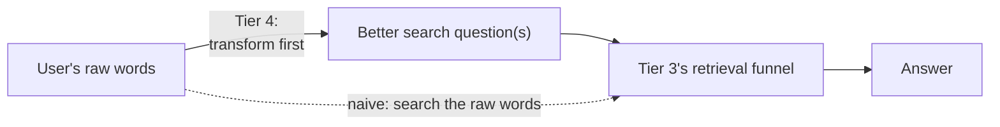

One sentence to hold onto:

> **The user's job is to express a need. The search query's job is to match stored
> documents. These are different jobs — Tier 4 is the translation between them.**

---

## 2. Why raw user queries fail: the five failure shapes

Almost every bad query is bad in one of five recognizable ways. Learn the shapes and the
rest of the document becomes a lookup table (each technique fixes specific shapes):

| # | Failure shape | Example | What's wrong |
|---|---|---|---|
| 1 | **Vague / underspecified** | *"pump broken"* | No model, no symptom, no context — matches everything and nothing |
| 2 | **Compound** (several questions in one) | *"Compare X3 and X5 warranty, and which is quieter?"* | One embedding must point at 3 different answers at once — it ends up pointing at none |
| 3 | **Wrong register** (vocabulary mismatch) | *"my pump makes a weird clicking"* vs. docs saying *"impeller cavitation noise"* | Casual words vs. technical docs — they live far apart even on a good meaning map |
| 4 | **Context-dependent** | *"does the bigger one fix that?"* (mid-conversation) | The referents ("bigger one," "that") live in chat history, not in the query |
| 5 | **Too specific / concrete** | *"Can I run the X3 at 4,200 rpm for 6 h at 55 °C?"* | No document matches these exact numbers; the *principles* that answer it are stated generally |

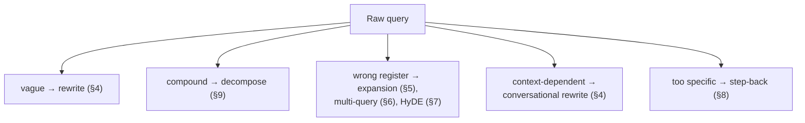

---

## 3. The general pattern: an LLM sits in front of the retriever

Every technique in this tier is the same architectural move: **a small, fast LLM call runs
BEFORE retrieval, transforming the query.** The variations are only in *what transformation
it's prompted to do* and *how many searches result*.

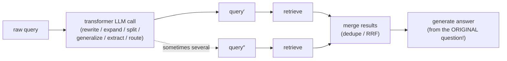

Two invariants worth tattooing somewhere:

1. **Transform for retrieval, answer the original.** The rewritten query is *only* for
   searching. The final generation prompt should contain the user's *original* question —
   otherwise you answer a question the user never asked.
2. **Every technique costs one+ LLM call of latency.** That's the tax on this whole tier —
   the decision guide (§12) is mostly about when the tax is worth it.

---

## 4. Technique 1 — Query rewriting

**Fixes shapes 1 (vague) and 4 (context-dependent).** The simplest transformation: ask an
LLM to restate the query *clearly and completely*.

**Plain rewriting** — sharpen fuzzy wording:

> Raw: *"pump broken water everywhere help"*
> Rewritten: *"AquaPump water pump leaking large amounts of water — troubleshooting steps
> and causes"*

The rewrite is calm, specific, and phrased like the documents it needs to match. Nothing
was invented — it's the same need, stated searchably.

**Conversational condensation** — the special case every chat-based RAG system needs.
In a conversation, the *current message* often isn't a standalone question at all:

> **Turn 1:** "How loud is the AquaPump X3?" → *"About 45 dB."*
> **Turn 2:** "and the X5?"
> **Turn 3:** "does the bigger one fix that clicking issue?"

Embed turn 3 literally and you're searching for `"does the bigger one fix that"` — garbage.
The fix: an LLM reads the *chat history + new message* and writes one **standalone
question**:

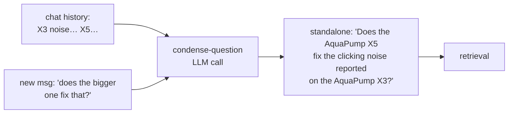

> **If you build exactly one thing from this tier for a chatbot, build this.** Without it,
> every follow-up question retrieves nonsense — it's the single most common real-world RAG
> chat bug.

---

## 5. Technique 2 — Query expansion

**Fixes shape 3 (wrong register / vocabulary mismatch).** Instead of *replacing* the query,
**append** synonyms, related terms, and alternate phrasings to it:

> Raw: *"pump making clicking noise"*
> Expanded: *"pump making clicking noise — ticking, rattling, knocking sound; impeller
> noise; cavitation; bearing wear"*

Now the query contains *both* registers: the user's casual words **and** the documentation's
technical vocabulary. Whichever register the right chunk was written in, some part of the
expanded query speaks it.

**Where it shines:** the *sparse/BM25 leg* of hybrid search — BM25 (Tier 3 §3) can only
match literal words, so handing it more of the right words directly attacks its
vocabulary-mismatch weakness. (If this reminds you of [Tier 3 §10.2's SPLADE](../retrieval-strategies/Introduction.md) —
good instinct: SPLADE does term expansion *to the documents at index time*; query expansion
does it *to the query at search time*. Same medicine, opposite end.)

**The risk — query drift:** every added term is a chance to pull retrieval off-target
(expanding "clicking" with "clock"…). Keep expansions few, domain-anchored, and validated
by your eval set.

---

## 6. Technique 3 — Multi-query (ask it five ways)

**Fixes shape 3, and general retrieval brittleness.** Embeddings are sensitive to phrasing:
two wordings of the same need can retrieve noticeably different chunks. Multi-query stops
betting on one wording — the LLM generates **3–5 different phrasings**, *all* of them
search **in parallel**, and the result lists merge:

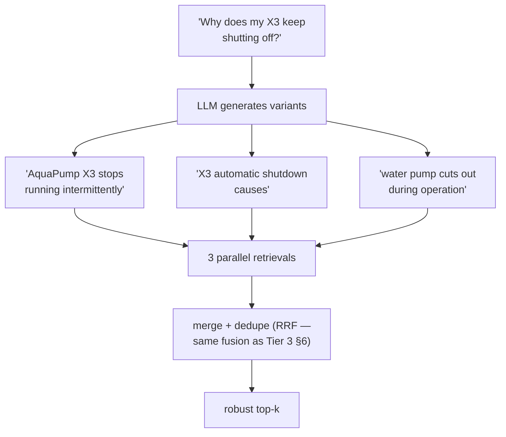

A chunk that ranks well across *several* phrasings is almost certainly relevant — phrasing
luck has been averaged out. The merge step reuses a tool you already own: **RRF**, exactly
as in hybrid search, just fusing sibling-query lists instead of sparse/dense lists.

**Cost:** one cheap LLM call + N parallel searches (latency barely moves if truly parallel;
retrieval load ×N). One of the best cost-to-benefit ratios in this tier, and the easiest to
bolt on.

---

## 7. Technique 4 — HyDE (search with a fake answer)

**Fixes shape 3 at a deeper level.** HyDE — **Hy**pothetical **D**ocument **E**mbeddings —
is the counterintuitive star of this tier:

> **Don't embed the question. Ask an LLM to write a fake answer, and embed *that*.**

**The problem it exploits:** on the meaning map, *questions and answers are different kinds
of text*. A short interrogative ("How long is the X3 warranty?") and a declarative policy
paragraph ("The AquaPump X3 is covered by a 5-year manufacturer warranty…") don't
necessarily sit close together — question-shaped text clusters with questions, answer-shaped
text with answers. But your index contains **answer-shaped chunks**. So search with
something answer-shaped:

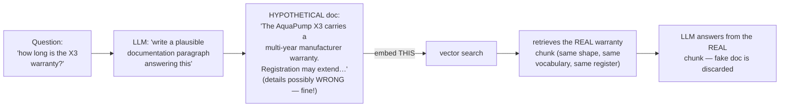

**The beautiful part — hallucination is harmless here.** Suppose the LLM's fake paragraph
says "3-year warranty" (wrong — it's 5). Doesn't matter: the fake document is never shown
to anyone and never used for the answer. Its only job is to be **the right *shape* of text
in the right *region* of the meaning map** — warranty-flavored, documentation-styled prose.
It lands near the *true* warranty chunk, retrieval grabs the real one, and generation uses
only that. The hallucination was the *bait*, not the answer.

**When it wins:** question-vs-document register gaps — terse user questions against dense
technical/legal/medical prose; zero-shot domains where queries are hard to embed well.
**When it loses:** when the LLM knows *so little* about the topic that its fake document is
off-topic-shaped (wrong bait → wrong region), and it's a full LLM generation of latency —
the priciest single-query technique here.

---

## 8. Technique 5 — Step-back prompting (zoom out first)

**Fixes shape 5 (too specific).** Some questions are so concrete that no document matches
them directly — the answer lives in *general principles* that a too-specific query flies
right past:

> Raw: *"Can I run the AquaPump X3 at 4,200 rpm for 6 hours at 55 °C water temperature?"*

No chunk contains those numbers together. But the corpus *does* contain the operating-limits
table and the duty-cycle guidelines — chunks a *more general* question finds instantly.
Step-back prompting asks the LLM: **"what's the broader question behind this?"**

> Step-back question: *"What are the AquaPump X3's operating limits for speed, temperature,
> and continuous runtime?"*

Then retrieve with **both** — the general question fetches the principles, the original
fetches anything specific — and generate from the union:

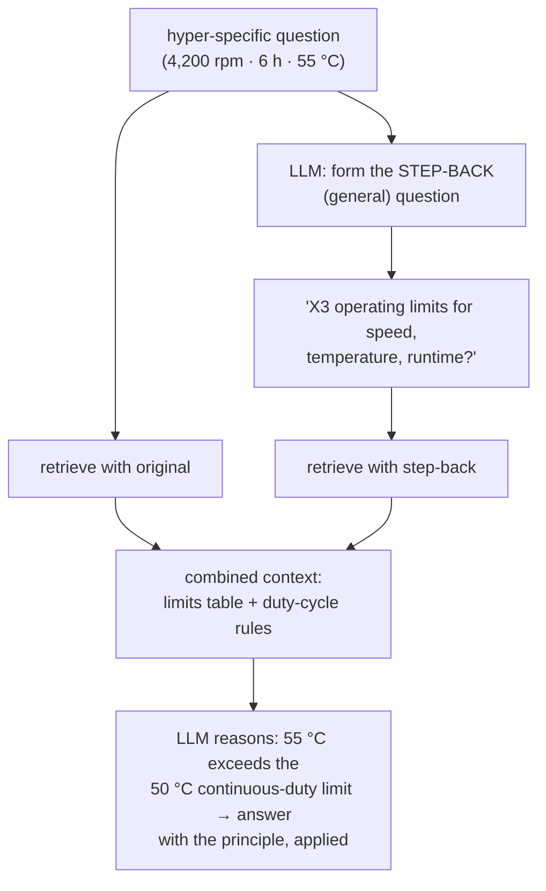

Note what happened at the end: the LLM *applied* a general principle to the specific case.
Step-back deliberately splits the work — **retrieval fetches principles, generation does
the applying.** That's why it excels at reasoning-flavored questions (physics-style,
policy-application, "is this allowed?" cases) where direct retrieval keeps whiffing.

---

## 9. Technique 6 — Sub-question decomposition (divide and retrieve)

**Fixes shape 2 (compound questions).** A compound question forces one embedding to point
in several directions at once:

> *"Compare the X3 and X5 warranty terms, and which one is quieter?"*

That's **three** retrieval targets (X3 warranty · X5 warranty · noise levels of both),
probably living in three different documents. One blended query vector lands *between*
them — the classic way multi-part questions come back half-answered. Decomposition asks the
LLM to split the question into standalone sub-questions, retrieves **for each
independently**, then synthesizes:

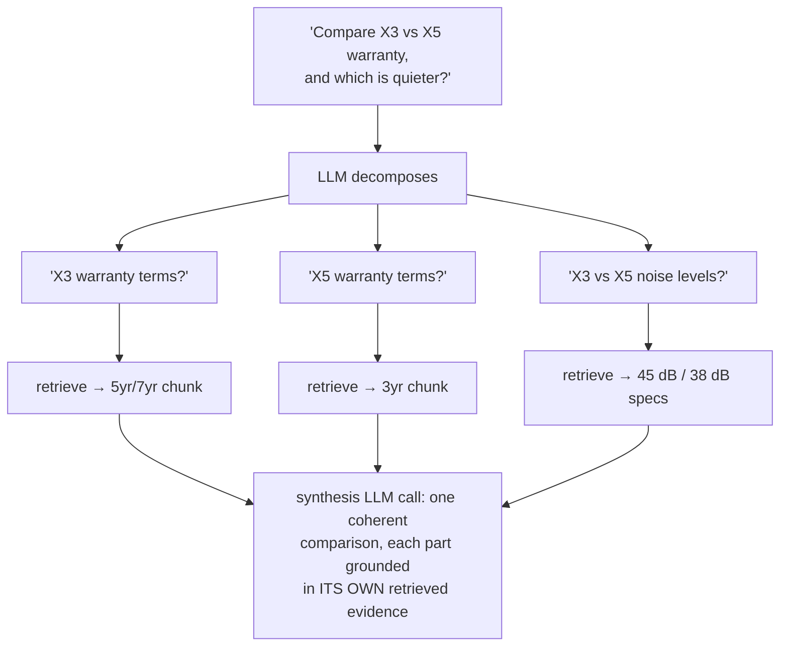

Each sub-query is sharp and single-target — each retrieval is easy. The final answer is
assembled from *complete* evidence instead of whatever a blurry blended query happened to
catch.

**The advanced variant — sequential decomposition** for questions whose parts *depend on
each other* (multi-hop): *"Does the pump our Berlin office uses support 230 V?"* → first
find *which pump Berlin uses* (answer: X5), **then** — using that answer — ask *"does the
X5 support 230 V?"*. Sub-question 2 couldn't even be *written* before sub-question 1 was
answered. Chain-retrieval like this is the doorstep of [Tier 5's agentic RAG](../advanced-rag-patterns/Introduction.md) —
a loop of ask → retrieve → learn → ask again. (And when questions are *mostly* multi-hop
over relationships, [Tier 6's Graph RAG](../graph-rag-knowledge-graph/Introduction.md) attacks
the same pain at the index level.)

**Cost:** the heaviest technique — decompose call + N retrievals + synthesis call. Reserve
it for genuinely compound/multi-hop traffic, ideally *routed* to it (§11) rather than
applied to everything.

---

## 10. Technique 7 — Self-query: extract the filters

**Fixes a shape hiding inside shapes 1–5: constraints phrased as prose.** Users state hard
constraints in natural language:

> *"Show me AquaPump manuals from 2025 or later about winter maintenance"*

Semantic search treats *all* of that as fuzzy meaning — but "2025 or later" isn't fuzzy!
It's a **filter** (Tier 3 §8), and semantic similarity is the wrong tool for it: a
2019 manual about winter maintenance is *semantically identical* to a 2025 one. Self-query
uses an LLM to **split the query into a semantic part and structured filters**:

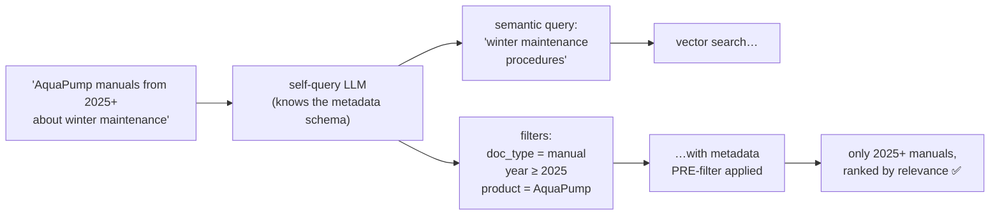

The LLM is shown your metadata schema (which fields exist, their types and values — this is
why [Tier 1 §12](../indexing-and-chunking/Introduction.md)'s metadata discipline pays off)
and translates prose constraints into exact predicates. The vector search then runs *inside*
the filtered set — pre-filtering, as Tier 3 insists.

**This is the bridge technique:** it's where Tier 4 (transform the query) and Tier 3
(metadata filtering) literally meet in one LLM call. Dates, versions, products, authors,
document types, regions — any corpus with rich metadata + users who mention constraints in
prose gets a big, cheap win here.

---

## 11. Technique 8 — Routing: send the query to the right place

**The meta-technique: not *fixing* the query, but *dispatching* it.** Real systems rarely
have one index. There's the product-docs index, the support-tickets index, the SQL database,
maybe web search. And different queries deserve different *treatment* — cheap direct
retrieval vs. expensive decomposition. A **router** is an LLM (or small classifier) that
reads the query first and picks the destination and/or strategy:

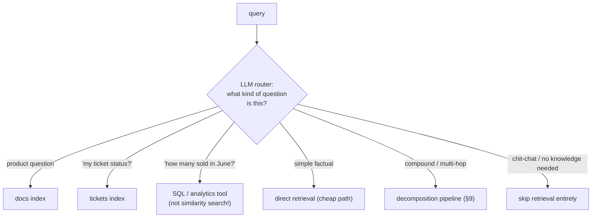

Two routing flavors to know by name:

- **Data-source routing** — *which index/tool answers this?* Includes the crucial
  "this isn't a retrieval question at all" exits (analytics → SQL; greetings → no
  retrieval).
- **Strategy routing** — *how much machinery does this deserve?* Simple question → naive
  retrieval; messy phrasing → multi-query; compound → decomposition. Spend latency where
  the question earns it.

If this smells like [Tier 5's Adaptive RAG](../advanced-rag-patterns/Introduction.md) — 
correct: Adaptive RAG *is* strategy routing grown into a whole architecture. Tier 4 routing
is its lightweight, everyday form: one classification call, big savings.

---

## 12. Choosing and combining: the decision guide

Match the technique to the failure shape you actually observe (Tier 7's metrics + reading
real failed queries tell you which shapes dominate your traffic):

| Your dominant symptom | Reach for |
|---|---|
| Follow-up questions in chat retrieve garbage | **Conversational rewrite (§4)** — non-negotiable for chat |
| Users phrase things casually; docs are technical | **Multi-query (§6)**, expansion (§5), or **HyDE (§7)** if the gap is severe |
| Multi-part questions come back half-answered | **Decomposition (§9)** |
| Hyper-specific questions whiff; principles exist in docs | **Step-back (§8)** |
| Constraints (dates, versions, types) ignored | **Self-query (§10)** |
| Mixed traffic; paying decomposition prices for simple lookups | **Routing (§11)** |

**A sane production stack, in order of adoption:**

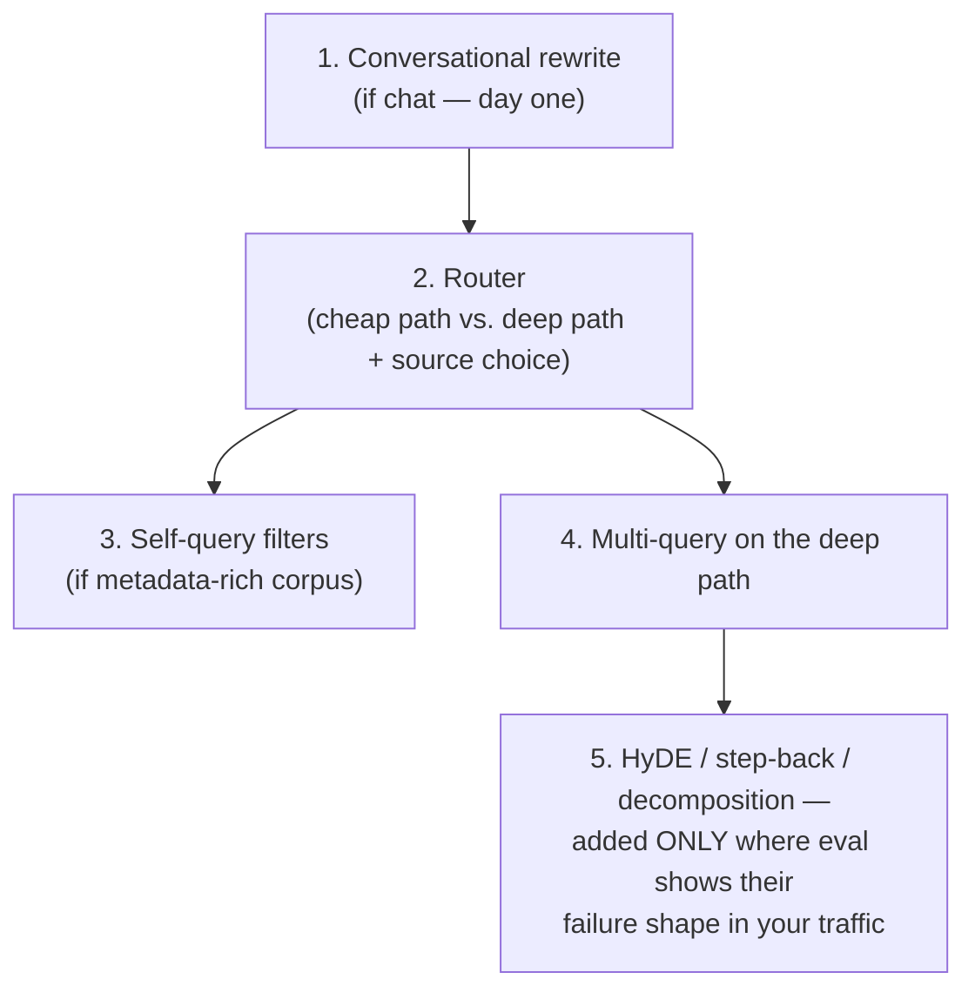

And the two rules that keep this tier honest:

1. **Don't stack blindly.** Rewrite + expansion + multi-query + HyDE + decomposition on
   every query = five LLM calls of latency for gains that may overlap. Each addition must
   defend itself with a metric (Tier 7 discipline — same as every tier).
2. **Transformations multiply retrieval load.** Multi-query ×5 phrasings × decomposition
   ×3 sub-questions = 15 searches per user question. Fine if intentional; ruinous if
   accidental. Know your multiplication factor.

---

## 13. Pitfalls & trade-offs

- **Answering the rewritten question instead of the original.** The transform is for
  *retrieval only*. Generate against the user's actual words, or you'll solve problems
  nobody posed. (§3, invariant 1 — the most common implementation bug in this tier.)
- **Latency creep.** Every technique is ≥1 LLM call *before retrieval even starts*. Use
  small/fast models for transformation calls, run what you can in parallel, and route so
  simple queries skip the machinery.
- **Query drift.** Rewrites and expansions can subtly change what's being asked; HyDE can
  bait the wrong region if the LLM knows nothing about the topic. Spot-check transformed
  queries against originals in your logs — drift is silent.
- **Decomposing the indivisible.** Simple questions forced through decomposition produce
  micro-questions, redundant retrievals, and a worse answer than the naive path. That's
  what routing is for.
- **Self-query without schema discipline.** The filter extractor is only as good as the
  metadata (Tier 1 §12). Inconsistent field values (`"manual"` vs `"Manual"` vs `"docs"`)
  = filters that silently match nothing — which, with pre-filtering, means *zero results*.
- **Trusting one anecdote.** A technique that rescued one embarrassing demo query may do
  nothing (or harm) on the full distribution. Golden test set, before/after, keep-if-moved —
  the same evaluation loop as Tiers 1–3.

---

## 14. Mastery checklist

You've mastered query transformation when you can, from memory:

- [ ] State the tier's core insight: retrieval quality is capped by *query* quality, and expressing a need ≠ matching documents.
- [ ] Name the five failure shapes with an example each, and map each shape to its technique(s).
- [ ] Draw the general pattern (§3) and recite both invariants (answer the original; transformation costs latency).
- [ ] Explain conversational condensation and why chat RAG is broken without it.
- [ ] Contrast expansion (append terms — helps BM25) with rewriting (replace phrasing), and name the query-drift risk.
- [ ] Explain multi-query end to end, including why RRF reappears at the merge.
- [ ] Explain HyDE: why answer-shaped text finds answer-shaped chunks, and why its hallucination is harmless (bait, not answer).
- [ ] Explain step-back's division of labor: retrieval fetches principles, generation applies them.
- [ ] Explain decomposition — and when *sequential* (multi-hop) decomposition is required, and what tier that leads to.
- [ ] Explain self-query as the Tier 4 ↔ Tier 3 bridge (prose constraints → metadata pre-filters).
- [ ] Describe both routing flavors (data-source, strategy) and what each saves.
- [ ] Recite the sane adoption order (§12) and defend rule 1 (don't stack blindly) and rule 2 (know your multiplication factor).

With Tiers 0–4 done, you own the *entire linear pipeline* — data, index, retrieval, and
query. **Next: Tier 5 — [Advanced RAG Patterns](../advanced-rag-patterns/Introduction.md)**,
where the pipeline stops being a straight line and learns to check itself, loop, and act.

---

## Sources

- [Query Transformations: Rewriting, HyDE, and Multi-Query — Jatin Bansal](https://jatinbansal.com/ai-engineering/query-transformations/)
- [In-Depth Understanding of RAG Query Transformation: Multi-Query, Decomposition, Step-Back — DEV Community](https://dev.to/jamesli/in-depth-understanding-of-rag-query-transformation-optimization-multi-query-problem-decomposition-and-step-back-27jg)
- [Which Query Transformation Techniques Actually Help RAG? — Alex Chernysh](https://alexchernysh.com/blog/query-transformation-for-rag)
- [A Deep Dive into Six Advanced Query Transformation Architectures — dmflow](https://www.dmflow.chat/en/blog/rag-query-transformation-guide-6-advanced-architectures)
- [Advanced Query Transformations to Improve RAG — Towards Data Science](https://towardsdatascience.com/advanced-query-transformations-to-improve-rag-11adca9b19d1/)
- [Query Rewrite in RAG Systems: Why It Matters and How It Works — DEV Community](https://dev.to/yaruyng/query-rewrite-in-rag-systems-why-it-matters-and-how-it-works-3mmd)
- [Query rewriting for RAG: how to improve retrieval accuracy — Meilisearch](https://www.meilisearch.com/blog/query-rewrite-rag)
- [Precise Zero-Shot Dense Retrieval without Relevance Labels (the HyDE paper) — arXiv](https://arxiv.org/abs/2212.10496)
- [Take a Step Back: Evoking Reasoning via Abstraction in LLMs (the step-back paper) — arXiv](https://arxiv.org/abs/2310.06117)
- [Query Transformations — NirDiamant/RAG_Techniques (DeepWiki)](https://deepwiki.com/NirDiamant/RAG_Techniques/3.1-query-transformations)
