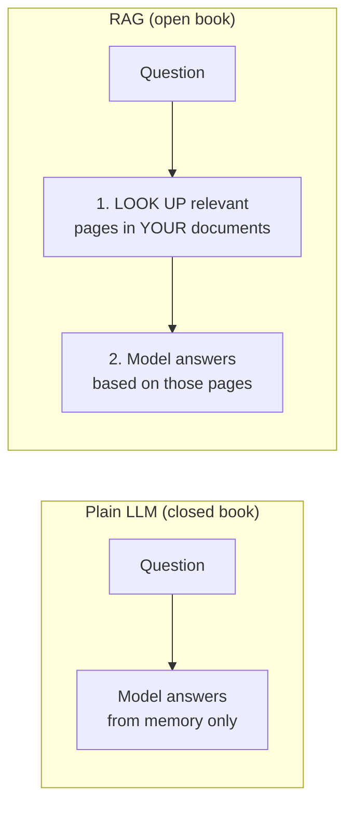
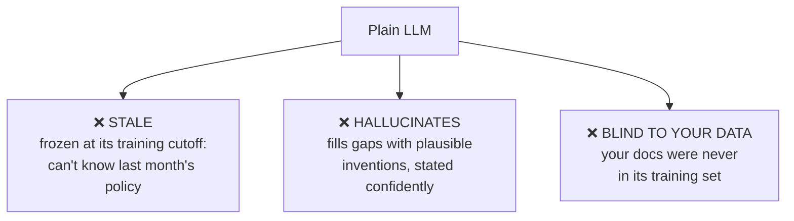
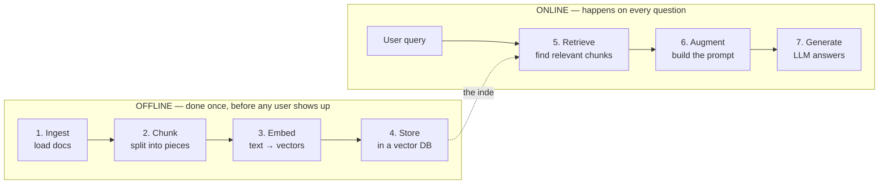
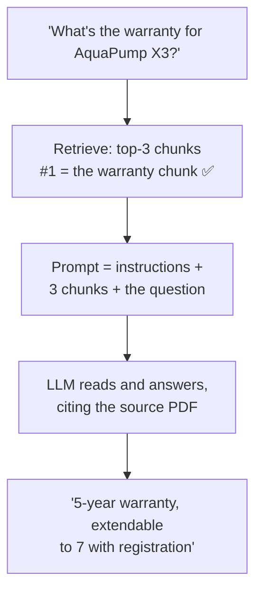
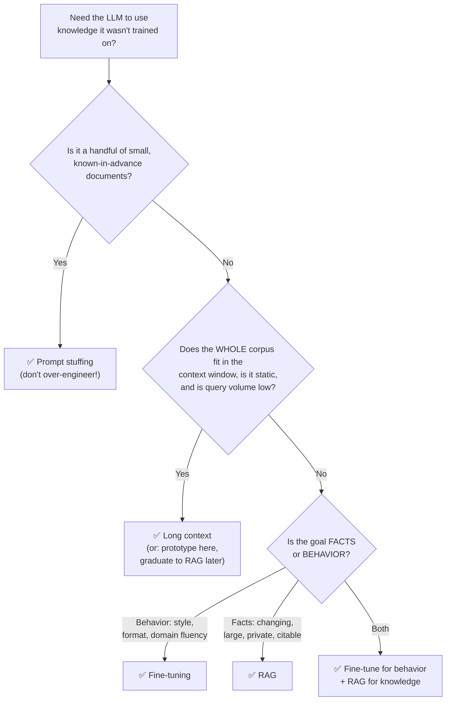

# RAG Foundations — What RAG Is and When to Use It (Beginner → Advanced)

> This is **Tier 0** of the [RAG curriculum](../overview.md) — the ground floor. Before any
> technique, tool, or acronym, you need three things rock-solid: **what problem RAG solves**,
> **how the basic pipeline works end to end**, and **when RAG is the right tool versus its
> alternatives** (fine-tuning, long context windows, prompt stuffing). Everything in Tiers 1–7
> assumes this document.
>
> No code; concepts only, explained from zero, with a running example you can follow through
> the whole pipeline.

---

## Table of Contents

1. [Start here: the open-book exam](#1-start-here-the-open-book-exam)
2. [The three problems every LLM has](#2-the-three-problems-every-llm-has)
3. [The fix, in one sentence](#3-the-fix-in-one-sentence)
4. [The 7-stage pipeline — one question, followed all the way through](#4-the-7-stage-pipeline--one-question-followed-all-the-way-through)
5. [The terminology, properly defined](#5-the-terminology-properly-defined)
6. [RAG vs. the alternatives](#6-rag-vs-the-alternatives)
7. [The decision framework](#7-the-decision-framework)
8. [When NOT to use RAG](#8-when-not-to-use-rag)
9. [Common beginner misconceptions](#9-common-beginner-misconceptions)
10. [Mastery checklist](#10-mastery-checklist)
11. [Sources](#sources)

---

## 1. Start here: the open-book exam

Imagine two students taking an exam:

- **Student A (closed book)** must answer purely from memory. If the exam asks about
  something they never studied — or studied years ago and half-forgot — they either leave it
  blank or, worse, *write something plausible-sounding and wrong*.
- **Student B (open book)** gets the same brain **plus a stack of reference books**. For each
  question, they first *look up* the relevant pages, then write the answer *based on what
  they just read*.

A plain LLM is Student A. **RAG turns it into Student B.**

That's genuinely the whole idea. **RAG = Retrieval-Augmented Generation**:

- **Retrieval** — the look-up step (find the relevant pages).
- **Augmented** — the retrieved text is *added to the prompt* (the model's "open book").
- **Generation** — the LLM writes the answer using what it was handed.

Everything else in this curriculum — chunking, embeddings, vector databases, reranking,
agents — is engineering to make the *look-up step* fast, accurate, and reliable at scale.

---

## 2. The three problems every LLM has

Why does the closed-book student fail? Three specific, structural reasons — and it's worth
knowing all three, because RAG fixes each one differently.

### Problem 1 — Stale knowledge (the knowledge cutoff)

An LLM's knowledge comes from its training data, which was collected up to some date (its
**knowledge cutoff**) and then *frozen*. The model literally cannot know anything that
happened after that day — new products, new prices, new laws, yesterday's meeting notes.

> **Example:** you ask, *"What's our company's current parental-leave policy?"* The policy
> was updated last month. Even a model trained *this year* has never seen it — and never
> will, no matter how you phrase the question.

### Problem 2 — Hallucination (confident nonsense)

An LLM is trained to produce *plausible* text, not *verified* text. When it doesn't know an
answer, it doesn't say "I don't know" by default — it generates something that *sounds*
right, with full confidence. This is called **hallucination**, and it's the single biggest
blocker to using LLMs for anything factual.

> **Example:** ask a plain LLM for the warranty period of your company's product
> "AquaPump X3." It has never heard of it — but it may cheerfully answer *"The AquaPump X3
> comes with a 2-year limited warranty"* because that's the *shape* of a typical warranty
> answer. A customer just got told a made-up fact.

### Problem 3 — No access to private data

Your contracts, internal wikis, support tickets, product specs, and databases were never in
any public training set (thankfully!). To the model, your company's entire knowledge base
simply *does not exist*.

**One root cause behind all three:** the model can only use what's baked into its weights
(this is called **parametric knowledge** — knowledge stored *in the parameters*). Anything
outside the weights is invisible.

---

## 3. The fix, in one sentence

> **RAG makes the model answer from *your* data by retrieving the relevant documents at
> question time and pasting them into the prompt — so the model reads, rather than recalls.**

See how this hits all three problems at once:

| Problem | How RAG fixes it |
|---|---|
| **Stale knowledge** | Retrieval reads your *live* document store. Update a document → the very next question uses the new version. No retraining, ever. |
| **Hallucination** | The prompt says, in effect: *"Answer using ONLY the text below."* The model is **grounded** — its claims are anchored to retrieved text, and you can show the user *citations* ("source: refund-policy.pdf, page 3"). |
| **Private data** | The retrieval index is built from *your* documents. Your knowledge base becomes searchable context the model can be handed. |

And a bonus fix beginners often miss: **access control and auditability.** Because knowledge
lives in a database instead of model weights, you can control *who* retrieves *what*, delete
information (try deleting a fact from a trained model's weights!), and trace exactly which
document produced which answer.

---

## 4. The 7-stage pipeline — one question, followed all the way through

Here is the naive RAG pipeline. Memorize these 7 stages — the entire curriculum is organized
around upgrading them one at a time.

Notice the split: stages 1–4 are **indexing** (offline, done in advance, like a librarian
organizing shelves), stages 5–7 are **querying** (online, per question, like a visitor
asking the librarian).

Now the running example. Your company "HydroTech" has 500 internal PDFs. A support agent
asks: **"What's the warranty period for the AquaPump X3?"**

**Stage 1 — Ingest.** All 500 PDFs are loaded and converted to plain text. (Messier than it
sounds — Tier 1 is largely about this.)

**Stage 2 — Chunk.** Each document is split into small pieces ("chunks"), say ~300 words
each. Why not keep whole documents? Two reasons you'll meet again in Tier 1: retrieval works
better on small, focused pieces, and the prompt can only hold so much text.

> One of those chunks, from `aquapump-x3-spec.pdf`, happens to say:
> *"…The AquaPump X3 is covered by a 5-year manufacturer warranty, extendable to 7 years
> with product registration within 90 days of purchase…"*

**Stage 3 — Embed.** Every chunk is run through an **embedding model**, which converts text
into a list of numbers (a **vector**) that captures its *meaning*. Similar meaning → similar
numbers. (This magic gets a full deep dive in Tier 2 — for now, trust that "meaning becomes
coordinates.")

**Stage 4 — Store.** All chunk vectors go into a **vector database** — a database built to
answer one question fast: *"which stored vectors are most similar to this new one?"*

--- *(a user arrives)* ---

**Stage 5 — Retrieve.** The question *"What's the warranty period for the AquaPump X3?"* is
embedded with the *same* embedding model, and the vector DB returns the top-k most similar
chunks — the warranty chunk above comes back as hit #1.

**Stage 6 — Augment.** A prompt is assembled from a template:

> *"Answer the question using ONLY the context below. If the answer is not in the context,
> say you don't know.*
> *Context: [chunk 1: '…covered by a 5-year manufacturer warranty, extendable to 7 years
> with registration…'] [chunk 2: …] [chunk 3: …]*
> *Question: What's the warranty period for the AquaPump X3?"*

**Stage 7 — Generate.** The LLM reads the prompt and answers: *"The AquaPump X3 has a 5-year
manufacturer warranty, extendable to 7 years if registered within 90 days of purchase
(source: aquapump-x3-spec.pdf)."*

No hallucination — the model didn't *recall* the warranty, it *read* it, from a document the
model had never seen during training, updated as recently as this morning.

> **Where the rest of the curriculum plugs in:** every tier upgrades one stage.
> Chunking better (Tier 1) · embedding & storing better (Tier 2) · retrieving better
> (Tier 3) · fixing the question first (Tier 4) · restructuring the whole loop (Tier 5) ·
> retrieving over graphs (Tier 6) · measuring everything (Tier 7).

---

## 5. The terminology, properly defined

The words used above (and in every RAG article you'll ever read), defined once:

| Term | Definition |
|---|---|
| **LLM (Large Language Model)** | The text-generating model (GPT, Claude, Llama…). In RAG it's the *reader/writer* — it does no searching itself. |
| **Prompt** | The full text handed to the LLM in one request: instructions + retrieved context + the user's question. |
| **Context window** | The maximum amount of text (measured in tokens) the LLM can read in one prompt. The hard budget that everything retrieved must fit into. |
| **Token** | The unit LLMs read/write text in — roughly ¾ of an English word. "Warranty" ≈ 1–2 tokens; this document ≈ thousands. |
| **Knowledge cutoff** | The date the model's training data ends. Everything after it is invisible to a plain LLM. |
| **Parametric knowledge** | What the model "knows" from training, stored in its weights. Fixed, fuzzy, unverifiable. |
| **Non-parametric knowledge** | Knowledge stored *outside* the model (your document index) and handed in at question time. Live, editable, citable. RAG's whole trick is moving facts from parametric to non-parametric. |
| **Hallucination** | The model generating plausible-but-false statements, confidently, to fill a knowledge gap. |
| **Grounding** | Forcing the answer to be based on supplied source text ("answer only from the context below"). The opposite of hallucinating. |
| **Chunk** | A small piece of a document (a few hundred tokens) — the unit that gets embedded, stored, and retrieved. |
| **Embedding / vector** | A list of numbers representing a text's *meaning*, produced by an embedding model. Similar meaning → nearby vectors. |
| **Vector database** | A database specialized for "find the stored vectors nearest to this one" — the index behind retrieval. |
| **Top-k** | The number of best-matching chunks retrieval returns (e.g. top-5). |
| **Indexing vs. querying** | The offline phase (ingest→store, done in advance) vs. the online phase (retrieve→generate, per question). |

---

## 6. RAG vs. the alternatives

RAG is *one* way to give an LLM knowledge it doesn't have. There are three others, and
interviews, design docs, and architecture debates constantly compare them. Each gets an
analogy, a mechanism, and its honest pros/cons.

### 6.1 Prompt stuffing — "tape the note to the question"

**What it is:** manually paste the relevant text into the prompt yourself. No retrieval
system — *you* are the retrieval system.

> *"Here's our refund policy: [pastes 2 pages]. Now answer: can a customer return an opened
> item?"*

**When it's right:** you have *one or a few small documents*, known in advance. This is
what you do in a chat UI every day, and it's perfect for it. **When it breaks:** the moment
you have more text than fits in the context window, or you don't know *which* document is
relevant until the question arrives. RAG is literally "prompt stuffing with an automated,
scalable chooser."

### 6.2 Long context windows — "hand over the whole book every time"

**What it is:** modern models accept huge contexts (hundreds of thousands, even millions of
tokens). So skip retrieval — dump your *entire* knowledge base into every single prompt.

**The analogy:** instead of looking up the relevant page, Student B photocopies **the whole
library** and staples it to every exam answer.

**When it's right:** small, static corpus (fits comfortably in the window), low query
volume, or quick prototyping — it's the *simplest possible* setup and great for validating
an idea before building a pipeline.

**When it breaks — three ways:**

1. **Cost & latency.** You pay for every token, *on every question*. Recent head-to-head
   testing found the long-context approach cost roughly **24× more** than an equivalent RAG
   pipeline at scale. Great for prototyping, terrible for production volume.
2. **Lost in the middle.** Models attend best to the *start* and *end* of a long context;
   accuracy on facts buried in the middle can drop by 10–20+ percentage points. Bigger
   window ≠ reliable use of everything in it.
3. **It still doesn't scale.** Corpora grow. 500 PDFs might fit today; 50,000 never will.

### 6.3 Fine-tuning — "send the model back to school"

**What it is:** continue training the model on your own examples, actually changing its
weights.

**The analogy:** instead of giving Student A a reference book, you enroll them in a
months-long course on your company. Afterward they *genuinely know* the material — as of
the day the course ended.

**The critical insight (this one sentence resolves most RAG-vs-fine-tuning debates):**

> **Fine-tuning teaches the model HOW to behave; RAG gives it WHAT to know.**
> Fine-tuning is for *skills, style, and format*. RAG is for *facts*.

**When fine-tuning is right:** a fixed output format or tone ("always respond in our
support-ticket JSON schema"), domain *language* fluency (legal/medical phrasing), or hard
latency budgets (no retrieval round-trip). **When it's wrong:** as a way to add facts.
Facts learned by fine-tuning are stale the moment data changes (retrain to update!), can't
be cited, can't be deleted, can't be access-controlled — and empirically, fine-tuning is a
*poor* mechanism for injecting new factual knowledge in the first place; the model tends to
gain the *style* of your documents faster than their *content*.

**The production pattern isn't either/or:** serious systems often **combine** them —
fine-tune for behavior (format, tone, refusal style) *and* RAG for knowledge. They upgrade
different layers of the same system.

### 6.4 All four, side by side

| | Prompt stuffing | Long context | Fine-tuning | RAG |
|---|---|---|---|---|
| Analogy | tape a note to the question | staple the whole library | send back to school | librarian finds the page |
| Knowledge freshness | as fresh as your paste | as fresh as the dump | frozen at training day | live — edit the index |
| Scales to big corpora | ❌ | ❌ (window limit) | ✅ (in weights) | ✅ (search scales) |
| Cost per query | low–medium | **very high** | low (after training) | low–medium |
| Up-front effort | none | none | high (data + training) | medium (build pipeline) |
| Citations possible | manual | weak (lost in middle) | ❌ impossible | ✅ natural |
| Delete/control facts | trivial | trivial | ❌ nearly impossible | ✅ delete from index |
| Best at | one-off questions | small static corpus, prototypes | style, format, skills | facts at scale, changing data |

---

## 7. The decision framework

The questions to ask, in order:

Three rules of thumb that decide most real cases:

1. **If the knowledge changes more than ~quarterly → RAG.** Retraining on every change is
   untenable; editing an index is trivial.
2. **If you must show sources or delete data (compliance, trust, GDPR) → RAG.** Only
   non-parametric knowledge can be cited and removed.
3. **If the problem is *how the model writes*, not *what it knows* → fine-tuning.** No
   amount of retrieved context will fix tone, format, or reasoning style.

---

## 8. When NOT to use RAG

Knowing the negative space is part of mastery. RAG is the wrong tool when:

- **The knowledge is already in the model.** "Explain photosynthesis" needs no retrieval —
  adding it just costs latency and can even *hurt* (irrelevant context distracts).
- **The task is transformation, not knowledge.** Summarize *this* email, translate *this*
  paragraph, rewrite *this* code — the input is already in the prompt; there's nothing to
  retrieve.
- **The corpus is tiny and static.** A 5-page FAQ doesn't need a vector database. Stuff it.
- **You need computation, not documents.** "What's our average order value this month?"
  wants a SQL query / analytics tool, not similar-looking text chunks. (Agents that *call*
  such tools are Tier 5 territory.)
- **Behavior is the problem.** Wrong tone, wrong format, weak domain phrasing → fine-tuning
  or prompting, not retrieval.

> **The golden rule (it echoes through every tier):** *start with the simplest thing that
> works — prompt stuffing → long context → naive RAG → advanced RAG — and only climb one
> step when a real, measured limitation forces you to.*

---

## 9. Common beginner misconceptions

- **"RAG trains the model on my data."** No — the model is *never modified*. RAG only
  changes what text is pasted into the prompt. (That's why it works instantly and why facts
  can be deleted.)
- **"The LLM searches the database."** No — the *retriever* (embedding model + vector DB)
  does the searching, before the LLM is even called. The LLM just reads what it's handed.
  Naive RAG's LLM has no idea a search happened.
- **"RAG eliminates hallucination."** It *reduces* it, a lot — but the model can still
  misread context, over-extrapolate, or answer despite the context lacking the fact. That's
  why grounding instructions ("say you don't know if it's not in the context") and
  evaluation (Tier 7's groundedness metric) exist.
- **"Bigger context windows will make RAG obsolete."** The cost math (§6.2), lost-in-the-
  middle behavior, and ever-growing corpora say otherwise. Windows keep growing; so does
  data. Retrieval *selects*; selection stays valuable at any window size.
- **"RAG answers are always correct."** RAG answers are only as good as (a) what got
  retrieved and (b) what's actually in your documents. Garbage documents → grounded garbage.
  Retrieval failures (the whole of Tier 3) → wrong context → wrong answer with a *citation*.

---

## 10. Mastery checklist

You've mastered the foundations when you can, from memory:

- [ ] Explain RAG with the open-book exam analogy, and unpack all three words in the acronym.
- [ ] Name the three LLM problems (stale knowledge, hallucination, no private data) with a concrete example of each.
- [ ] Explain parametric vs. non-parametric knowledge, and why moving facts out of the weights enables freshness, citations, and deletion.
- [ ] Walk the 7 stages with a running example, and say which stages are offline (indexing) vs. online (querying).
- [ ] Define: context window, token, knowledge cutoff, grounding, chunk, embedding, vector DB, top-k.
- [ ] Give the one-sentence rule: fine-tuning = HOW to behave, RAG = WHAT to know.
- [ ] Explain the three ways long context breaks at scale (cost, lost-in-the-middle, growth).
- [ ] Reproduce the 4-way comparison table and the decision flowchart.
- [ ] List three situations where RAG is the *wrong* tool.
- [ ] Correct all five misconceptions in §9 without looking.

If all boxes tick, move to **Tier 1 — [Indexing & Chunking](../indexing-and-chunking/Introduction.md)**:
the messy, decisive work of preparing your documents, where most real-world quality problems
are born.

---

## Sources

- [Retrieval-Augmented Generation for Knowledge-Intensive NLP Tasks (the original RAG paper) — arXiv](https://arxiv.org/abs/2005.11401)
- [A beginner's guide to building a RAG application from scratch — learnbybuilding.ai](https://learnbybuilding.ai/tutorial/rag-from-scratch/)
- [RAG for Dummies: A Beginner's Guide — Medium](https://michielh.medium.com/rag-for-dummies-a-beginners-guide-to-retrieval-augmented-generation-ac3348d31302)
- [RAG Tutorial: A Beginner's Guide — SingleStore](https://www.singlestore.com/blog/a-guide-to-retrieval-augmented-generation-rag/)
- [RAG vs Fine-tuning vs Long Context: When to Use What — Medium](https://medium.com/@officialpreksha2166/rag-vs-fine-tuning-vs-long-context-when-to-use-what-and-why-most-teams-get-it-wrong-388cc446ff3c)
- [I Tested RAG vs Fine-Tuning vs Long-Context on the Same Docs — Towards AI](https://pub.towardsai.net/i-tested-rag-vs-fine-tuning-vs-long-context-on-the-same-docs-the-1m-token-window-collapsed-at-24x-0cf96ad88eee)
- [RAG vs Large Context Window: Real Trade-offs — Redis](https://redis.io/blog/rag-vs-large-context-window-ai-apps/)
- [Fine-tuning vs RAG: a decision framework — DEV Community](https://dev.to/ayinedjimi-consultants/fine-tuning-vs-rag-a-decision-framework-with-examples-3g8k)
- [When to fine tune a model vs use RAG — Mallow Technologies](https://mallow-tech.com/blog/fine-tune-vs-rag/)
- [Lost in the Middle: How Language Models Use Long Contexts — arXiv](https://arxiv.org/abs/2307.03172)
