# Retrieval Strategies — The Core Skill of RAG (Beginner → Advanced)

> This is **Tier 3** of the [RAG curriculum](../overview.md) — the tier where "good" RAG
> separates from "naive." Everything before this tier prepared the data (chunking, embeddings,
> vector stores); everything after it (query transformation, advanced patterns) assumes you
> can already *retrieve well*. This is the highest-ROI tier in the whole track.
>
> This document walks through every major retrieval strategy from first principles —
> **keyword/sparse search (TF-IDF, BM25), dense/semantic search, hybrid search with RRF,
> reranking with cross-encoders, metadata filtering, context compression**, and the advanced
> frontier (**MMR, learned sparse, late interaction / ColBERT, parent-document retrieval**) —
> each with a diagram, a worked example, the problem it solves, and when to use it.
> No code; concepts only, from beginner to advanced.

---

## Table of Contents

1. [The big picture: where retrieval sits](#1-the-big-picture-where-retrieval-sits)
2. [The core problem: two kinds of "matching"](#2-the-core-problem-two-kinds-of-matching)
3. [Strategy 1 — Sparse / keyword search (TF-IDF → BM25)](#3-strategy-1--sparse--keyword-search-tf-idf--bm25)
4. [Strategy 2 — Dense / semantic search (vector similarity)](#4-strategy-2--dense--semantic-search-vector-similarity)
5. [Sparse vs. dense: strengths, weaknesses, failure modes](#5-sparse-vs-dense-strengths-weaknesses-failure-modes)
6. [Strategy 3 — Hybrid search + Reciprocal Rank Fusion (RRF)](#6-strategy-3--hybrid-search--reciprocal-rank-fusion-rrf)
7. [Strategy 4 — Reranking (cross-encoders and the two-stage funnel)](#7-strategy-4--reranking-cross-encoders-and-the-two-stage-funnel)
8. [Strategy 5 — Metadata filtering](#8-strategy-5--metadata-filtering)
9. [Strategy 6 — Context compression](#9-strategy-6--context-compression)
10. [Advanced frontier: MMR, SPLADE, ColBERT, parent-document retrieval](#10-advanced-frontier-mmr-splade-colbert-parent-document-retrieval)
11. [Tuning knobs: top-k, thresholds, and chunk windows](#11-tuning-knobs-top-k-thresholds-and-chunk-windows)
12. [Putting it all together: the production retrieval stack](#12-putting-it-all-together-the-production-retrieval-stack)
13. [Pitfalls & trade-offs](#13-pitfalls--trade-offs)
14. [Mastery checklist](#14-mastery-checklist)
15. [Sources](#sources)

---

## 1. The big picture: where retrieval sits

In the 7-stage naive pipeline, retrieval is **stage 5** — the moment a user query meets your
indexed data. Every strategy in this document is an upgrade to that single stage:

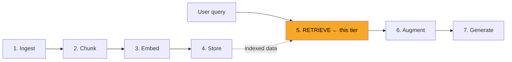

Why this tier matters more than any other:

- **The LLM can only answer from what retrieval gives it.** If the right chunk isn't in the
  context, no amount of prompt engineering or model quality can save the answer. Retrieval is
  the *ceiling* on your whole system's quality.
- **It's the cheapest place to improve.** Swapping in hybrid search or adding a reranker takes
  hours and often moves answer quality more than months of fiddling elsewhere.
- **Everything downstream diagnoses back to here.** When the Evaluation tier's *Context
  Relevance* metric is low, the fix lives in this document.

> **Mental model:** think of retrieval strategies as a **funnel** — cheap, broad methods cast a
> wide net over millions of chunks; expensive, precise methods refine the survivors. Most of
> this tier is learning what belongs at each funnel stage.

---

## 2. The core problem: two kinds of "matching"

Every retrieval strategy is an answer to one deceptively simple question: *given a query, which
chunks are relevant?* The difficulty is that "relevant" can mean two different things:

**Lexical match** — the chunk contains the *same words* as the query.

> Query: `"error code E-1043"` → the chunk that literally contains `E-1043` is the answer.
> A synonym won't do. Exact tokens matter.

**Semantic match** — the chunk means the *same thing* as the query, even with zero shared words.

> Query: `"my laptop won't turn on"` → the best chunk might say *"the notebook fails to boot
> when the power adapter is faulty."* Not one important word overlaps, yet it's exactly right.

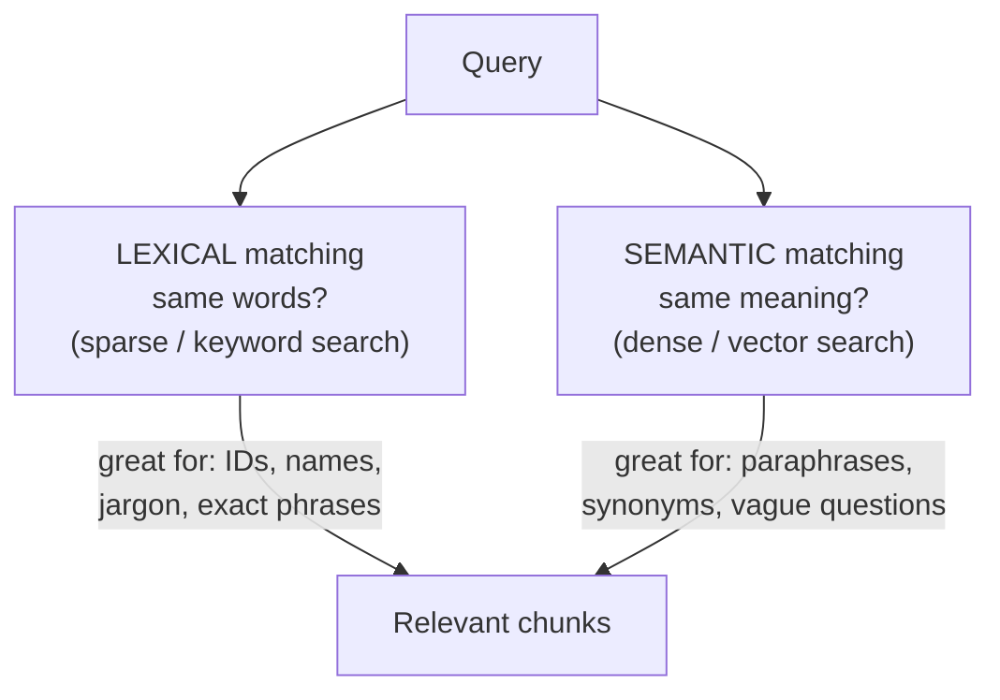

Neither kind of matching is "better" — **real query traffic always contains both kinds**, which
is why the single most important idea in this tier is:

> **The two search families fail in opposite ways, so combining them (hybrid search) is
> usually the single highest-ROI upgrade in all of RAG.**

Hold that thought; first, each family from the ground up.

---

## 3. Strategy 1 — Sparse / keyword search (TF-IDF → BM25)

"Sparse" search is classic full-text search — the technology behind decades of search engines.
It's called *sparse* because each document is represented as a huge vector with one slot per
vocabulary word, and almost every slot is zero (a 300-word chunk touches ~200 of, say, 50,000
vocabulary words).

### 3.1 The intuition, built in three steps

**Step 1 — Term Frequency (TF):** a document that mentions `"refund"` five times is probably
more about refunds than one that mentions it once. *Count matters.*

**Step 2 — Inverse Document Frequency (IDF):** the word `"the"` appears everywhere, so matching
it means nothing. The word `"chargeback"` appears in 0.1% of documents, so matching it means a
lot. *Rare words carry more signal.* TF × IDF together = **TF-IDF**, the 1970s foundation.

**Step 3 — BM25 fixes TF-IDF's two blind spots:**

1. **Saturation** — the 50th occurrence of `"refund"` shouldn't count as much as the 2nd.
   BM25 makes term frequency *saturate* (diminishing returns) instead of growing linearly.
2. **Length normalization** — a 3,000-word document naturally repeats words more than a
   100-word one; BM25 penalizes long documents so they can't win on volume alone.

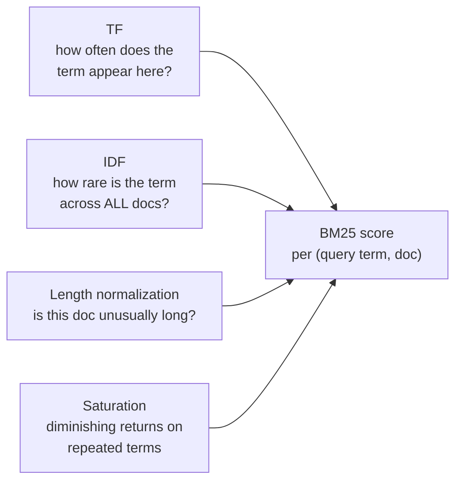

### 3.2 The terminology, properly defined

Every term used above (and everywhere BM25 comes up in papers, docs, and vector-DB settings),
defined once so nothing stays hand-wavy:

| Term | Definition |
|---|---|
| **Term** | A single searchable word/token after basic processing (lowercasing, etc.). The unit BM25 scores on. |
| **Document** | The unit being scored and returned. In RAG, your *chunk* is the "document." |
| **Corpus** | The full collection of documents/chunks being searched. IDF is computed across the whole corpus. |
| **Term Frequency (TF)** | How many times a term appears *in one document*. The "aboutness" signal: 5 mentions of `refund` > 1 mention. |
| **Document Frequency (DF)** | How many documents *in the corpus* contain the term at least once. High DF = common word. |
| **Inverse Document Frequency (IDF)** | The rarity weight, computed from DF: roughly `log(total docs / docs containing the term)`. Rare terms (low DF) get a big IDF and dominate the score; ubiquitous terms get an IDF near zero. |
| **TF-IDF** | The classic 1970s scoring scheme: `TF × IDF` per term, summed over query terms. BM25 is its refined successor. |
| **Stop words** | Extremely common words (`the`, `for`, `is`) that carry no search signal. IDF naturally crushes their weight to ~0; many systems also just delete them at index time. |
| **Saturation** | BM25's diminishing-returns curve on TF: the score gain from the 2nd occurrence is large, from the 50th nearly nil. Prevents keyword-stuffed documents from winning on repetition. Controlled by the **k1** parameter (typical default ≈ 1.2–2.0; higher k1 = slower saturation, repetition keeps counting for longer). |
| **Length normalization** | The penalty that stops long documents from winning just because more words fit in them. TF is scaled by the document's length relative to the corpus-average length. Controlled by the **b** parameter (0 = no penalty, 1 = full penalty; default ≈ 0.75). |
| **Inverted index** | The data structure that makes all this fast: a map from each term → the list of documents containing it (like a book's index). Query time = look up only the query's terms, never scan the corpus. This is why BM25 is cheap at any scale. |
| **Sparse vector** | The representation view of a document: one slot per vocabulary word (tens of thousands of slots), almost all zeros. "Sparse search" is named after this shape — contrast with the *dense* vectors of §4, where every dimension is filled. |
| **Vocabulary mismatch problem** | BM25's structural blind spot: if the query and the document express the same idea with different words (`laptop won't turn on` vs. `notebook fails to boot`), the score is ~0 no matter how relevant the document is. The core motivation for dense search and hybrid search. |
| **Okapi BM25** | The full name. "Okapi" was the 1980s–90s London research retrieval system it shipped in; "BM25" = "Best Matching, formula #25" — literally the 25th ranking function the researchers tried. It stuck because it kept winning evaluations, and it's still the default in Elasticsearch, OpenSearch, and every serious full-text engine today. |

> **Practical note:** `k1` and `b` are the *only* two knobs BM25 has, and the defaults
> (k1 ≈ 1.2, b ≈ 0.75) are good for almost everything. Tune them only with an eval set in
> hand (§11's discipline applies here too) — e.g. very short chunks sometimes benefit from
> lowering `b`, since length hardly varies.

### 3.3 A worked example

Corpus of 3 chunks; query: **"refund policy for damaged items"**.

| Chunk | Content (abridged) | Why BM25 scores it this way |
|---|---|---|
| A | "Our **refund policy**: **refunds** are issued within 14 days…" | High — hits `refund` (rare-ish, repeated but saturating) and `policy` |
| B | "**Damaged items** may be returned; a **refund** is processed after inspection…" | Highest — hits `refund`, `damaged`, `items`: more distinct query terms |
| C | "For shipping questions, contact support…" | ~0 — only stop-word-level overlap (`for`) which IDF crushes to nothing |

Notice what BM25 rewards: **covering more distinct rare query terms** beats repeating one term
many times. That's saturation + IDF working together.

### 3.4 Where sparse search wins and loses

- ✅ **Wins:** exact identifiers (`E-1043`, `SKU-77812`), product/person names, legal or medical
  jargon, acronyms, code symbols, quoted phrases. Also: no ML model needed, blazing fast,
  fully explainable ("it matched because of these words").
- ❌ **Loses:** the **vocabulary mismatch problem**. Query says `"laptop won't turn on"`, doc
  says `"notebook fails to boot"` → BM25 scores it near zero. Synonyms, paraphrases,
  cross-lingual queries, and vague questions are invisible to it.

---

## 4. Strategy 2 — Dense / semantic search (vector similarity)

Dense search is the "new" half (and the one naive RAG uses by default). An **embedding model**
maps every chunk to a point in a high-dimensional space (e.g. 768 or 1536 numbers) where
**distance ≈ difference in meaning**. Retrieval = embed the query, find the nearest chunk
vectors (via cosine similarity, using the ANN indexes from Tier 2).

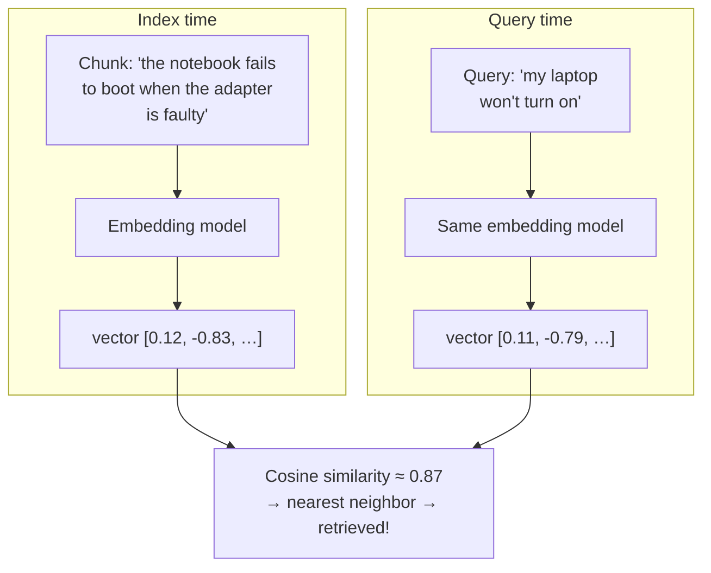

### 4.1 Why it works: meaning as geometry

The embedding model was trained on billions of sentence pairs so that texts humans consider
similar end up *close together*. `"laptop won't turn on"` and `"notebook fails to boot"` share
no keywords, but they land millimeters apart in embedding space — dense search finds the match
that BM25 is structurally blind to.

### 4.2 A worked example (same query as before)

Query: **"refund policy for damaged items"** — but now imagine chunk D exists:

| Chunk | Content (abridged) | BM25 | Dense |
|---|---|---|---|
| B | "Damaged items may be returned; a refund is processed…" | ✅ high | ✅ high |
| D | "If your order arrives **broken**, we'll give your **money back** within two weeks." | ❌ ~0 (no shared keywords!) | ✅ high (same meaning) |
| E | "Refund of the security deposit for the **conference room** rental…" | ✅ decent (has `refund`) | ❌ low (different topic) |

Chunk D is the dense-search victory: perfect answer, zero keyword overlap. Chunk E is the
dense-search victory *in the other direction*: BM25 is fooled by the shared word `refund`,
while the embedding knows conference-room deposits are a different subject.

### 4.3 Where dense search wins and loses

- ✅ **Wins:** paraphrases, synonyms, vague/conversational questions, "find me something like
  this," multilingual retrieval (good models embed all languages into one space).
- ❌ **Loses:**
  - **Exact tokens** — embeddings blur `E-1043` and `E-1044` into nearly identical vectors;
    for a part-number lookup, that's catastrophic.
  - **Out-of-domain jargon** — an embedding model that never saw your internal product names
    treats them as noise.
  - **Opacity** — you can't easily explain *why* a chunk scored 0.83.
  - **It always returns *something*** — the nearest neighbor of a nonsense query is still
    returned with a confident-looking score. Dense search has no natural notion of "no match."

---

## 5. Sparse vs. dense: strengths, weaknesses, failure modes

The exam-grade summary. The two families are **mirror images** — every row shows opposite
behavior:

| Dimension | Sparse (BM25) | Dense (vectors) |
|---|---|---|
| Matches on | Exact words | Meaning |
| Synonyms / paraphrase | ❌ blind | ✅ core strength |
| Exact IDs, names, jargon | ✅ core strength | ❌ blurs them |
| Unseen/out-of-domain terms | ✅ fine (just tokens) | ❌ degrades |
| Explainability | ✅ "matched these words" | ❌ opaque score |
| "No good match" detection | ✅ score ≈ 0 is meaningful | ❌ always returns *something* |
| Infra cost | Tiny (inverted index) | Embedding model + vector DB |
| Typical failure | Vocabulary mismatch | Precision loss on exact tokens |

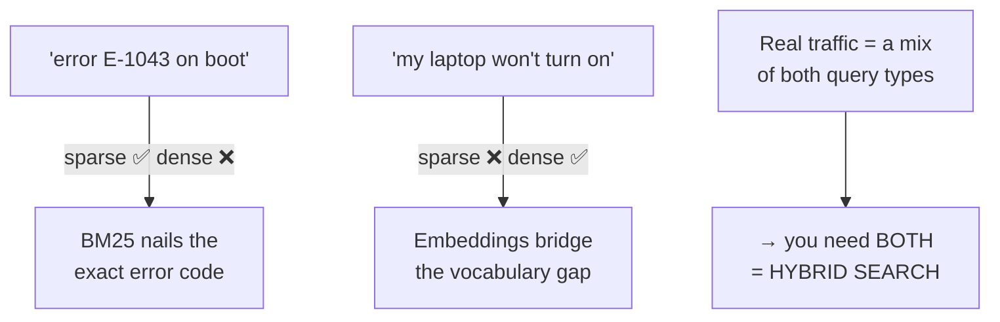

> **Key insight:** you cannot pick a winner, because *your users* won't pick a query style.
> The same support inbox contains `"SKU-77812 warranty"` and `"the thing I bought is broken"`.
> This is why the next strategy exists.

---

## 6. Strategy 3 — Hybrid search + Reciprocal Rank Fusion (RRF)

**Hybrid search = run sparse AND dense in parallel, then fuse the two ranked lists into one.**
It is widely considered the single highest-ROI upgrade in RAG: one architectural change that
covers both failure modes at once.

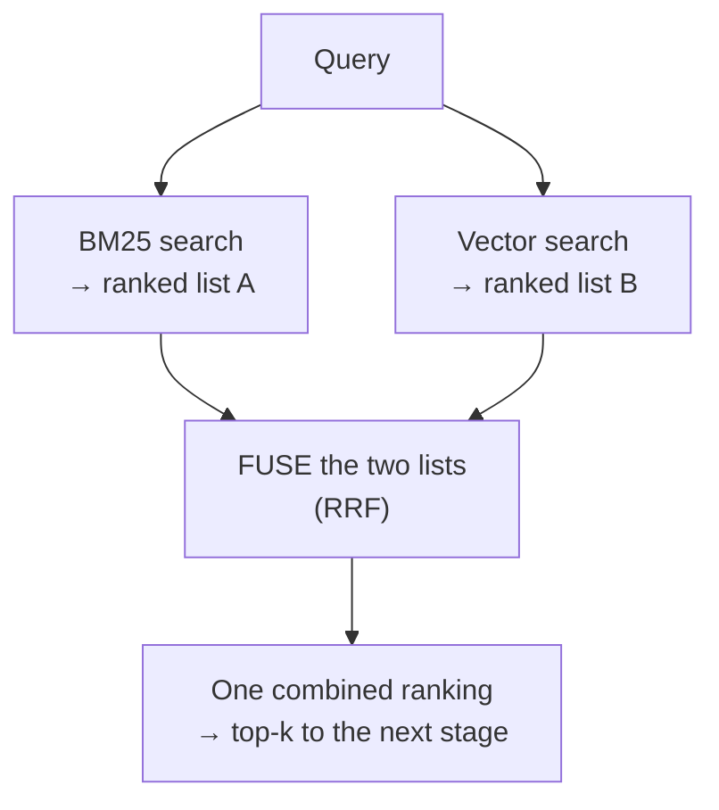

### 6.1 The fusion problem

You now have two ranked lists — but their scores live on **incomparable scales** (BM25 might
score 0–40, cosine similarity 0–1). Naively adding scores is meaningless. The standard fix:

### 6.2 Reciprocal Rank Fusion (RRF) — fuse by *rank*, not score

RRF ignores the raw scores entirely and uses only each document's **position** in each list:

> **RRF score of a document = sum over each list of  1 / (k + rank in that list)**
> where `k` is a smoothing constant, conventionally **60**, and rank starts at 1.

A worked example (using k = 60):

| Doc | BM25 rank | Vector rank | RRF = 1/(60+r₁) + 1/(60+r₂) | Final |
|---|---|---|---|---|
| Doc B | 1 | 3 | 1/61 + 1/63 = 0.0164 + 0.0159 = **0.0323** | 🥇 1st |
| Doc E | 3 | 8 | 1/63 + 1/68 = 0.0159 + 0.0147 = **0.0306** | 🥈 2nd |
| Doc D | *(absent)* | 1 | 0 + 1/61 = **0.0164** | 🥉 3rd |
| Doc A | 2 | *(absent)* | 1/62 + 0 = **0.0161** | 4th |

Two behaviors to internalize from the math:

1. **Appearing in *both* lists is powerful.** Doc E is only mediocre in each list (ranks 3
   and 8), yet it outscores Doc D, which was *#1* in a list — RRF treats *cross-method
   agreement* as strong evidence of relevance.
2. **A single-list gem still survives.** Doc D (the dense-only match with zero keyword
   overlap) isn't drowned out — it lands 3rd, ahead of Doc A, and comfortably inside any
   reasonable top-k that moves on to the reranker.

Why `k = 60`? It dampens the gap between rank 1 and rank 2 (1/61 vs. 1/62 — tiny) so a single
list can't dominate, while still preserving order. It's an empirically robust default; you'll
almost never need to tune it.

> **Weighted variants:** many vector DBs (Weaviate, Qdrant, OpenSearch, pgvector setups) expose
> an **alpha** parameter — `alpha = 1` pure dense, `alpha = 0` pure sparse, `0.5` balanced —
> either as weighted RRF or normalized score fusion. Tune it against your eval set: jargon-heavy
> corpora (legal, medical, code) usually want more sparse weight; conversational Q&A wants more
> dense.

**When to use hybrid:** almost always. The exceptions are corpora that are *purely* one type —
e.g. a pure code-symbol index (sparse alone can suffice) or a corpus of casual chat with no
jargon (dense alone can suffice). If in doubt, hybrid.

---

## 7. Strategy 4 — Reranking (cross-encoders and the two-stage funnel)

**One sentence:** reranking means *search twice* — first a fast, rough search picks ~50
candidates out of millions, then a slower, smarter model re-reads just those 50 and puts the
truly best 3–5 on top.

Why bother? Because in RAG only the top few chunks fit into the prompt. Hybrid search (§6) is
good at getting the right chunk *somewhere into* the top 50 — but "somewhere in the top 50"
isn't good enough when only the top 5 reach the LLM. Reranking fixes the *order*.

### 7.1 Start with an analogy: hiring for a job

Imagine 1,000,000 people apply for one job. You cannot interview a million people.
So every company does the same two-step:

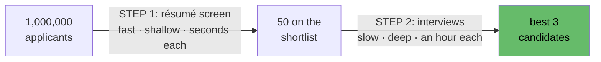

- **Step 1 — résumé screening.** Fast and shallow. You skim keywords and summaries. It
  *sometimes ranks people wrongly* (a great candidate with a plain résumé sits at #40), but
  that's fine — its only job is to make sure good people are *on the shortlist at all*.
- **Step 2 — interviews.** Slow and deep. You talk to each shortlisted person directly and
  find out who is *actually* best. Far more accurate — but only affordable because there are
  50 people now, not a million.

Retrieval in RAG is exactly this:

| Hiring | RAG |
|---|---|
| 1M applicants | 1M chunks in the vector DB |
| Résumé screen (fast, shallow) | **Stage 1: hybrid search** (§3–6) |
| The shortlist of 50 | The retrieved top-50 candidates |
| Interviews (slow, deep) | **Stage 2: the reranker** |
| Final 3 hires | Top 3–5 chunks that enter the prompt |

### 7.2 Why is stage 1 "shallow"? The sealed-envelope problem

Here's the key thing to understand — *why* can't the vector search from §4 just rank
perfectly on its own?

Because of *when* the work happens. In dense retrieval, every chunk was compressed into
**one single vector at index time — before your query ever existed**. The chunk's vector is
like a sealed envelope containing a one-line summary of the chunk, written in advance, with
no idea what question would someday be asked. At query time, all the system does is compare
your query's one-line summary against a million pre-written one-line summaries.

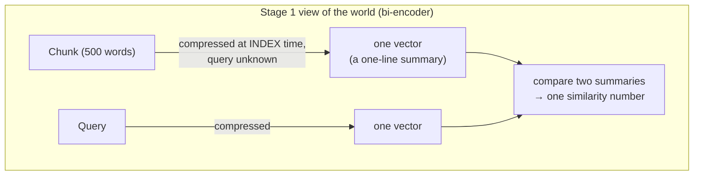

A one-line summary of a 500-word refund policy can say *"this is about refunds"* — but it
cannot preserve every fine distinction, like whether it covers *opened packaging* vs.
*damaged items* vs. *digital goods*. All of those chunks compress to roughly "refund-ish."
That information was lost when the envelope was sealed. **No comparison of two summaries can
recover detail that the summaries don't contain.**

This architecture — query and document each encoded *separately*, meeting only as two
finished vectors — is called a **bi-encoder** ("bi" = two separate encoders). It's the price
of speed: because chunk vectors are pre-computed, query time is just a fast nearest-neighbor
lookup.

### 7.3 What the reranker does differently: it opens the envelopes

A **cross-encoder** (the model type used for reranking) doesn't compare summaries. It takes
the *actual query text* and the *actual chunk text*, puts them **side by side in one input**,
and reads them together — every word of the query cross-checked against every word of the
chunk ("cross" = the texts cross paths inside the model). Then it outputs one relevance score.

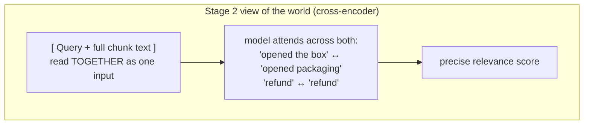

This is the interview instead of the résumé skim: nothing was compressed in advance, nothing
was lost, the judgment is made with both texts fully visible — *for this specific question*.

**So why not cross-encode everything and skip stage 1?** Do the math. A cross-encoder must
run once per (query, chunk) pair, *at query time*, because it needs the query text —
nothing can be pre-computed. One million chunks × even 5 ms each = **83 minutes per query**.
Against 50 shortlisted candidates: 50 × 5 ms = **a quarter of a second**. That's the entire
design in one line:

> **Deep reading doesn't scale to the whole corpus; shallow matching doesn't rank precisely.
> So: shallow-match the million, deep-read the fifty.**

### 7.4 The two stages, side by side

| | Stage 1 — Retriever (bi-encoder + BM25) | Stage 2 — Reranker (cross-encoder) |
|---|---|---|
| Compares | two pre-made summaries (vectors) | the two actual texts, together |
| Chunk processed | once, at index time | again for *every* query |
| Speed | milliseconds over millions | ~ms *per candidate* — fine for 50, impossible for 1M |
| Quality of ranking | rough ("refund-ish") | precise (catches fine distinctions) |
| Job in the funnel | **recall** — get the answer into the pool | **precision** — put the answer on top |
| Typical tools | vector DB + BM25 index | Cohere Rerank, BGE-reranker, MiniLM cross-encoders |

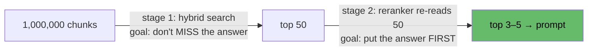

### 7.5 A before / after example

Query: *"Can I get a refund if I opened the box?"*

**Before reranking** — stage 1's ranking (comparing one-line summaries, everything
"refund-ish" looks alike):

| Rank | Chunk | Problem |
|---|---|---|
| 1 | Generic refund policy | close, but doesn't answer the *opened* case |
| 2 | Damaged-items refund policy | wrong case |
| 3 | Digital-goods refund policy | wrong case |
| … | … | |
| 7 | **Opened-packaging clause** ← the actual answer | too deep — never reaches the prompt if you take top-5 |

**After reranking** — the cross-encoder reads the query together with each chunk, notices
that *"opened the box"* matches *"opened packaging"* almost word-for-word in context, and
promotes rank 7 → **rank 1**. The LLM now cites the right clause instead of confidently
citing the wrong one.

That's the whole value proposition: the answer was *already retrieved* (stage 1 did its job),
but it was *badly ordered* — and order is everything when only 5 chunks fit in the prompt.

### 7.6 Cost, and when to use it

- **What it costs:** one small model call per candidate (or a single batched rerank-API
  call) — typically tens to a few hundred milliseconds per query, plus per-call pricing if
  using a hosted reranker.
- **What it buys** (in the Evaluation tier's language): it converts **recall@50 into
  precision@5**. The metrics that prove it worked are **NDCG** and **MRR** — both measure
  whether the best chunk sits at the *top*, which is exactly what reranking changes.
- **When to use it:** whenever answer quality matters more than ~100 ms of latency — which is
  almost every production RAG system. It's the second-highest-ROI upgrade after hybrid
  search.
- **One rule to remember** (also in §13): a reranker can only reorder what stage 1 gives
  it. Reranking a top-5 is pointless — feed it a broad top-50–100, then trust it to sort.

---

## 8. Strategy 5 — Metadata filtering

Retrieval so far treats the corpus as one undifferentiated pile. But your chunks carry
**metadata** (attached back in Tier 1): source, department, date, product version, language,
access level. **Metadata filtering applies hard, structured constraints alongside the fuzzy
search.**

> Query: *"What's the parental-leave policy?"* asked by an employee in **Germany**, where the
> corpus holds HR policies for 12 countries. Semantic similarity alone will happily return the
> US policy — it's *semantically identical*. Only a filter `country = "DE"` can express the
> constraint, because it isn't about similarity at all — it's about **correctness**.

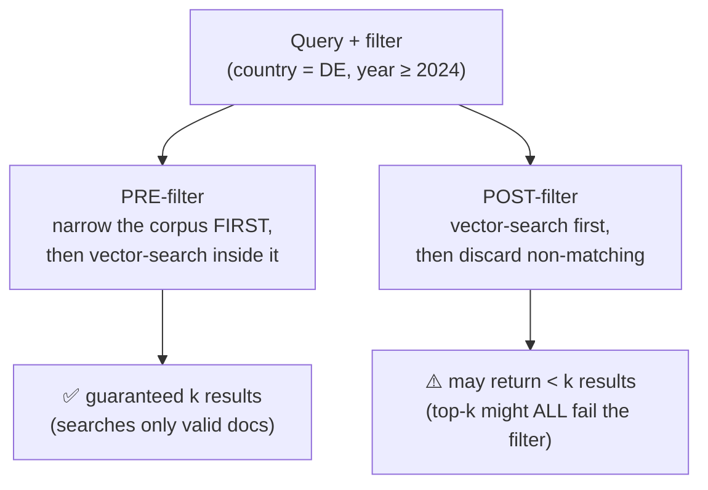

**Pre-filtering vs. post-filtering — the classic gotcha:**

- **Post-filtering** (search, then discard): if the query's 10 nearest neighbors are all US
  policies, filtering `country = DE` afterwards leaves you **zero** results even though German
  chunks exist. The relevant docs never made the top-k.
- **Pre-filtering** (restrict, then search): the vector search runs only over chunks that pass
  the filter, so you always get the k best *valid* chunks. Modern vector DBs (Qdrant, Weaviate,
  pgvector with a `WHERE` clause, Pinecone) implement efficient pre-filtering — always prefer it.

**Where do filter values come from?** Either the application context (the logged-in user's
country, the product version they're on) or — more advanced — extracted from the query itself
by an LLM (**self-query retrieval**: *"policies from 2024 onward"* → `year ≥ 2024`), which is a
bridge into Tier 4's query transformation.

**When to use it:** any corpus with versions, dates, regions, tenants, or permissions.
Access-control filtering (only retrieve documents this user may see) isn't optional — it's a
security requirement, and it *must* be a pre-filter.

---

## 9. Strategy 6 — Context compression

Retrieval's last mile. You've selected the right chunks — but chunks are cut for *indexing*
convenience, not for the LLM's benefit. A 500-token chunk may contain 2 relevant sentences and
498 tokens of noise. **Context compression trims the retrieved material down to what actually
answers the query, before it enters the prompt.**

**Why bother, when context windows are huge?**

1. **Cost & latency** — every context token is billed and processed on *every* query.
2. **Lost in the middle** — LLMs demonstrably attend best to the start and end of the context;
   relevant facts buried mid-context in a wall of noise get missed.
3. **Distraction** — irrelevant text doesn't just waste tokens; it actively pulls the
   generation off course and feeds hallucination.

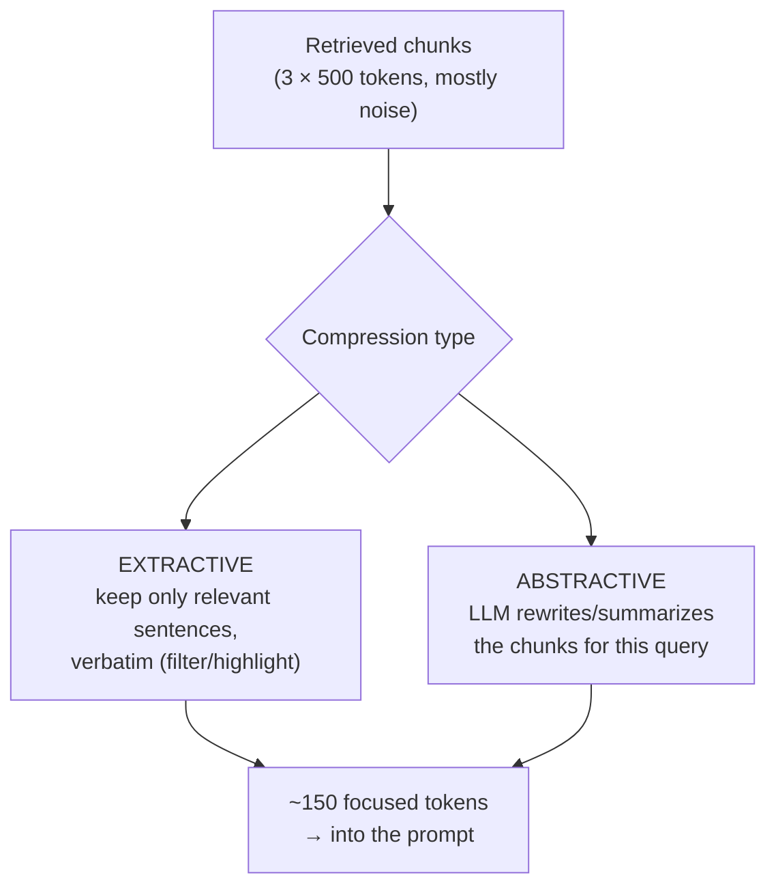

- **Extractive compression** — keep only the relevant *original sentences*, verbatim. Can be an
  LLM asked to quote relevant parts, a small relevance model scoring each sentence, or a
  specialized token-pruning model (**LLMLingua** family — up to ~20× compression). At its
  simplest, it's just *dropping whole chunks* below a relevance threshold. Safe: nothing is
  rewritten, so nothing can be mis-summarized, and citations stay exact.
- **Abstractive compression** — an LLM *summarizes* the chunks with respect to the query.
  Denser, can merge facts across chunks — but adds an LLM call and, crucially, a place for
  information to be lost or distorted *before* generation even starts.

**Example.** Query: *"What's the maximum reimbursement for a home-office chair?"* Retrieved: a
500-token furniture-policy chunk. Extractive compression keeps two sentences: *"Ergonomic desk
chairs are reimbursable up to €400. Claims require a receipt submitted within 90 days."*
The other 460 tokens (approval workflows, desk policy, monitor policy) never reach the prompt.

**When to use it:** long chunks, expensive models, high query volume, or whenever groundedness
metrics suggest the model is getting distracted by noisy context. Prefer extractive first —
it's cheaper and safer; go abstractive only when you need cross-chunk synthesis.

---

## 10. Advanced frontier: MMR, SPLADE, ColBERT, parent-document retrieval

By now you have the full standard stack: hybrid search → rerank → filter → compress. These
four techniques are **patches** — each one exists because someone running that standard stack
had a *specific complaint* it couldn't fix. So learn them by the complaint, not the name:

| The complaint you'd actually say | The patch |
|---|---|
| "My top-5 results all say the *same thing* five times." | **MMR** (§10.1) |
| "BM25 keeps missing docs that use a *synonym* of my keyword." | **SPLADE** (§10.2) |
| "The reranker is too slow, but plain vector search is too imprecise." | **ColBERT** (§10.3) |
| "The retrieved chunk is *right*, but too small — the LLM lacks the surrounding context." | **Parent-document retrieval** (§10.4) |

None of these are step one. They're what you reach for when a *measured* problem matches a
row above.

### 10.1 MMR — Maximal Marginal Relevance ("stop repeating yourself")

**The complaint.** You ask *"What's our refund policy?"* and retrieval returns 5 chunks…
which are 5 near-identical copies of the same paragraph — from `policy_v1.pdf`,
`policy_v2.pdf`, the FAQ that quotes it, the onboarding doc that copies it, and the intranet
mirror. Technically all 5 are "relevant." Practically, you got **one** piece of information
and wasted four of your five precious context slots.

Why does this happen? Because plain retrieval scores every chunk **independently** against
the query. Nothing in the system ever asks: *"do these five chunks, together, add up to more
than one of them alone?"*

**The analogy.** You're assembling a 5-person expert panel. You don't pick the five most
qualified people if they're five copies of the same specialist — after the first one, each
new seat should add something the panel *doesn't already have*. Qualified **and** different.

**How MMR works — pick one at a time, and change the rules after each pick:**

1. Pick the single most query-relevant chunk. (First pick = pure relevance, nothing to be
   redundant with yet.)
2. For every remaining candidate, compute two numbers: *how relevant is it to the query?*
   and *how similar is it to what I've already picked?* (both are just embedding
   similarities you already have).
3. Pick the candidate with the best **relevance minus redundancy** balance.
4. Repeat until you have k chunks.

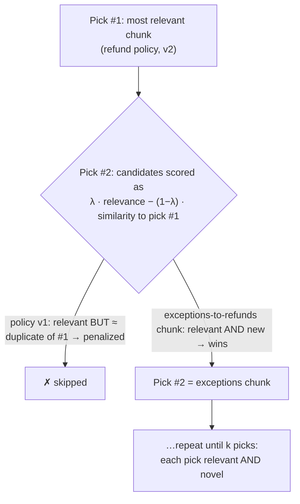

The **λ (lambda) knob** slides between the two extremes: λ = 1 means "pure relevance, ignore
redundancy" (ordinary retrieval), λ = 0 means "pure variety, ignore the query" (useless).
Practical values sit around 0.5–0.7 — mostly relevance, with a real redundancy penalty.

**Result for the refund example:** instead of the same paragraph five times, you get: the
policy + the exceptions + the process + the digital-goods special case + the deadlines.
Five slots, five *different* facts — which is what a good answer actually needs.

**Reach for it when:** your corpus contains duplication (versions, mirrors, boilerplate), or
questions are multi-faceted (a complete answer needs *several different* pieces of evidence).

### 10.2 SPLADE — learned sparse retrieval ("BM25 with a built-in thesaurus")

**The complaint.** From §3: BM25 can only match words that are **literally present**. A chunk
that says `"laptop"` is invisible to the query `"notebook"`. You love BM25's speed,
exact-match power, and cheap infrastructure — you just wish it *knew about synonyms*.

**The idea in one line:** keep the sparse, keyword-style index — but when indexing each
chunk, let a neural model **add the related words the chunk *implies* but never says**, each
with a weight for how strongly it's implied.

**What actually gets stored.** Take the chunk *"The laptop fails to boot when the adapter is
faulty."* BM25 would index exactly its literal words. SPLADE runs it through a transformer
that outputs a weighted word list — the literal words **plus** the implied ones:

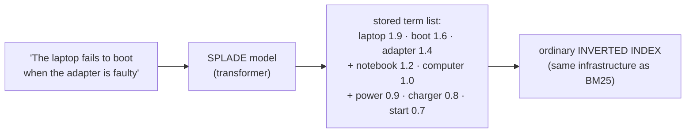

The words `notebook`, `computer`, `charger`, `start` are **not in the chunk** — the model
added them because its training taught it they belong to this chunk's meaning. Now the query
*"notebook won't start"* finds this chunk **by plain keyword lookup**, because `notebook`
and `start` are literally sitting in the index entry.

**Why this is clever:** the *expensive* neural work happens once, at index time. Query time
is still a cheap inverted-index lookup — sparse search's whole appeal survives. You've
softened the vocabulary-mismatch problem (§3's fatal flaw) *without* switching to dense
vectors. Weights are learned too, so it's smarter than a hand-made thesaurus: expansion is
contextual (a chunk about musical "keys" won't get expanded with "keyboard shortcuts").

**Reach for it when:** you're keyword-heavy (and want to stay on inverted-index
infrastructure like Elasticsearch/OpenSearch) but vocabulary mismatch is measurably hurting
recall. In hybrid stacks, SPLADE can replace or reinforce the BM25 leg.

### 10.3 ColBERT — late interaction ("keep a sticky note per word")

**The complaint.** Section 7 left you with two extremes. The **bi-encoder** seals each chunk
into *one* summary vector — fast, but fine detail is lost forever. The **cross-encoder**
reads the full texts together — precise, but so slow it can only handle a shortlist. What if
you need something *in between*: more precision than one-vector search, less latency than a
full reranker?

**The idea in one line:** instead of one sealed one-line summary per chunk, store **one small
vector per word** of the chunk — pre-computed like a bi-encoder, but detailed enough that
query words can match document words individually.

Back to the envelope analogy of §7.2: the bi-encoder put a single one-line summary in the
envelope. ColBERT fills the envelope with **a sticky note for every word** in the chunk. The
envelope is still prepared in advance (fast at query time!) — but nothing fine-grained was
thrown away.

**How matching works at query time ("MaxSim" — maximum similarity):**

1. The query is also turned into one vector per word.
2. Each **query word** looks through the document's sticky notes and finds its **single best
   match** (its *max sim*ilarity).
3. The document's score = the sum of those per-query-word best matches.

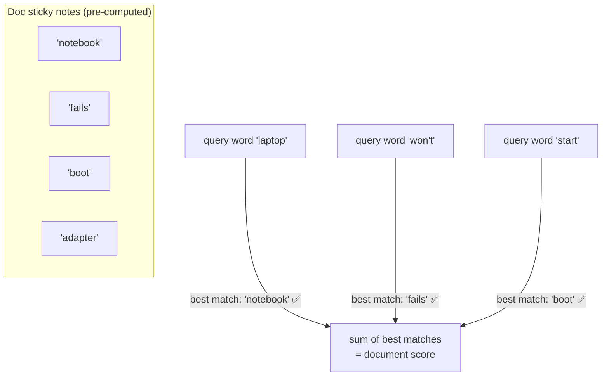

Notice what this buys: **word-level semantic matching**. `laptop`↔`notebook` matches because
the *word vectors* are close (semantics, unlike BM25) — and it's specifically the word
`laptop` matching the word `notebook`, not two whole-document summaries vaguely resembling
each other (precision, unlike the bi-encoder).

It's called **late interaction** because query and document representations are computed
separately (like a bi-encoder = "early" independence) but interact at the *word* level at
query time ("late") — versus the cross-encoder, where the texts interact from the very first
layer.

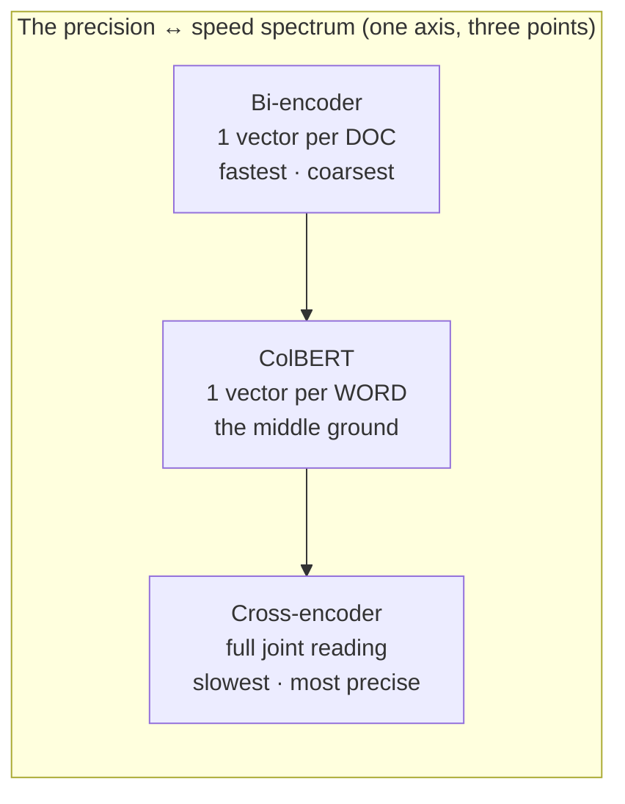

**The price:** storage. A 300-word chunk stores ~300 small vectors instead of 1 — indexes get
big (compression variants like ColBERTv2/PLAID exist for exactly this reason).

**Reach for it when:** the two-stage funnel's reranking latency is too high for your traffic,
but single-vector retrieval precision is measurably too low — ColBERT can serve as a
precise *first* stage, shrinking or removing the rerank step.

### 10.4 Parent-document / small-to-big retrieval ("find the sentence, hand over the page")

**The complaint.** Tier 1 left you with a dilemma you couldn't fully resolve then. **Small
chunks search better**: a 2-sentence chunk about one topic produces a sharp, unambiguous
embedding. **Big chunks answer better**: the LLM needs the surrounding definitions, caveats,
and conditions to produce a correct, grounded answer. One chunk size must betray one side.

**The idea in one line:** stop using the same unit for both jobs — **search with small
chunks, but hand the LLM the bigger parent** the small chunk came from.

**The analogy.** A book's index points you to the *exact line* on page 217 — but you don't
read just that line; you read the *page*. The index entry is optimized for finding; the page
is optimized for understanding. Parent-document retrieval builds exactly this: sharp little
index entries (child chunks, embedded and searched) that each carry a pointer to their
readable context (the parent section, which is what actually gets returned).

**How it's set up (at index time)** — split every document twice, and keep the link:

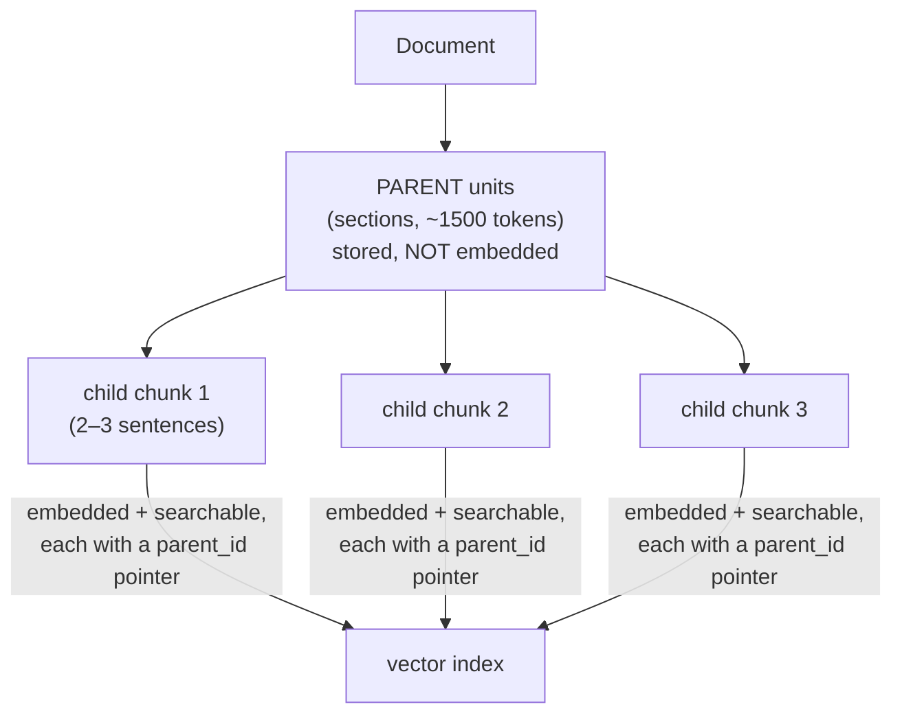

**At query time:**

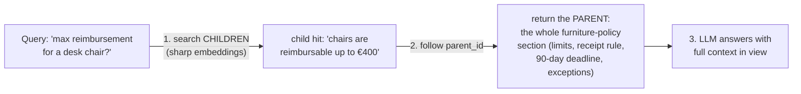

The 2-sentence child was easy to *find* (its embedding is purely about chair reimbursement —
no dilution from the rest of the section). But answering well needs the receipt requirement
and the 90-day deadline sitting around it — which the parent supplies. **Search precision of
the small; answer quality of the big.** (If several children hit the same parent, it's
returned once — a free de-duplication bonus.)

**The sentence-window variant:** same trick, sliding-scale version — embed single sentences,
and on a hit return the sentence **± N neighbors** around it, instead of a pre-defined parent
section. Choose the window size instead of a document structure.

**Reach for it when:** answers are cut off mid-thought, the LLM misses conditions/exceptions
that sat right next to the retrieved text, or groundedness suffers because chunks lack
context. It pairs naturally with Tier 1's hierarchical chunking and is usually the *easiest*
win in this whole section — no new models, just restructured indexing.

### 10.5 The four patches at a glance

| Patch | Stage it changes | One-line summary | Extra cost |
|---|---|---|---|
| **MMR** | selection of final top-k | pick chunks one by one, penalizing repeats | negligible (reuses embeddings) |
| **SPLADE** | the sparse index | neural model adds implied synonyms into the keyword index | model pass at index time |
| **ColBERT** | the dense index + scoring | a vector per *word* instead of per chunk; word-level MaxSim matching | index storage |
| **Parent-document** | indexing + what's returned | search small child chunks, return their big parent | index restructuring |

They're independent and composable — e.g. a stack can use SPLADE as its sparse leg, ColBERT
as its dense leg, MMR on the final selection, and parent-document expansion before the
prompt. But add each one only when its complaint row (top of §10) shows up in your metrics.

---

## 11. Tuning knobs: top-k, thresholds, and chunk windows

Strategies chosen, three numbers still decide day-to-day quality:

- **top-k (how many chunks to retrieve).** Too low → the answer isn't in the context (recall
  failure). Too high → noise, cost, lost-in-the-middle (precision failure). Typical shape:
  **broad k for stage 1** (50–100 into the reranker), **narrow k for the prompt** (3–8 out of
  it). Never tune k by vibes — tune it by watching recall@k and precision@k on your eval set.
- **Similarity threshold (minimum score to include).** Dense search always returns *something*
  (§4.3) — a threshold is your "actually, we found nothing relevant" detector, which should
  route to a fallback ("I don't have information on that") instead of stuffing garbage into
  the prompt. Calibrate it on real queries; raw cosine values are not comparable across
  embedding models.
- **Window/parent size** (if using §10.4): how much surrounding context to return per hit —
  the small-chunk-precision vs. big-context trade-off dial.

> **The tuning discipline** (same golden rule as every tier): change **one knob**, re-run the
> **same eval set** (retrieval metrics from Tier 7: recall@k, MRR, NDCG), keep the change only
> if a number moved. Retrieval tuning without metrics is astrology.

---

## 12. Putting it all together: the production retrieval stack

Every strategy in this document composes into **one funnel**. This is the reference
architecture of a modern production retrieval stage — and the "before" picture that Tier 4
(query transformation) and Tier 5 (advanced patterns) will build on:

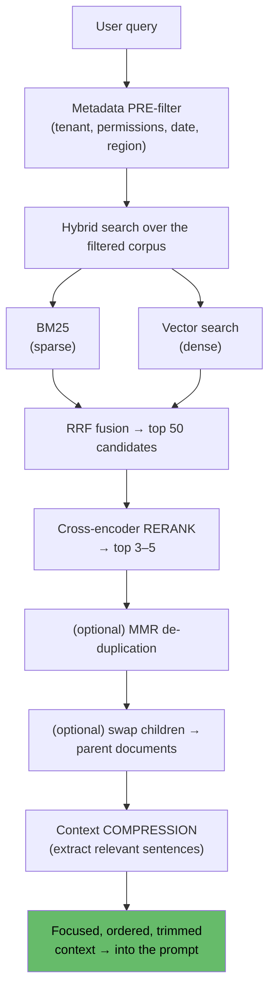

**The build order (each step is independently shippable and measurable):**

| Step | Add | Expected effect (metric to watch) |
|---|---|---|
| 1 | Naive dense retrieval | Baseline — measure it first |
| 2 | **Hybrid + RRF** | Recall@k jumps; keyword queries stop failing |
| 3 | **Reranker** | Precision@5 / NDCG / MRR jump; right chunk reaches the top |
| 4 | **Metadata pre-filters** | Wrong-version/region/tenant errors → zero |
| 5 | **Compression** | Groundedness up, cost & latency down |
| 6 | MMR / parent-document / SPLADE / ColBERT | Targeted fixes, only if a metric demands them |

Steps 2 and 3 are the famous ones: **hybrid search and reranking are, empirically, the two
highest-ROI changes in all of RAG.** Everything else is refinement.

---

## 13. Pitfalls & trade-offs

- **Tuning generation while retrieval is broken.** If Context Relevance is low, no prompt or
  model change can help — the answer isn't in the context. Always diagnose retrieval first.
- **Dense-only by default.** Naive stacks skip BM25 because vector search feels modern. Then
  the first user who searches an order number gets nonsense. Hybrid is cheap; skip it only
  with a measured reason.
- **Fusing raw scores instead of ranks.** BM25 and cosine scores are incomparable scales;
  adding them is meaningless. Use RRF (or properly normalized weighted fusion).
- **Reranking a too-small pool.** A cross-encoder can only promote what stage 1 retrieved.
  Reranking a top-5 is pointless — feed it a broad top-50–100. (Recall first, then precision.)
- **Post-filtering metadata.** Filter-after-search silently returns zero results when the
  top-k all fail the filter. Always pre-filter — and treat permission filters as security.
- **No similarity threshold.** Dense search always returns its nearest neighbor, relevant or
  not. Without a floor, nonsense queries get confident garbage answers.
- **Over-compressing.** Aggressive abstractive compression can delete the very detail the
  answer needed — a second place to hallucinate *before* generation. Prefer extractive; check
  groundedness after enabling it.
- **Redundant top-k.** Five near-identical chunks = one fact + four wasted context slots. MMR
  or dedup fixes it.
- **Tuning without an eval set.** Every knob here (alpha, k, thresholds, λ) interacts. Without
  fixed metrics on a fixed test set (Tier 7), you're guessing — and probably regressing.

---

## 14. Mastery checklist

You've mastered retrieval strategies when you can, from memory:

- [ ] Explain lexical vs. semantic matching and give a query where each one is the only thing that works.
- [ ] Explain BM25 as TF-IDF + saturation + length normalization, and what each part fixes.
- [ ] Explain why dense retrieval bridges the vocabulary-mismatch problem — and why it blurs exact identifiers.
- [ ] Reproduce the sparse-vs-dense mirror-image table (strengths, weaknesses, failure modes).
- [ ] Compute an RRF fusion by hand for two small ranked lists, and explain the role of k = 60.
- [ ] Explain bi-encoder vs. cross-encoder, and why the two-stage funnel (broad retrieve → rerank) uses each where it wins.
- [ ] Explain pre- vs. post-filtering and why post-filtering can silently return zero results.
- [ ] Explain extractive vs. abstractive compression and the "lost in the middle" motivation.
- [ ] Place MMR, SPLADE, ColBERT, and parent-document retrieval each against the specific weakness it fixes.
- [ ] Describe the tuning knobs (top-k, threshold, window) and the metric that validates each.
- [ ] Draw the full production retrieval funnel from memory and give the build order with the metric each step should move.

If you can do all of these, you own the single most important tier of the curriculum.
**Next stop:** Tier 4 — Query Transformation (fixing the *question* before it ever reaches
this retrieval stack), then Tier 5 — [Advanced RAG Patterns](../advanced-rag-patterns/Introduction.md),
which wraps this whole funnel in loops, checks, and agents.

---

## Sources

- [Retrieval-Augmented Generation for LLMs: A Survey — arXiv](https://arxiv.org/pdf/2312.10997)
- [Okapi BM25 — Wikipedia (the ranking function and its parameters)](https://en.wikipedia.org/wiki/Okapi_BM25)
- [Understanding TF-IDF and BM25 — KMW Technology](https://kmwllc.com/index.php/2020/03/20/understanding-tf-idf-and-bm-25/)
- [Hybrid Search Explained — Weaviate](https://weaviate.io/blog/hybrid-search-explained)
- [Reciprocal Rank Fusion (RRF) — Elastic documentation](https://www.elastic.co/guide/en/elasticsearch/reference/current/rrf.html)
- [Rerankers and Two-Stage Retrieval — Pinecone](https://www.pinecone.io/learn/series/rag/rerankers/)
- [Cross-Encoders — Sentence-Transformers documentation](https://www.sbert.net/examples/applications/cross-encoder/README.html)
- [Lost in the Middle: How Language Models Use Long Contexts — arXiv](https://arxiv.org/abs/2307.03172)
- [LLMLingua: Compressing Prompts for Accelerated Inference — Microsoft Research](https://www.microsoft.com/en-us/research/project/llmlingua/)
- [SPLADE: Sparse Lexical and Expansion Model — arXiv](https://arxiv.org/abs/2107.05720)
- [ColBERT: Efficient and Effective Passage Search via Late Interaction — arXiv](https://arxiv.org/abs/2004.12832)
- [Maximal Marginal Relevance (MMR) — original SIGIR paper (Carbonell & Goldstein)](https://dl.acm.org/doi/10.1145/290941.291025)
- [Advanced RAG: Small-to-Big / Parent Document Retrieval — LlamaIndex docs](https://docs.llamaindex.ai/en/stable/examples/retrievers/recursive_retriever_nodes/)
- [Filtering in vector search: pre- vs. post-filtering — Qdrant documentation](https://qdrant.tech/documentation/concepts/filtering/)
